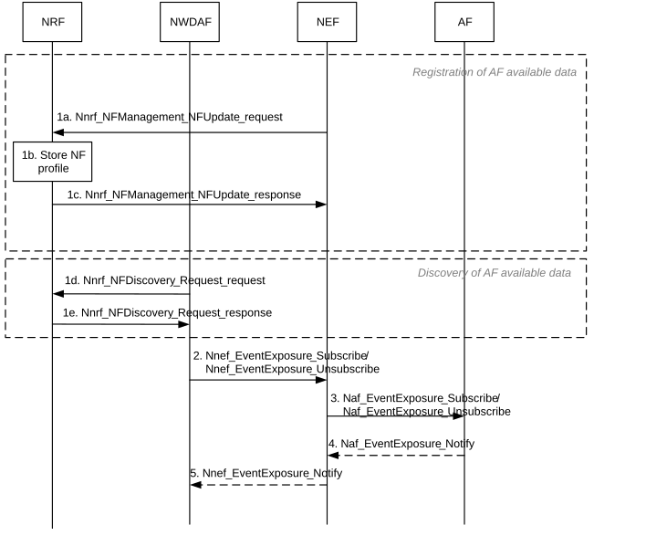

# 6.2.2.3 Procedure for Data Collection from AF via NEF

The procedure in Figure 6.2.2.3-1 is used by NWDAF to collect information from AFs via the NEF.

NOTE 1: In this release, AF registers its available data to NWDAF via OAM configuration at NEF.

The AF collectable data information includes: AF identification, AF service identification (e.g. endpoint information of Naf_EventExposure), available data to be collected per application (e.g. identified by Event ID(s)).

Figure 6.2.2.3-1: Data Collection from AF via NEF

1a. After the registration of AF available data at the NEF, NEF generates an event exposure with new EventID to be associated with available data to be collected from AF. NEF invokes Nnrf_NFManagement_NFUpdate_request service operation to update its registration information (i.e. NEF Profile) including the generated Event IDs and associated AF identification, Application ID(s) (i.e. internal application ID or Application ID known in the core network).

1b. NRF stores the received NEF registration information including available data to be collected from AF.

1c. NRF sends Nnrf_NFManagement_NFUpdate_response message to NEF.

1d. When NWDAF needs to discovery the available data from AFs and the appropriated NEF to collect this data, NWDAF invokes Nnrf_NFDiscovery_Request_request service operation using as parameter the NEF NF Type and optionally a list of Event ID(s), AF identification and application ID.

1e. NRF matches the requested query for available data in AFs with the registered NEF Profiles and sends this information via Nnrf_NFDiscovery_Request_response message to NWDAF.

NOTE 2: After the registration and discovery procedure described in step 1, NWDAF identifies the available data per AF per application and the proper NEF to collect such data.

2\. The NWDAF subscribes to or cancels subscription to data in AF via NEF by invoking the Nnef_EventExposure_Subscribe or Nnef_EventExposure_Unsubscribe service operation. If the event subscription is authorized by the NEF, the NEF records the association of the event trigger and the NWDAF identity.

NOTE 3: User consent for retrieving user data in AF via NEF is not specified in this Release.

3\. Based on the request from the NWDAF, the NEF subscribes to or cancels subscription to data in AF by invoking the Naf_EventExposure_Subscribe/ Naf_EventExposure_Unsubscribe service operation.

4\. If the NEF subscribes to data in AF, the AF notifies the NEF with the data by invoking Naf_EventExposure_Notify service operation according to Event Reporting Information in the subscription.

5\. If the NEF receives the notification from the AF, the NEF notifies the NWDAF with the data by invoking Nnef_EventExposure_Notify service operation.

When the Reporting type is provided at step 2, the NWDAF determines that the events are disappeared, if the same events are included in the notification compared to the previous notification. Otherwise, NWDAF determines the events are newly appeared or changed. Also, the NWDAF restores the events that are not included in the notification, but included in the previous notification.

If the Granularity of dynamics is applied to the subscription, the NWDAF shall infer the events in the AF from the events in the previous notification and the applied Granularity of dynamics.
