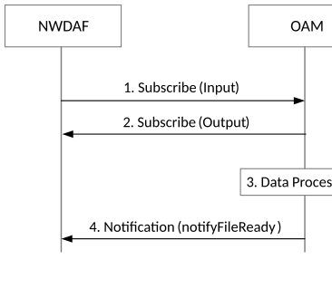

# 6.2.3 Data Collection from OAM

## 6.2.3.1 General

The NWDAF may collect relevant management data from the services in the OAM as configured by the PLMN operator.

‐ NG RAN or 5GC performance measurements as defined in TS 28.552 \[8\].

‐ 5G End to end KPIs as defined in TS 28.554 \[10\].

NWDAF shall use the following services to have access to the information provided by OAM:

\- Generic performance assurance and fault supervision management services as defined in TS 28.532 \[6\].

‐ PM (Performance Management) services as defined in TS 28.550 \[7\].

‐ FS (Fault Supervision) services defined in TS 28.545 \[9\].

\- MDA (Management Data Analytics) services as defined in TS 28.104 \[45\].

NWDAF can be configured to invoke the existing OAM services to retrieve the management data that are relevant for analytics generation, which may include NF resources usage information (e.g. usage of virtual resources assigned to NF) and NF resource configuration information (e.g. life cycle changes of NF resource configurations).

OAM perform the required configuration in order to provide the information requested by NWDAF subscription and perform the tasks, e.g. data collection, data processing, associated with the subscribed request from NWDAF.

Another usage of OAM services is when the target of data collection is a specific UE, via MDT based retrieval of information:

\- Measurement collection for MDT as defined in TS 37.320 \[20\].

In addition, NWDAF can be provisioned with Network Slice information (i.e. as defined by the NetworkSliceInfo specified in TS 28.541 \[22\]) when a slice is created or modified via OAM configuration mechanism as defined in TS 28.541 \[22\] and TS 28.532 \[6\].

## 6.2.3.2 Procedure for data collection from OAM

The interactions between NWDAF and OAM for data collection are illustrated in Figure 6.2.3.2-1. The data collected depends on the use cases. This figure is an abstraction of the OAM performance data file report management service that is defined TS 28.532 \[6\]. The actual OAM services and reporting mechanisms that NWDAF may use are specified in TS 28.532 \[6\], TS 28.550 \[7\] or TS 28.545 \[9\].

The flow below assumes the NWDAF is configured on how to subscribe to the relevant OAM services.

OAM shall setup the required mechanisms to guarantee the continuous data collection requested by NWDAF.

Figure 6.2.3.2-1: Data collection from OAM performance data file report management service

1\. (Clause 11.6.1.3.2 of TS 28.532 \[6\]), Subscribe (Input): NWDAF subscribes to the notification(s) related to the services provided by the management service producer.

2\. (Clause 11.6.1.3.3 of TS 28.532 \[6\]), Subscribe (Output): management service producer responses to NWDAF if the subscription is success or not.

3\. Data processing: management service producer prepares the data.

4\. (Clause 11.6.1.1 of TS 28.532 \[6\]), Notification (notifyFileReady): management service producer notifies the data file is ready.

As the final step, NWDAF fetches data by using file transfer protocols as defined in clause 11.6.2 of TS 28.532 \[6\].

NOTE 1: The call flow in Figure 6.2.3.2-1 only shows a subscribe/notify model for the simplicity, however both request-response and subscription-notification models are supported.

NOTE 2: NWDAF is configured with the Network Slice information (i.e. NetworkSliceInfo including a DN (Distinguished Name) of the NetworkSlice managed object relating to the network slice instance associated to the S-NSSAI and NSI ID if available as defined in TS 28.541 \[22\]). Based on the Network Slice information, the NWDAF uses the DN (Distinguished Name) to identify the NetworkSlice managed object relating to the S-NSSAI and NSI ID and consumes the management services to collect the management data of the corresponding NetworkSlice managed object (including the NRF serving the network slice, the NFs associated to the network slice, the NG RAN or 5GC performance measurements defined in TS 28.552 \[8\], or the 5G end to end KPIs defined in TS 28.554 \[10\]) provided by OAM.
