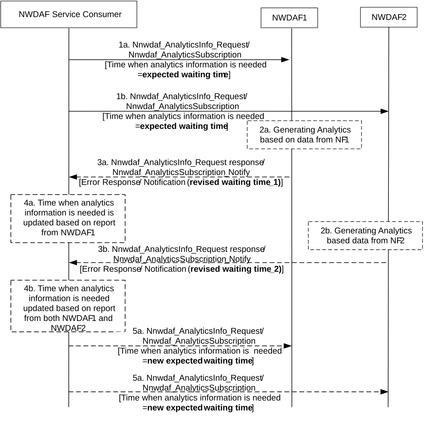

# 6.2.5 Time coordination across multiple NWDAF instances

## 6.2.5.1 General

In certain situations, an NWDAF Service Consumer expects to receive analytics by a given time. In particular, when an NWDAF Service Consumer is collecting analytics from multiple NWDAFs it can be necessary to coordinate the timing of the analytics subscriptions/requests from the same NWDAF service consumer.

The NWDAF Service Consumer may use "time when analytics information is needed parameter" (see clause 6.1.3) as a dynamic timer to indicate the minimum time it is going to wait (i.e. "expected waiting time") to receive the analytics collected from multiple NWDAFs.

## 6.2.5.2 Procedure for time coordination across multiple NWDAFs

Figure 6.2.5.2-1: Procedure for time coordination across multiple NWDAFs

1a-1b. On analytics request/subscription, the NWDAF Service Consumer indicates the "expected waiting time" as "time when analytics is needed" parameter to those NWDAFs from which it expects to receive the analytics latest by the "time when analytics information is needed", using either the Nnwdaf_AnalyticsInfo_Request or Nnwdaf_AnalyticsSubscription_Subscribe service operation. In this example, NWDAF1 and NWDAF2 are the NWDAFs with tightly related analytics.

2a-2b. Each NWDAF generates the requested analytics based on data from related data sources. In this example, NWDAF1 processes data from NF1 and NWDAF2 processes data from NF2.

3a-3b. \[Optional\] If the "time when analytics information is needed" is reached, but the analytics is not ready, the NWDAF may indicate a "revised waiting time" in an error response or error notification, using either the Nnwdaf_AnalyticsInfo_Request response or Nnwdaf_AnalyticsSubscription_Notify service operation, depending on the service used in step 1.

4a-4b. \[Optional\] On receiving an indicated "revised waiting time" as part of an error response or error notification, the NWDAF Service consumer may use the "revised waiting time" to update the "time when analytics information is needed" parameter for future analytics requests/subscriptions to the same group of NWDAFs.

5a-5b. If the value of the "time when analytics information is needed" was updated in step 4, the NWDAF Service Consumer, in future requests or within current subscription, indicates the new expected waiting time as "time when analytics information is needed" to all NWDAFs with tightly related analytics, using either the Nnwdaf_AnalyticsInfo_Request or Nnwdaf_AnalyticsSubscription_Subscribe service operation.

NOTE 1: Steps 3a-3b and steps 4a-4b may happen in different orders depending on the timing of analytics collection (from other NFs, e.g. NF1 or NF2) or processing.

NOTE 2: Parameter "time when analytics is needed" as in steps 1a-1b, 3a-3b, 4a-4b and 5a-5b can be per individual Analytics ID.
