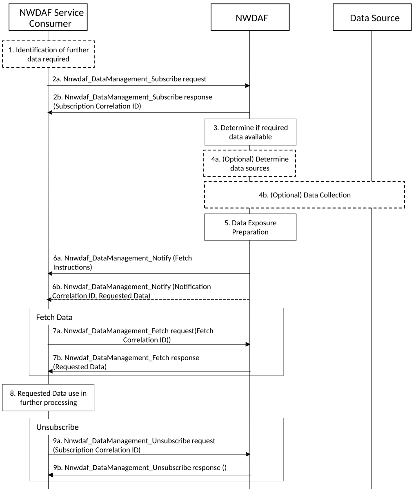

# 6.2.6.2 Procedure for Data Collection from NWDAF

The procedure in Figure 6.2.6.2-1 is used by NWDAF service consumer to invoke the data management services at NWDAFs in order to retrieve runtime and historical data.

Figure 6.2.6.2-1: Data Collection from NWDAF via Data Management Service

1\. NWDAF service consumer (e.g. NWDAF, DCCF) identifies that further data from an NWDAF is required in order to perform some operation related to Analytics ID. The triggers for further data collection are related to:

a\) the local policies of NWDAF or DCCF (e.g. preparation for future requests for Analytics ID as specified in clause 6.2.2.1);

b\) a request for analytics generation requiring data not available or not directly reachable via the NWDAF service consumer (e.g. out of the serving area);

c\) a request for model training;

d\) a request for data collection that NWDAF service consumer cannot provide by itself.

NOTE 1: If the NWDAF service consumer is a DCCF, the discovery of the proper NWDAF is defined in clause 6.2.6.3.6. If the NWDAF service consumer is a NWDAF, the NWDAF service consumer can discover the appropriate NWDAF(s) as defined in clause 5.2.

2a. NWDAF service consumer invokes Nnwdaf_DataManagement_Subscribe service from NWDAF to request a required data. The request comprises the Data Specification as well as Data Formatting and Processing instructions as defined in clause 5A.4, Notification Target Address (+ Notification Correlation ID).

When the required data is Event IDs, the NWDAF service consumer may include the Data Source, e.g. NF Instance (or NF Set) ID from which the data needs to be collected.

The NWDAF service consumer may include ADRF information indicating whether the data are to be stored in an ADRF and optionally an ADRF ID.

The NWDAF service consumer may include ADRF ID or NWDAF ID (or ADRF Set ID or NWDAF Set ID) storing historical data (optional), directing NWDAF to the repository containing historical data.

The NWDAF checks if required data is related to a user, i.e. SUPI or GPSI, then, depending on local policy and regulations, as described in clause 6.2.9, the NWDAF checks or has checked the user consent by retrieving the user consent information from UDM using Nudm_SDM_Get including data type "User consent". If user consent is not granted, NWDAF sends a response to the NWDAF service consumer in step 2b, indicating that user consent for data collection was not granted and the data collection for this SUPI or GPSI stops here. If the user consent is granted, the NWDAF can provide the required data to the NWDAF service consumer by performing the following steps 2b-7 and the NWDAF subscribes to UDM to notifications of changes on subscription data type "User consent" for this user using Nudm_SDM_Subscribe. When receiving the notification that user consent has been revoked, the NWDAF shall provide a Termination Request in Nnwdaf_DataManagement_Notify to request the NWDAF service consumer to cancel the subscription to the required data.

2b. Based on the received request, NWDAF creates a new data for the requesting consumer. NWDAF sends Nnwdaf_DataManagement_Subscribe service response with a confirmation of successful request and the subscription correlation ID identifying the requested data.

NOTE 2: Subscription Correlation ID allows the NWDAF service consumer to request to NWDAF any changes in the generation of a requested data.

3\. NWDAF determines whether the request data is available at such NWDAF.

NWDAF maintains a local association of requested Event IDs or Analytics IDs to the list of triggered event subscription identifications from data sources to generate the requested data. Based on this local association, the NWDAF checks if the data to be collected is available at itself. If the data is available, NWDAF uses such data to generate the requested data.

When data sources are NFs, the NWDAF discovers the proper NFs as defined in clause 6.2.2.1.

When the data sources are other NWDAFs, the NWDAF discovers the other NWDAFs as defined in clause 5.2.

When the data source is DCCF, the NWDAF discovers the proper DCCF as defined in clause 6.3.19 of TS 23.501 \[2\].

4a. (Optional) If NWDAF receives a request for data that is not available or not reachable by such NWDAF (e.g. out of serving area), NWDAF determines the sources for the data that is not available, if the information has not been included in the subscription to the requested data.

4b. (Optional) NWDAF may trigger further data collection using any of the available mechanisms in clause 6.2.2 (e.g. if the data subscribed in step 2a partially matches data that are already being collected by the NWDAF from a data source and a modification of the subscription to the data source would satisfy both the existing data collection as well as the newly requested data) and clause 6.2.6 (e.g. recursively using data collection services from other needed NWDAFs, DCCFs, ADRFs, NFs).

NWDAF updates its local association of the mapping of the requested data (Event ID or Analytics ID) to the identification of the request/subscription for data collection from the further data sources.

5\. Based on the properties of the received request, NWDAF generates the requested data including the available or collected data (e.g. from other NWDAFs, DCCFs or ADRFs, NFs).

6a. If the fetch flag is set to true in step 2a, NWDAF waits until the requested data is ready and sends a Nnwdaf_DataManagement_Notify service message with fetch instructions.

The requested data is ready when the NWDAF has generated the data and completed processing and formatting as described in clause 5A.4.

6b. If the fetch flag is set to false in step 2a, NWDAF uses the Nnwdaf_DataManagement_Notify service to send the Notification Correlation ID and requested data to the NWDAF service consumer.

7(a.b). Alternatively, if the Nnwdaf_DataManagement_Notify service message with fetch instructions is received in step 6a, the NWDAF service consumer shall fetch the required data from NWDAF via Nnwdaf_DataManagement_Fetch service operation within the fetch deadline specified in the fetch instructions. The NWDAF service consumer invokes the Nnwdaf_DataManagement_Fetch service operation with the input parameters including the Fetch Correlation ID, that identifies the data to be fetched and receives a response with the requested data.

8\. The NWDAF service consumer uses the requested data for performing further processing. If the NWDAF service consumer is an NWDAF the requested data can be used for analytics generation or model training or for further exposing such data to other NWDAFs. If the NWDAF service consumer is a DCCF, the requested data can be provided to a DCCF data consumer.

9\. When the NWDAF service consumer determines that no more data is required or if receiving a Termination Request from the NWDAF, e.g. due to user consent revocation for the data collection related to a user, it unsubscribes to the requested data from NWDAF. If NWDAF had triggered further data collection in Step 3a and 3b, NWDAF also unsubscribe to all data sources.

NOTE 3: It is also possible that instead of providing the dataset of the generated data in steps 6a, 6b, 7b, the NWDAF provides a reference to where the dataset can be retrieved by the NWDAF service consumer.
