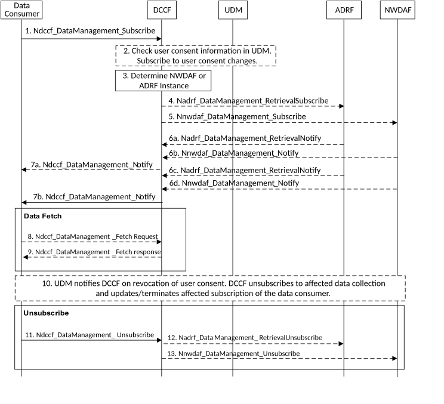

# 6.2.6.3.3 Historical Data Collection via DCCF

The procedure depicted in figure 6.2.6.3.3-1 is used by data consumers (e.g. NWDAF) to obtain historical data, i.e. data related to past time period. The data consumer requests data using Ndccf_DataManagement_Subscribe service operation. Whether the data consumer uses this procedure or directly contacts the ADRF or NWDAF is based on configuration.

Figure 6.2.6.3.3-1: Historical Data Collection via DCCF

1\. The data consumer requests data via DCCF by invoking the Ndccf_DataManagement_Subscribe (Service_Operation, Data Specification, Time Window, Formatting Instructions, Processing Instructions, ADRF ID or NWDAF ID (or ADRF Set ID or NWDAF Set ID) service operation as specified in clause 8.2.2. The data consumer may specify one or more notification endpoints to receive the data. If data to be collected is subject to user consent: if the data consumer checked user consent, the data consumer shall provide user consent check information (i.e. an indication that it has checked user consent), otherwise, the data consumer shall provide a purpose for the data collection.

"Service_Operation" is the service operation used to acquire the data from a data source. "Data Specification" provides Service_Operation-specific parameters (e.g. event IDs, UE-ID(s)) used to retrieve the data. "Time Window" specifies a past time period and comprises a start and stop time. "Formatting and Processing Instructions" are as defined in clause 5A4. The data consumer may optionally include the ADRF or NWDAF instance (or ADRF Set or NWDAF Set) ID where the stored data resides.

2\. The DCCF checks if data is to be collected for a user, i.e. SUPI or GPSI, then, depending on local policy and regulations, the DCCF checks the user consent by retrieving the user consent information from UDM using Nudm_SDM_Get including data type "User consent" and taking into account purpose for data collection as provided in step 1. If user consent is not granted, DCCF does not subscribe to event exposure for events related to this user, the data collection for this SUPI or GPSI stops here and DCCF sends a response to the data consumer indicating that user consent for data collection was not granted. If the user consent is granted, the DCCF subscribes to UDM to notifications of changes on subscription data type "User consent" for this user using Nudm_SDM_Subscribe.

If the data consumer is NWDAF and it provides user consent check information (i.e. an indication that it has checked user consent) in Ndccf_DataManagement_Subscribe in step 1, which has been obtained by the NWDAF from UDM before, then the DCCF can do data collection for a user based on the user consent information from the NWDAF and skip retrieving it from UDM.

3\. If an ADRF or NWDAF instance or ADRF Set ID or NWDAF Set ID is not provided by the data consumer, the DCCF determines if any ADRF or NWDAF instances might provide the data as described in clause 5B and 5A.2.

NOTE 1: An ADRF or NWDAF might have previously registered data it is collecting with the DCCF.

4\. (conditional) If the DCCF determines that an ADRF instance might provide the data, or an ADRF instance or Set was supplied by the data consumer, the DCCF sends a request to the ADRF, using Nadrf_DataManagement_RetrievalSubscribe (Data Specification, Notification Target Address=DCCF) service operation as specified in clause 10.2. The ADRF responds to the DCCF with an Nadrf_DataManagement_RetrievalSubscribe response indicating if the ADRF can supply the data. If the data can be provided, the procedure continues with steps 6a and 6c.

5\. (conditional) If the DCCF determines that an NWDAF instance might provide the data or an NWDAF instance or Set was supplied by the data consumer, the DCCF sends a request to the NWDAF using Nnwdaf_DataManagement_Subscribe (Data Specification, Notification Target Address=DCCF) as specified in clause 7.4.2.

6a-d. The ADRF uses Nadrf_DataManagement_RetrievalNotify or the NWDAF uses Nnwdaf_DataManagement_Notify to send the requested data (e.g. one or more stored notifications archived from a data source) to the DCCF. The data may be sent in one or more notification messages.

7a-b. The DCCF uses Ndccf_DataManagement_Notify to send data to all notification endpoints indicated in step 1. Notifications are sent to the Notification Target Address(es) using the data consumer Notification Correlation ID(s) received in step 1. Data sent to notification endpoints may be processed and formatted by the DCCF, so they conform to delivery requirements specified by the data consumer.

NOTE 2: According to Formatting Instructions provided by the data consumer, multiple notifications from an ADRF or NWDAF can be combined in a single Ndccf_DataManagement_Notify so many notifications from the ADRF or NWDAF results in fewer notifications (or one notification) to the data consumer. Alternatively, a Ndccf_DataManagement_Notify can instruct the data notification endpoint to fetch the data from the DCCF before an expiry time.

8\. If a notification contains a fetch instruction, the notification endpoint sends a Ndccf_DataManagement_Fetch request to fetch the data from the DCCF.

9\. The DCCF delivers the data to the notification endpoint.

10\. The UDM may notify the DCCF on changes of user consent at any time after step 2. If user consent is no longer granted for a user for which data has been collected and if there are no other consumers for the data, the DCCF shall unsubscribe to any data collection for that SUPI or GPSI. The DCCF shall further update or terminate affected subscriptions of the Data Consumer. The DCCF may unsubscribe to be notified of user consent updates from UDM for each SUPI for which user consent has been revoked.

11\. When the data consumer no longer wants data to be collected or has received all the data it needs, it invokes Ndccf_DataManagement_Unsubscribe (Subscription Correlation ID) as specified in clause 8.2.3, using the Subscription Correlation Id received in response to its subscription in step 1.

12\. If the data are being provided by an ADRF and there are no other data consumers subscribed to the data, the DCCF unsubscribes with the ADRF using Nadrf_DataManagement_RetrievalUnsubscribe as specified in clause 10.2.7.

13\. If the data are being provided by an NWDAF and there are no other data consumers subscribed to the data, the DCCF unsubscribes with the NWDAF using Nnwdaf_DataManagement_Unsubscribe as specified in clause 7.4.3.
