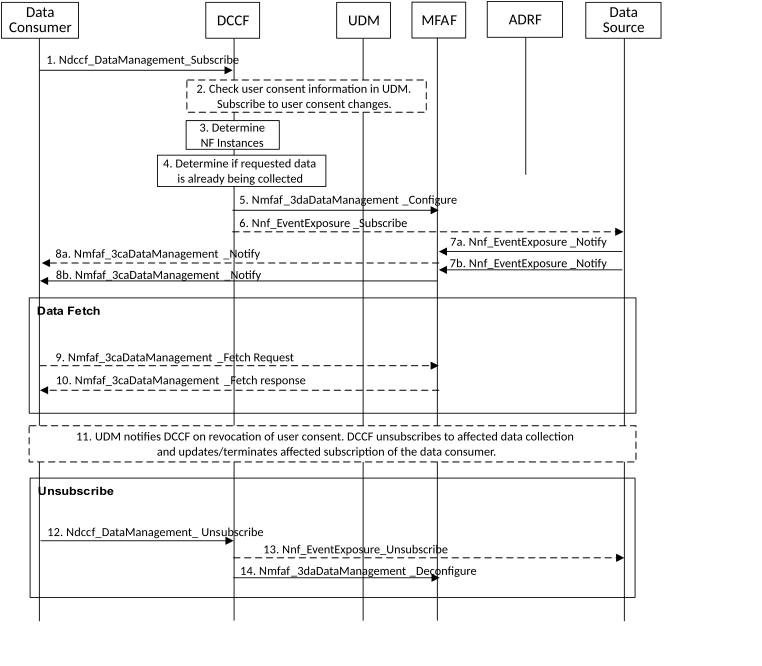

# 6.2.6.3.4 Data Collection via Messaging Framework

This procedure depicted in Figure 6.2.6.3.4-1 is used by a data consumer (e.g. NWDAF) to obtain data and be notified of events using the DCCF and a Messaging Framework. The 3GPP DCCF Adaptor (3da) Data Management service and 3GPP Consumer Adaptor (3ca) Data Management service of the Messaging Framework Adaptor Function (MFAF) are used to interact with the 3GPP Network and the Messaging Framework. Whether the data consumer directly contacts the Data Source or goes via the DCCF is based on configuration.

Figure 6.2.6.3.4-1: Data Collection via Messaging Framework

1\. The data consumer subscribes to data via the DCCF by invoking the Ndccf_DataManagement_Subscribe (Service_Operation, Data Specification, Formatting Instructions, Processing Instructions, NF (or NF-Set) ID, ADRF Information, Data Consumer Notification Target Address (+ Notification Correlation ID)) service operation as specified in clause 8.2.2. The data consumer may specify one or more notification endpoints and the NF or NF set to collect data from. If data to be collected is subject to user consent: if the data consumer checked user consent, the data consumer shall provide user consent check information (i.e. an indication that it has checked user consent), otherwise, the data consumer shall provide a purpose for the data collection.

Service_Operation is the service operation to be used by the DCCF to request data (e.g. Namf_EventExposure_Subscribe or OAM Subscribe). Data Specification provides Service_Operation-specific required parameters (e.g. event IDs, UE-ID(s), target of event reporting) and optional input parameters used to retrieve the data. Formatting and Processing Instructions are as defined in clause 5A.4. The data consumer may optionally include the Data Source NF Instance (or NF Set) ID. The data consumer may include ADRF information indicating whether the data are to be stored in an ADRF and, optionally, an ADRF ID.

NOTE 1: Data consumer requesting data to be stored in ADRF allows the collected data to be available to other data consumers in the future.

2\. The DCCF checks if data is to be collected for a user, i.e. SUPI or GPSI, then, depending on local policy and regulations, the NWDAF checks the user consent by retrieving the user consent information from UDM using Nudm_SDM_Get including data type "User consent" and taking into account purpose for data collection as provided in step 1. If user consent is not granted, NWDAF does not subscribe to event exposure for events related to this user, the data collection for this SUPI or GPSI stops here and DCCF sends a response to the data consumer indicating that user consent for data collection was not granted. If the user consent is granted, the DCCF subscribes to UDM to notifications of changes on subscription data type "User consent" for this user using Nudm_SDM_Subscribe.

If the data consumer is NWDAF and it provides user consent check information (i.e. an indication that it has checked user consent) in Ndccf_DataManagement_Subscribe in step 1, which has been obtained by the NWDAF from UDM before, then the DCCF can do data collection for a user based on the user consent information from the NWDAF and skip retrieving it from UDM.

3\. If the NF instance or NF Set ID is not provided by the data consumer, the DCCF determines the NF instances that can provide data as described in clause 5A.2 and clause 6.2.2.2. If the consumer requested storage of data in an ADRF, but the ADRF ID is not provided by the data consumer, or the collected data is to be stored in an ADRF according to configuration on the DCCF, the DCCF selects an ADRF to store the collected data.

4\. The DCCF determines whether the data requested in step 1 are already being collected, as described in clause 5A.2.

If the data requested are already being collected from the Data Source by a data consumer, the DCCF adds the data consumer to the list of data consumers that are subscribed for these data, then the DCCF determines that no subscriptions to the Data Source need to be created or modified.

5\. The DCCF sends an Nmfaf_3daDataManagement_Configure (Data Consumer Information, MFAF Notification Information, Formatting Conditions, Processing Instructions) to configure the MFAF to map notifications received from the Data Source to outgoing notifications sent to endpoints and to instruct the MFAF how to format and process the outgoing notifications. The DCCF may also instruct the MFAF to store data into ADRF by providing an ADRF ID, if requested by the data consumer in step 1, together with the NF Id of the data source.

Data Consumer Information contains for each notification endpoint, the data consumer Notification Target Address (+ Data Consumer Notification Correlation ID to be used by the MFAF when sending notifications in step 9.

MFAF Notification Information is included if a Data Source is already sending the data to the MFAF. MFAF Notification Information identifies Event Notifications received from the Data Sources and comprises the MFAF Notification Target Address (+ MFAF Notification Correlation ID). If the MFAF does not receive MFAF Notification information from the DCCF, the MFAF selects a MFAF Notification Target Address (+ MFAF Notification Correlation ID) and sends the MFAF Notification Information, containing MFAF Notification Target Address (+ MFAF Notification Correlation ID), to the DCCF in the Nmfaf_3daDataManagement_Configure Response.

6\. If the data subscribed in step 1 partially matches data that are already being collected by the DCCF from a Data Source and a modification of this subscription to the Data Source would satisfy both the existing data subscriptions as well as the newly requested data, the DCCF invokes Nnf_EventExposure_Subscribe (Subscription Correlation ID) with parameters indicating how to modify the previous subscription (as specified in clause 5A.2). The DCCF adds the data consumer to the list of data consumers that are subscribed for these data. If some of the newly requested data can only be provided by new Data Source, the DCCF creates new subscription(s) to the new Data Source for the newly requested data.

If the data requested at step 1 are not already available or not being collected yet, the DCCF subscribes to data from the NF using the Nnf_EventExposure_Subscribe (Data Specification, MFAF Notification Target Address (+ MFAF Notification Correlation ID)) service operation as specified in clause 5A.2 and clause 6.2.2.2, using the MFAF Notification Target Address (+ MFAF Notification Correlation ID) received in step 5. The DCCF adds the data consumer to the list of data consumers that are subscribed for these data.

7\. When new output data are available, the Data Source uses Nnf_EventExposure_Notify to send the data to the MFAF. The Notification includes the MFAF Notification Correlation ID.

8\. The MFAF uses Nmfaf_3caDataManagement_Notify to send the data to all notification endpoints indicated in step 6. Notifications are sent to the Notification Target Address(es) using the Data Consumer Notification Correlation ID(s) received in step 6. Data sent to notification endpoints may be processed and formatted by the MFAF, so they conform to delivery requirements specified by the data consumer. The MFAF may store the information in ADRF if requested by consumer or if required by DCCF configuration

NOTE 2: According to Formatting Instructions provided by the data consumer, multiple notifications from a Data Source can be combined in a single Nmfaf_3caDataManagement_Notify, so many notifications from the Data Source results in fewer notifications (or one notification) to the data consumer. Alternatively, a notification can instruct the data notification endpoint to fetch the data from the MFAF before an expiry time.

9\. If a Nmfaf_3caDataManagement_Notify contains a fetch instruction, the notification endpoint sends a Nmfaf_3caDataManagement_Fetch request to fetch the data from the MFAF.

10\. The MFAF delivers the data to the notification endpoint.

11\. The UDM may notify the DCCF on changes of user consent at any time after step 2. If user consent is no longer granted for a user for which data has been collected and if there are no other consumers for the data, the DCCF shall unsubscribe to any Event ID to collect data for that SUPI or GPSI. The DCCF shall further update or terminate affected subscriptions of the Data Consumer. The DCCF may unsubscribe to be notified of user consent updates from UDM for each SUPI for which user consent has been revoked.

12\. When the data consumer no longer wants data to be collected, it invokes Ndccf_DataManagement_Unsubscribe (Subscription Correlation ID), using the Subscription Correlation Id received in response to its subscription in step 1. The DCCF removes the data consumer from the list of data consumers that are subscribed for these data.

13\. If there are no other data consumers subscribed to the data, the DCCF unsubscribes with the Data Source.

14\. The DCCF de-configures the MFAF so it no longer maps notifications received from the Data Source to the notification endpoints configured in step 5.
