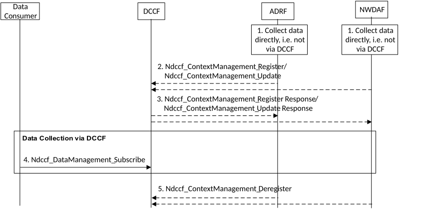

# 6.2.6.3.6 Data collection profile registration

In some cases data consumers (e.g. NWDAF or ADRF) collect data from data source NF directly, e.g. when NWDAF is co-located with 5GC NF.

To enable data consumers can get the data which has been collected by NWDAF or ADRF directly (i.e. not via DCCF), the NWDAF or ADRF may register/update the data collection profile to the DCCF during/after the procedure of data collection. DCCF can then determine some requested data is available in NWDAF or ADRF and can coordinate data collection based on the data collection profile.

The procedure depicted in Figure 6.2.6.3.6-1 is used by data source (e.g. NWDAF or ADRF) to register data profile to DCCF.

Figure 6.2.6.3.6-1: Procedure for the NWDAF or ADRF register data profile to DCCF

1\. An ADRF or NWDAF instance is collecting or has collected data directly, e.g. from collocated NF.

2\. The ADRF or NWDAF requests to register/update data collection profile (Service Operation, Analytics/Data Specification, ADRF ID or NWDAF ID) to DCCF by invoking the Ndccf_ContextManagement_Register or Ndccf_ContextManagement_Update. The registration/ update request can be triggered by the acceptation of subscription for data collection responded by the data source (e.g. collocated NF), it can be before the start of data collection or after the completion of data collection. DCCF determines the data collection status of NWDAF or ADRF based on the Analytics/Data Specification, i.e. DCCF determines whether the required data is being collected or has been collected.

"Service Operation" identifies the service used to collect the data or analytics from a Data Source (e.g.: Namf_EventExposure_Subscribe or Nnwdaf_AnalyticsSubscription_Subscribe).

"Analytics/Data Specification" is the "Service Operation" specific parameters that identify the collected data (i.e.: Analytics ID(s) / Event ID (s), Target of Analytics Reporting or Target of Event Reporting, Analytics Filter or Event Filter, etc.).

ADRF ID or NWDAF ID specify the ADRF or NWDAF which registers data collection profile.

3\. The DCCF responds to the ADRF or NWDAF with a Ndccf_ContextManagement_Register Response or Ndccf_ContextManagement_Update Response.

4\. To obtain historical data and if the data consumer is configured to collect data via the DCCF using Ndccf_DataManagement_Subscribe service operation, the data consumer uses the procedures described in clause 6.2.6.3.2 or clause 6.2.6.3.3.

5\. The ADRF or NWDAF requests to delete a registration of data collection or analytics collection to the DCCF by invoking the Ndccf_ContextManagement_Deregister, triggered for instance by a request of the service consumer or by a storage life-time expiry of related data.
