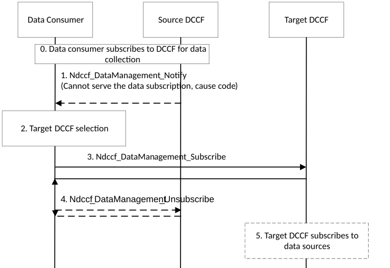

# 6.2.6.3.7 DCCF (re-)selection initiated by consumer

The procedure depicted in Figure 6.2.6.3.7-1 is used by a data consumer (e.g. NWDAF or central DCCF) to obtain data related to UE(s), to be notified by the DCCF when the DCCF can no longer serve the UE(s) and to then reselect the DCCF.

Figure 6.2.6.3.7-1: Procedure for DCCF relocation initiated by consumer

0\. The data consumer subscribes to source DCCF.

1\. Source DCCF may notify the data consumer that it cannot serve the subscription anymore, e.g. when location of UE(s) falls outside the serving area of the DCCF. A cause code is added with the notification (e.g. UE(s) moved outside DCCF serving area). The DCCF may send pending data to the data consumer.

2\. The data consumer for the DCCF determines to select a new instance of DCCF. The data consumer discovers and selects the target DCCF as described in clause 6.3.19 of TS 23.501 \[2\]. The data consumer may perform the DCCF selection due to internal triggers, notification of a UE mobility event or by receiving the notification from the source DCCF in step 1.

3\. The data consumer sends a subscription request to the target DCCF using Ndccf_DataManagement_Subscribe request.

4\. The data consumer may unsubscribe from the source DCCF.

5\. Target DCCF may subscribe to relevant data source(s), if not yet subscribed.
