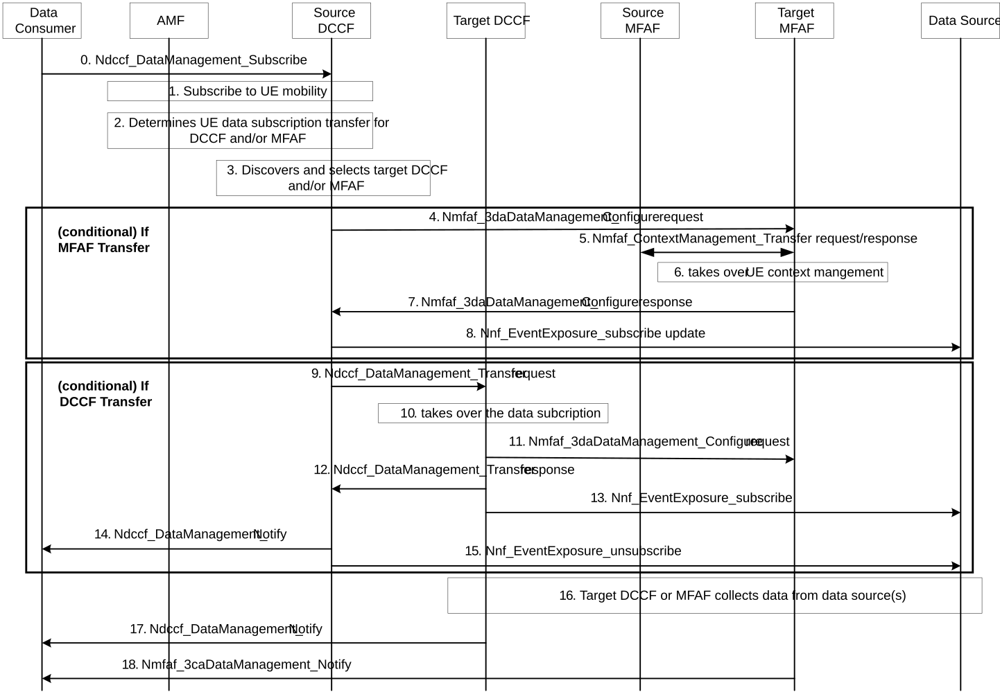

# 6.2.6.3.8 DCCF and MFAF relocation initiated by DCCF

The procedure depicted in Figure 6.2.6.3.8-1 is used to support DCCF and MFAF reselection when the source DCCF or MFAF can no longer serve the UE.

Figure 6.2.6.3.8-1: Procedure for DCCF relocation initiated by DCCF

0\. The data consumer subscribes to source DCCF. The data consumer may indicate in the subscription request with an indicator that the DCCF may execute the relocation procedure.

NOTE 1: If the source DCCF or target DCCF does not support relocation, the consumer may execute DCCF relocation based on internal logic.

1\. Source DCCF subscribes UE mobility events from AMF. The UE ID is provided by the data consumer in step 0.

2\. If UE moves out of the service area of the source DCCF, source DCCF determines UE DCCF subscription context to be transferred to target DCCF, e.g., triggered by a UE mobility event notification from AMF. If UE moves out of the service area of the source MFAF, source DCCF determines UE MFAF data subscription to be transferred to target MFAF.

3\. Source DCCF may query the NRF to discover and select the target DCCF and/or MFAF, e.g. based on the UE location information received from AMF.

**Conditional on MFAF transfer:**

4\. Source DCCF uses the Nmfaf_3daDataManagement service to request transfer of UE MFAF data subscription context to the target MFAF.

5\. Target MFAF retrieves MFAF subscription context from Source MFAF.

6\. Target MFAF accepts the data subscription context transfer. The source MFAF stops data collection and can remove the related context.

7\. Target MFAF responds to the DCCF indicating the transfer is complete. The response may contain a Transaction Reference ID from the Target MFAF. The DCCF regards the data collection context at the Source NWDAF as terminated.

8\. If a DCCF relocation does not occur, Source DCCF updates the data subscription to the data source by changing the Notification Target Address and Notification Correlation ID to the MFAF Notification Address and the MFAF Notification Correlation ID that received in step 7.

**Conditional on DCCF transfer:**

9\. Source DCCF using Ndccf_DataManagement_Transfer Request service operation to transfer of UE data subscription context to the target DCCF.

10\. Target DCCF accepts the data subscription(s) context transfer.

11\. If an MFAF is being used, the Target DCCF uses the Nmfaf_3daDataManagement_Configure service to configure the target MFAF.

12\. Target DCCF confirms UE data subscription context transfer to the source DCCF. The confirmation includes the Subscription Correlation ID used by the Target DCCF.

13\. \[Optional\] Target DCCF subscribes to the relevant data source(s), if it is not yet subscribed to the data source(s) for the data required for the data subscription context and repeat step 1 to subscribes for UE mobility events from AMF.

14\. Source DCCF informs the data consumer about the successful UE DCCF or MFAF data subscription context transfer using a Ndccf_DataManagement_Notify message. The notification may contain a Subscription Correlation ID provided by the target DCCF.

15\. \[Optional\] Source DCCF unsubscribes with the data source(s) that are no longer needed for the remaining UE data subscriptions.

**For DCCF or MFAF transfer:**

NOTE 3: At this point, UE data subscription transfer is deemed completed.

16-18. Target DCCF or MFAF collects data from the data source(s) and notifies the data consumer using a Ndccf_DataManagement_Notify message.
