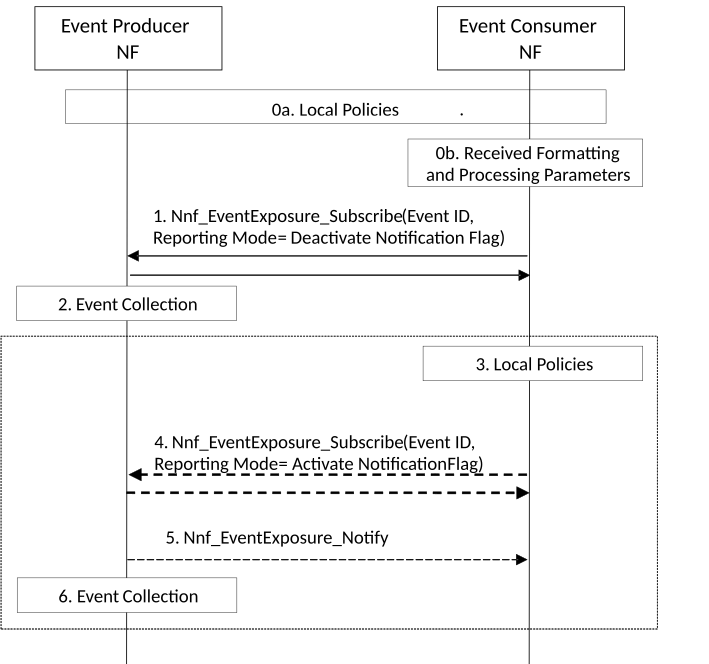

# 6.2.7 Data Collection with Event Muting Mechanism

## 6.2.7.1 General

Additional mechanisms to limit signalling between Event Producer NF (e.g. AMF, SMF) and Event Consumer NF (NWDAF, DCCF) are provided, with the Event Provider NFs enhanced with the optional capability of muting the notification of the events while storing for a limited time and limited size the events until the Event Consumer NF retrieves such mute stored events.

## 6.2.7.2 Procedure for Data Collection with Event Muting Mechanism

The mute storage of events mechanism in the DCCF, the NWDAF, or NFs (if configured to support event muting mechanism) reuses the Event Reporting Information field of Event Exposure Framework to include the following flags:

\- Deactivate notification flag: The event consumer NF includes in the subscription to an event ID the deactivation flag to indicate to the event provider NF to collect, store the requested events but halt the notification to the consumer. The number of stored events may be limited based on Event Producer NF configuration; when this number is reached or another exception occurs (e.g., full buffer), the Event Producer NF performs the actions described later in this clause.

\- Retrieval notification flag: The event consumer NF includes in an event subscription modification request the subscription identification and the retrieval notification flag to indicate to the event producer NF to send the past collected events not already sent to this consumer NF. After sending the past collected events the event producer continues to store events without sending notifications to the event consumer.

When an Event Consumer NF requests notification muting from an Event Producer NF using the Deactivation notification flag, the Event Consumer can in addition specify requested Event Producer NF actions to be taken when an exception occurs at the Event Producer NF. The Event Consumer NF may specify the following parameters in the Event Reporting Information field of Event Exposure Framework:

\- Event Producer NF action on buffered notifications: 'Send All', 'Discard All' or 'Drop Old'.

\- Event Producer NF action on subscription: 'close', 'continue with muting', 'continue without muting'.

The Event Producer NF evaluates the requested action from the Event Consumer NF according to local policy (if configured) and in the response to the Event Consumer NF provides an accept indication if the request can be satisfied.

If the request is accepted, the response from the Event Producer NF may indicate the following:

\- The maximum number of notifications that the Event Producer NF expects to be able to store.

\- An estimate of the duration for which notifications can be buffered.

Using the event muting mechanism NWDAF, DCCF can subscribe to events from NFs such as AMF and SMF (if configured to support event muting mechanism), to avoid constant notifications and retrieve the mute stored events when it requires.

The procedure in Figure 6.2.7.2-1 is used by Event Consumer NF to control the frequency of data collection from Event Producer NFs (except DCCF and NWDAF) via Event Exposure. For data collection via DCCF and NWDAF, the consumer may mute the notifications by using the formatting instructions as specified in clause 5A.4.

Figure 6.2.7.2-1: Procedure for muting event notification

0a. The Event Consumer NF, such as NWDAF or DCCF, is configured with local policies that are used to determine when the muted storage of events is triggered and actions to be requested from the Event Producer NF if an exception occurs at the NF Producer (e.g., full buffer). The Event Producer NF is configured with local polices specifying default actions to take should an exception occur and policies for handling Event Consumers requests containing requested actions to be taken by the Event Producer NF if an exception occurs.

0b. The Event Consumer NF, such as NWDAF or DCCF, may receive a request with the Formatting and Processing parameters indicating Event Clubbing. The DCCF or NWDAF may utilize event muting when collecting data from NFs (if configured to support event muting mechanism).

1\. The Event Consumer NF, DCCF or NWDAF subscribes for a (set of) Event ID(s) by invoking the Nnf_EventExposure_Subscribe service operation including in event reporting information the deactivate notification flag and optionally requested Event Producer NF actions to be taken when an exception occurs at the Event Producer NF.

If the Event Producer NF supports the deactivate notification flag and the requested actions to be taken by the Event Producer NF when an exception occurs, the Event Producer NF sends a response back including the Subscription Correlation ID and an indication of successful deactivation of notifications. The Event Consumer NF may request the Event Producer NF to store data related to Event ID(s), or aggregated data related to UE(s). The response from the Event Producer NF may indicates the maximum number of notifications that the Event Producer NF expects to be able to store and / or an estimate of the duration for which notifications can be buffered.

If the Event Producer NF does not support the deactivate notification flag or does not accept requested actions to be taken by the Event Producer NF when an exception occurs, the Event Producer NF sends a response back including an indication of failure and cause code. In this case, the Event Consumer NF re-sends the subscription request without including in the event reporting information the deactivate notification flag or with different requested actions to be taken by the Event Producer NF when an exception occurs.

NOTE: If the Event Producer NF receives a subscription without the deactivate notification flag, the steps 2 - 6 are not executed and the Event Producer NF performs the event notification as defined in clause 4.15 of TS 23.502 \[3\].

2\. Based on the request from Event Consumer NF, DCCF or NWDAF, the Event Producer NF triggers a window of event collection for the Event Consumer NF, DCCF or NWDAF subscription with the indication of "deactivate notification flag". The Event Producer NF keeps the association between the Event ID, Subscription Correlation ID (which identifies the consumer of the event), subscriber information (e.g. notification target information) and the status of the transaction between the Event Consumer NF, DCCF or NWDAF and the Event Producer as "collecting events / non-notification".

3\. Based on local policies or based on the Notification Time Window indicated in the Formatting and Processing parameters of the received request in step 0b, the Event Consumer NF, DCCF or NWDAF decides when to request the muted stored events from the Event Producer NF.

4\. Event Consumer NF invokes the Nnf_EventExposure_Subscribe service operation from the Event Producer NF including, the Event ID, the Subscription Correlation ID and the retrieval notification flag. These parameters denote the identification of the transaction required by the Event Consumer NF, i.e. retrieve muted stored events for a subscribed Event ID and trigger a new time window of muted stored event generation without notification.

5\. Event Producer NF based on the parameters received in the request from Event Consumer NF verifies whether there is a subscription to the requested Event ID with a deactivate notification flag. In positive case, Event Producer NF identifies and sends the past collected events muted during the period between the received retrieval notification flag and the last deactivate flag received from the Event consumer NF for the Event ID, the Subscription Correlation ID.

If an exception (e.g. full buffer) occurs, the Event Producer NF performs the actions determined in steps 0a and 1.

6\. The Event Producer NF checks whether overall event reporting information (e.g. the maximum time window for the subscription of such Event ID) has expired. If yes, it does not trigger another round of event muted storage and deactivates the subscription. If not expired, the Event Producer NF trigger another time window for muted stored of produced events, sets back the deactivated notification flag for the Event ID and Subscription Correlation ID.

If the Event Consumer NF wants to change an existing subscription to an Event Producer NF using muted stored events into a regular notification of events, it shall invoke Nnf_EventExposure_Subscribe service operation from Event Producer NF without deactivate notification flag.
