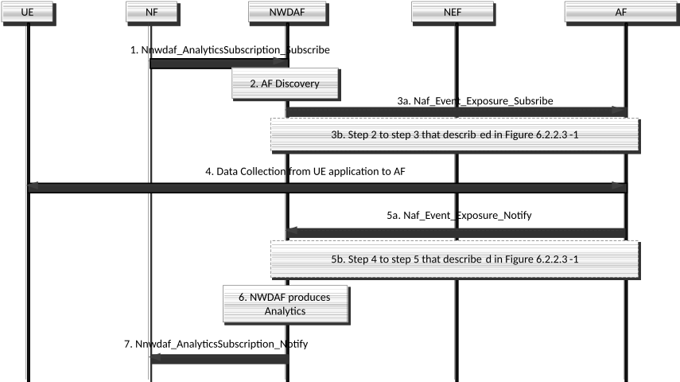
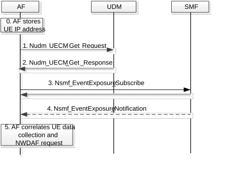
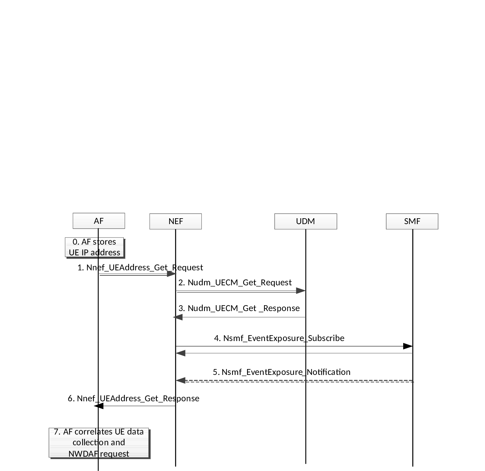
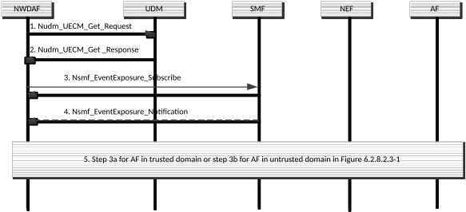

# 6.2.8 Data Collection from the UE Application

## 6.2.8.1 General

The NWDAF may interact with an AF to collect data from UE Application(s) as an input for analytics generation and ML Model training. The AF can be in the MNO domain or an AF external to MNO domain. The data collection request from NWDAF may trigger the AF to collect data from the UE Application. The AF in this clause is referred as the Data Collection AF which is described in TS 26.531 \[32\].

The UE Application establishes a connection to the AF in the MNO domain or external to MNO domain over user plane via a PDU session. The AF communicates with the UE Application and collects data from UE Application.

For both an AF in trusted domain and an AF in untrusted domain (which supports to collect data from a UE Application), the SLA between the operator and the Application Service Provider (i.e. ASP) determines per Application ID in use by the ASP:

\- The AF for the UE Application to connect to (e.g. based on an FQDN).

\- The information that the UE Application shares with the AF, subject to user consent.

\- Possible Data Anonymization, Aggregation or Normalization algorithms (if used).

\- The authentication information that enable the AF to verify the authenticity of the UE's Application that provides data.

NOTE 1: The mutual authentication information that is used by the UE Application and the AF and how user consent is obtained is out of scope of the present document. However, the authentication information could contain GPSI.

The AF (which supports the data collection) is configured based on the SLA above.

NOTE 2: Data Anonymization, Aggregation or Normalization algorithms within the SLA are defined per individual UE.

A UE Application (which supports to providing data to an AF) is configured by the ASP with the Application ID to use in the communication with the AF and then the UE Application is configured per Application ID with the following information:

\- The address of the AF to contact.

\- The parameters that the UE Application is authorized to provide to the AF.

\- The authentication information to enable the UE Application to verify the authenticity of the AF that requests data.

NOTE 3: The authentication and authorization information that is used by the UE Application and the AF for collection and how user consent is obtained is out of SA2's scope. However, the authentication information could contain GPSI.

NOTE 4: The configuration procedure for the above information from the ASP to the UE's Application is out of scope of the present document.

NOTE 5: The Application ID configured in the UE Application can either be an OSAppId as defined in TS 23.503 \[4\] or an OS independent Application Identifier (e.g. for applications running on a web browser).

The Target for Event Reporting in the Naf_EventExposure request may be set to:

\- an external UE ID (i.e. GPSI) or an external Group ID, in case the AF is located in the untrusted domain;

\- a SUPI or an internal Group ID, in case the AF is located within the trusted domain.

The GPSI may be an External Identifier for individual UE as defined in TS 23.501 \[2\] that includes the domain name. This domain name and the Application ID configured in the UE Application are different from each other.

## 6.2.8.2 Procedure for data collection from the UE Application

### 6.2.8.2.1 Connection establishment between UE Application and AF

The UE Application receives the data collection configuration from ASP. The configuration information is as described in clause 6.2.8.1.

The UE Application establishes a user plane connection to the AF. Data collection procedure from the UE Application is performed via the user plane connection.

NOTE 1: Whether multiple user plane connections are established, or a single user plane connection is established for different applications between each UE Application and AF is based on implementation that is out of 3GPP scope.

NOTE 2: The Connection establishment procedure from the UE Application to the AF as above is out of scope of the present specification. For the 3GPP defined services, the Connection establishment procedure is described in TS 26.531 \[32\]. For the non-3GPP defined services, the Connection establishment procedure is out of 3GPP's scope.

NOTE 3: In order to preserve resources (e.g. battery, quota) for the end user, a user plane connection to the AF can be established only when the UE has an active PDU Session for the UE Application and it is actively using the network (i.e. the user plane connection to the AF does not need to be established when the UE Application is inactive, or used in an off-line mode).

Both direct data collection procedure (from the UE Application to the AF, either in trusted domain or untrusted domain) and indirect data collection procedure (from the UE Application to the Application server and from the Application server to the AF) are described in TS 26.531 \[32\].

The AF stores the IP address received from the UE (in the PDU session used) in order to request data collection from the UE Application. The UE IP address is used by the AF to identify the user plane connection.

The UE Application provides the Application ID configured in the UE Application to the AF as described in TS 26.531 \[32\].

### 6.2.8.2.2 AF registration and discovery

The AF registers its available NF profile to the NRF. The AF in trusted domain registers to the NRF by using the Nnrf_NFManagement service that is defined in clause 5.2.7.2 of TS 23.502 \[3\]. The AF in untrusted domain registers the available NF profile to the NRF via the NEF as described in clause 6.2.2.3.

The AF discovery and selection is described in clause 6.3.25 of TS 23.501 \[2\].

### 6.2.8.2.3 Data Collection Procedure from UE

Figure 6.2.8.2.3-1: Data Collection Procedure from UE

1\. An NF subscribes to analytics from the NWDAF as described in clause 6.1.1.1, that includes Analytics ID, Analytics Filter Information including e.g. AoI, Internal Application ID(s) and Target of Analytics Reporting. NWDAF may also initiate the data collection prior to this subscription.

NOTE: Subscription to analytics can be triggered directly towards NWDAF or can be done via DCCF using procedure in clause 6.1.4.2.

2\. NWDAF discovers and selects the AF that provides data collection (based on the AF profiles registered in NRF) as described in clause 6.3.25 of TS 23.501 \[2\].

Step 3a is used for the AF in trusted domain while step 3b is used for the AF in untrusted domain.

3a. NWDAF subscribes to the AF in trusted domain for UE data collection (i.e. input data from UE for analytics), by using Naf_EventExposure_Subscribe as defined in clause 5.2.19.2.2 of TS 23.502 \[3\]. The NWDAF request contains an Application ID known in the core network and the UE Application provides the Application ID configured in the UE Application. The AF binds the NWDAF request for an Application Id and the UE data collection for an Application Id configured in the UE.

3b. NWDAF subscribes to the AF in untrusted domain for UE data collection (i.e. input data from UE for analytics), by using step 2 and step 3 of the procedure that is described in Figure 6.2.2.3-1.

NOTE: For steps 3a and 3b, data collection can also be triggered using DCCF, as specified in clause 6.2.6.3.

4\. The AF collects the UE data using either direct or indirect data collection procedure in clause 6.2.8.2.1. The establishment of the connection can be performed at any time prior to this. The AF links the data collection request from step 3 to the user plane connection as described in clause 6.2.8.2.4.

NOTE 1: The Direct data collection and indirect data collection procedure is described in TS 26.531 \[32\].

Step 5a is used for the AF in trusted domain while step 5b is used for the AF in untrusted domain.

5a. The AF in trusted domain receives the input data from the UE and processes the data (e.g. anonymizes, aggregates and normalizes) according to the SLA that is configured in the AF described in clause 6.2.8.1 and Event ID(s) and Event Filter(s) set during step 3a. The trusted AF then notifies the NWDAF on the processed data according to the NWDAF subscription in step 3a.

5b. The AF in untrusted domain receives the input data from the UE and processes the data (e.g. anonymizes, aggregates and normalizes) according to the SLA that is configured in the AF described in clause 6.2.8.1 and Event ID(s) and Event Filter(s) set during step 3b. The untrusted AF notifies the NWDAF on the processed data by using step 5b (i.e. Step 4 and step 5 of the procedure that described in Figure 6.2.2.3-1).

NOTE 2: If NWDAF requests the same data from multiple UEs, i.e. a determined list of UEs or "any UE" as the Target of Analytics Reporting, the AF can process (e.g. anonymize, aggregate and normalize) the data from multiple UEs according to the Event ID(s) and Event Filter(s) received from NWDAF during step 3a or 3b before notifying the NWDAF on the processed data in step 5a (if the AF is in trusted domain) or step 5b (if the AF is in untrusted domain).

6\. The NWDAF produces analytics using the UE data received from the AF.

7\. The NWDAF provides analytics to the consumer NF.

If the Target of Analytics Reporting that was received from the consumer in step 1 includes an Internal Group ID, NWDAF includes such Internal Group ID in step 3a or step 3b to AF. In the case of step 3b, NEF translates the Internal Group ID to an External Group ID.

If the Target of Analytics Reporting that was received from consumer in step 1 is "any UE", NWDAF may either set the target of event reporting to "any UE" in step 3a or 3b to AF, or may determine a list of SUPIs from AMF and/or SMF based on the Analytics Filter Information and sends the step 3a or 3b to AF for the determined list of UEs.

NOTE 3: It is assumed that the AF is provisioned with the list of UE IDs (GPSIs or SUPIs) belonging to an External or Internal Group ID.

### 6.2.8.2.4 Correlation between UE data collection and the NWDAF data request

### 6.2.8.2.4.1 General

The UE IP address is used to identify the user plane connection established between the UE application and the AF for data collection, while the AF receives the Naf_EventExposure_Subscribe to request for the specific UE data collection by using SUPI (for AF in trusted domain) or external UE ID (i.e. GPSI) (for AF in untrusted domain). AF is required to correlate the UE IP address to the SUPI or to GPSI.

If the AF supports requests addressed to External Group ID (for AF in untrusted domain) or Internal Group ID (for AF in internal trust domain), the AF must correlate the list of external UE ID (i.e. GPSI) or SUPI, respectively, with the group(s) the UE belongs to, so that the AF can further correlate the UE ID (external or internal) to the UE IP address.

AF may indicate in NF profile and register to NRF in clause 6.2.8.2.2 if it supports to do the mapping itself or ask NWDAF to do it. If the AF is in a trusted domain, it may also indicate the supported list of S-NSSAI, DNN combinations to NRF in NF profile.

NOTE 1: If any method in Annex A is used, the AF always indicates in the NF profile that it supports mapping by itself.

Accordingly, if AF supports the mapping, for AF in trusted domain, it is required to correlate the UE IP address and SUPI as described in clause 6.2.8.2.4.2 or by other means, e.g. as described in Annex A. This, after receiving the data collection request from NWDAF and there is no mapping information storage in the AF. For AF in untrusted domain, the procedure to correlate the UE IP address and GPSI is described in clause 6.2.8.2.4.4 or by some other means, e.g. as described in Annex A. If there is NAT between the UE and the AF, one of the methods in Annex A can be used.

If there is no NAT between the UE and the AF, NWDAF may collect the mapping information as described in clause 6.2.8.2.4.4 before sending request to AF in step 3a or step 3b in Figure 6.2.8.2.3-1.

If the user plane session between the UE and the AF is released, the AF / NWDAF removes the stored correlation information between UE IP address and UE SUPI / GPSI.

For all procedures defined in this clause 6.2.8.2.4.1, a specific combination of S-NSSAI/DNN shall be corresponding to a single PDU session for a UE to access the AF (either in trusted domain or untrusted domain).

NOTE 2: Based on implementation, for the UE to access the Data Collection AF, only a single PDU Session is allowed to be established to the Data Collection AF, by configuring a specific S-NSSAI/DNN for the Data Collection AF only.

### 6.2.8.2.4.2 AF in trusted domain correlates UE data collection and NWDAF request

This is only valid if there is no NAT between the UE and the AF.

If the AF receives the Naf_EventExposure_Subscribe/Request including Target for Event Reporting set to SUPI and not including the UE's IP address and the AF does not locally store the UE's IP address, the AF finds the PDU session(s) serving the SUPI, DNN, S-NSSAI from UDM and the allocated IPv4 address or IPv6 prefix or both from SMF as described in Figure 6.2.8.2.4.2-1.

Figure 6.2.8.2.4.2-1: AF in trusted domain correlates UE data collection and NWDAF request

0\. At the establishment of the user plane connection between the UE Application and the AF, the AF stores the UE IP address (for both direct and indirect reporting) as described clause 6.2.8.2.1.

1\. The AF receives a request to retrieve input data as described in clause 6.2.8.2.3 including a SUPI. The AF finds the SMF serving the PDU session(s) for this SUPI using Nudm_UECM_Get_Request including SUPI, type of requested information set to SMF Registration Info and the S-NSSAI and DNN, as defined in clause 5.3.2.5.7 in TS 29.503 \[26\].

2\. The UDM provides the SMF id and the corresponding PDU Session id, S-NSSAI, DNN using Nudm_UECM_Get_Response to the AF. Using the AF supported S-NSSAI, DNN and the received information from UDM, AF determines the PDU session used for the user plane connection between UE and AF.

3\. The AF sends Nsmf_EventExposure_Subscribe to the SMF identified in step 2, including the Target for Event Reporting set to the PDU Session id(s) provided in step 2 and the Event ID set to IP address/prefix allocation/change.

4\. The SMF provides the allocated IPv4 address or IPv6 prefix to the AF.

5\. The AF correlates the UE data that includes the UE IP address and the NWDAF request for a SUPI using the retrieved IPv4 address or IP v6 prefix.

If the user plane session between the UE and the AF is released, the AF shall remove the stored correlation information between the UE IP address / prefix and SUPI.

### 6.2.8.2.4.3 AF in untrusted domain correlates UE data collection and NWDAF request

This is only valid if there is no NAT between the UE and the AF.

If the AF receives the Naf_EventExposure_Subscribe from NWDAF, via NEF, including Target for Event Reporting set to GPSI and not including the UE's IP address and the AF does not locally store the UE's IP address, the AF request the NEF to provide the allocated IPv4 address or IPv6 prefix or both as described in Figure 6.2.8.2.4.3-1.

NOTE 1: The NWDAF can also provide the UE IP address to the AF as described in clause 6.2.8.2.4.1.

Figure 6.2.8.2.4.3-1: AF in untrusted domain correlates UE data collection and NWDAF request

0\. Same step as step 0 in figure 6.2.8.2.4.3-1.

1\. The AF receives a request to retrieve input data as described in clause 6.2.8.2.3 including a GPSI. The AF requests NEF to provide the IPv4address or IPv6 prefix or both serving the PDU session for this GPSI towards the AF using Nnef_UEAddress_Get_Request.

2\. The NEF is configured with the DNN, S-NSSAI to access this AF. The NEF finds the SMF serving the PDU session(s) for this GPSI, DNN, S-NSSAI using Nudm_UECM_Get_Request including type of requested information set to SMF Registration Info and the S-NSSAI and DNN, as defined in clause 5.3.2.5.7 of TS 29.503 \[26\].

NOTE 2: If there are more than one (DNN, S-NSSAI) combination to access this AF, the NEF will find the SMF(s) serving the PDU session(s) to any of these (DNN, S-NSSAI) combinations.

3\. The UDM provides the SMF id(s) and the tuple (PDU Session id (S-NSSAI, DNN) using Nudm_UECM_Get_Response to the NEF. Using the configuration in NEF, as described in step 2, the NEF determines the PDU session used for the user plane connection between UE and AF.

4\. The NEF sends Nsmf_EventExposure_Subscribe to the SMF(s) identified in step 3, including the Target for Event Reporting set to the PDU Session id(s) provided in step 3 and the Event ID set to IP address/prefix allocation/change.

5\. The SMF provides the allocated IPv4 address or IPv6 prefix or both to the NEF.

6\. The NEF provides the allocated IPv4 address or IPv6 prefix or both provided by SMF in step 5 to the AF.

7\. The AF correlates the UE data that includes the UE IP address and the NWDAF request for the GPSI using the retrieved IPv4 address or IP v6 prefix.

If the user plane session between the UE and the AF is released, the AF shall remove the stored correlation information between the UE IP address / prefix and GPSI.

### 6.2.8.2.4.4 NWDAF correlates UE data collection and NWDAF request for trusted AF and untrusted AF

This is only valid if there is no NAT between the UE and the AF.

NWDAF receives the analytics subscription from consumer and discover an AF as described in clause 6.2.8.2.3. NWDAF finds the PDU session(s) serving the SUPI, DNN, S-NSSAI from UDM and the allocated IPv4 address or IPv6 prefix from SMF as described in Figure 6.2.8.2.4.4-1.

Figure 6.2.8.2.4.4-1: NWDAF correlates UE data collection and NWDAF request

1\. The NWDAF finds the SMF(s) serving the PDU session(s) for this SUPI or GPSI using Nudm_UECM_Get_Request including SUPI or GPSI, type of requested information set to SMF Registration Info and the list of S-NSSAI and DNN combinations, as defined in clause 5.3.2.5.7 in TS 29.503 \[26\]. The NWDAF acquires the DNN, S-NSSAI used to access the AF using Nnrf_NFDiscovery_Request service operation or is configured with the DNN, S-NSSAI used to access the AF.

2\. The UDM provides the SMF id(s) and the corresponding PDU Session id(s), per S-NSSAI, DNN combination using Nudm_UECM_Get_Response to the NWDAF. Based on the S-NSSAI, DNN used to access the AF in step 1, NWDAF determines the PDU session used for the user plane connection between UE and AF.

3\. The NWDAF sends Nsmf_EventExposure_Subscribe to the SMF identified in step 2, including the Target for Event Reporting set to the PDU Session id(s) provided in step 2 and the Event ID set to IP address/prefix allocation/change.

4\. The SMF provides the allocated IPv4 address or IPv6 prefix to the NWDAF.

5\. Step 3a for AF in trusted domain or step 3b for AF in untrusted domain in Figure 6.2.8.2.3-1 is performed with the exception that NWDAF sets the allocated IPv4 address or IPv6 prefix that were received in step 4 as target of event reporting.

If NWDAF subscribed for the PDU session used for the user plane connection between the UE and the AF is released notification in step 3, the SMF informs the NWDAF that the UE IP address / prefix is released via Nsmf_EventExposure_Notify. Based on this information, the NWDAF shall remove the stored correlation information between the UE IP address / prefix and SUPI.

### 6.2.8.2.4a Void
