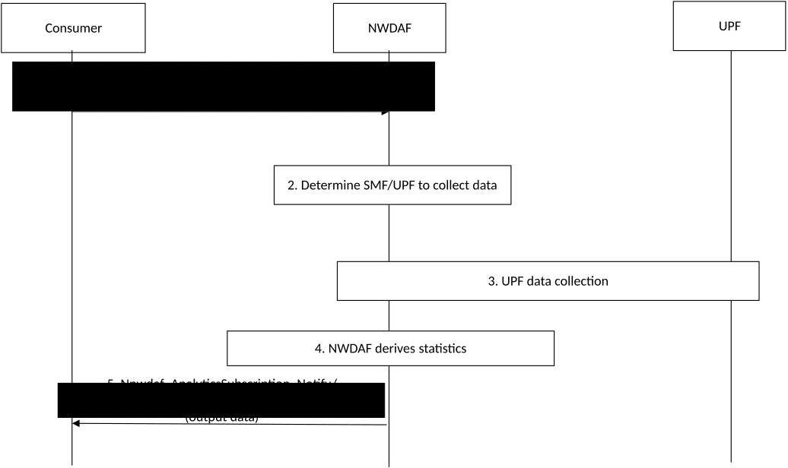

# 6.20 PDU Session traffic analytics

## 6.20.1 General

This clause specifies the procedure for an NWDAF to provide statistics on whether traffic of UEs via one or multiple PDU sessions is according to the information provides by the service consumer.

The NWDAF collects traffic flow information of UE traffic via PDU session(s) established for a specific S-NSSAI and/or DNN and provides statistics of UEs that route traffic according to the information provided by the service consumer (e.g., Traffic Descriptor, S-NSSAI, DNN) and UEs that route traffic which is not expected according to the information provided by the service consumer (e.g., Traffic Descriptor, S-NSSAI, DNN).

The assumption is that Traffic Descriptors are known (e.g. known flow description), so that there are associated Packet Detection Rule(s) for the known traffic configured in the UPF.

NOTE 1: How traffic from different applications over the same S-NSSAI/DNN and/or PDU session is discerned is implementation-specific.

The service consumer may be a PCF.

The consumer of these analytics includes in the request:

\- Analytics ID = "PDU Session traffic".

\- Target of Analytics Reporting as defined in clause 6.1.3.

\- Traffic Descriptor: Application Identifier, IP Descriptions or Domain Descriptors are applicable.

NOTE 2: The Application Id provided by the consumer is known by the network, i.e. corresponds to an Application Id known at the UPF.

\- Analytics Filter Information containing:

\- Area of Interest (i.e. the location of UEs where PDU Session traffic is monitored);

\- S-NSSAI;

\- DNN;

\- an optional list of analytics subsets that are requested (see clause 6.20.3);

\- Optionally, preferred level of accuracy of the analytics.

\- Optionally, preferred level of accuracy per analytics subset (see clause 6.20.3);

\- An Analytics target period indicates the time period over which the analytics are requested.

\- Optionally, maximum number of objects.

\- In a subscription, the Notification Correlation Id and the Notification Target Address are included.

## 6.20.2 Input Data

NWDAF collects input data from the SMF and/or UPF. The detailed data are described in Table 6.20.2-1.

Table 6.20.2-1: Collected PDU Session User Plane Traffic Information

| Information             | Source   | Description                                                                                                  |
|-------------------------|----------|--------------------------------------------------------------------------------------------------------------|
| SUPI                    | SMF, UPF | UE ID for the UE that established PDU sessions to an S-NSSAI/DNN.                                            |
| S-NSSAI                 | SMF, UPF | The S-NSSAI for which the PDU session is established.                                                        |
| DNN                     | SMF, UPF | The DNN for which the PDU session is established.                                                            |
| PDU Session Information |          | The detected Service Data Flow, volume measured and Application related information in a PDU Session.        |
| \> Packet Filter Set    | SMF, UPF | Packet Filter Set for the detected Service Data Flow as defined in clause 5.8.2.4.2 of TS 23.502 \[3\].      |
| \> URL list             | SMF, UPF | If available, list of URLs extracted from the inspected user plane packets in the Service Data Flow.         |
| \> Domain Name list     | SMF, UPF | If available, list of domain names extracted from the inspected user plane packets in the Service Data Flow. |
| \> UL Data volume       | SMF, UPF | Measured UL data traffic volume for the Service Data Flow for the duration of the PDU Session.               |
| \> DL Data volume       | SMF, UPF | Measured DL data traffic volume for the Service Data Flow for the duration of the PDU Session.               |

NOTE: Care needs to be taken with regards to load and major signalling caused when requesting Any UE. This could be achieved via utilization of some event filters (e.g. Area of Interest), a specific DNN, S-NSSAI or sampling ratio as part of Event Reporting Information.

The NWDAF collects input data from the UPF either indirectly via the SMF, or directly from the UPF using the "UserDataUsageMeasures" event exposure event as described in clause 4.15.4.5 of TS 23.502 \[3\]. Further details about input parameters are described in Table 4.15.4.5.1 of TS 23.502 \[3\].

## 6.20.3 Output Analytics

The NWDAF collects input data from the UPF, via SMF when the request is for a UE or a group of UEs identified by an Internal-Group-ID or directly from the UPF when possible (see clause 5.8.2.17 of TS 23.501 \[2\]) if the request applies for any UE and NWDAF provides analytics of UEs about the traffic they route over a PDU session of specific S-NSSAI/DNN according to the Traffic Descriptor provided by the consumer and traffic they route over a PDU Session that is not according to the Traffic Descriptor provided by the consumer and information about that traffic.

The output analytics is shown in Table 6.20.3-1.

Table 6.20.3-1: PDU Session traffic statistics

| Information                                                                                                                                                                                   | Description                                                                                                                                                             |
|-----------------------------------------------------------------------------------------------------------------------------------------------------------------------------------------------|-------------------------------------------------------------------------------------------------------------------------------------------------------------------------|
| List of SUPIs or SUPI                                                                                                                                                                         | Identifies a SUPI, or a list of SUPIs for which analytics are provided.                                                                                                 |
| S-NSSAI                                                                                                                                                                                       | Identifies the Network Slice for which analytic information is provided.                                                                                                |
| DNN                                                                                                                                                                                           | Identifies the data network name (e.g. internet) for which analytics information is provided.                                                                           |
| Traffic matching the Traffic Descriptor (NOTE 1)                                                                                                                                              | Identifies traffic that matches Traffic Descriptor provided by the consumer in those PDU Sessions identified by the S-NSSAI and DNN above and the volume.               |
| \> Traffic Descriptor                                                                                                                                                                         | IP Flow descriptor containing 3-tuple, server side (destination address, port and protocol) or Application ID or Domain descriptor.                                     |
| \> Volume                                                                                                                                                                                     | measures of data volume exchanged (UL, DL and/or overall) and/or number of packets exchanged (UL, DL and/or overall) for the Traffic Descriptor within the PDU Session. |
| Traffic which does not match Traffic Descriptor (NOTE 1)                                                                                                                                      | Identifies traffic that does not match Traffic Descriptor provided by the consumer in those PDU Sessions identified by the S-NSSAI and DNN above and the volume.        |
| \> Traffic Descriptor                                                                                                                                                                         | IP Flow descriptor containing 3-tuple, server side (destination address, port and protocol) or Application ID or Domain descriptor.                                     |
| \> Volume                                                                                                                                                                                     | measures of data volume exchanged (UL, DL and/or overall) and/or number of packets exchanged (UL, DL and/or overall).                                                   |
| NOTE 1: Analytics subset that can be used in "list of analytics subsets that are requested" and "Preferred level of accuracy per analytics subset". The list is ordered by descending volume. |                                                                                                                                                                         |

NOTE: Predictions are not provided.

## 6.20.4 Procedures

The procedure for deriving PDU Session traffic is shown below.

Figure 6.20.4-1: NWDAF providing PDU Session traffic analytics

1\. The Consumer NF (e.g. the PCF) requests or subscribes to the NWDAF to request PDU Session Traffic analytics. The consumer includes within analytics filter the expected traffic via a PDU session according to the Traffic Descriptors and the SUPI or list of SUPIs, the S-NSSAI and DNN of the PDU session. It is assumed that there are associated Packet Detection Rule(s) for the expected traffic listed in the analytics request, i.e. the expected traffic is known.

2\. The NWDAF determines to collect data, either directly from the UPF or indirectly via the SMF and identifies the SMF(s) and/or UPF(s) to retrieve input data according to the S-NSSAI/DNN and SUPI or list of SUPIs in the analytics request.

3\. The NWDAF collects input information using the procedure for subscription to UPF event exposure for certain UEs via SMF as described in clause 4.15.4.5.2 of TS 23.502 \[3\]; the Target of Event Reporting is set to each of the tuples (SUPI, DNN and S-NSSAI) that have a PDU Session in the same SMF, the Target Subscription Information is set to "UserDataUsageMeasures", the Target service data flows is absent to indicate that the UPF reports any detected service data flow in the PDU Session.

The UPF reports volume measurements for the PDU Session with per application granularity, the report includes volume measurements and provide the application related information, i.e. URLs and Domain names.

4\. The NWDAF derives analytics indicating a list of UEs and the traffic they route according to the provided information provided by the consumer (i.e. Traffic Descriptor, S-NSSAI and DNN), including its volume and the traffic they route and a list of UEs which route traffic that it is not expected according to the information provided by the consumer (i.e. Traffic Descriptor, S-NSSAI and DNN) including its volume.

5\. The NWDAF provides the analytics as defined in Table 6.20.3-1 using either the Nnwdaf_AnalyticsInfo_Request response or Nnwdaf_AnalyticsSubscription_Subscribe_Notify, depending on the service used in step 1
