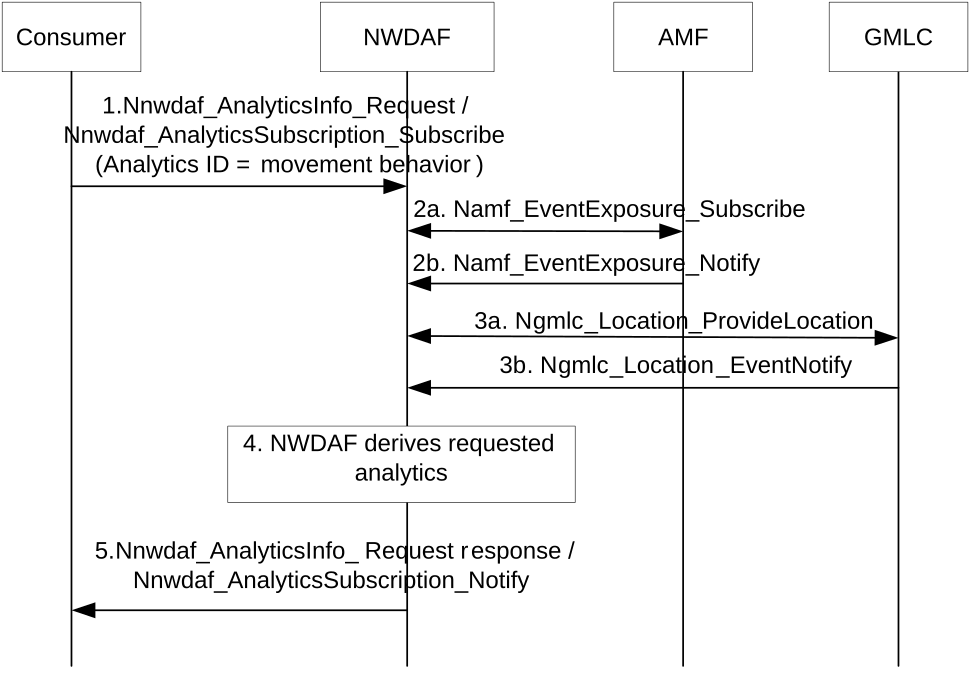

# 6.21 Movement Behaviour Analytics

## 6.21.1 General

The movement behaviour analytics provides analytics information (statistics or predictions) regarding e.g. the number, direction and velocity of UEs during an analytics target period in a target area. The analytics of movement behaviour requires to collect UE movements in a certain region in a certain period of time. In addition, the consumers can further derive the congestion situation in the target area through analytics.

The NWDAF provides movement behaviour analytics to a NF (e.g. NEF, AF).

The consumer of these analytics shall indicate in the request or subscription:

\- Analytics ID = "movement behaviour";

\- Target of Analytics Reporting: any UE;

\- Analytics Filter Information:

\- Area of Interest (AOI): restricts the scope of the movement behaviour analytics to the provided area. The AOI may be described as shown in clause 5.5 of TS 23.273 \[39\];

\- Optionally, the list of analytics subsets that are requested among those specified in clause 6.21.3;

\- An Analytics target period indicates the time period over which the statistics or predictions are requested;

\- Optionally, preferred level of accuracy of the analytics;

\- Optionally, preferred level of accuracy per analytics subset (see clause 6.21.3);

\- Optionally, preferred granularity of location information: "longitude and latitude level";

\- Optionally, preferred orientation of location information: ("horizontal", "vertical", "both")"; and

\- Optionally, maximum number of objects.

## 6.21.2 Input data

The NWDAF collects the UE location and velocity information within the area of interest from the sources listed in Table 6.21.2-1.

Table 6.21.2-1: Data collection by NWDAF for "movement behaviour" analytics

| Information                                                                             | Source       | Description                                                                             |
|-----------------------------------------------------------------------------------------|--------------|-----------------------------------------------------------------------------------------|
| UE ID                                                                                   | AMF          | SUPI                                                                                    |
| UE locations (1..max)                                                                   | AMF          | UE positions                                                                            |
| \>UE location                                                                           |              | TA or cells that the UE enters                                                          |
| \>Timestamp                                                                             |              | A time stamp when the AMF detects the UE enters this location                           |
| Fine granularity locations (1 …max)                                                     | LCS (NOTE 1) | UE locations                                                                            |
| …\>Timestamp                                                                            |              | Time information associated with the collected information                              |
| …\>LCS QoS                                                                              |              | The achieved LCS QoS accuracy (see TS 23.273 \[39\])                                    |
| …\>Location estimate                                                                    |              | Geographical location or location in local coordinates (as defined in TS 23.032 \[34\]) |
| …\>Velocity estimate                                                                    |              | Speed and direction information                                                         |
| …\>Indoors/outdoor indication                                                           |              | Indicate the location estimate is indoor or outdoor                                     |
| …\>Age of location                                                                      |              | Valid period of the location estimate                                                   |
| NOTE 1: The procedure to collect location data using LCS is described in clause 6.2.12. |              |                                                                                         |

## 6.21.3 Output analytics

The output for analytics of movement behaviour provided by NWDAF is defined in Table 6.21.3-1 and Table 6.21.3-2.

Table 6.21.3-1: movement behaviour statistics

| Information                                                                                                                                       | Description                                                                             |
|---------------------------------------------------------------------------------------------------------------------------------------------------|-----------------------------------------------------------------------------------------|
| Applicable Area                                                                                                                                   | A geographical area as defined in TS 23.273 \[39\] that the analytics applies to.       |
| Time slot entry (1..max)                                                                                                                          | List of time slots during the Analytics target period                                   |
| \> Time slot start                                                                                                                                | Time slot start within the Analytics target period                                      |
| \> Duration                                                                                                                                       | Duration of the time slot                                                               |
| \> Total number of UEs (NOTE)                                                                                                                     | Total number of UEs in the area of interest                                             |
| \> Ratio of moving UEs (NOTE)                                                                                                                     | Ratio of moving UEs in the area of interest                                             |
| \> Average speed (NOTE)                                                                                                                           | Average speed of all UEs in the area of interest                                        |
| \> Speed threshold (1...max) (NOTE)                                                                                                               | Threshold utilized to filter the UEs                                                    |
| \>\> Number of UEs                                                                                                                                | The number of UEs whose speed is faster than the speed threshold                        |
| \>\> Ratio                                                                                                                                        | Percentage of UEs whose speed is faster than the speed threshold                        |
| \> Direction (1…max) (NOTE)                                                                                                                       | Heading directions of the UEs in the target area, such as north, south, east, west etc. |
| \>\> Number of UEs                                                                                                                                | The number of UEs in the specific direction                                             |
| \>\> Average speed                                                                                                                                | Average speed of UEs in the specific direction                                          |
| \>\> Ratio                                                                                                                                        | Percentage of UEs in the specific direction                                             |
| NOTE: Analytics subset that can be used in "list of analytics subsets that are requested" and "Preferred level of accuracy per analytics subset". |                                                                                         |

Table 6.21.3-2: movement behaviour predictions

| Information                                                                                                                                       | Description                                                                             |
|---------------------------------------------------------------------------------------------------------------------------------------------------|-----------------------------------------------------------------------------------------|
| Applicable Area                                                                                                                                   | A geographical area as defined in TS 23.273 \[39\] that the analytics applies to        |
| Time slot entry (1..max)                                                                                                                          | List of time slots during the Analytics target period                                   |
| \> Time slot start                                                                                                                                | Time slot start within the Analytics target period                                      |
| \> Duration                                                                                                                                       | Duration of the time slot                                                               |
| \> Total number of UEs (NOTE)                                                                                                                     | Total number of UEs in the area of interest                                             |
| \> Ratio of moving UEs (NOTE)                                                                                                                     | Ratio of moving UEs in the area of interest                                             |
| \> Average speed (NOTE)                                                                                                                           | Average speed of all UEs in the area of interest                                        |
| \> Speed threshold (1...max) (NOTE)                                                                                                               | Threshold utilized to filter the UEs                                                    |
| \>\> Number of UEs                                                                                                                                | The number of UEs whose speed is faster than the speed threshold                        |
| \>\> Ratio                                                                                                                                        | Percentage of UEs whose speed is faster than the speed threshold                        |
| \> Direction (1..max) (NOTE)                                                                                                                      | Heading directions of the UEs in the target area, such as north, south, east, west etc. |
| \>\> Number of UEs                                                                                                                                | The number of UEs in the specific direction                                             |
| \>\> Average speed                                                                                                                                | Average speed of UEs in the specific direction                                          |
| \>\> Ratio                                                                                                                                        | Percentage of UEs in the specific direction                                             |
| \>\> Confidence                                                                                                                                   | Confidence of the prediction                                                            |
| NOTE: Analytics subset that can be used in "list of analytics subsets that are requested" and "Preferred level of accuracy per analytics subset". |                                                                                         |

## 6.21.4 Procedures

Figure 6.21.4-1 depicts the procedure for movement behaviour analytics provided by NWDAF.

Figure 6.21.4-1: "Movement Behaviour" analytics provided by NWDAF

1\. The NWDAF receives an analytics request from the NWDAF service consumer (as defined in clause 6.1.1.1) or from an AF via NEF (as defined in clause 6.1.1.2) to request movement behaviour analytics within a target area for any UE.

The Analytics ID is set to "Movement Behaviour". The target for analytics reporting is set to be any UE. Analytic filters may be provided as shown in clause 6.21.1. The Area of Interest is the target area that may be defined as a geographical area or as a geopolitical name of an area, in such case, the NEF will translate it as the identities of one or more radio cells or tracking areas.

The NWDAF service consumer NF can request statistics or predictions or both for a given Analytics target period.

2\. The NWDAF collects input data from AMF as defined in Table 6.21.2-1 via the AMF event exposure service.

The collected UE location information from AMF is optional and may assist in the statistics/prediction of UE moving direction and speed in step 4.

3\. The NWDAF collects the UE location information using LCS as defined in Table 6.21.2-1 and clause 6.2.12.

Based on the analytics target period, the NWDAF may trigger the immediate 5GC-MT-LR procedure as defined in clause 6.1.2 or the deferred 5GC-MT-LR procedure in clause 6.3.1 of TS 23.273 \[39\] to obtain UE's location information.

4\. The NWDAF derives requested analytics.

5\. The NWDAF provides the analytics as defined in Table 6.21.3-1 and Table 6.21.3-2 using either the Nnwdaf_AnalyticsInfo_Request response or Nnwdaf_AnalyticsSubscription_Notify, depending on the service used in step 1.
