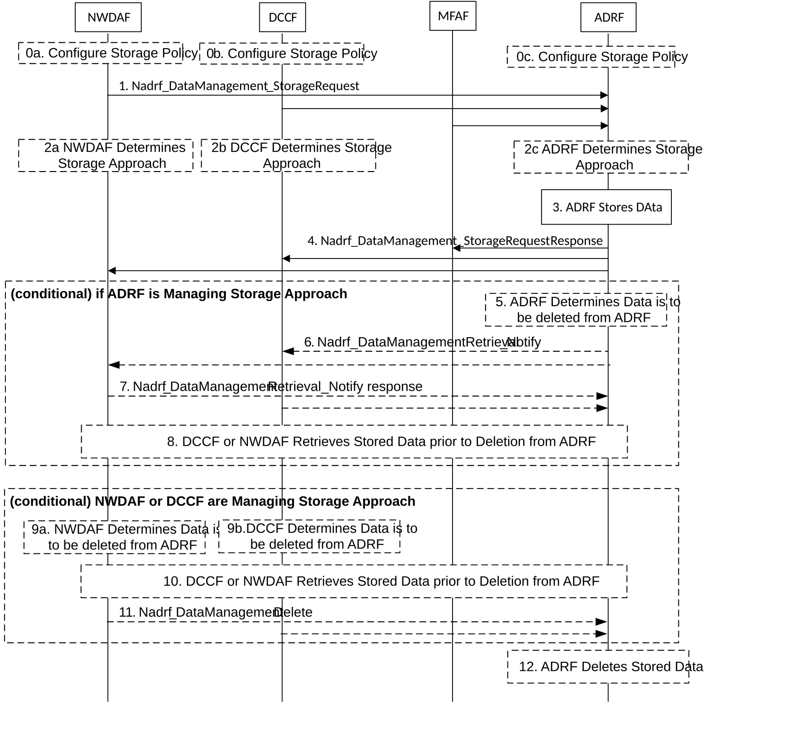
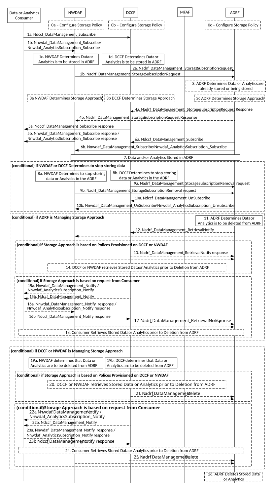
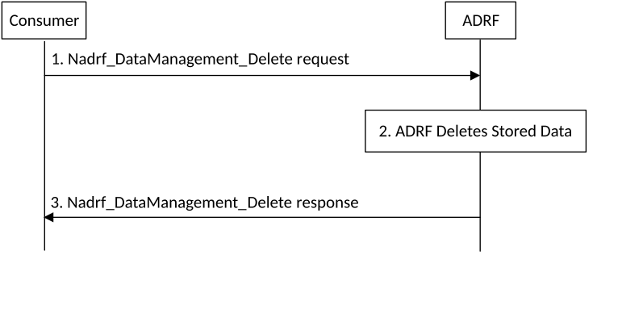
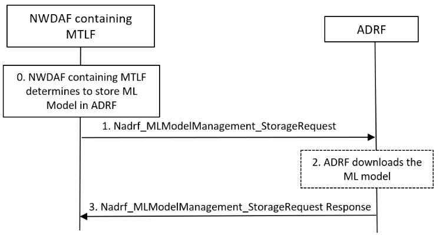
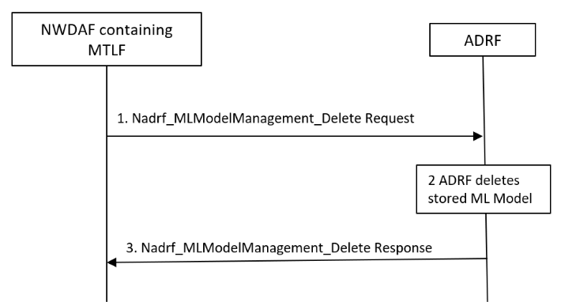
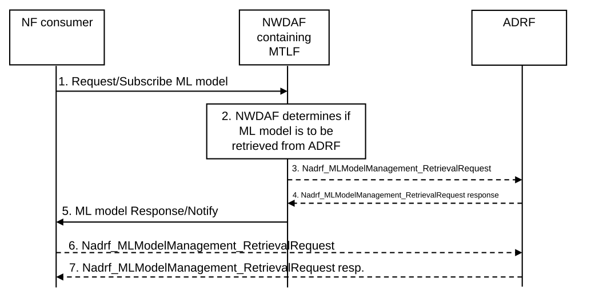

# 6.2B Analytics Data and ML Model Repository procedures

## 6.2B.1 General

Collected data and analytics may be stored in ADRF, using procedure as specified in clause 6.2B.2 and clause 6.2B.3. Collected data and analytics may be deleted from ADRF, using procedure as specified in clause 6.2B.4.

ML Model may be stored in ADRF, using procedure as specified in clause 6.2B.5. ML Model may be deleted from ADRF, using procedure as specified in clause 6.2B.6. ML Model(s) may be retrieved from ADRF, using procedure as specified in clause 6.2B.7.

## 6.2B.2 Historical Data and Analytics storage

The procedure depicted in figure 6.2B.2-1 is used by consumers (e.g. NWDAF, DCCF or MFAF) to store historical data and/or analytics, i.e. data and/or analytics related to past time period that has been obtained by the consumer. After the consumer obtains data and/or analytics, consumer may store historical data and/or analytics in an ADRF. Whether the consumer directly contacts the ADRF or goes via the DCCF or via the Messaging Framework is based on configuration.

The consumer may include in the storage request the DataSetTag attribute which the data records are to be associated to when stored by ADRF. The DataSetTag attribute is defined in Table 6.2B-1. Data records can be associated to multiple DataSetTag attributes.

Table 6.2B-1: DataSetTag attribute

| Information        | Description                                                                    |
|--------------------|--------------------------------------------------------------------------------|
| DataSetTag         | Identifies the data set.                                                       |
| DataSetDescription | Provides human-readable information about the characteristics of the data set. |

The consumer may include in the storage request the Data Synthesis and Compression (DSC) information. The detail of DSC information is up to implementation, which is out of 3GPP scope.

NOTE: DSC information can include the following information:

\- indication that the data have been generated using a data synthesis tool;

\- indication that the data have been generated using a data compression tool;

\- the information about the data synthesis and/or compression technique.

Figure 6.2B.2-1: Historical Data and Analytics storage

0a-c. NWDAF, DCCF or ADRF are configured with default operator storage policies as described in clause 5B.1.

1\. The consumer sends data and/or analytics to the ADRF by invoking the Nadrf_DataManagement_StorageRequest (collected data with timestamp, analytics with timestamp, Service Operation, Analytics Specification or Data Specification, Storage Handling information, optionally DataSetTag, optionally DSC information) service operation. The NWDAF or DCCF may provide notification endpoint information to the ADRF for use by the ADRF to send notifications (implicit subscription) alerting the DCCF or NWDAF that data are about to be deleted (see step 6).

2a-c. Based on Storage Handling information (if available) and Storage Policy, the ADRF, DCCF or NWDAF determines the Storage Approach (lifetime for storing data and whether consumer is notified prior to data deletion).

3\. The ADRF stores the data and/or analytics sent by the consumer. The ADRF may, based on implementation, determine whether the same data and/or analytics is already stored or being stored based on the information sent in step 1 by the consumer NF and, if the data and/or analytics is already stored or being stored in the ADRF, the ADRF decides to not store again the data and/or analytics sent by the consumer. If the DataSetTag attribute is included for data and/or analytics already stored or being stored, then ADRF associates the data records with such DataSetTag.

4\. The ADRF sends Nadrf_DataManagement_StorageRequest Response message to the consumer indicating that data and/or analytics is stored, whether the ADRF determined at step 3 that data or analytics is already stored and the Storage Approach.

**Conditional on ADRF Managing the Storage Approach**

5\. The ADRF determines that the lifetime of the stored data or analytics has expired (according to the Storage Approach).

6\. If indicated by the Storage Approach, the ADRF sends a notification alerting the DCCF or NWDAF that data are about to be deleted.

NOTE: This is an implicit subscription.

7\. The DCCF or NWDAF indicate in the response to the ADRF whether they will retrieve the Data or Analytics.

8\. The DCCF or NWDAF may retrieve the Data or Analytics from the ADRF as described in clause 5B.1.

**Conditional on the DCCF or NWDAF Managing the Storage Approach**

9 The NWDAF or DCCF determine that the lifetime of the stored data or analytics has expired (according to the Storage Approach).

10\. The NWDAF or DCCF optionally retrieve the data or analytics from the ADRF as described in clause 5B.1.

11\. The NWDAF or DCCF request that the data or analytics be deleted from the ADRF.

12\. The ADRF deletes the data or analytics if:

\- the Storage Approach in the ADRF indicates alerting the consumer is not required prior to data or analytics deletion;

\- in step 7 the DCCF or NWDAF indicated data or analytics will not be retrieved prior to deletion;

\- data or analytics retrieval in step 8 has completed; or

\- A request to delete data or analytics was received in step 11.

If the ADRF received a response from the NWDAF or DCCF in step 7 indicating data or analytics will be retrieved but retrieval is not initiated before an adequate fixed time has elapsed, the ADRF may autonomously delete the data or analytics.

## 6.2B.3 Historical Data and Analytics Storage via Notifications

The procedure depicted in figure 6.2B.3-1 is used by consumers (NWDAF, DCCF) to store received notifications in the ADRF. The consumer requests the ADRF to initiate a subscription for data and/or analytics. Data and/or analytics provided in notifications as a result of the subsequent subscription by the ADRF are stored in the ADRF.

The consumer may include in the subscription request the DataSetTag attribute defined in Table 6.2B-1.

Figure 6.2B.3-1: Historical Data and Analytics Storage via Notifications

0a-c NWDAF, DCCF or ADRF are configured with default operator storage policies as described in clause 5B.1.

1a-d. Based on reception of a DataManagement subscription request or Analytics subscription request (e.g. see clause 6.2.6.3.2 and clause 6.2.6.2 for DataManagement subscription request, clause 6.1.1.1 for Analytics subscription request) or based on local configuration, the DCCF or the NWDAF determines that notifications are to be stored in an ADRF. The subscription request may contain Storage Handling information with a requested ADRF storage lifetime and a request to be notified before data are deleted from the ADRF.

2a-b. The DCCF or the NWDAF determines the ADRF where data and/or analytics needs to be stored and requests that the ADRF subscribes to receive notifications. The determination may be made based on configuration or information supplied by the data consumer as described in clauses 6.1.4 and 6.2.6.3. The request to the ADRF specifies the data and/or analytics to which the ADRF will subscribe by invoking the Nadrf_DataManagement_StorageSubscriptionRequest service operation. The request may include the DataSetTag attribute which the data records are to be associated to when stored by ADRF. If the Storage Policy is not configured on the NWDAF or DCCF, the NWDAF or DCCF sends the Storage Handling Request to the ADRF. The NWDAF or DCCF may provide notification endpoint information to the ADRF for use by the ADRF to send notifications (implicit subscription) alerting the DCCF or NWDAF that data are about to be deleted (see step 12).

3\. \[Optional\] The ADRF may, based on implementation, determine whether the same data and/or analytics is already stored or being stored, based on the information sent in step 2 by the consumer. If the DataSetTag attribute is included for data and/or analytics already stored or being stored, then ADRF associates the data records with such DataSetTag.

3a-c. \[Optional\] Based on Storage Handling information and Storage Policy, the ADRF, DCCF or NWDAF determines the Storage Approach (lifetime for storing data and whether consumer is notified prior to data deletion).

4a-b. \[Optional\] If the data and/or analytics is already stored and/or being stored in the ADRF, the ADRF sends Nadrf_DataManagement_StorageSubscriptionRequest Response message to the consumer indicating that data and/or analytics is stored. The ADRF includes the Storage Approach if determined in step 3c.

5a-b. The DCCF or NWDAF sends a subscription response to the Data or Analytics Consumer. The response may contain the Storage Approach determined by the ADRF, NWDAF or DCCF.

6a-b. ADRF subscribes to the DCCF or the NWDAF to receive notifications, providing its notification endpoint address and a notification correlation ID. In step 6b, the ADRF uses Nnwdaf_DataManagement_Subscribe to obtain data from the NWDAF or Nnwdaf_AnalyticsSubscription_Subscribe to obtain analytics from the NWDAF.

7\. The DCCF, the MFAF or the NWDAF sends Analytics or Data notifications containing the notification correlation ID provided by the ADRF to ADRF notification endpoint address. The Analytics or Data notifications shall contain timestamp. The ADRF stores the notifications.

**Conditional on DCCF or NWDAF determining to stop storing data or analytics**

8a-b. The DCCF or the NWDAF determines to stop storing notifications in the ADRF.

9a-b. The DCCF or the NWDAF requests that the ADRF unsubscribes to receive notifications.

10a-b. The ADRF sends a request to the DCCF or the NWDAF to unsubscribe to data or analytics notifications.

The NWDAF may interact with the Data Source and the DCCF may interact with the Data Source and/or MFAF. Delivery of notifications from the DCCF/MFAF or NWDAF to the ADRF are subsequently halted. If Nnwdaf_AnalyticsSubscription_Subscribe was used in step 6b, then the Nnwdaf_AnalyticsSubscription_Unsubscribe is used in step 10b.

**Conditional on ADRF Managing the Storage Approach**

11\. The ADRF determines that the lifetime of the stored data or analytics has expired (according to the Storage Approach).

12\. If indicated by the Storage Approach, the ADRF sends a notification alerting the DCCF or NWDAF that data or Analytics are about to be deleted.

NOTE: This is an implicit subscription.

**Conditional if the Storage Approach is based on Default Operator Policies provisioned on the NWDAF or DCCF (see step 3a-c and clause 5B.1)**

13\. The DCCF or NWDAF indicate in the response to the ADRF whether they will retrieve the data or analytics.

14\. The DCCF or NWDAF may retrieve the data or analytics from the ADRF as described in clause 5B.1.

**Conditional if the Storage Approach is based on a Storage Handling Request received from the Data or Analytics Consumer (see step 3a-c and clause 5B.1)**

15a-b. The NWDAF or DCCF sends a notification to the Data or Analytics Consumer alerting it that the data or analytics are about to be deleted.

16a-b. The Data or Analytics Consumer indicates in the response to the NWDAF or DCCF whether it will retrieve the data or analytics.

17\. The DCCF or NWDAF indicate in the response to the ADRF whether the consumer will retrieve the data or analytics.

18\. The Data or Analytics Consumer retrieves the stored data or analytics as described in clause 5B.1.

**Conditional on DCCF or NWDAF Managing the Storage Approach**

19a-b. The NWDAF or DCCF determines that the lifetime of the stored data or analytics has expired (according to the Storage Approach).

**Conditional if the Storage Approach is based on Default Operator Policies provisioned on the NWDAF or DCCF (see step 3a-c and clause 5B.1)**

20\. The NWDAF or DCCF optionally retrieve the data or analytics from the ADRF as described in clause 5B.1.

21\. The NWDAF or DCCF request that the data or analytics be deleted from the ADRF.

**Conditional if the Storage Approach is based on a Storage Handling Request received from the Data or Analytics Consumer (see step 3a-c and clause 5B.1)**

22a-b. The NWDAF or DCCF sends a notification to the Data or Analytics Consumer alerting it that the data or analytics are about to be deleted.

23a-b. The Data or Analytics Consumer indicates in the response to the NWDAF or DCCF whether it will retrieve the Data or Analytics.

24\. The Data or Analytics Consumer retrieves the stored data or analytics as described in clause 5B.1.

25\. The NWDAF or DCCF request that the data or analytics be deleted from the ADRF.

26\. The ADRF deletes the data or analytics if:

\- the Storage Approach in the ADRF indicates alerting the consumer is not required prior to data or analytics deletion;

\- in Steps 13 or 17 the DCCF or NWDAF indicated data or analytics will not be retrieved prior to deletion;

\- data or analytics retrieval in steps 14 or 18 has completed; or

\- A request to delete data or analytics was received in steps 21 or 25.

If the ADRF received a response from the NWDAF or DCCF in steps 14 or 17 indicating data or analytics will be retrieved but retrieval is not initiated before an adequate fixed time has elapsed, the ADRF may autonomously delete the data or analytics.

## 6.2B.4 Data removal from an ADRF

The procedure depicted in figure 6.2B.4-1 is used by consumers (DCCF, NWDAF) to remove data previously stored in an ADRF.

Figure 6.2B.4-1: Data Removal from an ADRF

1\. A consumer requests that specified data be deleted from the ADRF using Nadrf_DataManagement_Delete request service operations. The request may include the DataSetTag attribute which the stored data records are associated to.

2\. The ADRF deletes all copies of the stored data.

3\. The ADRF indicates the result (i.e. data deleted, data not found, data found but not deleted) using Nadrf_DataManagement_Delete response service operations.

NOTE: As described in clauses 6.2B.2 and 6.2B.3, data or analytics may be removed from an ADRF when a storage lifetime expires. The NWDAF, DCCF or ADRF can provide an alert to the consumer and the consumer may retrieve data or analytics prior to deletion by the ADRF.

## 6.2B.5 ML Model Storage in ADRF

The procedure depicted in figure 6.2B.5-1 is used by NWDAF containing MTLF to store or update ML Model(s) in an ADRF.

Figure 6.2B.5-1: ML Model Storage in ADRF

0\. NWDAF containing MTLF determines to store or update ML Model(s) in ADRF based on MTLF policy.

1\. NWDAF containing MTLF requests to store or update a (set of) ML Model(s) to the ADRF by invoking Nadrf_MLModelManagement_StorageRequest service, optionally including allowed NF instance list for the ML Model identifier as described in TS 33.501 \[49\].

2\. The ADRF locally maintains the association between the ML Model identifier and the NF instance ID of NWDAF containing MTLF and allowed NF instance list (if there is any in step 1).

\[Optional\] If instead of the ML Model(s), the ML Model address(es) is/are included in request, ADRF downloads the ML Model(s) based on the ML Model address(es) and locally stores the ML Model(s).

3\. The ADRF sends Nadrf_MLModelManagement_StorageRequest Response message to the consumer including the ML Model storage or ML Model Update result indication.

## 6.2B.6 ML Model removal from ADRF

The procedure depicted in figure 6.2B.6-1 is used by NWDAF containing MTLF to delete ML Model from an ADRF.

Figure 6.2B.6-1: ML Model removal from ADRF

1\. NWDAF containing MTLF requests to delete the ML Model(s) previously stored in the ADRF using Nadrf_MLModelManagement_Delete request service operation.

2\. The ADRF deletes both the stored ML Model(s) and ML Model related information.

3\. The ADRF indicates the result (i.e. ML Model deleted, ML Model not found, ML Model found but not deleted) using Nadrf_MLModelManagement_Delete response service operation.

## 6.2B.7 ML Model retrieval from ADRF

The procedure depicted in Figure 6.2B.7-1 is used by consumers (NWDAF containing MTLF and NWDAF containing AnLF) to retrieve ML Models from an ADRF.

Figure 6.2B.7-1: Procedure for ML Model(s) retrieval from ADRF

1\. The NWDAF service consumer (NWDAF containing AnLF or NWDAF containing MTLF) subscribes/requests for a (set of) trained ML Model(s) associated with a/an (set of) Analytics ID(s) by invoking the Nnwdaf_MLModelProvision_Subscribe / Nnwdaf_MLModelInfo_Request service.

2\. The NWDAF containing MTLF determines whether the set of ML Model(s) associated with a/an (set of) Analytics ID(s) should be retrieved from the ADRF.

When NWDAF containing MTLF authorizes the NF consumer to retrieve the ML Model(s) stored in the ADRF directly, steps 3 and 4 is skipped.

If NWDAF containing MTLF determines that the set of ML Model(s) corresponding Analytics ID(s) requested in step 1 needs to be retrieved from ADRF and the NF consumer is agnostic to where the ML Model(s) is stored, then Steps 3 and 4 is performed.

NOTE: How NWDAF containing MTLF and ADRF authorizes the NF Consumer is specified in clause X.10 of TS 33.501 \[49\].

3\. The ADRF service consumer (NWDAF containing MTLF) requests for the ML Model stored in ADRF by invoking the Nadrf_MLModelManagement_RetrievalRequest Request (Storage Transaction Identifier or one or more unique ML Model identifier(s)) service operation.

4\. The ADRF verifies the service consumer (NWDAF containing MTLF) as described in Annex X.10 of TS 33.501 \[49\]. If verification is successful, the ADRF sends Nadrf_MLModelManagement_RetrievalRequest Response (ML Model file address of Model file(s) stored in ADRF) service operation.

5\. The NWDAF containing MTLF notifies/ response to the NWDAF service consumer with the tuple Analytics ID, one or more tuples of unique ML Model identifier and ML Model Information. The ML Model information may contain the ML Model file address or ADRF (Set) ID. The ADRF(Set) ID is included only when the NWDAF containing MTLF authorizes the NF consumer to retrieve the ML Model(s) stored in the ADRF in step 2. When ADRF (Set) ID is provided and the NWDAF containing MTLF authorizes the NF Service Consumer to retrieve all ML Models corresponding to a Storage Transaction ID, the Storage Transaction ID may be provided. In other cases, the NWDAF containing MTLF only provides ML Model identifier(s).

6\. If in step 5, the NWDAF service consumer which is also the service consumer of ADRF in this step 6 and step 7 (NWDAF containing AnLF or NWDAF containing MTLF) received ADRF (Set) ID (where the ML Model(s) requested in step 1 is stored) and/or the ML Model provide indicator, then the service consumer may invoke the Nadrf_MLModelManagement_RetrievalRequest (Storage Transaction Identifier or one or more unique ML Model identifier(s)) service operation to get the ML Model stored in ADRF.

7\. The ADRF verifies the service consumer as described in Annex X.10 of TS 33.501 \[49\]. If verification is successful, the ADRF sends Nadrf_MLModelManagement_RetrievalRequest Response (ML Model identifier(s) and address(es) of Model file(s) stored in ADRF) to the NWDAF (ADRF) service consumer.
