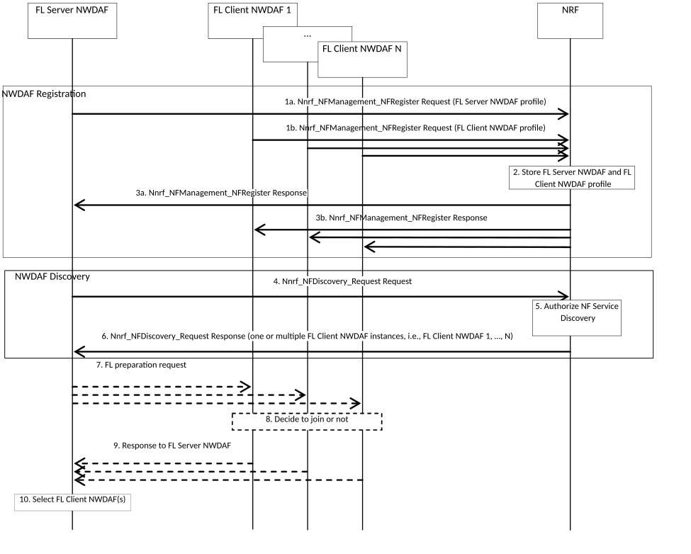
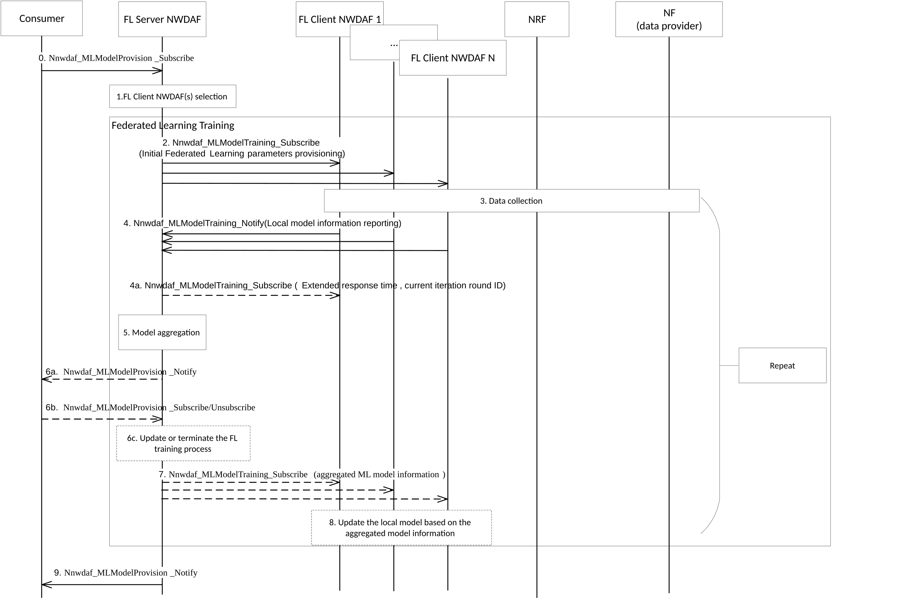
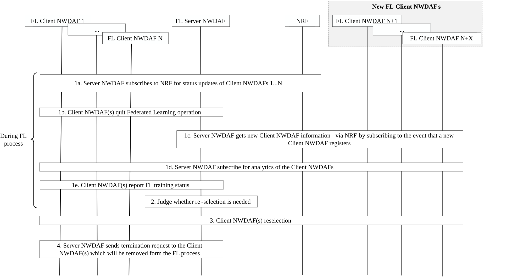

# 6.2C Federated Learning among Multiple NWDAFs

## 6.2C.1 General

This clause specifies how NWDAF containing MTLF can leverage Federated Learning technique to train an ML Model.

## 6.2C.2 Procedures

### 6.2C.2.1 Registration and Discovery procedure for Federated Learning

Figure 6.2C.2.1-1: Registration and Discovery procedure for Federated Learning

Steps 1 to 3 are the NWDAF registration procedure.

1-3. NWDAF containing MTLF as FL Server NWDAF or FL Client NWDAF registers to NRF with its NF profile, which includes NWDAF NF Type (see clause 5.2.7.2.2 of TS 23.502 \[3\]), Analytics ID(s), Address information of NWDAF, Service Area, FL capability type information (i.e. FL server and/or FL client) and Time interval supporting FL as described in clause 5.2.

Steps 4 to 6 are the NWDAF Discovery procedure.

4-6. NWDAF containing MTLF determines ML Model requires FL based on operator policy (e.g. pre-configured list of ML Models), Analytic ID, Service Area/DNAI or data can not be obtained directly from data producer NF (e.g. due to privacy reasons).

If the NWDAF containing MTLF can not perform as FL Server NWDAF, the MTLF first discovers and selects FL Server NWDAF from NRF by invoking the Nnrf_NFDiscovery_Request service operation. The following criteria might be used: Analytic ID of the ML Model required, Model filter information as defined in clause 6.2A.2, FL capability Type (i.e. FL server), Time Period of Interest, Service Area.

Once the FL Server NWDAF (the requested or the selected one) is determined, the FL Server NWDAF discovers and selects other NWDAF(s) containing MTLF as FL Client NWDAF(s) from NRF by invoking the Nnrf_NFDiscovery_Request service operation. The following criteria might be used: Analytic ID of the ML Model required, FL capability Type (i.e. FL client), Service Area, NF type(s) of data sources from which the FL Client NWDAF is able to collect data for local ML Model training, Time Period of Interest, ML Model Interoperability Indicator.

7\. FL Server NWDAF sends Federated Learning preparation request to the FL Client NWDAF(s), using Nnwdaf_MLModelTraining_Subscribe or Nnwdaf_MLModelTrainingInfo_Request service with the ML Preparation Flag, to check if the FL Client NWDAF(s) can meet the ML Model training requirement (e.g. Analytics ID, ML Model Interoperability information, Data Availability requirement, FL Availability time requirement (time span needed for the FL process), etc.). Data Availability requirement includes a list of Event IDs of the local data for training, and may also include the dataset statistical properties, the time window of the data samples and the minimum number of data samples.

NOTE: Federated Learning preparation procedure (i.e. steps 7-9) can be skipped if the FL Server NWDAF can decide that the FL Client NWDAF(s) supports the FL procedure to be performed, e.g. based on information acquired from previous FL procedures or from the NRF, or based on local configuration.

8\. FL Client NWDAF(s) checks if it can meet the ML Model training requirement and/or can successfully download the model if the model information is provided in the request and decides whether to join the Federated Learning process based on operator policy (e.g. pre-configured list of ML Models) and/or implementation. Example criteria used by FL Client NWDAF(s) may be based on its data availability and time availability, computation and communication capability and ML Model Interoperability information.

9\. FL Client NWDAF(s) invokes Nnwdaf_MLModelTraining_Notify or Nnwdaf_MLModelTraining_Subscribe response or Nnwdaf_MLModelTrainingInfo_Request response service operation to indicate to the FL Server NWDAF whether it will join the FL procedure and may include the reason in the response message if it cannot join the FL process.

10\. FL Server NWDAF determines the FL Client NWDAFs to be involved in the FL procedures based on the information received in step 6 and other information received in step 9 (if available).

### 6.2C.2.2 General procedure for Federated Learning among Multiple NWDAF Instances

Figure 6.2C.2.2-1: General procedure for Federated Learning among Multiple NWDAF

0\. The consumer (NWDAF containing AnLF or NWDAF containing MTLF) sends a subscription request to FL server NWDAF to retrieve an ML Model, using Nnwdaf_MLModelProvision including Analytics ID, ML Model Monitoring information as defined in clause 7.5.2, desired ML Model metric (e.g. ML Model Accuracy).

NOTE 1: The ML Model Accuracy threshold can be used to indicate the target ML Model Accuracy of the training process and the FL server NWDAF may stop the training process when the ML Model Accuracy threshold is achieved during the training process.

If the consumer (i.e. the NWDAF containing AnLF or NWDAF containing MTLF) provides the Time when the ML Model is needed, the FL Server NWDAF can take this information into account to decide the maximum response time for its FL Client NWDAF(s).

1\. FL Server NWDAF selects NWDAF(s) containing MTLF (FL Client NWDAF(s)) as described in clause 6.2C.2.1.

2\. FL Server NWDAF sends a Nnwdaf_MLModelTraining_Subscribe or Nnwdaf_MLModelTrainingInfo_Request to the selected NWDAF(s) containing MTLF (FL Client NWDAF(s)), which participate in the Federated learning to perform the local model training and determine the interim local ML Model information based on the input parameter in the request from FL Server NWDAF. The request includes the desired ML Model metric and initial ML Model and also includes the maximum response time, the FL Client NWDAF has to report the interim local ML Model information to the FL Server NWDAF before the maximum response time elapses.

3\. \[Optional\] Each FL Client NWDAF collects its local data by using the current mechanism in clause 6.2 if the Client NWDAF has not local data available already.

4\. During Federated Learning training procedure, each FL Client NWDAF further trains the ML Model provided by the FL Server NWDAF based on its local data and reports the interim local ML Model information to the FL Server NWDAF in Nnwdaf_MLModelTraining_Notify or Nnwdaf_MLModelTrainingInfo_Request response. The Nnwdaf_MLModelTraining_Notify or Nnwdaf_MLModelTrainingInfo_Request response may also include the Status report of FL training that includes local ML Model metric value (and optionally the used metric) computed by the FL Client NWDAF and Training Input Data Information (e.g. areas covered by the data set, sampling ratio, maximum/minimum of value of each dimension of data, etc.) in the FL Client NWDAF. The Nnwdaf_MLModelTraining_Notify or Nnwdaf_MLModelTrainingInfo_Response also includes the global ML Model metric value (and optionally the used metric) when the ML Model Accuracy Check Flag was included in the Nnwdaf_MLModelTraining_Subscribe or Nnwdaf_MLModelTrainingInfo_Request (as described in step 7), the global ML Model metric value is calculated by the FL Client NWDAF using the local training data as the testing dataset.

NOTE 2: The parameters in characteristics of local training dataset are up to the implementation.

The local ML Model, which is sent from the FL Client NWDAF(s) to the FL Server NWDAF during the FL training process, is the information needed by the FL Server NWDAF to build the aggregated model.

If the FL Client NWDAF is not able to complete the training of the interim local ML Model within the maximum response time provided by the FL Server NWDAF, the FL Client NWDAF shall send the Delay Event Notification that include the delay event indication, an optional cause code (e.g. local ML Model training failure, more time necessary for local ML Model training) and the expected time to complete the training if available to the FL Server NWDAF before the maximum response time elapses.

4a. \[Optional\]If FL Server NWDAF receives notification/response that the FL Client NWDAF is not able to complete the training within the maximum response time, the FL Server NWDAF may send to the FL Client NWDAF a new maximum response time in Nnwdaf_MLModelTraining_Subscribe or Nnwdaf_MLModelTrainingInfo_Request, before which the FL Client NWDAF has to report the interim local ML Model information to the FL Server NWDAF. Otherwise, the FL Server NWDAF may indicate FL Client NWDAF to skip reporting for this iteration. FL Server NWDAF includes the current iteration round ID in the message to indicate that the request is to modify the training parameters of the current iteration round.

Alternatively, the FL Server NWDAF may inform the FL Client NWDAF to cease the ML Model training by sending termination request and to report back the current local ML Model updates.

5\. The FL Server NWDAF aggregates all the local ML Model information retrieved at step 4, to update the global ML Model. The FL Server NWDAF may also compute the global ML Model metric value, e.g. based on the local ML Model metric value(s) provided by the FL Client NWDAF(s) or by applying the global model on the validation dataset (if available). The FL Server NWDAF may update the global ML Model each time a FL Client NWDAF provides updated local ML Model information, or the FL Server NWDAF may decide to wait for local ML Model information from all FL Client NWDAFs before updating the global ML Model.

If the FL Server NWDAF provides the maximum response time for the FL Client NWDAF(s) to provide the interim local ML Model information in step 2, or the new maximum response time in step 4a, the FL Server NWDAF decides either to wait for the FL Client NWDAF(s) which have not yet provided their interim local ML Model within the new maximum response time or to aggregate only the retrieved local ML Model information instances to update global ML Model. The FL Server NWDAF makes this decision, considering the notification/response from the FL Client NWDAF or, if the notification is not received, based on local configuration.

6a. \[Optional\] Based on the consumer request in step 0, the FL Server NWDAF sends a Nnwdaf_MLModelProvision_Notify message to update the global ML Model metric value to the consumer periodically (e.g. a certain number of training rounds or every 10 min) or dynamically when some pre-determined status is achieved (e.g. the ML Model Accuracy threshold is achieved or training time expires).

6b. \[Optional\] The consumer decides whether the current model can fulfil the requirement, e.g. global ML Model metric value is satisfactory for the consumer and determines to stop or continue the training process. The consumer re-invokes Nnwdaf_MLModelProvision_Subscribe service operation as used in step 0 to continue the training process or invokes Nnwdaf_MLModelProvision_Unsubscribe service operation to stop the training process.

6c. \[Optional\] Based on the subscription request sent from the consumer in step 6b, the FL Server NWDAF updates or terminates the current FL training process.

If the FL Server NWDAF received a request in step 6b to stop the Federated Training process, steps 7 and 8 are skipped.

7\. If the FL procedure continues, FL Server NWDAF may determine FL Client NWDAF as described in clause 6.2C.2.3 and sends Nnwdaf_MLModelTraining_Subscribe or Nnwdaf_MLModelTrainingInfo_Request that includes the aggregated ML Model information to selected FL Client NWDAF(s) for next round of Federated Training. The request may also include the ML Model Accuracy Check Flag, that indicates the FL Client NWDAF(s) to use the local training data as the testing dataset to calculate the Model Accuracy of the global ML Model provided by the FL Server NWDAF.

8\. Each FL Client NWDAF updates its own ML Model based on the aggregated ML Model information distributed by the FL Server NWDAF at step 7.

NOTE 3: The steps 3-8 should be repeated until the training termination condition (e.g. maximum number of iterations, or the result of loss function is lower than a threshold) is reached.

When the Federated Training procedure is complete, the FL Server NWDAF requests the FL client NWDAF(s) to terminate the FL procedure by invoking Nnwdaf_MLModelTraining_Unsubscribe service with a cause code that the FL process has finished and optionally with the final aggregated ML Model information. Then the FL client NWDAF(s) terminate the local model training and if the final aggregated ML Model information is received from the FL server NWDAF, the FL client NWDAF(s) can store it for further use.

9\. After the training process is complete, the FL Server NWDAF may send Nnwdaf_MLModelProvision_Notify that includes the globally optimal ML Model information to the consumer.

### 6.2C.2.3 Procedures for Maintaining Federated Learning Processes

This clause specifies how to maintain a Federation Learning process in FL execution phase, including FL Server NWDAF triggers reselection, addition, or removal of FL Client NWDAF(s), discovers new FL Client NWDAF(s) via NRF and FL Client NWDAF(s) joins or leaves Federated Learning process dynamically.

In Federated Learning execution phase, FL Server NWDAF monitors the status changes of FL Client NWDAF(s) and may reselects FL Client NWDAF(s) based on the updated status, availability and/or capability, etc.

NOTE 1: FL Server NWDAF checks if there is a need to carry on the FL execution phase and then reselects FL members for the next iteration if needed.

Figure 6.2C.2.3-1: Procedure of FL Server NWDAF reselects FL Client NWDAF(s), FL Client NWDAF(s) Join or Leave Federated Learning Process Dynamically in Federated Learning execution phase

The procedure for FL Server NWDAF reselecting FL Client NWDAF(s), FL Client NWDAF(s) joining or leaving Federated Learning process dynamically is as follows:

1a. FL Server NWDAF may get the updated status of current FL Client NWDAF(s) via NRF by using Nnrf_NFManagement service (as in clause 5.2.7.2 of TS 23.502 \[3\]) in the Federated Learning execution phase.

FL Server NWDAF may subscribe to NRF for notifications of status changes of the current NWDAF(s) (FL Client NWDAFs 1…N) by invoking an Nnrf_NFManagement_NFStatusSubscribe service operation. NRF notifies the FL Server NWDAF the status changes of the current FL Client NWDAF(s) by invoking Nnrf_NFManagement_NFStatusNotify service operation(s).

The status of a current FL Client NWDAF could be availability changes, capability changes (e.g. it will not support FL anymore, etc.).

1b. The current FL Client NWDAF(s) may inform FL Server NWDAF that it is leaving the Federated Learning process by invoking Nnwdaf_MLModelTraining_Notify service operation with Termination Request and cause code (reason for leaving, e.g. high NF load, time availability changes).

1c. FL Server NWDAF may get the information of the new FL Client NWDAF(s) dynamically via NRF by subscribing to the event that a new FL Client NWDAF registers (Nnrf_NFManagement_NFStatusSubscribe service as in clause 5.2.7.2 of TS 23.502 \[3\]).

1d. NWDAF may subscribe for NF load analytics of the FL Client NWDAF(s).

1e. FL Client NWDAF(s) may send Status report of FL training and Global ML Model Accuracy Information by invoking Nnwdaf_MLModelTraining_Notify service.

2\. FL Server NWDAF checks FL Client NWDAF(s) status based on the received information and may determine whether reselection of FL Client NWDAF(s) for the next round(s) of Federated Learning is needed based on the received information from step 1.

NOTE 2: Several examples of the factors that the FL Server NWDAF can consider to reselect the FL Client NWDAF(s) are updated status of FL Client NWDAF reported by NRF is different than the criteria were initially used for selecting the client; characteristics of local training dataset is different than global validation dataset owned by FL Server NWDAF and/or the metric value of the global model calculated using the local training dataset is much different from that calculated by other FL Client NWDAFs; the metric value of the global model calculated using the local training dataset is lower than the metric value calculated using the global validation dataset owned by FL Server NWDAF; the metric value of the global model calculated using the local training dataset is lower than ML Model metric value received in Nnwdaf_MLModelMonitor_Notify when FL Server NWDAF using AnLF-assisted MTLF ML Models Accuracy Monitoring; the load of the FL Client NWDAF (from the NF load Analytics or from the FL Client NWDAF directly) is high; the FL Server NWDAF receives leave request from the FL Client NWDAF; the FL Client NWDAF did not report the status of FL Training within the maximum response time.

3\. \[If re-selection is needed as judged in step 2\] If step 1c is not performed, FL Server NWDAF may discover new candidate FL Client NWDAF(s) via NRF by using Nnrf_NFDiscovery services as in clause 5.2.7.3 of TS 23.502 \[3\]. FL Server NWDAF reselects FL Client NWDAF(s) from the current FL Client NWDAF(s) and the new candidate FL Client NWDAF(s) (found in steps 1c or 3). For the new candidate FL Client NWDAF(s), the interaction between FL Server NWDAF and FL Client NWDAF(s) is same as the selection procedure described in clause 6.2C.2.1. The adding / deleting FL Client NWDAF(s) may happen at the end of each iteration.

4\. FL Server NWDAF sends termination request by invoking Nnwdaf_MLModelTraining_Unsubscribe service operation or Nnwdaf_MLModelTrainingInfo_Request service operation with Termination Request to the FL Client NWDAF(s), optionally indicating the reason, e.g. FL Client NWDAF is unselected by the FL Server NWDAF for the FL process, or the FL process is suspended, etc. And FL server may also send the updated global ML Model information to the unselected FL client NWDAF. FL Client NWDAF(s) terminates operations for the Federated Learning process if receive termination request from the FL Server NWDAF and may perform further action to be qualified in participation of FL training in the next cycles.

NOTE 3: In the case of high load, the FL Client NWDAF can e.g. decline new service request. In the case of low accuracy, the FL Client NWDAF can gather new local training data.
