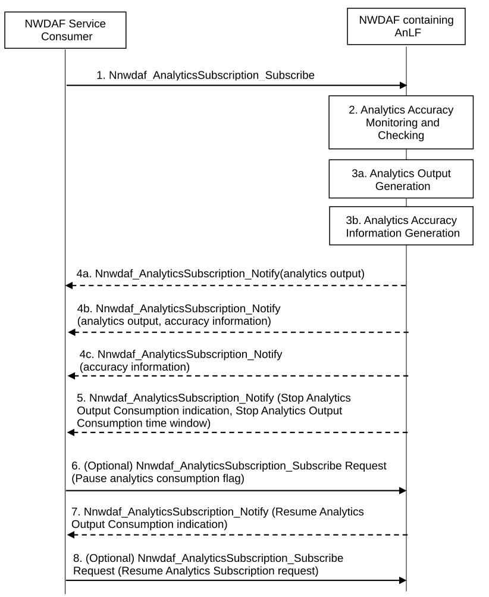
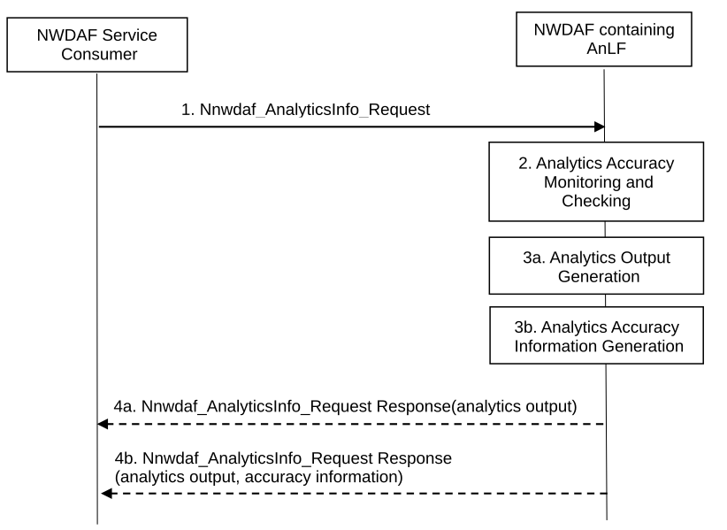

# 6.2D AnLF Analytics Accuracy Monitoring Procedures

## 6.2D.1 General

The Analytics Accuracy Information comprises a set of parameters as defined in clause 6.1.3.

When multiple NWDAFs are deployed, some NWDAFs may be specialized with the analytics accuracy checking capability. When an NWDAF containing AnLF has the analytics accuracy checking capability, such an NWDAF is able to:

\- Receive a subscription or a request for analytics IDs via Nnwdaf_AnalyticsSubscription_Subscribe or Nnwdaf_AnalyticsInfo_Request service operation with the indication for activating the mechanisms for checking the accuracy of such analytics ID as defined in clause 6.1.3.

\- Provide the accuracy information to the consumer via Nnwdaf_AnalyticsSubscription_Notify or Nnwdaf_AnalyticsInfo_Request response service operation.

NOTE 1: In this version of the specification, NWDAF containing AnLF can provide accuracy information to an NF consumer that subscribes or requests for the analytics.

NOTE 2: When receiving a subscription from an NF consumer that includes a request for accuracy information, the analytics output and the accuracy information can be provided by NWDAF containing AnLF in a single notification or via separate notifications.

NOTE 3: When receiving a request from an NF consumer that includes a request for accuracy information, the analytics and the accuracy information can be provided by NWDAF containing AnLF within the single response.

NOTE 4: In this version of the specification, the subscription or request for accuracy information independently from requesting an analytics output is not supported.

Based on the triggers described in clause 5C.1, NWDAF containing AnLF starts the accuracy monitoring and generation of Analytics Accuracy Information for an Analytics ID.

The Analytics Accuracy Information may be requested per Analytics ID and scoped using the same parameters as those defined in the Target of Analytics Reporting as defined in clause 6.1.3 and Analytics Filter Information (e.g. for a specific area, specific slice) of the requested Analytics ID.

When the analytics accuracy checking is activated in an NWDAF containing the AnLF, the NWDAF may store for a period of time the necessary information to determine the analytics accuracy and provide the accuracy information to consumers when requested or use it for its internal processes.

NWDAF containing AnLF generates the accuracy information as described in clause 5C.1.

## 6.2D.2 Procedures for Analytics Accuracy Information Subscription

This procedure is used by NF consumers of analytics ID to subscribe to receive analytics output and Analytics Accuracy Information related to the requested analytics ID for NF consumer. Figure 6.2D.2-1 shows the procedure for accuracy information subscription and provisioning.

Figure 6.2D.2-1: Analytics Accuracy Information Subscribe

1\. The NWDAF service consumer selects the appropriated NWDAF containing AnLF according to clause 5.2 and subscribes or modifies the subscription for Analytics Accuracy Information by invoking the Nnwdaf_AnalyticsSubscription_Subscribe service operation. The parameters that can be included in the subscription to trigger the accuracy information checking and provisioning are listed in clause 6.1.3.

If the subscription is not the initial subscription request, it may include Analytics Feedback Information as described in clause 6.1.1.

2\. When a subscription request is received, the NWDAF containing AnLF verifies the parameters of the Analytics Accuracy Request information received from the NWDAF service consumer in step 1.

The NWDAF containing AnLF starts the Analytics Accuracy Monitoring and generation of the Analytics Accuracy Information related to the analytics ID indicated in the subscription according to the parameters defined in Analytics Accuracy Request Information in clause 6.1.3. The NWDAF containing AnLF is to compute Analytics Accuracy Information according to the methods in clause 6.2D.1. If the NWDAF containing AnLF does not have enough necessary data, it will perform step 3b to collect ground truth data before computing Analytics Accuracy Information.

The NWDAF containing AnLF may have started to perform the Analytics Accuracy Monitoring and Analytics Accuracy Information generation, triggered by other NWDAF service consumer(s) before. Upon receiving a new request from the NWDAF service consumer, the NWDAF containing AnLF determines whether new data collection is needed for Analytics Accuracy Information generation based on the corresponding analytics subscription.

In addition to the received request from the NWDAF service consumer, based on local policy, the NWDAF containing AnLF may determine to start the Analytics Accuracy Monitoring and Analytics Accuracy Information generation.

3a. The NWDAF containing AnLF performs the data collection for the subscribed analytics ID and generates the analytics output.

3b. The NWDAF containing AnLF performs the data collection (e.g., ground truth data collection) for accuracy information generation for the subscribed analytics ID and generates the associated Analytics Accuracy Information. If Analytics Feedback Information is included in step 1, the NWDAF containing AnLF may take it into account and determine whether it affects the ground truth data by the internal logic to generate Analytics Accuracy Information.

4a. The NWDAF containing AnLF provides the analytics output according to the parameters defined in Analytics Reporting Information included in the subscription request when there is no Analytics Accuracy Request Information included in the subscription in step 1.

NOTE: Steps 3b and 4a can occur in any order.

4b. The NWDAF containing AnLF provides the Analytics Accuracy Information together with the analytics output for the analytics ID according to the parameters defined in the Analytics Accuracy Request Information included in the subscription request.

4c. The NWDAF containing AnLF provides only the Analytics Accuracy Information for the analytics ID according to the parameters defined in the Analytics Accuracy Request Information included in the subscription request. The Analytics Accuracy Information is provided in a separated notification when the periodicity for providing the Analytics Accuracy Information indicated in the Analytics Accuracy Request Information is different from the periodicity for providing the analytics output indicated in the subscription request, or the accuracy value is under the analytics accuracy threshold which is indicated in the subscription request or locally configured.

5\. When determining the low or insufficient accuracy for an analytics ID, i.e. the deviation of the analytics output using the trained ML Model from the ground truth data (which are collected from Data Producer NF corresponding to the requested analytic ID at the time which the prediction refers to) does not meet analytics accuracy requirement, which indicates the accuracy value is under the analytics accuracy threshold(s) (which are locally configured or received in the subscribe request), the NWDAF containing AnLF may notify the NWDAF Service consumer with the Stop Analytics Output Consumption indication and the Stop Analytics Output Consumption time window.

6\. (Optional) The NWDAF Service Consumer may decide to stop the consumption of analytics output without unsubscribing to the analytics ID, based on its own logic or based on a received notification from NWDAF with the Stop Analytics Output Consumption indication. The NWDAF Service Consumer invokes the Nnwdaf_AnalyticsSubscription_Subscribe service operation including the Subscription Correlation ID to modify an existing subscription and provides the parameter Pause analytics consumption flag in the Analytics Accuracy Request Information.

7\. When the NWDAF determines an improvement in the accuracy of an analytics ID (e.g. meet the accuracy requirement of the analytics consumer) or when the Stop Analytics Output Consumption time window set by itself is finished, the NWDAF notifies the NWDAF Service Consumer of the accuracy information for the analytics ID to resume the consumption of the analytics output, therefore reactivating an existing analytics ID subscription that has been previously stopped.

8\. (Optional) The NWDAF Service Consumer based on its own logic can notify the NWDAF to resume the notification of analytics output, therefore reactivating an existing subscription to analytics ID that has been paused either by NWDAF Service Consumer request (step 6) or by NWDAF indication (step 5). The NWDAF Service Consumer invokes the Nnwdaf_AnalyticsSubscription_Subscribe service operation including the Subscription Correlation ID to modify an existing subscription and provides the parameter Resume Analytics Subscription request in the Analytics Accuracy Request Information.

## 6.2D.3 Procedures for Analytics Accuracy Information Request

This procedure is used by NF consumers of analytics ID to request Analytics Accuracy Information related to the requested analytics ID for NF consumer. Figure 6.2D.3-1 shows the procedure for accuracy information request and response.

Figure 6.2D.3-1: Analytics Accuracy Information Request

1\. The NWDAF service consumer selects the appropriated NWDAF containing AnLF according to Clause 5.2 and requests for Analytics Accuracy Information by invoking the Nnwdaf_AnalyticsInfo_Request service operation. The parameters that can be included in the request to trigger the accuracy information checking and provisioning are listed in clause 6.1.3.

2\. When a request is received, the NWDAF containing AnLF determines whether the request is only for analytics output generation or if it includes the Analytics Accuracy request.

If the Analytics Accuracy request is included, the NWDAF containing AnLF starts the Analytics Accuracy Monitoring and generation of the Analytics Accuracy Information related to the analytics ID indicated in the request and according to the parameters defined in Analytics Accuracy Request Information in clause 6.1.3. The NWDAF containing AnLF is to compute Analytics Accuracy Information according to the methods in Clause 6.2D.1. If the NWDAF containing AnLF does not have enough necessary data, it will perform step 3b to collect ground truth data before computing Analytics Accuracy Information.

The NWDAF containing AnLF may have started to perform the Analytics Accuracy Monitoring and Analytics Accuracy Information generation, triggered by other NWDAF service consumer(s) before. Upon receiving a new request from the NWDAF service consumer, the NWDAF containing AnLF determines whether new data collection is needed for Analytics Accuracy Information generation based on the corresponding analytics request.

In addition to the received request from the NWDAF service consumer, based on local policy, the NWDAF containing AnLF may determine to start the Analytics Accuracy Monitoring and Analytics Accuracy Information generation.

3a. The NWDAF containing AnLF performs the data collection for the requested analytics ID and generates the analytics output.

3b. The NWDAF containing AnLF performs the data collection (e.g., ground truth data collection) for accuracy information generation for the requested analytics ID and generates the associated Analytics Accuracy Information.

4a. The NWDAF containing AnLF provides the analytics output according to the parameters defined in Analytics Reporting Information included in the request, when no Analytics Accuracy Request Information is included in the request in step 1.

NOTE: Step 3b, 4a can occur in any order.

4b. The NWDAF containing AnLF provides the requested analytics output and Analytics Accuracy Information for the analytics ID according to the parameters defined in the Analytics Accuracy Request Information included in the request.
