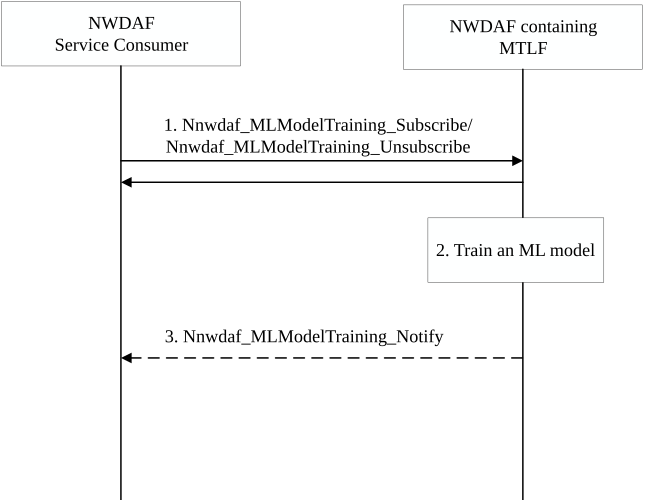
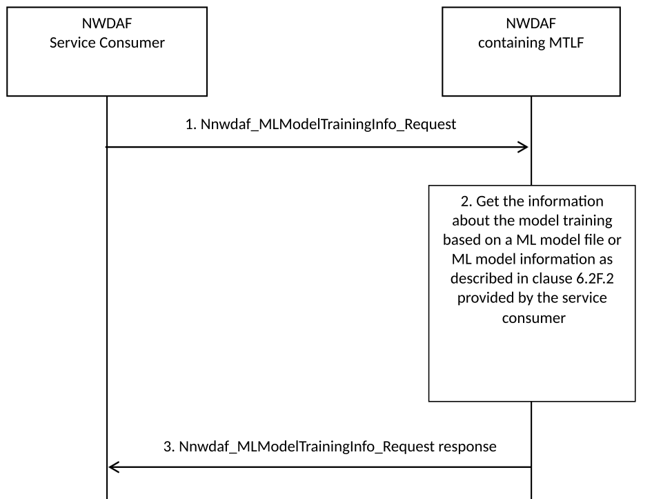

# 6.2F Procedure for ML Model Training

## 6.2F.1 ML Model Training Subscribe/Unsubscribe

The procedure in Figure 6.2F.1-1 is used by an NWDAF service consumer, i.e. an NWDAF containing MTLF to subscribe to another NWDAF, i.e. an NWDAF containing MTLF, for a trained ML Model based on the ML Model file or ML Model information as described in clause 6.2F.2 provided by the NWDAF service consumer. The service may be used by an NWDAF containing MTLF to enable e.g. Federated Learning or to update ML Model. The service is also used by an NWDAF service consumer to request an NWDAF containing MTLF to prepare training ML Model or modify existing ML Model training subscription.

Figure 6.2F.1-1: Procedure for ML Model Training subscribe/unsubscribe

1\. The NWDAF service consumer may subscribe or unsubscribe for training an ML Model by invoking the Nnwdaf_MLModelTraining_Subscribe/ Nnwdaf_MLModelTraining_Unsubscribe service operation. The parameters that can be provided by the NWDAF service consumer are listed in clause 6.2F.2.

In order to enable Federated Learning, NWDAF Service consumer act as FL Server NWDAF can subscribe to multiple NWDAFs containing MTLF act as FL Client NWDAFs, which are selected by the FL Server NWDAF.

The FL server NWDAF may use the request to check if an NWDAF can meet the ML Model training requirement (e.g. ML Model Interoperability information, Analytics ID, Serving Area and/or availability of data and time). In such case, the FL server NWDAF includes an ML Preparation Flag. When the ML Preparation Flag presents in the request, the service provider NWDAF only checks if it can meet the ML Model training requirement (e.g. ML Model Interoperability information, Analytics ID, Serving Area and/or availability of data and time) and / or can successfully download the model if the model information is provided.

The FL server NWDAF may use the request to get the Model Accuracy information of the global ML Model calculated by the FL Client NWDAFs. In such cases, the service consumer NWDAF includes a Model Accuracy Check Flag. When the Model Accuracy Check Flag is present in the request, the service provider NWDAF uses the local training data as the testing dataset to calculate the Model Accuracy information of the ML Model provided by the service consumer NWDAF.

When NWDAF service consumer determine to further update the ML Model, NWDAF service consumer modifies the subscription by invoking Nnwdaf_MLModelTraining_Subscribe service operation including Subscription Correlation ID with ML Model Information (as defined in clause 6.2A.2).

2\. The NWDAF containing MTLF trains ML Model provided at step 2 by collecting new data or re-use the data that it owns. If the ML Model file is not provided in step 1, the NWDAF containing MTLF shall first get the ML Model using the information indicated at step 1.

3\. When the NWDAF containing MTLF completes ML Model training, the NWDAF containing MTLF notifies the NWDAF service consumer with ML Model Information (as defined in clause 6.2A.2) of updated ML Model by invoking the Nnwdaf_MLModelTraining_Notify service operation. The parameters that can be provided by the NWDAF containing MTLF as service provider is specified in clause 6.2F.2.

If the NWDAF containing MTLF determines to terminate the ML Model training, i.e. NWDAF containing MTLF will not provide further notifications related to this request, then the NWDAF containing MTLF may notify the NWDAF Service consumer a Terminate Request indication with cause code (e.g. NWDAF overload, not available for the FL process anymore, etc.) by invoking the Nnwdaf_MLModelTraining_Notify service operation.

In order to enable Federated Learning, NWDAF containing MTLF acting as FL Client NWDAF can notify NWDAF Service consumer acting as FL Server NWDAF the local ML Model information and status report of FL training including accuracy information of local model and Training Input Data Information (e.g. areas covered by the data set, sampling ratio, maximum/minimum of value of each dimension, etc.).

If the Model Accuracy Check Flag is present in the Nnwdaf_MLModelTraining_Subscribe, the service provider NWDAF acting as FL Client NWDAF may notify the NWDAF Service consumer acting as FL Server NWDAF the Model Accuracy information of the global ML Model.

## 6.2F.2 Contents of ML Model Training

The consumers of the ML Model training services (i.e. an NWDAF containing MTLF) may provide the input parameters in Nnwdaf_MLModelTraining_Subscribe or Nnwdaf_MLModelTrainingInfo_Request service operations as listed below:

\- Analytics ID: identifies the analytics for which the ML Model is requested to be trained.

\- ML Model Interoperability Information as defined in clause 6.2A.2.

\- (Only for Nnwdaf_MLModelTraining_Subscribe) A Notification Target Address (+ Notification Correlation ID) as defined in TS 23.502 \[3\] clause 4.15.1, allowing to correlate notifications received from the NWDAF containing MTLF with the subscription.

\- \[OPTIONAL\] ML Model Information (as defined in clause 6.2A.2).

\- \[OPTIONAL\] ML Model file.

NOTE 1: It is up to NWDAF implementation to determine whether to include ML Model file in input parameters considering ML Model file size, etc.

\- \[OPTIONAL\] ML Model identifier: identifies the provided ML Model.

\- \[OPTIONAL\] ML Preparation Flag: identifies whether the request is for preparing Federated Learning or executing Federated Learning.

\- \[OPTIONAL\] ML Model Accuracy Check Flag: identifies that the request is for using the local training data as the testing dataset to calculate the Model Accuracy of the global ML Model provided by the NWDAF service consumer acting as the FL Server NWDAF.

\- \[OPTIONAL\] ML Correlation ID: identifies the Federated Learning procedure for training the ML Model. This parameter is included when the service is used for Federated Learning.

\- \[OPTIONAL\] Data Availability requirement. This is the requirement on data availability for the ML Model training. e.g. FL Server NWDAF sends the requirement in preparation request to a FL Client NWDAF for selecting the FL Client NWDAF which can meet the data availability requirement. The following may be included:

\- Event ID list to be collected for local model training.

\- Dataset statistical properties as defined in clause 6.1.3.

\- Time window of the data samples.

\- Minimum number of data samples.

\- \[OPTIONAL\] FL Availability time requirement. This is the requirement on availability time for the ML Model training, e.g. FL Server NWDAF sends the requirement in preparation request to FL Client NWDAF for selecting the FL Client NWDAF which is available in the required time for training ML Model.

\- \[OPTIONAL\] Training Filter Information: enables to select which data for the ML Model training is requested, e.g. S-NSSAI, Area of Interest. Parameter types in the Training Filter Information are the same as or subset of parameter types in the ML Model Filter Information which are defined in clause 6.2A.2.

\- \[OPTIONAL\] Target of Training Reporting: indicates the object(s) for which data for ML Model training is requested, i.e. group of UEs identified by a list of Internal-Group-Ids or any UE (i.e. all UEs).

\- \[OPTIONAL\] Use case context: indicates the context of use of ML Model.

\- \[OPTIONAL\] Training Reporting Information with the following parameters:

\- Maximum response time: indicates maximum time for waiting notifications (i.e. model training results).

\- \[OPTIONAL\] Iteration round ID: indicates the iteration round number of current ML Model training.

\- \[OPTIONAL\] Expiry time.

\- \[OPTIONAL\] Indication of skipping the current FL round.

The NWDAF containing MTLF provides to the consumer of the ML Model training service operations as described in clause 7.10 and clause 7.11, the output information in notification or response as listed below:

\- (Only for Nnwdaf_MLModelTraining_Notify) The Notification Correlation Information.

\- \[OPTIONAL\] ML Model Information (as defined in clause 6.2A.2).

\- \[OPTIONAL\] ML Model identifier: identifies the provisioned ML Model.

\- \[OPTIONAL\] Global ML Model Accuracy information: The model metric value of the global ML Model and optionally the used metric, which is calculate by the FL Client NWDAF using the local training data as the testing dataset.

\[OPTIONAL\] Status report of FL training: Accuracy information of local model and Training Input Data Information (e.g. areas covered by the data set, sampling ratio, maximum/minimum of value of each dimension, etc.), which are generated by the FL Client NWDAF during FL procedure.

NOTE 2: The parameters in Training Input Data Information are up to the implementation.

\- \[OPTIONAL\] ML Correlation ID. This parameter may be included when the service is used for Federated Learning.

\- \[OPTIONAL\] Iteration round ID: indicates the iteration round number of ML Model training indicated by the FL Server NWDAF.

\- \[OPTIONAL\] Delay Event Notification with the following parameters:

\- delay event indication: this parameter indicates that FL Client NWDAF is not able to complete the training of the interim local ML Model within the maximum response time provided by the FL Server NWDAF.

\- \[OPTIONAL\] cause code (e.g. local ML Model training failure, more time necessary for local ML Model training, etc.).

\- \[OPTIONAL\] Expected time to complete the training: Indicates to the FL Server NWDAF that expected remaining training time and may be provided with Delay Event Notification.

## 6.2F.3 ML Model Training Information Request

The procedure in Figure 6.2F.3-1 is used by an NWDAF service consumer, i.e., an NWDAF containing MTLF to request another NWDAF, i.e., an NWDAF containing MTLF, for the information about ML Model training based on the ML Model file or ML Model information as described in clause 6.2F.2 provided by the NWDAF service consumer. The service may be used by an NWDAF containing MTLF to enable e.g. Federated Learning.

Figure 6.2F.3-1: Procedure for ML Model Training Information Request

1\. The NWDAF service consumer may request the NWDAF containing MTLF to get the information about the ML Model training based on the ML Model file or ML Model information as described in clause 6.2F.2 provided by the service consumer by invoking the Nnwdaf_MLModelTrainingInfo_Request service operation. The parameters that can be provided by the NWDAF service consumer are listed in clause 6.2F.2.

In order to enable Federated Learning, NWDAF Service consumer acting as FL Server NWDAF requests to get ML Model Training Information from multiple NWDAF containing MTLF acting as FL Client NWDAFs, which are selected by the FL Server NWDAF. The details are specified in clause 6.2C.

The NWDAF service consumer may use the request to check if an NWDAF can meet the ML Model training requirements (e.g. ML Model Interoperability information, Analytics ID, Service Area/DNAI and/or availability of data and time). In such cases, the NWDAF service consumer includes an ML Preparation Flag.

The NWDAF service consumer may use the request to get the Model Accuracy of the ML Model provided by the service consumer using local training data in the NWDAF containing MTLF as the testing dataset. In such cases, the service consumer NWDAF includes a Model Accuracy Check Flag.

2\. When the ML Preparation Flag is present in the request, the NWDAF containing MTLF only checks whether it can meet the ML Model training requirement and/or can successfully download the model if the model information is provided. Based on the check result, the NWDAF containing MTLF gets a successful return code or failure cause code (e.g. NWDAF does not meet the ML training requirements) as the information about the ML Model training.

When the Model Accuracy Check Flag is present in the request, the NWDAF containing MTLF uses the local training data as the testing dataset to calculate the Model Accuracy information of the ML Model provided by the service consumer. The NWDAF containing MTLF includes the Model Accuracy information into the information about the ML Model training.

When the NWDAF containing MTLF is ongoing ML Model training based on the ML Model file or ML Model information as described in clause 6.2F.2 provided by the NWDAF service consumer, the NWDAF containing MTLF gets a failure cause code (e.g. ML training is not complete) as the information about the ML Model training.

When the NWDAF containing MTLF completes ML Model training based on the ML Model file or ML Model information as described in clause 6.2F.2 provided by the NWDAF service consumer, the NWDAF containing MTLF gets a successful return code and the ML Model Information of the trained ML Model as the information about the ML Model training.

3\. The NWDAF containing MTLF replies to the NWDAF service consumer with the information about the ML Model training by invoking the Nnwdaf_MLModelTrainingInfo_Request response service operation.
