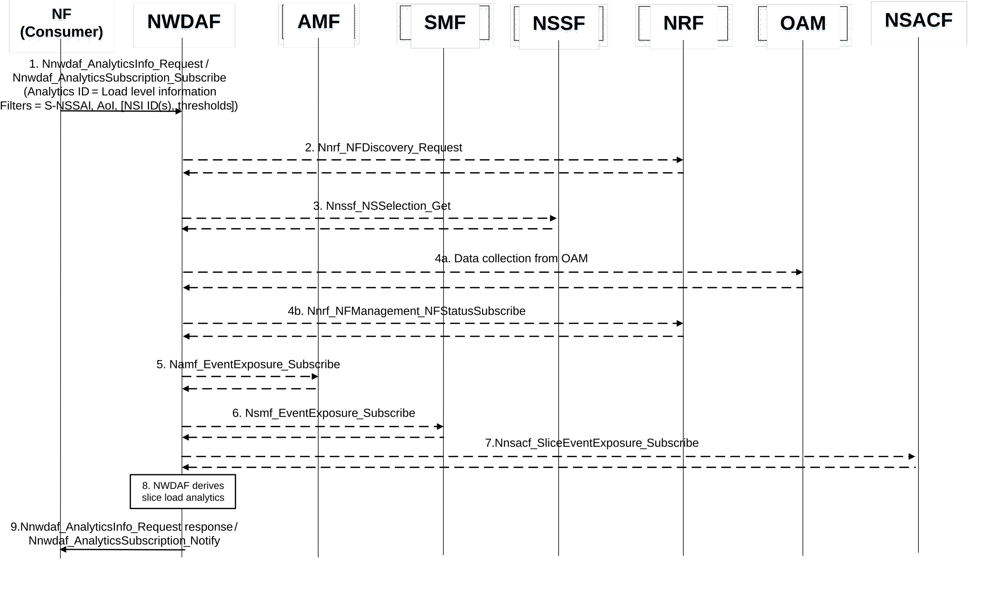

# 6.3 Slice load level related network data analytics

## 6.3.1 General

The NWDAF provides slice load level information to a consumer NF on a Network Slice level or a Network Slice instance level or both. The NWDAF is not required to be aware of the current subscribers using the slice. The NWDAF notifies slice specific network status analytics information to the consumer NF that is subscribed to it. A consumer NF may collect directly slice specific network status analytics information from NWDAF. This information is not subscriber specific.

The NWDAF services as defined in the clause 7.2 and clause 7.3 are used to expose slice load level analytics from the NWDAF to the consumer NF (e.g. PCF, NSSF, AMF or AF, possibly via NEF).

The consumer of these analytics shall indicate in the request or subscription:

\- Analytics ID = "Load level information";

\- Analytics Filter Information:

\- S-NSSAI and NSI ID;

NOTE 1: The use of NSI ID in the network is optional and depends on the deployment choices of the operator. If used, the NSI ID is associated with S-NSSAI. NSI ID is only applicable when the consumer of analytics is NSSF or AMF.

\- optionally, the list of analytics subsets that are requested among those specified in clause 6.3.3A;

\- optionally, for analytics exposure in roaming case (see clause 6.1.5), the PLMN ID identifying the target PLMN (i.e. PLMN of which the roaming analytics is requested); and

\- optionally, for analytics exposure in roaming case (see clause 6.1.5), mapped S-NSSAI of the HPLMN if the consumer NF is in the VPLMN.

NOTE 2: The terms "HPLMN" and "VPLMN" here refer to a roaming case in which at least one UE served by the NWDAF analytics consumer is involved.

\- an optional Area of Interest (i.e. list of TAs or cells);

NOTE 3: When the AF provides geographical area, the NEF can map it into list of TAs or cells.

\- an optional list of NF types;

\- optionally, Load Level Threshold value;

\- optionally, "maximum number of objects" indicating the maximum number of Network Slice instances expected in output, when the Analytics Filter Information does not indicate an NSI ID; and

\- an Analytics target period indicating the time period over which the statistics or predictions are requested.

## 6.3.2 Void

## 6.3.2A Input data

The detailed information collected by the NWDAF is listed in Table 6.3.2A-1 and Table 6.3.2A-2.

Table 6.3.2A-1: OAM Input data for slice load analytics

|                                                                                                        |        |                                                                                                                                                                                            |
|--------------------------------------------------------------------------------------------------------|--------|--------------------------------------------------------------------------------------------------------------------------------------------------------------------------------------------|
| Information                                                                                            | Source | Description                                                                                                                                                                                |
| UE registered in a Network Slice/Network Slice instance                                                | OAM    | Mean number of UEs registered in a NW slice or NW slice instance as defined in TS 28.552 \[8\]. (NOTE 1).                                                                                  |
| PDU Session established on a Network Slice/Network Slice instance                                      | OAM    | Mean number of established PDU Sessions in a NW slice or NW slice instance as defined in TS 28.552 \[8\]. (NOTE 1).                                                                        |
| Load of NFs associated to Network Slice instance                                                       | OAM    | Resource utilization information of a Network Slice instance obtained from its constituent NF instances. NF instance load input data collection is described in clause 6.5, Table 6.5.2-1. |
| NOTE 1: 5GC performance measurements can be provided per S-NSSAI by OAM as defined in TS 28.552 \[8\]. |        |                                                                                                                                                                                            |

Table 6.3.2A-2: 5GC NF Input data for slice load analytics

<table>
<colgroup>
<col style="width: 26%" />
<col style="width: 17%" />
<col style="width: 55%" />
</colgroup>
<tbody>
<tr class="odd">
<td>Information</td>
<td>Source</td>
<td>Description</td>
</tr>
<tr class="even">
<td>Timestamps</td>
<td>5GC NF</td>
<td>A time stamp associated with the collected information.</td>
</tr>
<tr class="odd">
<td>UE registers/de-registers to a Network Slice/Network Slice instance</td>
<td>AMF(s)</td>
<td>AMF reports that a UE registered or deregistered to a S-NSSAI or to a S-NSSAI and NSI ID.</td>
</tr>
<tr class="even">
<td>Number of UEs served by the AMF</td>
<td>AMF(s)</td>
<td>AMF reports the total number of UEs served by the AMF per S-NSSAI or per S-NSSAI and NSI ID. (NOTE 1)</td>
</tr>
<tr class="odd">
<td>PDU Session established/released on a Network Slice</td>
<td>SMF(s)</td>
<td>SMF reports that a PDU Session is established or released per S-NSSAI or per S-NSSAI and NSI ID.</td>
</tr>
<tr class="even">
<td>Current number of UEs registered in a NW slice</td>
<td>NSACF</td>
<td>NSACF reports the number of UE registered at the S-NSSAI.</td>
</tr>
<tr class="odd">
<td>Current number of PDU Sessions established in a NW slice</td>
<td>NSACF</td>
<td>NSACF reports the number of PDU Sessions established at the S-NSSAI.</td>
</tr>
<tr class="even">
<td>Load of NFs associated to Network Slice instance</td>
<td>NRF</td>
<td>Resource utilization information of a Network Slice instance obtained from its constituent NF instances. NF instance load input data collection is described in clause 6.5, Table 6.5.2-1.</td>
</tr>
<tr class="odd">
<td colspan="3">
NOTE 1: AMF reports the total number of registered UE in the AMF at each associated time stamp.

NOTE 2: SMF reports multiple PDU Sessions when establishment or release happened at the same time, indicated by the time stamp.

NOTE 3: Based on the internal logic, the NWDAF determines the source for the data collection.
</td>
</tr>
</tbody>
</table>

NWDAF collects input data on the number of UEs registered in a S-NSSAI or S-NSSAI and NSI ID combination using one of the following options:

\- Total number of UE registered to a S-NSSAI or to a S-NSSAI and NSI ID from each AMF(s) and/or from NSCAF serving the slice:

\- Namf_EventExposure_Subscribe (Target for Event Reporting = "any UE", Event ID = "Number of UEs served by the AMF and located in "Area of Interest"", Event Filter information = S-NSSAI(s) or one or more of the tuple (S-NSSAI, NSI ID), Event reporting mode = periodic along with periodicity) as defined in clause 5.2.2.3.1 of TS 23.502 \[3\]; or

\- Nnsacf_SliceEventExposure_Subscribe (EventID = "Number of UE registered", EventFilter = "S-NSSAI", Event reporting mode = periodic along with periodicity) as defined in clause 5.2.21.4.2 of TS 23.502 \[3\].

\- Individual UE registration/deregistration to a S-NSSAI or to a S-NSSAI and NSI ID reported by AMF(s):

\- Namf_EventExposure_Subscribe (Target for Event Reporting = "any UE", Event ID = "UE moving in or out of a subscribed "Area of Interest", Event Filter information = S-NSSAI(s) or one or more of the tuples (S-NSSAI, NSI ID), Event reporting mode = reporting to a maximum number or a maximum duration) as defined in clause 5.2.2.3.1 of TS 23.502 \[3\].

NWDAF collects input data on the number of PDU Sessions established in a S-NSSAI using one of the following options:

\- Total number of PDU Sessions established in a S-NSSAI from each NSACF serving the slice:

\- Nnsacf_SliceEventExposure_Subscribe (EventID = "Number of PDU sessions established", EventFilter = "S-NSSAI(s)", Event reporting mode = periodic along with periodicity) as defined in clause 5.2.21.4.2 of TS 23.502 \[3\].

\- Individual PDU Session Established or PDU Session Released in a S-NSSAI from SMF:

\- Nsmf_EventExposure_Subscribe (Target for Event Reporting = "any UE", Event ID = "PDU Session Establishment and/or PDU Session Release", Event Filter information = S-NSSAI(s), Event reporting mode = reporting to a maximum number or a maximum duration) as defined in clause 5.2.8.3.1 of TS 23.502 \[3\].

## 6.3.3 Void

## 6.3.3A Output analytics

The NWDAF services as defined in the clause 7.2 and 7.3 are used to expose the following analytics:

\- Network Slice instance load statistics information as defined in Table 6.3.3A-1.

\- Network Slice load statistics information as defined in Table 6.3.3A-2.

\- Network Slice instance load predictions information as defined in Table 6.3.3A-3.

\- Network Slice load predictions information as defined in Table 6.3.3A-4.

Table 6.3.3A-1: Network Slice instance load statistics

<table>
<colgroup>
<col style="width: 30%" />
<col style="width: 69%" />
</colgroup>
<tbody>
<tr class="odd">
<td>Information</td>
<td>Description</td>
</tr>
<tr class="even">
<td>S-NSSAI</td>
<td>Identification of the Network Slice.</td>
</tr>
<tr class="odd">
<td>Network Slice instances (1..max)</td>
<td>List of Network Slice instance(s) within the S-NSSAI.</td>
</tr>
<tr class="even">
<td>&gt; NSI ID</td>
<td>Identification of the Network Slice instance.</td>
</tr>
<tr class="odd">
<td>&gt; Number of UE Registrations (NOTE 1)</td>
<td>Number of UE registrations of the Network Slice instance (average, variance).</td>
</tr>
<tr class="even">
<td>&gt; Number of PDU Sessions establishment (NOTE 1)</td>
<td>Number of PDU Session establishments of the Network Slice instance (average, variance).</td>
</tr>
<tr class="odd">
<td>&gt; Resource usage (NOTE 1)</td>
<td>The usage of assigned virtual resources currently in use for the NF instances (mean usage of virtual CPU, memory, disk) as defined in clause 5.7 of TS 28.552 [8], belonging to a particular Network Slice instance.</td>
</tr>
<tr class="even">
<td>&gt; Resource usage threshold crossings (NOTE 1)</td>
<td>Number of times resource usage threshold is met or exceeded or crossed on the Network Slice instance and the time when it happened. It is present if threshold is provided by the consumer as Analytics Filter.</td>
</tr>
<tr class="odd">
<td>&gt; Resource usage threshold crossings time period (1..max) (NOTE 1, NOTE 2)</td>
<td>Resource usage threshold crossing vector including time elapsed between times each threshold is met or exceeded or crossed on the Network Slice instance if a threshold value is provided by the consumer as Analytics Filter.</td>
</tr>
<tr class="even">
<td>&gt; Load Level (NOTE 1)</td>
<td>The load level of the Network Slice Instance indicated by the S-NSSAI and the associated NSI ID (if applicable) in the Analytics Filter, it is present if Load Level Threshold is not provided by the consumer as Analytics Filter.</td>
</tr>
<tr class="odd">
<td>&gt; Crossed Load Level Threshold (NOTE 1)</td>
<td>An indication on whether the Load Level Threshold is met or exceeded by the statistics value of the Load Level. It is present if the Load Level Threshold is provided by the consumer as Analytics Filter.</td>
</tr>
<tr class="even">
<td>&gt; Spatial validity</td>
<td>Area (i.e. list of TAIs) where the network slice instance load statistics applies. Spatial validity may be a subset of the requested Area of Interest provided by the consumer.</td>
</tr>
<tr class="odd">
<td colspan="2">
NOTE 1: Analytics subset that can be used in "list of analytics subsets that are requested".

NOTE 2: The time period is a time interval specified by a start time and an end time timestamps within the Analytics target period.
</td>
</tr>
</tbody>
</table>

Table 6.3.3A-2: Network Slice load statistics

|                                                                                              |                                                                                                                                                                                                                                     |
|----------------------------------------------------------------------------------------------|-------------------------------------------------------------------------------------------------------------------------------------------------------------------------------------------------------------------------------------|
| Information                                                                                  | Description                                                                                                                                                                                                                         |
| S-NSSAI                                                                                      | Identification of the Network Slice.                                                                                                                                                                                                |
| \> Number of UE Registrations (NOTE 1)                                                       | Number of UE registrations at the Network Slice (average, variance).                                                                                                                                                                |
| \> Number of PDU sessions establishments (NOTE 1)                                            | Number of PDU Session establishments at the Network Slice (average, variance).                                                                                                                                                      |
| \> Load Level (NOTE 1)                                                                       | The load level of the Network Slice Instance indicated by the S-NSSAI and the associated NSI ID (if applicable) in the Analytics Filter, it is present if Load Level Threshold is not provided by the consumer as Analytics Filter. |
| \> Crossed Load Level Threshold (NOTE 1)                                                     | An indication on whether the Load Level Threshold is met or exceeded by the statistics value of the Load Level. It is present if the Load Level Threshold is provided by the consumer as Analytics Filter.                          |
| \> Spatial validity                                                                          | Area (i.e. list of TAIs) where the network slice load statistics applies. Spatial validity may be a subset of the requested Area of Interest provided by the consumer.                                                              |
| NOTE 1: Analytics subset that can be used in "list of analytics subsets that are requested". |                                                                                                                                                                                                                                     |

Table 6.3.3A-3: Network Slice instance load predictions

<table>
<colgroup>
<col style="width: 30%" />
<col style="width: 69%" />
</colgroup>
<tbody>
<tr class="odd">
<td>Information</td>
<td>Description</td>
</tr>
<tr class="even">
<td>S-NSSAI</td>
<td>Identification of the Network Slice.</td>
</tr>
<tr class="odd">
<td>Network Slice instances (1..max)</td>
<td>List of Network Slice instance(s) within the S-NSSAI.</td>
</tr>
<tr class="even">
<td>&gt; NSI ID</td>
<td>Identification of the Network Slice instance.</td>
</tr>
<tr class="odd">
<td>&gt; Number of UE Registrations (NOTE 1)</td>
<td>Number of predicted UE registrations at the Network Slice instance (average, variance).</td>
</tr>
<tr class="even">
<td>&gt; Number of PDU Sessions establishment (NOTE 1)</td>
<td>Number of predicted PDU Session establishments of the Network Slice instance (average, variance).</td>
</tr>
<tr class="odd">
<td>&gt; Resource usage (NOTE 1)</td>
<td>The predicted usage of assigned virtual resources for the NF instances (mean usage of virtual CPU, memory, disk) as defined in clause 5.7 of TS 28.552 [8], belonging to a particular Network Slice instance.</td>
</tr>
<tr class="even">
<td>&gt; Resource usage threshold crossings (NOTE 1)</td>
<td>Number of predicted times resource usage threshold is met or exceeded or crossed at the Network Slice instance and the time when it happened. It is present if a threshold value is provided by the consumer as Analytics Filter.</td>
</tr>
<tr class="odd">
<td>&gt; Resource usage threshold crossings time period (1..max) (NOTE 1, NOTE 2)</td>
<td>Predicted Resource usage threshold vector including predicted time elapsed between times each threshold is met or exceeded or crossed on the Network Slice instance, it is present if a threshold value is provided by the consumer as Analytics Filter.</td>
</tr>
<tr class="even">
<td>&gt; Load Level (NOTE 1)</td>
<td>The load level of the Network Slice Instance indicated by the S-NSSAI and the associated NSI ID (if applicable) in the Analytics Filter, if Load Level Threshold is not provided by the consumer as Analytics Filter.</td>
</tr>
<tr class="odd">
<td>&gt; Crossed Load Level Threshold (NOTE 1)</td>
<td>An indication on whether the Load Level Threshold is met or exceeded by the predicted value of the Load Level. It is present if the Load Level Threshold is provided by the consumer as Analytics Filter.</td>
</tr>
<tr class="even">
<td>&gt; Spatial validity</td>
<td>Area (i.e. list of TAIs) where the network slice instance load prediction applies. Spatial validity may be a subset of the requested Area of Interest provided by the consumer.</td>
</tr>
<tr class="odd">
<td>&gt; Confidence</td>
<td>Confidence of this prediction.</td>
</tr>
<tr class="even">
<td colspan="2">
NOTE 1: Analytics subset that can be used in "list of analytics subsets that are requested".

NOTE 2: The time period is a time interval specified by a start time and an end time timestamps within the Analytics target period.
</td>
</tr>
</tbody>
</table>

Table 6.3.3A-4: Network Slice load predictions

|                                                                                              |                                                                                                                                                                                                                       |
|----------------------------------------------------------------------------------------------|-----------------------------------------------------------------------------------------------------------------------------------------------------------------------------------------------------------------------|
| Information                                                                                  | Description                                                                                                                                                                                                           |
| S-NSSAI                                                                                      | Identification of the Network Slice.                                                                                                                                                                                  |
| \> Number of UE Registrations (NOTE 1)                                                       | Predicted Number of UE registrations at the Network Slice (average, variance).                                                                                                                                        |
| \> Number of PDU sessions establishments (NOTE 1)                                            | Predicted Number of PDU Session establishments at the Network Slice (average, variance).                                                                                                                              |
| \> Load Level (NOTE 1)                                                                       | The load level of the Network Slice Instance indicated by the S-NSSAI and the associated NSI ID (if applicable) in the Analytics Filter, if Load Level Threshold is not provided by the consumer as Analytics Filter. |
| \> Crossed Load Level Threshold (NOTE 1)                                                     | An indication of whether the Load Level Threshold is met or exceeded by the predicted value of the Load Level. It is present if the Load Level Threshold is provided by the consumer as Analytics Filter.             |
| \> Spatial validity                                                                          | Area (i.e. list of TAIs) where the network slice load prediction applies. Spatial validity may be a subset of the requested Area of Interest provided by the consumer.                                                |
| \> Confidence                                                                                | Confidence of this prediction.                                                                                                                                                                                        |
| NOTE 1: Analytics subset that can be used in "list of analytics subsets that are requested". |                                                                                                                                                                                                                       |

NOTE: If no NSI ID is provided as Analytics Filter, slice load level related output analytics are provided according to Tables 6.3.3A-2 and 6.3.3A-4. Otherwise slice instance load level related output analytics are provided according to Tables 6.3.3A-1 and 6.3.3A-3.

The predictions are provided with a Validity Period, as defined in clause 6.1.3. The Network Slice Load statistics and predictions may be exposed to the AF by NEF under the conditions defined in clause 5.9.2.3 of TS 33.501 \[49\] NEF security requirements.

## 6.3.4 Procedures

Figure 6.3.4-1: Network Slice load analytics provided by NWDAF

Figure 6.3.4-1 shows the procedure for NWDAF to derive slice load analytics. The steps are described as follows:

1\. A consumer NF subscribes to/requests a NWDAF using Nnwdaf_AnalyticsSubscription_Subscribe or Nnwdaf_AnalyticsInfo_Request service operation (Analytics ID = Load level information and a set of Analytics Filters (e.g. S-NSSAI, NSI ID, Area of Interest)).

2\. \[OPTIONAL\] If the NWDAF does not have already the slice information, it gains the slice information from OAM (as described in clause 6.2.3) and selects, based on discovery towards NRF, the AMF, SMF and NSSF instance(s) relevant to the Analytics Filters provided in the analytics subscription.

3\. \[OPTIONAL\] If the NSI ID(s) are not provided in the analytics subscription by the consumer NF, the NWDAF invokes Nnssf_NSSelection_Get service operation from NSSF to obtain the NSI ID(s) corresponding to the S-NSSAI in the subscription.

NOTE: Step 4a to step 7 are conditional depending on the NWDAF internal logic that determines the source(s) of data collection.

4a. \[CONDITIONAL\] The NWDAF may subscribe to input data in Table 6.3.2A-1 from the OAM according to the data collection principles from the OAM described in clause 6.2.3.

4b. \[CONDITIONAL\] The NWDAF may collect input data from the NRF (see clause 6.5) to derive slice instance resource usage statistics and predictions for a Network Slice instance.

5\. \[CONDITIONAL\] The NWDAF may subscribe to the AMF(s) event exposure service to collect data on the number of UEs currently registered on certain Network Slice and, if available, its constituent Network Slice instance(s) as defined in clause 6.3.2A. If required, the NWDAF may also collect the corresponding UE IDs.

6\. \[CONDITIONAL\] The NWDAF may subscribe to the SMF(s) event exposure service to collect data on the number of PDU sessions established and/or released at the SMF on currently registered on certain Network Slice as defined in clause 6.3.2A. NWDAF can then use such collected data to determine the number of PDU sessions established on i) a Network Slice; and ii) if available, on a Network Slice instance by leveraging the data collected in step 5.

7\. \[CONDITIONAL\] The NWDAF may subscribe to one or multiple NSACFs to collect data on either the number of UE registered in a S-NSSAI or the number of PDU sessions established in a S-NSSAI as defined in clause 6.3.2A. When multiple NSACFs are selected by the NWDAF for the S-NSSAI, the NWDAF aggregates the reports from the NSACFs to derive the number of UEs registered in the S-NSSAI or the number of PDU sessions established in the S-NSSAI.

8\. The NWDAF derives slice load analytics.

9\. The NWDAF delivers analytics to the consumer NF by invoking Nnwdaf_AnalyticsSubscription_Notify or Nnwdaf_AnalyticsInfo_Request response service operations.
