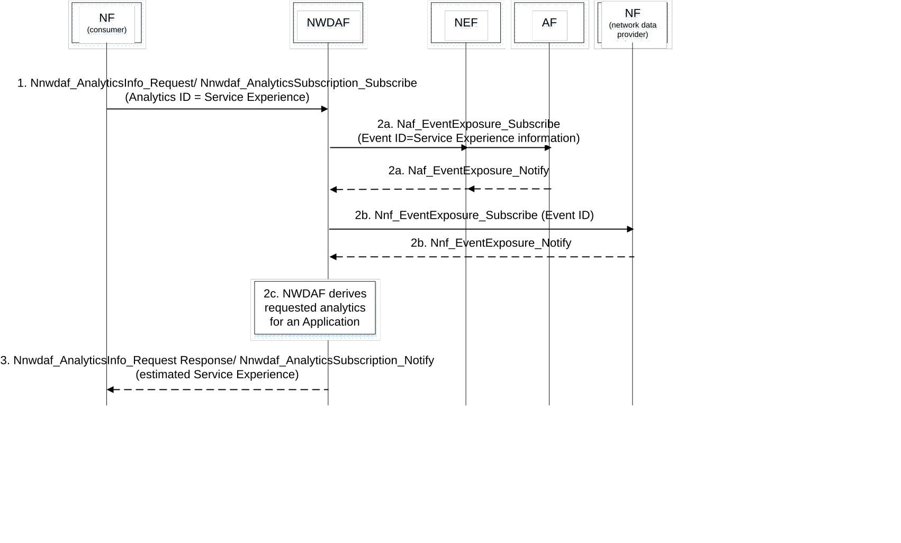

# 6.4.4 Procedures to request Service Experience for an Application

Figure 6.4.4-1: Procedure for NWDAF providing Service Experience for an Application

This procedure allows the consumer to request Analytics ID "Service Experience" for a particular Application. The consumer includes both the Application ID for which the Service Experience is requested and indicates that the Target of Analytics Reporting is "any UE". If the Target for Analytics Reporting is either a SUPI or an Internal-Group-Id the procedure in clause 6.4.6 applies. At the same time, for an Application ID, a set of initial QoS parameter combinations per service experience window (e.g. one is for 3\<Service MOS\<4 and another is for 4\<Service MOS\<5) is defined in PCF (e.g. by configuration of operator policies) that may be updated based on the Service Experience reported by NWDAF.

1\. Consumer NF sends an Analytics request/subscribe (Analytics ID = Service Experience, Target of Analytics Reporting = any UE, Analytics Filter Information that may include one or more of the following as defined in Table 6.4.1-1 (Application ID, S-NSSAI, DNN, Application Server Address(es), Area of Interest, RAT type(s), Frequency value(s)), Analytics Reporting Information=Analytics target period) to NWDAF by invoking a Nnwdaf_AnalyticsInfo_Request or a Nnwdaf_AnalyticsSubscription_Subscribe.

2a. NWDAF subscribes the service data from AF in the Table 6.4.2-1 by invoking Nnef_EventExposure_Subscribe or Naf_EventExposure_Subscribe service (Event ID = Service Experience information, Application ID, Event Filter information, Target of Event Reporting = Any UE) as defined in TS 23.502 \[3\].

NOTE 1: In the case of trusted AF, NWDAF provides the Area of Interest as a list of TAIs to AF. In the case of untrusted AF, NEF translates the requested Area of Interest provided as event filter by NWDAF into geographic zone identifier(s) that act as event filter for AF.

2b. NWDAF subscribes the network data from 5GC NF(s) in the Table 6.4.2-2 by invoking Nnf_EventExposure_Subscribe service operation.

2c. With these data, the NWDAF estimates the Service experience for the application.

NOTE 2: QoE measurements from the applications are based on outcome of the ongoing SA5 Rel-16 WID "Management of QoE measurement collection" which addresses how to collect the QoE measurements from the applications in the UE.

3\. The NWDAF provides the data analytics, i.e. the observed Service Experience (which can be a range of values) to the consumer NF by means of either Nnwdaf_AnalyticsInfo_Request response or Nnwdaf_AnalyticsSubscription_Notify, depending on the service used in step 1, indicating how well the used QoS Parameters satisfy the Service MoS agreed between the MNO and the end user or between the MNO and the external ASP.

NOTE 3: The call flow only shows a request-response model for the interaction of NWDAF and consumer NF for simplicity instead of both request-response model and subscription-notification model.

NOTE 4: The non-real time data information from AF includes the service experience data (see Table 6.4.2-1), which indicates the service quality during the service lifetime.

If the consumer NF is a PCF and it determines that the application SLA is not satisfied, it may take into account the Observed Service Experience and the operator policies including SLA and required Service Experience (which can be a range of values) to determine new QoS parameters to be applied for the service, as defined in clause 6.1.1.3 and clause 6.2.1.2 of TS 23.503 \[4\].

If the consumer NF is an AF (e.g. MEC or other Application Server), it may use the Observed Service Experience related network data analytics to determine whether the user experience can be satisfied. If not, the AF may determine to adjust service parameters, e.g. for a video service this may be bit rate, frame rate, codec format, compression parameter, screen size, etc. to better match the network conditions and achieve better user experience.

If the consumer NF is SMF, PCF or AF/Application Server, it may take into account the Observed Service Experience analytics per UP path (i.e. UPF and/or DNAI and/or AS instance address as defined in Table 6.4.3-1) to perform the following procedures:

\- The consumer SMF determines to (re)selects UP paths, including UPF and DNAI, as described in clause 4.3.5 of TS 23.502 \[3\]. In addition, the SMF may (re)configure traffic steering, updating the UPF regarding the target DNAI with new traffic steering rules.

\- The consumer AF/Application Server determines to adjust service parameters, e.g. service parameters of video for adjustment may be bit rate, frame rate, codec format, compression parameter, screen size, etc. or service parameters for the AI/ML operations described in clause 6.40 of TS 22.261 \[33\]. In addition, the AF/ Application Server may provide an updated list of DNAI(s) for SMF to perform relocation when appropriate.

\- The consumer PCF may provide an updated list of DNAI(s) for SMF to perform relocation upon AF request.

If the consumer NF is a NEF, it may take into account the Observed Service Experience analytics to support Member UE selection as detailed in clause 4.15.13 of TS 23.502 \[3\].
