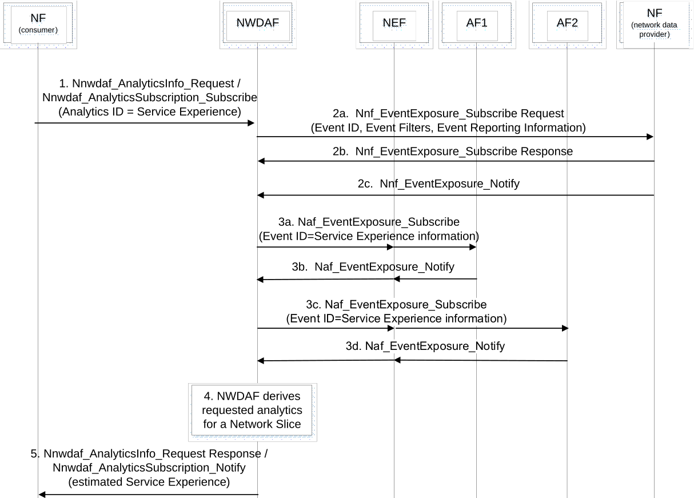

# 6.4.5 Procedures to request Service Experience for a Network Slice

Figure 6.4.5-1: Procedure for NWDAF providing Service Experience for a UE or a group of UEs in a Network Slice

This procedure is similar to the procedure in clause 6.4.4, with the following differences. The consumer needs to request the Analytics ID "Service Experience" for a Target for Analytics Reporting as defined in clause 6.1.3 on a Network Slice, identified by an S-NSSAI. If multiple Network Slice instances of the same Network Slice are deployed, associated NSI ID(s) may be used in addition to S-NSSAI. If 'any UE' is the Target of Analytics Reporting, NWDAF may subscribe to UE mobility event notifications of AMF as described in clause 5.3.4.4 of TS 23.501 \[2\] using event ID "UE moving in or out of Area of Interest" and Event Filters as described in Table 5.2.2.3.1-1 of TS 23.502 \[3\] if it is needed to retrieve the list of SUPIs (and GPSIs if available) in the area of interest. The event exposure service request may also include the immediate reporting flag as Event Reporting Information as described in Table 4.15.1-1 of TS 23.502 \[3\].

In addition, service experience data may need to be collected from multiple Applications. If each Application is hosted in different AFs, NWDAF subscribes the service data in the Table 6.4.2-1 from the different AFs by invoking Nnef_EventExposure_Subscribe or Naf_EventExposure_Subscribe services for each Application (Event ID = Service Experience information, Event Filter information, Application ID) as defined in TS 23.502 \[3\]. Figure 6.4.5-1 shows an example procedure with two AFs. If one AF provides the service experience data of multiple Applications, the set of Application IDs is provided by NWDAF to the AF with the Naf_EventExposure_Subscribe service operation, as defined TS 23.502 \[3\].

The Observed Service Experience for a Network Slice when consumed by OAM could be used as described in Annex H of TS 28.550 \[7\].
