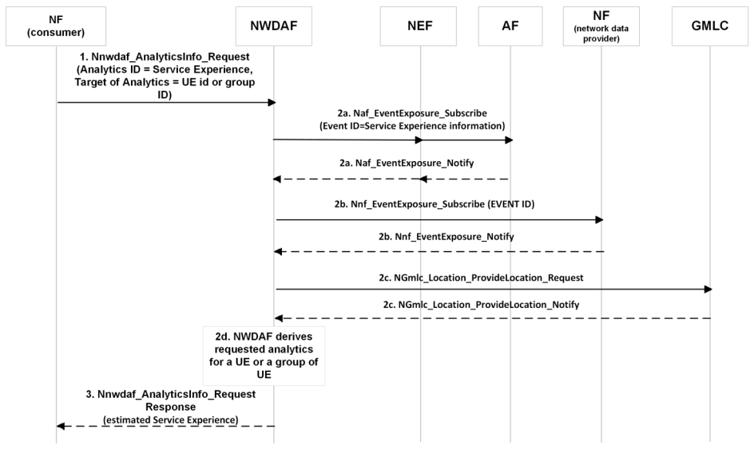

# 6.4.6 Procedures to request Service Experience for a UE

Figure 6.4.6-1 depicts procedure for NWDAF providing Service Experience for an application for a UE or a group of UEs.

Figure 6.4.6-1: Procedure for NWDAF providing Service Experience for an application for a UE or a group of UEs

The procedure in clause 6.4.4 applies with the following additions. The consumer needs to request the Analytics ID "Service Experience" for a UE identified by a SUPI or a group of UEs identified by a list of Internal Group-Ids. The consumer includes both the Application ID for which their Service Experience is requested and the Target of Analytics Reporting. Analytic Filter Information can be set according to clause 6.4.1. The NWDAF may collect UE location information from the GLMC if the consumer requested fine granularity location information according to clause 6.4.2.1. When NEF is the NF service consumer, the NEF translates a GPSI into a SUPI or an External-Group-Id into an Internal-Group-Id then includes it in the Target of Analytics Reporting.
