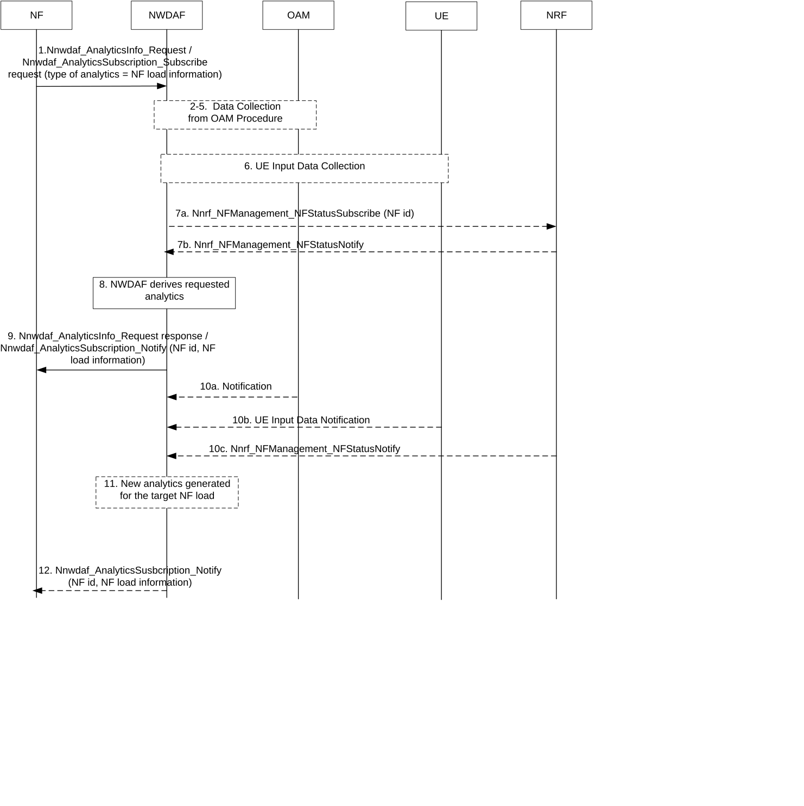

# 6.5 NF load analytics

## 6.5.1 General

The clause 6.5 describes how NWDAF can provide NF load analytics, in the form of statistics or predictions or both, to another NF.

The service consumer may be an NF, or the OAM.

The consumer of these analytics shall indicate in the request:

\- Analytics ID = "NF load information";

\- Target of Analytics Reporting: an optional SUPI or any UE;

\- Analytics Filter Information:

\- optional S-NSSAI;

\- an optional list of NF Instance IDs, NF Set IDs, or NF types;

\- optional area of interest;

\- an optional list of analytics subsets that are requested (see clause 6.5.3);

\- Optional preferred level of accuracy of the analytics;

\- Optional preferred level of accuracy per analytics subset (see clause 6.5.3);

\- Optional preferred order of results for the list of resource status: ascending or descending NF load;

\- Optional Reporting Threshold; the Reporting Threshold is unique for all NFs matching the above Analytics Filter and the reporting applies when the conditions are met for at least one of these NFs;

\- An Analytics target period indicates the time period over which the statistics or predictions are requested;

\- In a subscription, the Notification Correlation Id and the Notification Target Address are included.

The NWDAF shall notify the result of the analytics to the consumer as indicated in clause 6.5.3.

If a list of the NF Instance IDs (or respectively of NF Set IDs) is provided, the NWDAF shall provide the analytics for each designated NF instance (or respectively for each NF instance belonging to each designated NF Set). In such case the Target of Analytics Reporting should be ignored.

Otherwise, if a SUPI is provided, the NWDAF shall use the SUPI to determine which NF instances (AMF and SMF) are serving this specific UE, filter them according to the provided S-NSSAI and NF types using data collected from NRF or OAM and provide analytics for these NF instances.

NOTE: Only NF instances of type AMF and SMF can be determined using a SUPI.

## 6.5.2 Input data

For the purpose of NF load analytics, the NWDAF may collect the information as listed in Table 6.5.2-1 for the relevant NF instance(s).

Table 6.5.2-1: Data collected by NWDAF for NF load analytics

|                           |        |                                                                                                                                                                                      |
|---------------------------|--------|--------------------------------------------------------------------------------------------------------------------------------------------------------------------------------------|
| Information               | Source | Description                                                                                                                                                                          |
| NF load                   | NRF    | The load of specific NF instance(s) in their NF profile as defined per TS 29.510 \[18\].                                                                                             |
| NF status                 | NRF    | The status of a specific NF instance(s) (registered, suspended, undiscoverable) as defined per TS 29.510 \[18\].                                                                     |
| NF resource usage         | OAM    | The usage of assigned virtual resources currently in use for specific NF instance(s) (mean usage of virtual CPU, memory, disk) as defined in clause 5.7 of TS 28.552 \[8\].          |
| NF resource configuration | OAM    | The life cycle changes of specific NF resources (e.g. NF operational or interrupted during virtual/physical resources reconfiguration) as defined in clause 5.2 of TS 28.533 \[19\]. |

NOTE 1: The OAM information can be used as a complement to NRF information for some or all of the following aspects: resources utilization, NRF information correlation and alternative source of information if NRF information on load is not available.

NOTE 2: NWDAF can request NRF for data related to NF instances, as described in TS 29.510 \[18\].

NOTE 3: NWDAF can correlate the NF resources configuration with NF resource usage for generating the analytics output.

If target NF type is UPF, the NWDAF may collect the information as listed in Table 6.5.2-2, in addition to information listed in Table 6.5.2-1.

Table 6.5.2-2: Data collected by NWDAF for UPF load analytics

|                      |        |                                                                                                                                    |
|----------------------|--------|------------------------------------------------------------------------------------------------------------------------------------|
| Information          | Source | Description                                                                                                                        |
| Traffic usage report | UPF    | Report of user plane traffic in the UPF for the accumulated usage of network resources (see clause 5.2.1.3.3 of TS 29.564 \[51\]). |

For the purpose of NF load analytics, the NWDAF may collect the information as listed in Table 6.5.2-3 (from OAM via MDT) and Table 6.5.2-5 via the AF (for trusted AF) or NEF (for untrusted AF) in addition to other information described above.

Table 6.5.2-3: MDT input data for UE

<table>
<colgroup>
<col style="width: 34%" />
<col style="width: 22%" />
<col style="width: 42%" />
</colgroup>
<tbody>
<tr class="odd">
<td>Information</td>
<td>Source</td>
<td>Description</td>
</tr>
<tr class="even">
<td>UE Speed</td>
<td>
OAM

(see NOTE 1)
</td>
<td>UE Speed (see TS 37.320 [20]).</td>
</tr>
<tr class="odd">
<td>UE Orientation</td>
<td>
OAM

(see NOTE 1)
</td>
<td>UE Orientation (see TS 37.320 [20]).</td>
</tr>
<tr class="even">
<td colspan="3">NOTE 1: UE input data collection for a specific UE from OAM (via MDT), is as captured in clause 6.2.3.1.</td>
</tr>
</tbody>
</table>

Table 6.5.2-4: Per UE attribute to be collected and processed by the AF

<table>
<colgroup>
<col style="width: 34%" />
<col style="width: 22%" />
<col style="width: 42%" />
</colgroup>
<tbody>
<tr class="odd">
<td>Information</td>
<td>Source</td>
<td>Description</td>
</tr>
<tr class="even">
<td>Per UE attribute</td>
<td>
UE Application

(see NOTE 1)
</td>
<td>UE application data to be collected from UE.</td>
</tr>
<tr class="odd">
<td>&gt; Destination</td>
<td></td>
<td>Expected final location of UE based on the route planned.</td>
</tr>
<tr class="even">
<td>&gt; Route</td>
<td></td>
<td>Planned path of movement by a UE application (e.g. a navigation app). The format is based on the SLA.</td>
</tr>
<tr class="odd">
<td>&gt; Average Speed</td>
<td></td>
<td>Expected speed over the route planned by a UE application.</td>
</tr>
<tr class="even">
<td>&gt; Time of arrival</td>
<td></td>
<td>Expected Time of arrival to destination based on the route planned.</td>
</tr>
<tr class="odd">
<td colspan="3">NOTE 1: The procedure for data collection from UE Application is as covered in clause 6.2.8.</td>
</tr>
</tbody>
</table>

Table 6.5.2-5: AF input data to the NWDAF for Collective Behaviour of UEs

<table>
<colgroup>
<col style="width: 34%" />
<col style="width: 22%" />
<col style="width: 42%" />
</colgroup>
<tbody>
<tr class="odd">
<td>Information</td>
<td>Source</td>
<td>Description</td>
</tr>
<tr class="even">
<td>Collective Attribute</td>
<td>
AF / NEF

(see NOTE 1, NOTE 2)
</td>
<td>Characterise collective attribute per set of UEs (see Table 6.5.2-4) within the area of interest.</td>
</tr>
<tr class="odd">
<td>&gt; Number of UEs</td>
<td></td>
<td>Total number of UEs that fulfil a collective behaviour within the area of interest.</td>
</tr>
<tr class="even">
<td>&gt; Timestamp</td>
<td></td>
<td>A time stamp of time that the collective attribute derived.</td>
</tr>
<tr class="odd">
<td>&gt; Application ID(s)</td>
<td>(see NOTE 3)</td>
<td>Identifying the application providing this information</td>
</tr>
<tr class="even">
<td>&gt; List of UE IDs</td>
<td>(see NOTE 4)</td>
<td>UE IDs that fulfil a collective behaviour within the area of interest.</td>
</tr>
<tr class="odd">
<td colspan="3">
NOTE 1: For collective behaviour attribute, data processing procedure is as defined in clause 6.2.8.

NOTE 2: Per collective attribute, the AF may provide several collective attribute sets, if several sets of UEs with similar behaviour are identified. A similar behaviour can be identified to specific ranges if the AF performs data processing (Data Anonymisation, Aggregation or Normalization) based on NWDAF request. UEs falling in the same range per UE attribute can form a collective attribute set.

NOTE 3: The application ID(s) (either external or Internal) is optional. If the application ID(s) is not provided, the relevant application ID(s) can be identified by NWDAF based on the relevant event ID as registered in NRF as covered in clause 6.2.8.2.2.

NOTE 4: List of UE IDs is optional and subject to support by the AF when processing the data based on NWDAF request.
</td>
</tr>
</tbody>
</table>

Based on network configuration, NWDAF may discover the AF from the NRF as defined in 6.2.8.2.2 (based on Collective Behaviour as Event ID or a corresponding Application ID).

For AF in trusted domain, the NWDAF invokes step 3a in clause 6.2.8.2.3 by using Naf_EventExposure_Subscribe service (Event ID = Collective Behaviour, Event Filter information, Target of Event Reporting). The collective attribute (see Table 6.5.2-5) can be indicated as part of event filter information as defined in TS 23.502 \[3\]. Otherwise, the AF notifies for all collective attributes within the area of interest.

For AF in untrusted domain, the NWDAF invokes step 3b in clause 6.2.8.2.3 by using Nnef_EventExposure_Subscribe (Event ID = Collective Behaviour, Event Filter information, Target of Event Reporting). The collective attribute (see Table 6.5.2-5) can be indicated as part of event filter information as defined in TS 23.502 \[3\]. Otherwise, the AF via NEF notifies for all collective attributes within the area of interest.

For Collective Behaviour of multiple UEs, NWDAF based on the configuration by MNO may request certain type of data processing from the AF as part of event filter information (e.g. for anonymisation, normalisation, aggregation). The data processing requested by NWDAF is used to anonymise, normalise or aggregate the same UE attribute from multiple UEs at the AF before notifying to the NWDAF.

For each UE attribute of a specific UE, whether and how AF is processing the data that is received from the UE depends on the SLA configured in AF (defined in clause 6.2.8.1) and is not known by the NWDAF.

To determine NF load (per area of interest), NWDAF may collect and take into account UE trajectory input data from the AF, defined in clause 6.7.2.2, Table 6.7.2.2-2 for UE mobility analytics in addition to MDT input data and /or collective behaviour input data, defined in clause 6.5.2, Table 6.5.2-3 and Table 6.5.2-5, respectively.

## 6.5.3 Output analytics

The NWDAF services as defined in the clause 7.2 and 7.3 are used to expose the analytics. NF load statistics information are defined in Table 6.5.3-1. NF load predictions information are defined in Table 6.5.3-2.

Table 6.5.3-1: NF load statistics

<table>
<colgroup>
<col style="width: 37%" />
<col style="width: 62%" />
</colgroup>
<tbody>
<tr class="odd">
<td>Information</td>
<td>Description</td>
</tr>
<tr class="even">
<td>List of resource status (1..max)</td>
<td>List of observed load information for each NF instance along with the corresponding NF id / NF Set ID (as applicable).</td>
</tr>
<tr class="odd">
<td>&gt; NF type</td>
<td>Type of the NF instance.</td>
</tr>
<tr class="even">
<td>&gt; NF instance ID</td>
<td>Identification of the NF instance.</td>
</tr>
<tr class="odd">
<td>&gt; NF status (NOTE 1)</td>
<td>The availability status of the NF on the Analytics target period, expressed as a percentage of time per status value (registered, suspended, undiscoverable).</td>
</tr>
<tr class="even">
<td>&gt; NF resource usage (NOTE 1)</td>
<td>The average usage of assigned resources (CPU, memory, disk).</td>
</tr>
<tr class="odd">
<td>&gt; NF load (NOTE 1)</td>
<td>The average load of the NF instance over the Analytics target period.</td>
</tr>
<tr class="even">
<td>&gt; NF peak load (NOTE 1)</td>
<td>The maximum load of the NF instance over the Analytics target period.</td>
</tr>
<tr class="odd">
<td>&gt; NF load (per area of interest) (NOTE 1, NOTE 2)</td>
<td>The average load of the NF instances over the area of interest.</td>
</tr>
<tr class="even">
<td colspan="2">
NOTE 1: Analytics subset that can be used in "list of analytics subsets that are requested" and "Preferred level of accuracy per analytics subset".

NOTE 2: Applicable only to AMF load based on Input data in clause 6.5.2, Table 6.5.2-3 and Table 6.5.2-5.
</td>
</tr>
</tbody>
</table>

Table 6.5.3-2: NF load predictions

<table>
<colgroup>
<col style="width: 35%" />
<col style="width: 64%" />
</colgroup>
<tbody>
<tr class="odd">
<td>Information</td>
<td>Description</td>
</tr>
<tr class="even">
<td>List of resource status (1..max)</td>
<td>List of predicted load information for each NF instance along with the corresponding NF id / NF Set ID (as applicable)</td>
</tr>
<tr class="odd">
<td>&gt; NF type</td>
<td>Type of the NF instance</td>
</tr>
<tr class="even">
<td>&gt; NF instance ID</td>
<td>Identification of the NF instance</td>
</tr>
<tr class="odd">
<td>&gt; NF status (NOTE 1)</td>
<td>The availability status of the NF on the Analytics target period, expressed as a percentage of time per status value (registered, suspended, undiscoverable)</td>
</tr>
<tr class="even">
<td>&gt; NF resource usage (NOTE 1)</td>
<td>The average usage of assigned resources (CPU, memory, disk)</td>
</tr>
<tr class="odd">
<td>&gt; NF load (NOTE 1)</td>
<td>The average load of the NF instance over the Analytics target period</td>
</tr>
<tr class="even">
<td>&gt; NF peak load (NOTE 1)</td>
<td>The maximum load of the NF instance over the Analytics target period</td>
</tr>
<tr class="odd">
<td>&gt; Confidence</td>
<td>Confidence of this prediction</td>
</tr>
<tr class="even">
<td>&gt; NF load (per area of interest) (NOTE 1, NOTE 2)</td>
<td>The predicted average load of the NF instances over the area of interest.</td>
</tr>
<tr class="odd">
<td colspan="2">
NOTE 1: Analytics subset that can be used in "list of analytics subsets that are requested" and "Preferred level of accuracy per analytics subset".

NOTE 2: Applicable only to AMF load based on Input data in clause 6.5.2, Table 6.5.2-3 and Table 6.5.2-5.
</td>
</tr>
</tbody>
</table>

NOTE: The variations on per-instance NF load and resource usage could be influenced by the number of running NF instances in addition to the load itself.

The predictions are provided with a Validity Period, as defined in clause 6.1.3.

The number of resource status is limited by the maximum number of objects provided as part of Analytics Reporting Information.

## 6.5.4 Procedures

The procedure depicted in Figure 6.5.4-1 allows a consumer NF to request analytics to NWDAF for NF load of various NF instances as defined in 6.5.1.

Figure 6.5.4-1: NF load analytics provided by NWDAF

1\. The NF sends a request to the NWDAF for analytics for NF load for a specific NF, using either the Nnwdaf_AnalyticsInfo or Nnwdaf_AnalyticsSubscription service. The Analytics ID is set to NF load information, the Target of Analytics Reporting and the Analytics Filter Information are set according to clause 6.5.1. The NF can request statistics or predictions or both and can provide a time window.

2-5. If the request is authorized and in order to provide the requested analytics, the NWDAF may need for each NF targeted instance to subscribe to OAM services to retrieve the target NF resource usage and NF resources configuration following steps captured in clause 6.2.3.2 for data collection from OAM. The NWDAF may collect MDT input data per individual UE from OAM (see Table 6.5.2-3). Steps 2-5 may be skipped when e.g. the NWDAF already has the requested analytics.

6\. For Collective Behaviour attributes, if the request is authorized and in order to provide the requested analytics, NWDAF may follow the UE Input Data Collection Procedure via the AF as defined in clause 6.2.8 (see Table 6.5.2-4 and Table 6.5.2-5).

The NWDAF subscribes to the AF services as above invoking either Nnef_EventExposure_Subscribe or Naf_EventExposure_Subscribe service (Event ID = Collective Behaviour, Event Filter information, Target of Event Reporting) as defined in TS 23.502 \[3\]. The area of interest is set as part of Event Filter information to specific TAs or AMF region. The UE data is collected from UEs within the area of interest.

In the case of trusted AF, the NWDAF provides the Area of Interest as a list of TAIs to the AF. In the case of untrusted AF, NEF translates the requested Area of Interest provided as event filter by the NWDAF into geographic zone identifier(s) that act as event filter for the AF.

For collective attributes as defined in Table 6.5.2-5, the AF processes (e.g. anonymize, aggregate and normalize) the data from individual UEs per UE attribute (see Table 6.5.2-4) based on Event Filters indicated by the NWDAF to determine which ones display a collective behaviour within the area of interest before notifying a collective attribute directly (trusted AF) or via NEF (for untrusted AF) to the NWDAF. The AF will provide (per collective attribute) e.g. the number of UEs that fulfil the collective attribute (within an area of interest).

NOTE 1: The call flow only shows a subscription/notification model for the simplicity, however both request-response and subscription-notification models should be supported.

NOTE 2: If the target NF type is UPF, the NWDAF can collect the information as listed in Table 6.5.2-2. How the NWDAF collects information is defined in clause 5.8.2.17 of TS 23.501 \[2\] and in clause 4.15.4 of TS 23.502 \[3\].

7a. The NWDAF subscribes to changes on the load and status of NF instances registered in NRF and identified by their NF id from NRF using Nnrf_NFManagement_NFStatusSubscribe service operation for each NF instance.

7b. NRF notifies NWDAF of changes on the load and status of the requested NF instances by using Nnrf_NFManagement_NFStatusNotify service operation.

8\. The NWDAF derives requested analytics.

9\. The NWDAF provides requested NF load analytics to the NF along with the corresponding Validity Period (only for predictions) or area of interest, using either the Nnwdaf_AnalyticsInfo_Request response or Nnwdaf_AnalyticsSubscription_Notify, depending on the service used in step 1.

10-12. If at step 1 the NF has subscribed to receive continuous reporting of NF load analytics, the NWDAF may generate new analytics and, when relevant according to the Analytics target period and Reporting Threshold, provide them along with the corresponding Validity Period (only for predictions) to the NF upon reception of notification of new NF load information from OAM or NRF or UE Input data notification via MDT or the AF (see Table 6.5.2-3 and Table 6.5.2-5).

NOTE 3: If the target NF type at step 1 is UPF, the NWDAF can generate new analytics when receiving new information as listed in Table 6.5.2-2.
