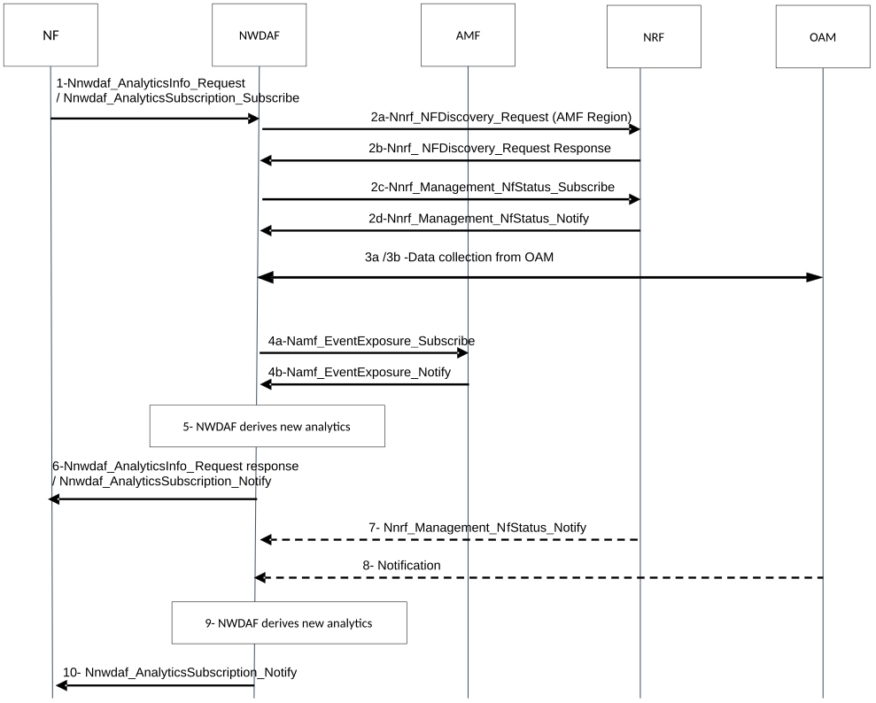

# 6.6 Network Performance Analytics

## 6.6.1 General

With Network Performance Analytics, NWDAF provides either statistics or predictions on the gNB status information, gNB resource usage, communication performance and mobility performance in an Area of Interest. In addition, NWDAF can provide statistics or predictions on the number of UEs located in that Area of Interest.

The service consumer may be an NF (e.g. PCF, NEF, AF), or the OAM.

The consumer of these analytics may indicate in the request:

\- Analytics ID = "Network Performance";

\- Target of Analytics Reporting as defined in clause 6.1.3;

\- Analytics Filter Information:

\- Area of Interest (list of TAs or Cell IDs) which restricts the area in focus (mandatory if Target of Analytics Reporting is set to "any UE", optional otherwise);

\- Optionally, Traffic type of interest (overall traffic, GBR traffic or Delay-critical GBR traffic);

NOTE: If Traffic type of interest is not provided, overall traffic is considered.

\- Optionally, a list of analytics subsets that are requested among those specified in clause 6.6.3;

\- Optionally, a preferred level of accuracy of the analytics;

\- Optionally, preferred level of accuracy per analytics subset (see clause 6.6.3);

\- Optionally, preferred order of results for the list of Network Performance information:

\- ordering criterion: "number of UEs", "communication performance" or "mobility performance";

\- order: ascending or descending;

\- Optionally, Reporting Thresholds, which apply only for subscriptions and indicate conditions on the level to be reached for respective analytics information (see clause 6.6.3) in order to be notified by the NWDAF;

\- An Analytics target period indicates the time period over which the statistics or prediction are requested; and

\- Optionally, maximum number of objects.

\- In a subscription, the Notification Correlation Id and the Notification Target Address are included.

\- Optionally, Spatial granularity size (if an Area of Interest is provided) and Temporal granularity size.

The NWDAF notifies the result of the analytics to the consumer as indicated in clause 6.6.3.

## 6.6.2 Input Data

The NWDAF collects Load and Performance information in an Area of Interest from the sources listed in Table 6.6.2-1 and number of UEs within Area of Interest from the sources listed in Table 6.6.2-2.

Table 6.6.2-1: Load and Performance information collected by NWDAF

|                                          |        |                                                                                                                                                                                                    |
|------------------------------------------|--------|----------------------------------------------------------------------------------------------------------------------------------------------------------------------------------------------------|
| Load information                         | Source | Description                                                                                                                                                                                        |
| Status, load and performance information | OAM    | Statistics on RAN status (up/down), load (i.e. Radio Resource Utilization) and performance per Cell Id for the traffic type of interest and in the Area of Interest as defined in TS 28.552 \[8\]. |
| NF Load information                      | NRF    | Load per NF                                                                                                                                                                                        |

Table 6.6.2-2: Number of UEs in Area of Interest information collected by NWDAF

|                           |        |                                      |
|---------------------------|--------|--------------------------------------|
| Number of UEs information | Source | Description                          |
| Number of UEs             | AMF    | Number of UEs in an Area of Interest |

The NWDAF shall be able to collect UE mobility information as stated in clause 6.7.2.2.

## 6.6.3 Output Analytics

The NWDAF shall be able to provide both statistics and predictions on Network Performance.

Network performance statistics are defined in Table 6.6.3-1.

Table 6.6.3-1: Network performance statistics

<table>
<colgroup>
<col style="width: 41%" />
<col style="width: 58%" />
</colgroup>
<tbody>
<tr class="odd">
<td>Information</td>
<td>Description</td>
</tr>
<tr class="even">
<td>List of network performance information (1..max)</td>
<td>Observed statistics during the Analytics target period.</td>
</tr>
<tr class="odd">
<td>&gt; Area subset</td>
<td>List of TAs or Cell IDs within the requested area of interest as defined in clause 6.6.1. If a Spatial granularity size was provided in the request or subscription, the number of elements of the list is smaller than or equal to the Spatial granularity size.</td>
</tr>
<tr class="even">
<td>&gt; Analytics target period subset</td>
<td>Time window within the requested Analytics target period as defined in clause 6.6.1. If a Temporal granularity size was provided in the request or subscription, the duration of the Analytics target period subset is greater than or equal to the Temporal granularity size.</td>
</tr>
<tr class="odd">
<td>&gt; gNB status information (NOTE 1)</td>
<td>Average ratio of gNBs that have been up and running during the entire Analytics target period in the area subset.</td>
</tr>
<tr class="even">
<td>&gt; gNB resource usage (NOTE 1) (NOTE 2)</td>
<td>Usage of assigned resources (average, peak).</td>
</tr>
<tr class="odd">
<td>&gt; gNB resource usage for GBR traffic (NOTE 1) (NOTE 2) (NOTE 3)</td>
<td>Usage of assigned resources for GBR traffic (average, peak).</td>
</tr>
<tr class="even">
<td>&gt; gNB resource usage for Delay-critical GBR traffic (NOTE 1) (NOTE 2) (NOTE 3)</td>
<td>Usage of assigned resources for Delay-critical GBR traffic (average, peak).</td>
</tr>
<tr class="odd">
<td>&gt; Number of UEs (NOTE 1)</td>
<td>Average number of UEs observed in the area subset.</td>
</tr>
<tr class="even">
<td>&gt; Communication performance (NOTE 1)</td>
<td>Average ratio of successful setup of PDU Sessions.</td>
</tr>
<tr class="odd">
<td>&gt; Mobility performance (NOTE 1)</td>
<td>Average ratio of successful handover.</td>
</tr>
<tr class="even">
<td colspan="2">
NOTE 1: Analytics subset that can be used in "list of analytics subsets that are requested" and "Preferred level of accuracy per analytics subset".

NOTE 2: The average and peak usage of uplink and downlink traffic are provided as percentage.

NOTE 3 The resource usage (average, peak) for GBR and Delay-critical GBR traffic types can be computed using the sub-counters of their corresponding 5QI measurements, as defined in clause 5.1.1.2 of TS 28.552 [8].
</td>
</tr>
</tbody>
</table>

Network performance predictions are defined in Table 6.6.3-2.

Table 6.6.3-2: Network performance predictions

<table>
<colgroup>
<col style="width: 41%" />
<col style="width: 58%" />
</colgroup>
<tbody>
<tr class="odd">
<td>Information</td>
<td>Description</td>
</tr>
<tr class="even">
<td>List of network performance information (1..max)</td>
<td>Predicted analytics during the Analytics target period</td>
</tr>
<tr class="odd">
<td>&gt; Area subset</td>
<td>List of TAs or Cell IDs within the requested area of interest as defined in clause 6.6.1. If a Spatial granularity size was provided in the request or subscription, the number of elements of the list is smaller than or equal to the Spatial granularity size.</td>
</tr>
<tr class="even">
<td>&gt; Analytics target period subset</td>
<td>Time window within the requested Analytics target period as defined in clause 6.6.1. If a Temporal granularity size was provided in the request or subscription, the duration of the Analytics target period subset is greater than or equal to the Temporal granularity size.</td>
</tr>
<tr class="odd">
<td>&gt; gNB status information (NOTE 1)</td>
<td>Average ratio of gNBs that will be up and running during the entire Analytics target period in the area subset.</td>
</tr>
<tr class="even">
<td>&gt; gNB resource usage (NOTE 1) (NOTE 2)</td>
<td>Usage of assigned resources (average, peak)</td>
</tr>
<tr class="odd">
<td>&gt; gNB resource usage for GBR traffic (NOTE 1) (NOTE 2) (NOTE 3)</td>
<td>Usage of assigned resources for GBR traffic (average, peak).</td>
</tr>
<tr class="even">
<td>&gt; gNB resource usage for Delay-critical GBR traffic (NOTE 1) (NOTE 2) (NOTE 3)</td>
<td>Usage of assigned resources for Delay-critical GBR traffic (average, peak).</td>
</tr>
<tr class="odd">
<td>&gt; Number of UEs (NOTE 1)</td>
<td>Average number of UEs predicted in the area subset.</td>
</tr>
<tr class="even">
<td>&gt; Communication performance (NOTE 1)</td>
<td>Average ratio of successful setup of PDU Sessions.</td>
</tr>
<tr class="odd">
<td>&gt; Mobility performance (NOTE 1)</td>
<td>Average ratio of successful handover.</td>
</tr>
<tr class="even">
<td>&gt; Confidence</td>
<td>Confidence of this prediction.</td>
</tr>
<tr class="odd">
<td colspan="2">
NOTE 1: Analytics subset that can be used in "list of analytics subsets that are requested" and "Preferred level of accuracy per analytics subset".

NOTE 2: The average and peak usage of uplink and downlink traffic are provided as percentage.

NOTE 3: The resource usage (average, peak) for GBR and Delay-critical GBR traffic types can be computed using the sub-counters of their corresponding 5QI measurements, as defined in clauses 5.1.1.2 of TS 28.552 [8].
</td>
</tr>
</tbody>
</table>

NOTE 1: The predictions are provided with a Validity Period, as defined in clause 6.1.3.

NOTE 2: The analytics on number of UEs are related to the information retrieved from the AMFs.

The number of network performance information entries is limited by the maximum number of objects provided as part of Analytics Reporting Information.

The NWDAF provides Network Performance Analytics to a consumer at the time requested by the consumer in the Analytics target period:

\- Analytics ID set to "Network Performance".

\- Notification Target Address including the address of the consumer.

\- Notification Correlation ID, for the consumer to correlate notifications from NWDAF if subscription applies.

\- Analytics specific parameters at the time indicated in the Analytics target period**.**

## 6.6.4 Procedures

Figure 6.6.4-1: Procedure for subscription to network performance analytics

1\. The NF sends Nnwdaf_AnalyticsSubscription_Subscribe or Nnwdaf_AnalyticsInfo_Request (Analytics ID="Network Performance", Target of Analytics Reporting, Analytics Filter Information = "Area of Interest", Analytics Reporting Information = ("Reporting Thresholds" and Analytics target Period(s))) to the NWDAF.

2a-2d. The NWDAF discovers from NRF the AMF(s) belonging to the AMF Region(s) that include(s) the Area of Interest and subscribes to NF load and status information from NRF about these AMF(s).

3a-3b. The NWDAF subscribes to OAM services to get the status and load information and the resource usage on the Area of Interest in clause 6.6.2, following the procedure captured in Clause 6.2.3.2.

4a-4b. The NWDAF collects the number of UEs located in the Area of Interest from AMF using Namf_EventExposure_Subscribe service, including the Target of Event Reporting provided as an input parameter (i.e. any UE or Internal Group Identifier).

5\. The NWDAF derives the requested analytics.

6\. The NWDAF sends Nnwdaf_AnalyticsSubscription_Notify or Nnwdaf_AnalyticsInfo_Request response (Network Performance analytics, Subscription Correlation Id, Confidence).

7-8. A change of network performance information, i.e. change in the gNB status information, gNB resource usage, communication performance and mobility performance in the area of interest at the observed period, is detected by OAM, or a change in the NF load information is reported by NRF and is notified to NWDAF.

9\. The NWDAF derives new analytics taking into account the most recent data collected.

10\. When relevant according to the Analytics target period and Reporting Thresholds, the NWDAF provides a notification using Nnwdaf_AnalyticsSubscription_Notify (Network Performance analytics, Subscription Correlation Id, Confidence).
