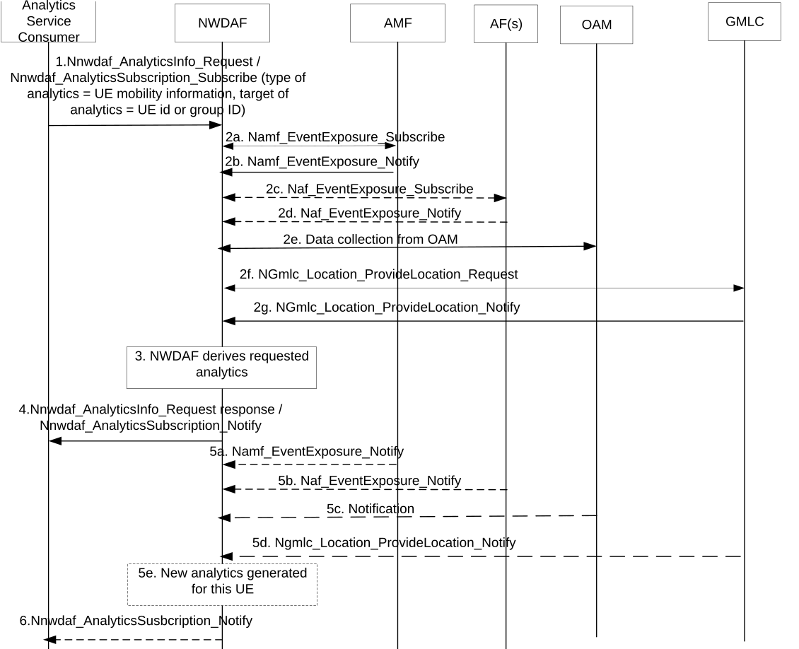

# 6.7.2 UE mobility analytics

## 6.7.2.1 General

NWDAF supporting UE mobility statistics or predictions shall be able to collect UE mobility related information from NF, OAM and to perform data analytics to provide UE mobility statistics or predictions.

The service consumer may be a NF (e.g. AMF, SMF or AF).

The consumer of these analytics may indicate in the request:

\- Analytics ID = "UE Mobility".

\- Target of Analytics Reporting: a single UE (SUPI) or group of UEs (i.e. a list of Internal Group Ids);

\- Analytics Filter Information optionally containing:

\- Area of Interest (AOI): restricts the scope of the UE mobility analytics to the provided area. If the request is for fine granularity location information (i.e. with a finer granularity than cell), the AOI may be described as shown in clause 5.5 of TS 23.273 \[39\];

NOTE 1: For LADN service, the consumer (e.g. SMF) provides the LADN DNN to refer the LADN service area as the AOI.

\- Visited Area(s) of Interest (visited AOI(s)): additional filter to only consider UEs that are currently (i.e. now) in the "AOI" and had previously (i.e. in the "Analytics target period") been in at least one of the Visited AOI(s). If this parameter is provided, the Analytics target period shall be in the past (i.e. supported for statistics only);

\- Linear distance threshold: An event where the UE moves by more than some predefined straight line distance from a previous location as per TS 23.273 \[39\]. The consumer can provide more than one value of Linear distance threshold.

\- an optional list of analytics subsets that are requested (see clause 6.7.2.3);

\- An Analytics target period indicates the time period over which the statistics or predictions are requested;

NOTE 2: For regular analytics scenarios, the Analytics target period is associated with the Analytics Filter Information = AOI, while for the scenario that Analytics ID=UE Mobility and Analytics Filter Information = (AOI and visited AOI(s)), as described in this clause, the Analytics target period is associated with the visited AOI(s) and to obtain the statistics for those UEs that currently reside in the AOI and had previously (i.e. in the "Analytics target period") been in at least one of the Visited AOI(s).

\- Optionally, maximum number of objects;

\- Preferred level of accuracy of the analytics;

\- Optionally, Preferred level of accuracy per analytics subset (see clause 6.7.2.3);

\- Preferred order of results for the time slot entries: ascending or descending time slot start;

\- Optionally, preferred granularity of location information: TA level or cell level "longitude and latitude level";

NOTE 3: Definition of "longitude and latitude level" is described in clause 6.1.3.

\- Optionally, Preferred orientation of location information: ("horizontal", "vertical", "both");

\- Optionally, Spatial granularity size and Temporal granularity size;

\- UE Location order indicator: indicates the NWDAF should derives and provides the UE Mobility analytics for UE Location in time order; and

\- In a subscription, the Notification Correlation Id and the Notification Target Address are included.

## 6.7.2.2 Input Data

The NWDAF supporting data analytics on UE mobility shall be able to collect UE mobility information from OAM, 5GC and AFs. The detailed information collected by the NWDAF could be MDT data from OAM, network data from 5GC and/or service data from AFs:

\- UE mobility information from OAM is UE location carried in MDT data;

\- Network data related to UE mobility from 5GC is UE location information, UE location trends or UE access behaviour trends, as defined in the Table 6.7.2.2-1;

Table 6.7.2.2-1: UE Mobility information collected from 5GC

<table>
<colgroup>
<col style="width: 32%" />
<col style="width: 14%" />
<col style="width: 53%" />
</colgroup>
<tbody>
<tr class="odd">
<td>Information</td>
<td>Source</td>
<td>Description</td>
</tr>
<tr class="even">
<td>UE ID</td>
<td>AMF</td>
<td>SUPI.</td>
</tr>
<tr class="odd">
<td>UE locations (1..max)</td>
<td>AMF</td>
<td>UE positions.</td>
</tr>
<tr class="even">
<td>&gt;UE location</td>
<td></td>
<td>TA or cells that the UE enters (NOTE 1).</td>
</tr>
<tr class="odd">
<td>&gt;Timestamp</td>
<td></td>
<td>A time stamp when the AMF detects the UE enters this location.</td>
</tr>
<tr class="even">
<td>Fine granularity location (1...max)</td>
<td>
LCS

(NOTE 2)
</td>
<td>UE positions.</td>
</tr>
<tr class="odd">
<td>....&gt;UE location</td>
<td></td>
<td>GAD shape or location coordinates (see TS 23.032 [34]).</td>
</tr>
<tr class="even">
<td>....&gt;Timestamp</td>
<td></td>
<td>A time stamp when the location was measured.</td>
</tr>
<tr class="odd">
<td>....&gt;LCS QoS</td>
<td></td>
<td>LCS QoS accuracy as defined in clause 4.1b of TS 23.273 [39].</td>
</tr>
<tr class="even">
<td>....&gt;Motion Event Notification)</td>
<td></td>
<td>The notification about motion event reporting as described in TS 23.273 [39].</td>
</tr>
<tr class="odd">
<td>....&gt;Liner distance threshold</td>
<td>NWDAF consumer</td>
<td>The distance travelled by the UE before reporting subsequent location as described in TS 23.273 [39].</td>
</tr>
<tr class="even">
<td>Type Allocation code (TAC)</td>
<td>AMF</td>
<td>To indicate the terminal model and vendor information of the UE. The UEs with the same TAC may have similar mobility behaviour. The UE whose mobility behaviour is unlike other UEs with the same TAC may be an abnormal one.</td>
</tr>
<tr class="odd">
<td>Frequent Mobility Registration Update</td>
<td>AMF</td>
<td>A UE (e.g. a stationary UE) may re-select between neighbour cells due to radio coverage fluctuations. This may lead to multiple Mobility Registration Updates if the cells belong to different registration areas. The number of Mobility Registration Updates N within a period M may be an indication for abnormal ping-pong behaviour, where N and M are operator's configurable parameters.</td>
</tr>
<tr class="even">
<td>UE access behaviour trends</td>
<td>AMF</td>
<td>Metrics on UE state transitions (e.g. access, RM and CM states, handover).</td>
</tr>
<tr class="odd">
<td>UE location trends</td>
<td>AMF</td>
<td>Metrics on UE locations.</td>
</tr>
<tr class="even">
<td colspan="3">
NOTE 1: UE location includes either the last known location or the current location, under the conditions defined in Table 4.15.3.1-1 in TS 23.502 [3].

NOTE 2: The procedure to collect location data using LCS is described in clause 6.2.12.
</td>
</tr>
</tbody>
</table>

\- Service data related to UE mobility provided by AFs is defined in the Table 6.7.2.2-2;

Table 6.7.2.2-2: Service Data from AF related to UE mobility

|                                                                                                                                                                     |                                                             |
|---------------------------------------------------------------------------------------------------------------------------------------------------------------------|-------------------------------------------------------------|
| Information                                                                                                                                                         | Description                                                 |
| UE ID                                                                                                                                                               | Could be external UE ID (i.e. GPSI).                        |
| Application ID                                                                                                                                                      | Identifying the application providing this information.     |
| UE trajectory (1..max)                                                                                                                                              | Timestamped UE positions.                                   |
| \>UE location                                                                                                                                                       | Geographical area that the UE enters.                       |
| \>Timestamp                                                                                                                                                         | A time stamp when UE enters this area.                      |
| A list of areas                                                                                                                                                     | A list of areas used by the AF for the application service. |
| NOTE: The application ID is optional. If the application ID is omitted, the collected UE mobility information can be applicable to all the applications for the UE. |                                                             |

Depending on the requested level of accuracy, data collection may be provided on samples (e.g. spatial subsets of UEs or UE group, temporal subsets of UE location information).

NOTE: Reporting current UE location can cause AMF to request NG-RAN to report UE location and consequently extra signalling and load in NG-RAN and AMF. The consumer retrieving data from AMF needs to use current location with care to avoid excessive signalling.

## 6.7.2.3 Output Analytics

The NWDAF supporting data analytics on UE mobility shall be able to provide UE mobility analytics to consumer NFs or AFs. The analytics results provided by the NWDAF could be UE mobility statistics as defined in table 6.7.2.3-1, UE mobility predictions as defined in Table 6.7.2.3-2:

Table 6.7.2.3-1: UE mobility statistics

<table>
<colgroup>
<col style="width: 26%" />
<col style="width: 73%" />
</colgroup>
<tbody>
<tr class="odd">
<td>Information</td>
<td>Description</td>
</tr>
<tr class="even">
<td>UE group ID or UE ID</td>
<td>Identifies the UE(s) for which the statistic applies by a list of SUPIs, or a group of UEs by a list of Internal-Group-Ids defined in clause 5.9.7 of TS 23.501 [2] (see NOTE 1).</td>
</tr>
<tr class="odd">
<td>Time slot entry (1..max)</td>
<td>List of time slots during the Analytics target period.</td>
</tr>
<tr class="even">
<td>&gt; Time slot start</td>
<td>Time slot start within the Analytics target period.</td>
</tr>
<tr class="odd">
<td>&gt; Duration</td>
<td>Duration of the time slot. If a Temporal granularity size was provided in the request or subscription, the Duration is greater than or equal to the Temporal granularity size.</td>
</tr>
<tr class="even">
<td>&gt; UE location (1..max)</td>
<td>Observed location statistics (see NOTE 2).</td>
</tr>
<tr class="odd">
<td>&gt;&gt; UE location (NOTE 5)</td>
<td>TAs or cells which the UE stays or geographical location (longitude and latitude level) (see NOTE 3).</td>
</tr>
<tr class="even">
<td>&gt;&gt; Ratio (NOTE 5)</td>
<td>Percentage of UEs in the group (in the case of a UE group).</td>
</tr>
<tr class="odd">
<td>&gt;&gt; UE's geographical distribution (NOTE 5)</td>
<td>The geographical distribution of the UEs among the TAs or cells or location coordinates.</td>
</tr>
<tr class="even">
<td>&gt;&gt; Requested Linear Distance Threshold (NOTE 4)</td>
<td>The linear distance threshold used for UE location reporting.</td>
</tr>
<tr class="odd">
<td>&gt;&gt; Geographical Identifier (NOTE 5)</td>
<td>Geographical Identifier as specified in TS 23.228 [47] (see NOTE 6).</td>
</tr>
<tr class="even">
<td>&gt; UE's direction (NOTE 5)</td>
<td>The direction of the UEs in the Area of Interest.</td>
</tr>
<tr class="odd">
<td colspan="2">
NOTE 1: When Target of Analytics Reporting is an individual UE, one UE ID (i.e. SUPI) will be included, the NWDAF will provide the analytics mobility result (i.e. list of (predicted) time slots) to NF service consumer(s) for the UE.

NOTE 2: If Visited AOI(s) was provided in the analytics request/subscription, the UE location provides information on the observed location(s) that the UE or group of UEs had been residing during the Analytics Target Period.

NOTE 3: When possible and applicable to the access type, UE location is provided according to the preferred granularity of location information and Spatial granularity size.

NOTE 4: The requested Linear Distance Threshold is provided only when in the analytic filter information of the analytics request there are multiple linear distance thresholds and the target is a single UE.

NOTE 5: Analytics subset that can be used in "list of analytics subsets that are requested" and "Preferred level of accuracy per analytics subset".

NOTE 6: It depends on the implementation how the NWDAF collects the geographic identifier.
</td>
</tr>
</tbody>
</table>

Table 6.7.2.3-2: UE mobility predictions

<table>
<colgroup>
<col style="width: 19%" />
<col style="width: 80%" />
</colgroup>
<tbody>
<tr class="odd">
<td>Information</td>
<td>Description</td>
</tr>
<tr class="even">
<td>UE group ID or UE ID</td>
<td>Identifies the UE(s) for which the prediction applies by a list of SUPIs, or a group of UEs by a list of Internal-Group-Ids defined in clause 5.9.7 of TS 23.501 [2] (see NOTE 1).</td>
</tr>
<tr class="odd">
<td>Time slot entry (1..max)</td>
<td>List of predicted time slots.</td>
</tr>
<tr class="even">
<td>&gt;Time slot start</td>
<td>Time slot start time within the Analytics target period.</td>
</tr>
<tr class="odd">
<td>&gt; Duration</td>
<td>Duration of the time slot. If a Temporal granularity size was provided in the request or subscription, the Duration is greater than or equal to the Temporal granularity size.</td>
</tr>
<tr class="even">
<td>&gt; UE location (1..max)</td>
<td>Predicted location prediction during the Analytics target period.</td>
</tr>
<tr class="odd">
<td>&gt;&gt; UE location (NOTE 3)</td>
<td>TAs or cells where the UE or UE group may move into or geographical location (longitude and latitude level) (see NOTE 2).</td>
</tr>
<tr class="even">
<td>&gt;&gt; Confidence</td>
<td>Confidence of this prediction.</td>
</tr>
<tr class="odd">
<td>&gt;&gt; Ratio (NOTE 3)</td>
<td>Percentage of UEs in the group (in the case of a UE group).</td>
</tr>
<tr class="even">
<td>&gt;&gt; UE's geographical distribution (NOTE 3)</td>
<td>The geographical distribution of the UEs among the TAs or cells or location coordinates.</td>
</tr>
<tr class="odd">
<td>&gt;&gt; Geographical Identifier (NOTE 3)</td>
<td>Geographical Identifier as specified in TS 23.228 [47] (see NOTE 4).</td>
</tr>
<tr class="even">
<td>&gt; UE's direction (NOTE 3)</td>
<td>The direction of the UEs in the Area of Interest.</td>
</tr>
<tr class="odd">
<td colspan="2">
NOTE 1: When Target of Analytics Reporting is an individual UE, one UE ID (i.e. SUPI) will be included, the NWDAF will provide the analytics mobility result (i.e. list of (predicted) time slots) to NF service consumer(s) for the UE.

NOTE 2: When possible and applicable to the access type, UE location is provided according to the preferred granularity of location information and Spatial granularity size.

NOTE 3: Analytics subset that can be used in "list of analytics subsets that are requested" and "Preferred level of accuracy per analytics subset".

NOTE 4: It depends on the implementation how the NWDAF collects the geographic identifier.
</td>
</tr>
</tbody>
</table>

The results for UE groups address the group globally. The ratio is the proportion of UEs in the group at a given location at a given time.

The number of time slots and UE locations is limited by the maximum number of objects provided as part of Analytics Reporting Information.

The time slots shall be provided by order of time, possibly overlapping. The locations shall be provided by decreasing value of ratio for a given time slot. The sum of all ratios on a given time slot must be equal or less than 100%. Depending on the list size limitation, the least probable locations on a given Analytics target period may not be provided.

If a UE Location order indicator is included in the Analytics Reporting information, the NWDAF does not aggregate the UE locations in a long duration but provides the UE locations one by one in their own time period, i.e. the "UE location (1..max)" in the UE Mobility analytics has only one UE location (TA, Cell or a finer granularity UE Location smaller than cell) which indicates the UE is located in this UE location in the duration from the time slot start (i.e. time stamp when the UE enters this location as described in clause 6.7.2.2).

## 6.7.2.4 Procedures

The NWDAF can provide UE mobility related analytics, in the form of statistics or predictions or both, directly to another NF. If the NF is an AF and when the AF is untrusted, the AF will request analytics via the NEF and the NEF will then convey the request to NWDAF.

NOTE: In the case of untrusted AF the Target of Analytics Reporting can be a GPSI or an External Group Identifier that is mapped in the 5GC to a SUPI or an Internal Group Identifier.

Figure 6.7.2.4-1: UE mobility analytics provided to an Analytics Service Consumer

1\. The NF sends a request (Analytics ID = UE mobility, Target of Analytics Reporting = UE id or Internal Group ID, Analytics Filter Information = AOI, Analytics Reporting Information= Analytics target period and/or UE Location order indicator) to the serving NWDAF for analytics information on a specific UE or group of UEs, i.e. list of Internal-Group-Ids, using either the Nnwdaf_AnalyticsInfo or Nnwdaf_AnalyticsSubscription service to derive UE mobility information. The NF can request statistics or predictions or both. For LADN service, the NF (i.e. SMF) provides LADN DNN as AOI in the Analytics Filter Information.

If NF wants to obtain the aggregated mobility analytics of those UEs, that currently reside in the AOI and had visited at least one of visited AOI(s) during an Analytics target period, the NF may send a request for UE mobility analytics with Analytics ID = UE mobility, Target of Analytics Reporting = UE group ID or UE ID, Analytics Filter Information = (AOI, visited AOI(s)), Analytics Reporting information = Analytics target period. In this case, the requested mobility analytics is a statistics.

2\. If the request is authorized and in order to provide the requested analytics, the NWDAF may subscribe to events with all the serving AMFs for the requested UE(s), for notification of location changes. This step may be skipped when e.g. the NWDAF already has the requested analytics available.

The NWDAF subscribes the service data for the requested UE(s) from AF(s) in the Table 6.7.2.2-2 by invoking Naf_EventExposure_Subscribe service or Nnef_EventExposure_Subscribe (if via NEF) using event ID "UE Mobility information" as defined in TS 23.502 \[3\].

The NWDAF collects UE mobility information from OAM for the requested UE(s), following the procedure captured in clause 6.2.3.2.

The NWDAF may collect UE location information from the GLMC, which may initiate the UE location service procedure and gets the location of each requested UE(s), if the consumer requested fine granularity location information and/or one or more location requests corresponding to the linear distance threshold values in the analytics request according to clause 6.7.2.1.

NOTE 1: The NWDAF determines the serving AMF(s) as described in clause 6.2.2.1.

3\. The NWDAF derives requested analytics.

If in step 1 the NWDAF receives analytics subscription/request from NF to obtain the aggregated mobility analytics of those UEs, which currently reside in AOI and had visited at least one of visited AOI(s) during an Analytics target period and if visited AOI(s) and AOI are covered by different NWDAFs, in addition to the data collected in the AOI in step 2, the NWDAF can also obtain UE mobility analytics in one of the visited AOI(s) during the Analytics target period from other NWDAF instance(s) for the requested UE(s). Then the NWDAF supporting analytics aggregation capability derives a UE ID list based on the request from the NF in step 1 and the requested aggregated analytics based on the data collected in the AOI in step 2 and UE mobility analytics in one or more of the visited AOI(s) obtained from the other NWDAF instance(s). UE visited locations in visited AOI(s) and AOI will be included in the aggregated UE mobility analytics.

NOTE 2: If the visited AOI(s) and AOI are covered by different NWDAFs, then consumer in the AOI firstly discovers a NWDAF supporting analytics aggregation capability in the AOI from the NRF, as defined in clause 6.3.13 of TS 23.501 \[2\].

4\. The NWDAF provides requested UE mobility analytics to the NF, using either the Nnwdaf_AnalyticsInfo_Request response or Nnwdaf_AnalyticsSubscription_Notify, depending on the service used in step 1. The details for UE mobility analytics provided by NWDAF are defined in clause 6.7.2.3.

If in step 1 the NF wants to obtain the aggregated mobility analytics of those UEs, that currently reside in the AOI and had visited at least one of visited AOI(s) during an Analytics target period, the NWDAF will provide the requested aggregated analytics for the UE(s) matching this criteria, i.e. the derived mobility analytics can cover a subset of UEs compared to the Target of Analytics Reporting as provided in step 1.

5-6. If at step 1, the NF has subscribed to receive notifications for UE mobility analytics, after receiving event notification from the AMFs, AFs, GMLC and OAM subscribed by NWDAF in step 2, the NWDAF may generate new analytics and provide them to the NF.
