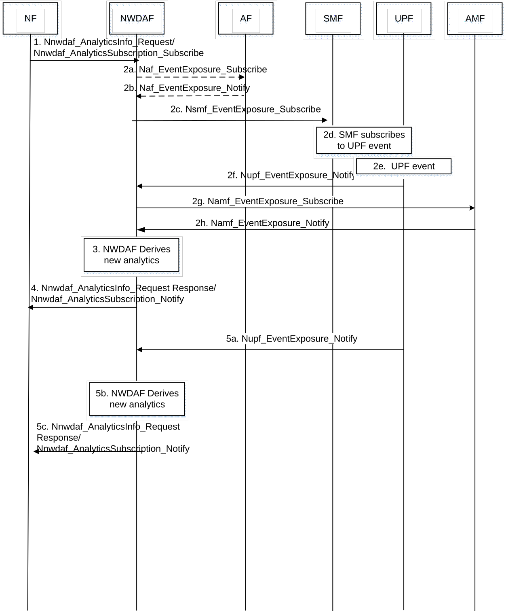

# 6.7.3 UE Communication Analytics

## 6.7.3.1 General

In order to support some optimized operations, e.g. customized mobility management, traffic routing handling, RFSP Index Management, QoS improvement or Inactivity Timer optimization, in 5GS, an NWDAF may perform data analytics on UE communication pattern and user plane traffic and provide the analytics results (i.e. UE communication statistics or prediction) to NFs in the 5GC or an AF.

An NWDAF supporting UE Communication Analytics collects per-application communication description from AFs. If consumer NF provides an Application ID, the NWDAF only considers the data from AF, SMF and UPF that corresponds to this application ID. NWDAF may also collect data from AMF.

The consumer of these analytics may indicate in the request:

\- Analytics ID = "UE Communication".

\- Target of Analytics Reporting: a single UE (SUPI) or group of UEs (a list of Internal-Group-Ids).

\- Analytics Filter Information optionally including:

\- S-NSSAI;

\- DNN;

\- Application ID;

\- Area of Interest.

\- an optional list of analytics subsets that are requested (see clause 6.7.3.3);

\- An Analytics target period indicates the time period over which the statistics or predictions are requested.

\- Preferred level of accuracy of the analytics.

\- Optional Preferred level of accuracy per analytics subset (see clause 6.7.3.3);

\- Optional preferred order of results for the list of UE Communications:

\- ordering criterion: "start time" or "duration",

\- order: ascending or descending;

\- Optionally, maximum number of objects;

\- Optionally, Spatial granularity size (if an Area of Interest is provided); and

\- In a subscription, the Notification Correlation Id and the Notification Target Address are included.

## 6.7.3.2 Input Data

The NWDAF supporting data analytics on UE communication shall be able to collect communication information for the UE from 5GC. The detailed information collected by the NWDAF includes service data related to UE communication as defined in the Table 6.7.3.2-1.

Table 6.7.3.2-1: Service Data from 5GC related to UE communication

<table>
<colgroup>
<col style="width: 29%" />
<col style="width: 10%" />
<col style="width: 60%" />
</colgroup>
<tbody>
<tr class="odd">
<td>Information</td>
<td>Source</td>
<td>Description</td>
</tr>
<tr class="even">
<td>UE ID</td>
<td>SMF, AF</td>
<td>SUPI in the case of SMF, external UE ID (i.e. GPSI) in the case of AF</td>
</tr>
<tr class="odd">
<td>Group ID</td>
<td>SMF, AF</td>
<td>
To identify UE group if available

Internal Group ID in the case of SMF, External Group ID in the case of AF
</td>
</tr>
<tr class="even">
<td>S-NSSAI</td>
<td>SMF</td>
<td>Information to identify a Network Slice</td>
</tr>
<tr class="odd">
<td>DNN</td>
<td>SMF</td>
<td>Data Network Name where PDU connectivity service is provided</td>
</tr>
<tr class="even">
<td>Application ID</td>
<td>SMF, AF</td>
<td>Identifying the application providing this information</td>
</tr>
<tr class="odd">
<td>Expected UE Behaviour parameters</td>
<td>AF</td>
<td>Same as Expected UE Behaviour parameters specified in TS 23.502 [3]</td>
</tr>
<tr class="even">
<td>UE communication (1..max)</td>
<td>UPF, AF</td>
<td>Communication description per application</td>
</tr>
<tr class="odd">
<td>&gt;Communication start</td>
<td></td>
<td>The time stamp that this communication starts</td>
</tr>
<tr class="even">
<td>&gt;Communication stop</td>
<td></td>
<td>The time stamp that this communication stops</td>
</tr>
<tr class="odd">
<td>&gt;UL data rate</td>
<td></td>
<td>UL data rate of this communication</td>
</tr>
<tr class="even">
<td>&gt;DL data rate</td>
<td></td>
<td>DL data rate of this communication</td>
</tr>
<tr class="odd">
<td>&gt;Traffic volume</td>
<td></td>
<td>Traffic volume of this communication</td>
</tr>
<tr class="even">
<td>Type Allocation code (TAC)</td>
<td>AMF</td>
<td>To indicate the terminal model and vendor information of the UE. The UEs with the same TAC may have similar communication behaviour. The UE whose communication behaviour is unlike other UEs with the same TAC may be an abnormal one.</td>
</tr>
<tr class="odd">
<td>UE locations (1..max)</td>
<td>AMF</td>
<td>UE positions</td>
</tr>
<tr class="even">
<td>&gt;UE location</td>
<td></td>
<td>TA or cells that the UE enters</td>
</tr>
<tr class="odd">
<td>&gt;Timestamp</td>
<td></td>
<td>A time stamp when the AMF detects the UE enters this location</td>
</tr>
<tr class="even">
<td>UE location trends</td>
<td>AMF</td>
<td>Metrics on UE locations.</td>
</tr>
<tr class="odd">
<td>PDU Session ID (1..max)</td>
<td>SMF</td>
<td>Identification of PDU Session.</td>
</tr>
<tr class="even">
<td>&gt; Inactivity detection time</td>
<td>SMF, UPF</td>
<td>Value of session inactivity timer.</td>
</tr>
<tr class="odd">
<td>&gt; PDU Session status</td>
<td>SMF</td>
<td>Status of the PDU Session (activated, deactivated).</td>
</tr>
<tr class="even">
<td>UE CM state</td>
<td>AMF</td>
<td>UE connection management state (e.g. CM-IDLE).</td>
</tr>
<tr class="odd">
<td>UE session behaviour trends</td>
<td>SMF</td>
<td>Metrics on UE state transitions (e.g. "PDU Session Establishment", "PDU Session Release").</td>
</tr>
<tr class="even">
<td>UE communication trends</td>
<td>SMF</td>
<td>Metrics on UE communications.</td>
</tr>
<tr class="odd">
<td>UE access behaviour trends</td>
<td>AMF</td>
<td>Metrics on UE state transitions (e.g. access, RM and CM states, handover).</td>
</tr>
</tbody>
</table>

Depending on the requested level of accuracy, data collection may be provided on samples (e.g. spatial subsets of UEs or UE group, temporal subsets of UE communication information).

The application Id is optional. If the application Id is omitted, the collected UE communication information can be applicable to all the applications for the UE.

## 6.7.3.3 Output Analytics

The NWDAF supporting UE Communication Analytics provides the analytics results to consumer NFs. The analytics results provided by the NWDAF include the UE communication statistics as defined in Table 6.7.3.3-1 or predictions as defined in Table 6.7.3.3-2.

Table 6.7.3.3-1: UE Communication Statistics

<table>
<colgroup>
<col style="width: 34%" />
<col style="width: 65%" />
</colgroup>
<tbody>
<tr class="odd">
<td>Information</td>
<td>Description</td>
</tr>
<tr class="even">
<td>UE group ID or UE ID</td>
<td>Identifies the UE(s) for which the statistic applies by a list of SUPIs, or a group of UEs by a list of Internal-Group-Ids defined in clause 5.9.7 of TS 23.501 [2].</td>
</tr>
<tr class="odd">
<td>UE communications (1..max) (NOTE 1)</td>
<td>List of communication time slots.</td>
</tr>
<tr class="even">
<td>&gt; Periodic communication indicator (NOTE 1)</td>
<td>Identifies whether the UE communicates periodically or not.</td>
</tr>
<tr class="odd">
<td>&gt; Periodic time (NOTE 1)</td>
<td>
Interval Time of periodic communication (average and variance) if periodic.

Example: every hour
</td>
</tr>
<tr class="even">
<td>&gt; Start time (NOTE 1)</td>
<td>Start time observed (average and variance)</td>
</tr>
<tr class="odd">
<td>&gt; Duration (NOTE 1)</td>
<td>Duration of communication (average and variance).</td>
</tr>
<tr class="even">
<td>&gt; Traffic characterization</td>
<td>S-NSSAI, DNN, ports, other useful information.</td>
</tr>
<tr class="odd">
<td>&gt; Traffic volume (NOTE 1)</td>
<td>Volume UL/DL (average and variance).</td>
</tr>
<tr class="even">
<td>&gt; Ratio</td>
<td>Percentage of UEs in the group (in the case of a UE group).</td>
</tr>
<tr class="odd">
<td>Applications (0..max) (NOTE 1)</td>
<td>List of applications in use.</td>
</tr>
<tr class="even">
<td>&gt; Application Id</td>
<td>Identification of the application.</td>
</tr>
<tr class="odd">
<td>&gt; Start time</td>
<td>Start time of the application.</td>
</tr>
<tr class="even">
<td>&gt; Duration time</td>
<td>Duration interval time of the application.</td>
</tr>
<tr class="odd">
<td>&gt; Occurrence ratio</td>
<td>Proportion for the application used by the UE during requested period.</td>
</tr>
<tr class="even">
<td>&gt; Spatial validity</td>
<td>Area where the service behaviour applies. If Area of Interest information was provided in the request or subscription, spatial validity may be a subset of the requested Area of Interest.</td>
</tr>
<tr class="odd">
<td>N4 Session ID (1..max) (NOTE 1) (NOTE 2)</td>
<td>Identification of N4 Session.</td>
</tr>
<tr class="even">
<td>&gt; Inactivity detection time</td>
<td>Value of session inactivity timer (average and variance).</td>
</tr>
<tr class="odd">
<td colspan="2">
NOTE 1: Analytics subset that can be used in "list of analytics subsets that are requested" and "Preferred level of accuracy per analytics subset".

NOTE 2: This analytics subset shall only be included if the consumer is SMF.
</td>
</tr>
</tbody>
</table>

Table 6.7.3.3-2: UE Communication Predictions

<table>
<colgroup>
<col style="width: 34%" />
<col style="width: 65%" />
</colgroup>
<tbody>
<tr class="odd">
<td>Information</td>
<td>Description</td>
</tr>
<tr class="even">
<td>UE group ID or UE ID</td>
<td>Identifies the UE(s) for which the statistic applies by a list of SUPIs, or a group of UEs by a list of Internal-Group-Ids defined in clause 5.9.7 of TS 23.501 [2].</td>
</tr>
<tr class="odd">
<td>UE communications (1..max) (NOTE 1)</td>
<td>List of communication time slots.</td>
</tr>
<tr class="even">
<td>&gt; Periodic communication indicator (NOTE 1)</td>
<td>Identifies whether the UE communicates periodically or not.</td>
</tr>
<tr class="odd">
<td>&gt; Periodic time (NOTE 1)</td>
<td>
Interval Time of periodic communication (average and variance) if periodic.

Example: every hour.
</td>
</tr>
<tr class="even">
<td>&gt; Start time (NOTE 1)</td>
<td>Start time predicted (average and variance).</td>
</tr>
<tr class="odd">
<td>&gt; Duration time (NOTE 1)</td>
<td>Duration interval time of communication.</td>
</tr>
<tr class="even">
<td>&gt; Traffic characterization</td>
<td>S-NSSAI, DNN, ports, other useful information.</td>
</tr>
<tr class="odd">
<td>&gt; Traffic volume (NOTE 1)</td>
<td>Volume UL/DL (average and variance).</td>
</tr>
<tr class="even">
<td>&gt; Confidence</td>
<td>Confidence of the prediction.</td>
</tr>
<tr class="odd">
<td>&gt; Ratio</td>
<td>Percentage of UEs in the group (in the case of a UE group).</td>
</tr>
<tr class="even">
<td>Applications (0..max) (NOTE 1)</td>
<td>List of applications in use.</td>
</tr>
<tr class="odd">
<td>&gt; Application Id</td>
<td>Identification of the application.</td>
</tr>
<tr class="even">
<td>&gt; Start time</td>
<td>Start time of the application.</td>
</tr>
<tr class="odd">
<td>&gt; Duration time</td>
<td>Duration interval time of the application.</td>
</tr>
<tr class="even">
<td>&gt; Occurrence probability</td>
<td>Probability the application will be used by the UE.</td>
</tr>
<tr class="odd">
<td>&gt; Spatial validity</td>
<td>Area where the service behaviour applies. If Area of Interest information was provided in the request or subscription, spatial validity may be a subset of the requested Area of Interest. If a Spatial granularity size was provided in the request or subscription, the number of elements of TAs or cells in the area is smaller than or equal to the Spatial granularity size.</td>
</tr>
<tr class="even">
<td>&gt; Confidence</td>
<td>Confidence of the prediction.</td>
</tr>
<tr class="odd">
<td>N4 Session ID (1..max) (NOTE 1) (NOTE 2)</td>
<td>Identification of N4 Session.</td>
</tr>
<tr class="even">
<td>&gt; Inactivity detection time</td>
<td>Value of session inactivity timer (average and variance).</td>
</tr>
<tr class="odd">
<td>&gt; Confidence</td>
<td>Confidence of the prediction.</td>
</tr>
<tr class="even">
<td colspan="2">
NOTE 1: Analytics subset that can be used in "list of analytics subsets that are requested" and "Preferred level of accuracy per analytics subset".

NOTE 2: This analytics subset shall only be included if the consumer is SMF.
</td>
</tr>
</tbody>
</table>

NOTE: When Target of Analytics Reporting is an individual UE, one UE ID (i.e. SUPI) will be included, the NWDAF will provide the analytics communication result (i.e. list of (predicted) communication time slots) to NF service consumer(s) for the UE.

The results for UE groups address the group globally. The ratio is the proportion of UEs in the group for a given communication at a given time and duration.

The number of UE communication entries (1..max) is limited by the maximum number of objects provided as part of Analytics Reporting Information. The communications shall be provided by order of time, possibly overlapping.

Depending on the list size limitation, the least probable communications on a given Analytics target period may not be provided.

## 6.7.3.4 Procedures

The NWDAF can provide UE communication related analytics, in the form of statistics or predictions or both, to a 5GC NF.

Figure 6.7.3.4-1: Procedure for UE communication analytics

1\. 5GC NF to NWDAF: Nnwdaf_AnalyticsSubscription_Subscribe (Analytics ID = UE communication, Target of Analytics Reporting=SUPI, Analytics Filter Information = (Application ID, Area of Interest, etc.)).

5GC NF sends a request to the NWDAF for analytics on a specific UE(s), using either Nnwdaf_AnalyticsInfo or Nnwdaf_AnalyticsSubscription_Subscribe service. The analytics type indicated by "Analytics ID" is set to "UE communication". The Target of Analytics Reporting is set to SUPI or an Internal Group Identifier and Analytics Filter may include Application ID and Area of Interest.

2a-b. NWDAF to AF (Optional): Naf_EventExposure_Subscribe (Event ID, external UE ID, Application ID, Area of Interest).

In order to provide the requested analytics, the NWDAF may subscribe per application communication information, which is identified by Application ID, from AFs for the UE. The Event ID "UE Communication information" as defined in TS 23.502 \[3\] is used, which indicates communication report for the UE which is requested by the 5GC NF in the step 1. The external UE ID is obtained by the NWDAF based on UE internal ID, i.e. SUPI. In the case of external AF, the NEF translates the requested Area of Interest into a list of geographic zone identifier(s) as described in clause 5.6.7.1 of TS 23.501 \[2\].

This step is skipped if the NWDAF already has the requested analytics available or has subscribed to the AF.

2c. NWDAF to SMF: Nsmf_EventExposure_Subscribe (Event ID, SUPI, Application ID).

In order to provide the requested analytics, the NWDAF subscribes via SMF to UPF information on SUPI, providing e.g. Indication of UPF Event Exposure Service and Target subscription UPF Event Id, Filter Information such as Application ID and/or Area of Interest. This is specified in clause 5.8.2.17 of TS 23.501 \[2\] and clause 4.15.4 of TS 23.502 \[3\].

2d. How SMF subscribes to on UPF is defined in clause 5.8.2.17 of TS 23.501 \[2\] and in clause 4.15.4 of TS 23.502 \[3\].

NOTE: The NWDAF request does not trigger any N4 session Establishment/Modification procedure. UPF sends N4 session level reports, including PDU session Inactivity to SMF, according to clause 4.4.2.2 of TS 23.502 \[3\].

2f. The UPF provides the requested input data to NWDAF. This is specified in clause 4.15.4 of TS 23.502 \[3\].

2g-h. NWDAF to AMF: Namf_EventExposure_Subscribe (Event ID, SUPI, Area of Interest).

In order to provide the requested analytics, the NWDAF retrieves one or more of Type Allocation code, UE connection management state, UE access behaviour trends and UE location trends from AMF.

NOTE: The NWDAF determines the SMF serving the UE as described in clause 6.2.2.1.

3\. The NWDAF derives requested analytics, in the form of UE communication statistics or predictions or both.

4\. NWDAF to 5GC NF: Nnwdaf_AnalyticsInfo_Request response or Nnwdaf_AnalyticsSubscription_Notify.

The NWDAF provides requested UE communication analytics to the NF, using either Nnwdaf_AnalyticsInfo_Request response or Nnwdaf_AnalyticsSubscription_Notify, depending on the service used in step 1.

5\. If the NF subscribed UE communication analytics at step 1, when, based e.g. on new UPF notifications the NWDAF generates new analytics, the NWDAF notifies the new generated analytics to the 5GC NF.
