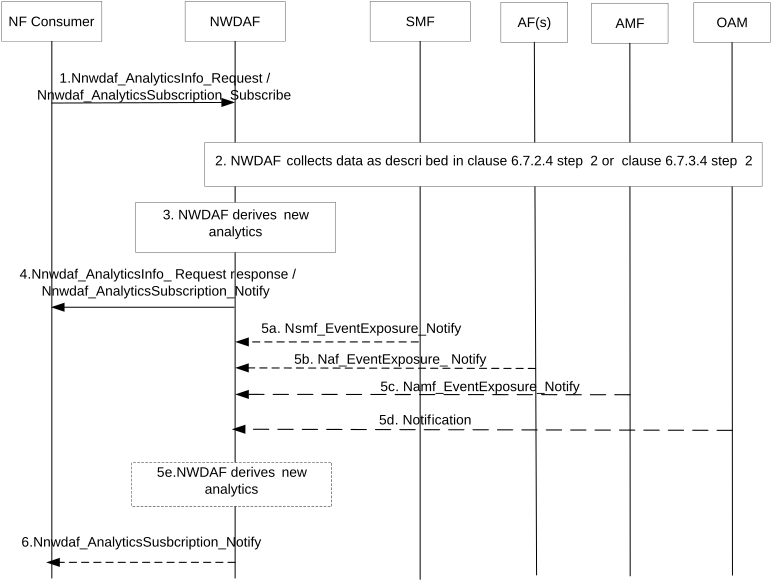

# 6.7.4 Expected UE behavioural parameters related network data analytics

## 6.7.4.1 General

The clause 6.7.4 defines how a service consumer learns from the NWDAF the expected UE behaviour parameters as defined in clause 4.15.6.3 of TS 23.502 \[3\] for a group of UEs or a specific UE.

The service consumer may be an NF (e.g. AMF, AF), or the OAM.

The consumer of these analytics shall indicate in the request:

\- Analytics ID = "UE Mobility" or "UE Communication".

\- Target of Analytics Reporting: a single UE (SUPI) or group of UEs (i.e. a list of Internal Group Ids).

NOTE: In the case of untrusted AF the Target of Analytics Reporting can be a GPSI or an External Group Identifier that is mapped in the 5GC to a SUPI or an Internal Group Identifier

\- An Analytics target period, which indicates the time period over which the statistics or predictions are requested.

\- Analytics Filter Information optionally including:

\- Area of Interest (AOI);

\- S-NSSAI;

\- DNN;

\- Application ID;

\- an optional list of analytics subsets that are requested (see clause 6.7.3.3).

\- Optional maximum number of objects.

\- In a subscription, the Notification Correlation Id and the Notification Target Address are included.

The NWDAF shall notify the result of the analytics to the consumer as indicated in clause 6.7.4.3.

## 6.7.4.2 Input Data

In order to produce "UE Mobility" analytics, the NWDAF collects UE mobility information, UE location trends and/or UE access behaviour trends, as defined in clause 6.7.2.2.

In order to produce "UE Communication" analytics, the NWDAF collects UE communication information, UE communication trends, UE session behaviour trends and/or UE access behaviour trends, as defined in clause 6.7.3.2.

## 6.7.4.3 Output Analytics

The analytics results for "UE Mobility" are specified in Table 6.7.2.3-1 and Table 6.7.2.3-2.

The analytics results for "UE Communication" are specified in Table 6.7.3.3-1 and Table 6.7.3.3-2.

## 6.7.4.4 Procedures

### 6.7.4.4.1 NWDAF-assisted expected UE behavioural analytics

Figure 6.7.4.4.1-1: NWDAF assisted expected UE behavioural analytics procedure

1\. 5GC NF (e.g. AMF, SMF and AF) to NWDAF: Nnwdaf_AnalyticsInfo_Request (Analytics ID, Target of Analytics Reporting, Analytics Filter Information) or Nnwdaf_AnalyticsSubscription_Subscribe (Analytics ID, Target of Analytics Reporting, Analytics Filter Information).

The Analytics ID is set to "UE Mobility" or to "UE Communication"," and the consumer request analytics.

2\. If Analytics ID is set to "UE Mobility", the NWDAF collects data from OAM, AMF and/or AF as specified in clause 6.7.2.4 step 2, unless the information is already available.

If Analytics ID is set to "UE Communication", the NWDAF collects data from AMF, SMF and/or AF as specified in clause 6.7.3.4 step 2, unless the information is already available.

3\. The NWDAF derives requested analytics.

4\. NWDAF to 5GC NF: Nnwdaf_AnalyticsInfo_Request response or Nnwdaf_AnalyticsSubscription_Notify.

The NWDAF provides requested Expected UE behaviour to the NF, using either Nnwdaf_AnalyticsInfo_Request response or Nnwdaf_AnalyticsSubscription_Notify, depending on the service used in step 1.

5-6. If the NF subscribed to at step 1, when the NWDAF generates new analytics, it provides the new generated analytics to the NF.
