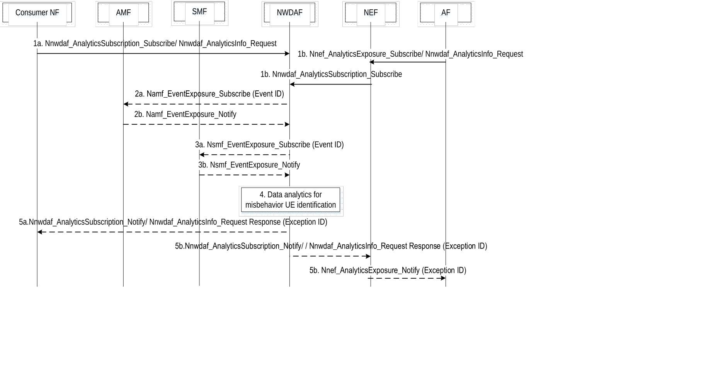

# 6.7.5 Abnormal behaviour related network data analytics

## 6.7.5.1 General

This clause defines how to identify a group of UEs or a specific UE with abnormal behaviour, e.g. being misused or hijacked, with the help of NWDAF.

NOTE 1: The misused or hijacked UEs are UEs in which there are malicious applications running or UEs which have been stolen.

The consumer of this analytics could be a 5GC NF. The 5GC NF subscribes analytics on abnormal behaviour from a NWDAF based on the UE subscription, network configuration or application layer request.

The NWDAF performs data analytics on abnormal behaviour if there is a related subscription and returns exception reports that result from the analysis of the correlations between behavioural variables. The exception reports contain an Exception Level expressed in the form of a scalar value, possibly supplemented by additional measurements.

The consumer of this analytics shall indicate in the request:

\- Analytics ID = "Abnormal behaviour";

\- Target of Analytics Reporting as defined in clause 6.1.3;

\- An Analytics target period indicates the time period over which the statistics or predictions are requested;

\- Analytics Filter Information optionally including:

\- expected UE behaviour parameters;

\- expected analytics type or list of Exception IDs with associated thresholds for the Exception Level, where the expected analytics type can be mobility related, communication related or both;

\- Area of interest;

\- Application ID;

\- DNN;

\- S-NSSAI.

NOTE 2: The expected analytics type generally indicates whether mobility or communication related abnormal behaviour analytics or both are expected by the consumer and the list of exception IDs indicates what specific analytics are expected by the consumer. Either the expected analytics type or the list of Exception IDs needs to be indicated, but they are not presented simultaneously. When the expected analytics type is indicated, the NWDAF performs corresponding abnormal behaviour analytics which are supported by the NWDAF. The relation between the expected analytics type and Exception IDs is defined in Table 6.7.5.1-1.

\- Optionally, maximum number of objects and maximum number of SUPIs;

\- In a subscription, the Notification Correlation Id and the Notification Target Address are included.

Table 6.7.5.1-1: Relation between expected analytics type and Exception IDs

|                         |                                                                                                                                             |
|-------------------------|---------------------------------------------------------------------------------------------------------------------------------------------|
| Expected analytics type | Exception IDs matching the expected analytics type                                                                                          |
| mobility related        | Unexpected UE location, Ping-ponging across neighbouring cells, Unexpected wakeup, Unexpected radio link failures.                          |
| communication related   | Unexpected long-live/large rate flows, Unexpected wakeup, Suspicion of DDoS attack, Wrong destination address, Too frequent Service Access. |

If the Target of Analytics Reporting is any UE, then the Analytics Filter should at least include:

\- Area of Interest or S-NSSAI, if the expected analytics type or the list of Exception IDs is mobility related.

\- Area of Interest, application ID, DNN or S-NSSAI, if the expected analytics type or the list of Exception IDs is communication related.

If the Target of Analytics Reporting is any UE, the consumer of this analytics shall request either mobility related only or communication related only abnormal behaviour analytics, but not both at the same time.

The expected UE behaviour parameters that the consumer can indicate in the request when known depend on the Exception ID that the consumer expects. They may encompass UE behaviour parameters as defined in clause 4.15.6.3 of TS 23.502 \[3\] and other parameters. Table 6.7.5.1-2 shows the mapping between each Exception ID and UE behaviour parameters.

Table 6.7.5.1-2: Description of Expected UE Behaviour parameters per Exception ID

<table>
<colgroup>
<col style="width: 46%" />
<col style="width: 53%" />
</colgroup>
<tbody>
<tr class="odd">
<td>Exception ID</td>
<td>UE behaviour parameters to provide</td>
</tr>
<tr class="even">
<td>Unexpected UE location</td>
<td>
Expected UE Moving Trajectory

Stationary Indication
</td>
</tr>
<tr class="odd">
<td>Unexpected long-live/large rate flows</td>
<td>
Periodic Time

Scheduled Communication Time

Communication Duration Time
</td>
</tr>
<tr class="even">
<td>Unexpected wakeup</td>
<td>
Periodic Time

Communication Duration Time

Scheduled Communication Time
</td>
</tr>
<tr class="odd">
<td>Suspicion of DDoS attack</td>
<td>
Periodic Time

Communication Duration Time

Scheduled Communication Time

Scheduled Communication Type

Traffic Profile

Expected transaction Dispersion
</td>
</tr>
<tr class="even">
<td>Too frequent Service Access</td>
<td>Periodic Time</td>
</tr>
<tr class="odd">
<td>Unexpected radio link failures</td>
<td>Expected UE Moving Trajectory</td>
</tr>
<tr class="even">
<td>Ping-ponging across neighbouring cells</td>
<td>
Expected UE Moving Trajectory

Stationary Indication
</td>
</tr>
</tbody>
</table>

When the NWDAF detects those UEs that deviate from the expected UE behaviour, e.g. unexpected UE location, abnormal traffic pattern, unexpected transaction dispersion amount, wrong destination address, etc. the NWDAF shall notify the result of the analytics to the consumer as specified in clause 6.7.5.3.

## 6.7.5.2 Input Data

The Exceptions information from AF is as specified in Table 6.7.5.2-1.

On request of the service consumer, the NWDAF shall collect and analyse UE behavioural information from the 5GC NFs (SMF, AMF, AF), or OAM as specified in clauses 6.7.2.2 and 6.7.3.2 and/or expected UE behavioural parameters from UDM as defined in clause 4.15.6.3, TS 23.502 \[3\], depending on Exception IDs.

NOTE: Care needs to be taken with regards to load by avoiding to cause major extra signalling when collecting data for any UE.

Table 6.7.5.2-1: Exceptions information from AF

|                                                                                                                                                                                                                                                           |                                                                                                                                                          |
|-----------------------------------------------------------------------------------------------------------------------------------------------------------------------------------------------------------------------------------------------------------|----------------------------------------------------------------------------------------------------------------------------------------------------------|
| Information                                                                                                                                                                                                                                               | Description                                                                                                                                              |
| IP address 5-tuple                                                                                                                                                                                                                                        | To identify a data flow of a UE via the AF (such as the Firewall or a Threat Intelligence Sharing platform)                                              |
| Exceptions (1..max) (NOTE 1)                                                                                                                                                                                                                              |                                                                                                                                                          |
| \>Exception ID                                                                                                                                                                                                                                            | Indicating the Exception ID (such as Unexpected long-live/large rate flows and Suspicion of DDoS attack as defined in Table 6.7.5.3-2) of the data flow. |
| \>Exception Level                                                                                                                                                                                                                                         | Scalar value indicating the severity of the abnormal behaviour.                                                                                          |
| \>Exception trend                                                                                                                                                                                                                                         | Measured trend (up/down/unknown/stable)                                                                                                                  |
| NOTE 1: The Exceptions information and the UE behavioural information as defined in clauses 6.7.2.2 and 6.7.3.2 could help NWDAF to train an Abnormal classifier, which could be used to classify a UE behaviour data into Normal behaviour or Exception. |                                                                                                                                                          |

## 6.7.5.3 Output Analytics

Corresponding to the "abnormal behaviour" Analytics ID, the analytics result provided by the NWDAF is defined in Table 6.7.5.3-1 and Table 6.7.5.3-2. When the level of an exception trespasses above or below the threshold, the NWDAF shall notify the consumer with the exception ID associated with the exception if the exception ID is within the list of exception IDs indicated by the consumer or matches the expected analytics type indicated by the consumer. The NWDAF shall provide the Exception Level and determine which of the other information elements to provide, depending on the observed exception.

Abnormal behaviour statistics information is defined in Table 6.7.5.3-1.

Table 6.7.5.3-1: Abnormal behaviour statistics

|                           |                                                                                                                  |
|---------------------------|------------------------------------------------------------------------------------------------------------------|
| Information               | Description                                                                                                      |
| Exceptions (1..max)       | List of observed exceptions                                                                                      |
| \> Exception ID           | The risk detected by NWDAF                                                                                       |
| \> Exception Level        | Scalar value indicating the severity of the abnormal behaviour                                                   |
| \> Exception trend        | Measured trend (up/down/unknown/stable)                                                                          |
| \> UE characteristics     | Internal Group Identifier, TAC                                                                                   |
| \> SUPI list (1..SUPImax) | SUPI(s) of the UE(s) affected with the Exception                                                                 |
| \> Ratio                  | Estimated percentage of UEs affected by the Exception within the Target of Analytics Reporting                   |
| \> Amount                 | Estimated number of UEs affected by the Exception (applicable when the Target of Analytics Reporting = "any UE") |
| \> Additional measurement | Specific information for each risk (see Table 6.7.5.3-3)                                                         |

Abnormal behaviour predictions information is defined in Table 6.7.5.3-2.

Table 6.7.5.3-2: Abnormal behaviour predictions

|                           |                                                                                                                  |
|---------------------------|------------------------------------------------------------------------------------------------------------------|
| Information               | Description                                                                                                      |
| Exceptions (1..max)       | List of predicted exceptions                                                                                     |
| \> Exception ID           | The risk detected by NWDAF                                                                                       |
| \> Exception Level        | Scalar value indicating the severity of the abnormal behaviour                                                   |
| \> Exception trend        | Measured trend (up/down/unknown/stable)                                                                          |
| \> UE characteristics     | Internal Group Identifier, TAC                                                                                   |
| \> SUPI list (1..SUPImax) | SUPI(s) of the UE(s) affected with the Exception                                                                 |
| \> Ratio                  | Estimated percentage of UEs affected by the Exception within the Target of Analytics Reporting                   |
| \> Amount                 | Estimated number of UEs affected by the Exception (applicable when the Target of Analytics Reporting = "any UE") |
| \> Additional measurement | Specific information for each risk (see Table 6.7.5.3-3)                                                         |
| \> Confidence             | Confidence of this prediction                                                                                    |

The predictions are provided with a Validity Period, as defined in clause 6.1.3.

The UE characteristics may provide a set of features common to all UEs affected with the exception.

The number of exceptions and the length of the SUPI list shall respectively be lower than the parameters maximum number of objects and Maximum number of SUPIs provided as part of Analytics Reporting Information.

If PCF subscribes to notifications on "Abnormal behaviour", the NWDAF shall send the PCF notifications about the risk, which may trigger the PCF to update the AM/SM policies.

The NWDAF also sends the notification directly to the AMF or SMF, if the AMF or SMF subscribes to the notification, so that the AMF or SMF may, based on operator local policies defined on a per S-NSSAI basis (for AMF) or on a per S-NSSAI, per DNN, or per (DNN,S-NSSAI) basis (for SMF), take actions for risk solving.

If the AF subscribes to notifications on "Abnormal behaviour", the NWDAF sends the notifications to the AF so that the AF may take actions for risk solving.

The following Table 6.7.5.3-3 gives examples of additional measurement provided by the NWDAF and examples of NF actions for solving each risk.

Table 6.7.5.3-3: Examples of additional measurements and NF actions for risk solving

<table>
<colgroup>
<col style="width: 22%" />
<col style="width: 31%" />
<col style="width: 46%" />
</colgroup>
<thead>
<tr class="header">
<th>Exception ID and description</th>
<th>Additional measurement</th>
<th>Actions of NFs</th>
</tr>
</thead>
<tbody>
<tr class="odd">
<td>Unexpected UE location</td>
<td>Unexpected UE location (TA or cells which the UE stays)</td>
<td>PCF may extend the Service Area Restrictions with current UE location. AMF may extend the mobility restriction with current UE location.</td>
</tr>
<tr class="even">
<td>Ping-ponging across neighbouring cells</td>
<td>Numbers, frequency, time and location information, assumption about the possible circumstances of the ping-ponging</td>
<td>
If the ping-ponging are per UE, then:

1. the AMF may adjust the UE (e.g. a stationary UE) registration area.

2. the AMF and/or the AF may allow the use of Coverage Enhancement for the affected UE.
</td>
</tr>
<tr class="odd">
<td>Unexpected long-live/large rate flows</td>
<td>Unexpected flow template (IP address 5 tuple)</td>
<td>
SMF updates the QoS rule, e.g. decrease the MBR for the related QoS flow.

PCF, if dynamic PCC applies for corresponding DNN, S-NSSAI, updates PCC Rules that triggers SMF updates the QoS rule, e.g. decrease the MBR for the related QoS flow.
</td>
</tr>
<tr class="even">
<td>Unexpected wakeup</td>
<td>Time of unexpected wake-up</td>
<td>AMF applies MM back-off timer to the UE.</td>
</tr>
<tr class="odd">
<td>Suspicion of DDoS attack</td>
<td>Victim's address (target IP address list)</td>
<td>
PCF may request SMF to release the PDU session.

SMF may release the PDU session and apply SM back-off timer.
</td>
</tr>
<tr class="even">
<td>Wrong destination address</td>
<td>Wrong destination address (target IP address list)</td>
<td>PCF updates the packet filter in the PCC Rules that triggers the SMF to update the related QoS flow and configures the UPF.</td>
</tr>
<tr class="odd">
<td>Too frequent Service Access</td>
<td>Volume, frequency, time, assumptions about the possible circumstances</td>
<td>
AF may release the AF session.

PCF may request SMF to release the PDU session.

SMF may release the PDU session and apply SM back-off timer.
</td>
</tr>
<tr class="even">
<td>Unexpected radio link failures</td>
<td>Numbers, frequency, time and location, assumptions about the possible circumstances</td>
<td>
If the unexpected radio link failures are per UE location bases, the AMF may allow the use of CE (Coverage Enhancement) in the affected location. Also, the Operator may improve the coverage conditions in the affected location.

If the unexpected radio link failures are per UE bases, then the AMF and/or the AF may allow the use of CE for the affected UE.
</td>
</tr>
</tbody>
</table>

## 6.7.5.4 Procedure

Figure 6.7.5.4-1: Procedure for NWDAF assisted misused or hijacked UEs identification

1a. A consumer NF subscribes to/requests NWDAF using Nnwdaf_AnalyticsSubscription_Subscribe/ Nnwdaf_AnalyticsInfo_Request (Analytics ID = Abnormal behaviour, Target of Analytics Reporting as defined in clause 6.1.3, Analytics Filter Information).

A consumer NF may subscribe to/request abnormal behaviour notification/response from NWDAF for a group of UEs, any UE or a specific UE. The Analytics ID indicates the NWDAF to identify misused or hijacked UEs through abnormal behaviour analytic.

1b. AF to NWDAF: Nnwdaf_AnalyticsSubscription_Subscribe or Nnwdaf_AnalyticsInfo_Request (Analytics ID, Target of Analytics Reporting as defined in clause 6.1.3, Analytics Filter Information).

For untrusted AFs, the AF sends the subscription via a NEF, where the AF invokes NEF service Nnef_AnalyticsExposure_Subscribe or Nnef_AnalyticsExposure_Fetch (Analytics ID, Target of Analytics Reporting = External-group-identifier, any UE or External UE ID, Analytics Filter Information).

An AF may also subscribe to/request abnormal behaviour notification/response from NWDAF for a group of UEs, a specific UE or any UE, where the subscription/request message may contain expected UE behaviour parameters identified on the application layer. If an External-Group-Identifier is provided by the AF, the NEF interrogates UDM to map the External-Group-Identifier to the Internal-Group-Identifier and obtain SUPI list corresponding to the Internal-Group-Identifier.

2\. \[Conditional\] NWDAF to AMF: Namf_EventExposure_Subscribe (Event ID(s), Event Filter(s), Internal-Group-Identifier, any UE or SUPI).

The NWDAF sends subscription requests to the related AMF to collect UE behavioural information if it has not subscribed such data.

NOTE 1: The NWDAF determines the related AMF(s) as described in clause 6.2.2.1.

The AMF sends event reports to the NWDAF based on the report requirements contained in the subscription request received from the NWDAF.

If requested by NWDAF via Event Filter(s), the AMF checks whether the UE's behaviour matches its expected UE behavioural information. In this case, the AMF sends event reports to the NWDAF only when it detects that the UE's behaviour deviated from its expected UE behaviour.

Depending on the Exception ID, the NWDAF may in addition perform data collection from OAM as specified in clause 6.2.3.2.

3\. \[Conditional\] NWDAF to SMF: Nsmf_EventExposure_Subscribe (Event ID(s), Event Filter(s), Internal-Group-Identifier, any UE or SUPI).

The NWDAF sends subscription requests to the related SMF(s) if it has not subscribed to such data.

NOTE 2: Besides Analytics Filter Information, other mechanisms such as setting maximum number of SUPIs and/ or using sampling ratio as part of Analytics Reporting Parameters as per Event Reporting Information (clause 4.15.1 of TS 23.502 \[3\]) can be used by the analytics consumer to limit signalling load, e.g. when the Target of Analytics Reporting is "any UE". The NWDAF can also use sampling ratio, possibly with partition criteria, when subscribing towards AMF and SMF.

NOTE 3: The NWDAF determines the related SMF(s) as described in clause 6.2.2.1.

The SMF sends event reports to the NWDAF based on the report requirements contained in the subscription request received from the NWDAF.

If requested by NWDAF via Event Filter(s), the SMF checks whether the UE's behaviour matches its expected UE behavioural information. In this case, the SMF sends event reports to the NWDAF only when it detects that the UE's behaviour deviated from its expected UE behaviour.

4\. The NWDAF performs data analytics for misused or hijacked UEs identification. Based on the analytics and operator's policies the NWDAF determines whether to send a notification to the consumer NF or AF.

5a. \[Conditional\] NWDAF to consumer NF (AMF or PCF or SMF depending on the subscription): Nnwdaf_AnalyticsSubscription_Notify or Nnwdaf_AnalyticsInfo_Request response (Analytics ID, Exception ID, Internal-Group-Identifier or SUPI, Exception level) (which is used depending on the service used in step 1a).

If the NWDAF determines to send a notification/response to the consumer 5GC NFs, the NWDAF invokes Nnwdaf_AnalyticsSubscription_Notify or Nnwdaf_AnalyticsInfo_Request response service operations. Based on the notification/response, the 5G NFs adopt configured actions to resolve/mitigate/avoid the risks as described in the Table 6.7.5.3-1.

5b. \[Conditional\] NWDAF to AF: Nnwdaf_AnalyticsSubscription_Notify or Nnwdaf_AnalyticsInfo_Request response (Analytics ID, Exception ID, External UE ID, Exception level) (which is used depending on the service used in step 1b).

If the NWDAF determines to send a notification/response to the consumer AF, the NWDAF needs to include external UE ID of the identified UE into the notification/response message.

NOTE 3: Based on the notification, the AF can adopt corresponding actions, e.g. adjusting recommended TCP Window Size, adjusting recommended Service Start and End.

NOTE 4: The call flow only shows a subscribe-notify model for the interaction of NWDAF and consumer NF for simplicity instead of both request-response model and subscription-notification model.
