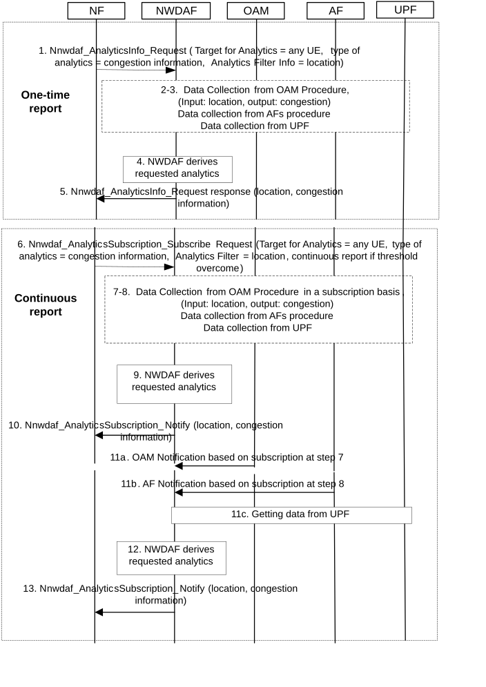
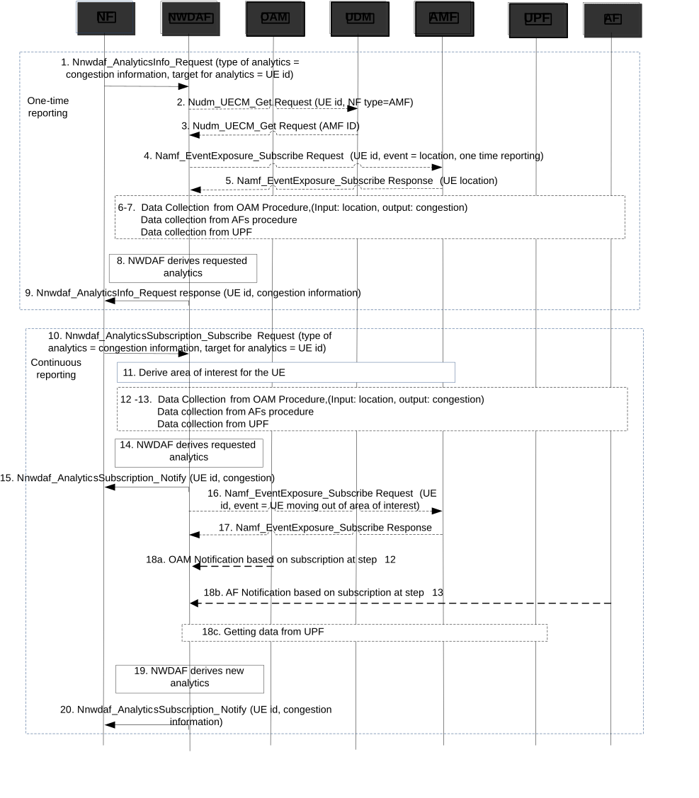

# 6.8 User Data Congestion Analytics

## 6.8.1 General

The NWDAF can provide user data congestion related analytics, by one-time reporting or continuous reporting, in the form of statistics or predictions or both, to another NF. User Data Congestion related analytics can relate to congestion experienced while transferring user data over the control plane or user plane or both. A request for user data congestion analytics relates to a specific area or to a specific user. If the consumer of these analytics provides a UE ID, the NWDAF determines the area where the UE is located. The NWDAF then collects measurements per cell and uses the measurements to determine user data congestion analytics.

The request for user data congestion related analytics indicates the location area information where congestion related analytics is desired or indicates a UE Identity that can be used by the NWDAF to determine the location area information where congestion related analytics is desired. When requesting user data congestion, the consumer may request the identifiers of the applications that contribute the most to the traffic in the area. The consumer may indicate how many applications should be reported by providing the maximum number of applications in the request or subscription.

When the consumer of user data congestion related analytics subscribes to user data congestion related analytics, it may indicate a threshold and the NWDAF will provide analytics to the consumer when the congestion level crosses the threshold. The consumer can indicate an S-NSSAI in the request when congestion analytics are needed on a per slice level.

The service consumer may be an NF (e.g. NEF, AF, PCF).

The consumer of these analytics may indicate in the request or subscription the following parameters, its content is described in the clause 6.1.3:

\- Analytics ID = "User Data Congestion";

\- Target of Analytics Reporting: either a single UE (SUPI), or "any UE";

NOTE: The Target of Analytics Reporting set to "any UE" applies when user data congestion analytics relates to a specific Area of Interest.

\- Analytics Filter Information:

\- Area of Interest (i.e. list of TAIs or Cell IDs) which restricts the area in focus (mandatory if Target of Analytics Reporting is set to "any UE", optional otherwise);

\- an optional list of analytics subsets that are requested, (see clause 6.8.3);

\- Optional S-NSSAI, in order to obtain congestion analytics only on a given slice;

\- Optional Reporting Threshold, which applies only for subscriptions and indicates conditions on the congestion level (Network Status Indication, see clause 6.8.3) to be reached in order to be notified by the NWDAF.

\- Preferred level of accuracy of the analytics;

\- Preferred order of results for the list of User Data Congestion statistics or predictions:

\- ordering by Applicable Time Window, chronological or reverse chronological order; or

\- ordering by Network Status Indication, ascending or descending;

\- Optional maximum number of objects;

\- An Analytics target period indicates the time period over which the statistics or prediction are requested, either in the past or in the future;

\- Optionally, Temporal granularity size; and

\- In a subscription, the Notification Correlation Id and the Notification Target Address are included.

The NWDAF notifies the result of the analytics to the consumer as indicated in clause 6.8.3.

## 6.8.2 Input data

The detailed information collected by the NWDAF is defined in Table 6.8.2-1.

NOTE 1: Performance Measurements defined in TS 28.552 \[8\] represent resource utilisation but do not, by themselves, indicate the event of congestion or congestion levels. The NWDAF collects measurements from the OAM and how the NWDAF derives Network Status Indication (NSI) is not specified.

Table 6.8.2-1: Data Collected from the NF and OAM related to User Data Congestion Analytics

| Information  | Source | Description                                                                                                                                                                                                                                                                                                                                                                                                                                                                          |
|--------------|--------|--------------------------------------------------------------------------------------------------------------------------------------------------------------------------------------------------------------------------------------------------------------------------------------------------------------------------------------------------------------------------------------------------------------------------------------------------------------------------------------|
| UE Location  | AMF    | UE location information that NWDAF can use to derive the Area of Interest.                                                                                                                                                                                                                                                                                                                                                                                                           |
| Measurements | OAM    | Performance Measurements that will be used by the NWDAF to determine congestion levels. Performance Measurements are related to information transfer over the user plane and/or the control plane (e.g. UE Throughput, DRB Setup Management, RRC Connection Number, PDU Session Management and Radio Resource Utilization as defined in TS 28.552 \[8\]). The NWDAF may obtain measurements by invoking management services that are defined in TS 28.532 \[6\] and TS 28.550 \[7\]. |

Table 6.8.2-2: Data Collected from the UPF or from the AF related to User Data Congestion Analytics

<table>
<colgroup>
<col style="width: 14%" />
<col style="width: 15%" />
<col style="width: 69%" />
</colgroup>
<thead>
<tr class="header">
<th>Information</th>
<th>Source</th>
<th>Description</th>
</tr>
</thead>
<tbody>
<tr class="odd">
<td>Application ID</td>
<td>UPF or AF</td>
<td>Application identifier as defined in clause 5.8.2 of TS 23.501 [2] (see NOTE 1).</td>
</tr>
<tr class="even">
<td>IP Packet Filter Set</td>
<td>UPF or AF</td>
<td>IP Packet Filter set as defined in clause 5.8.2 of TS 23.501 [2] (see NOTE 1).</td>
</tr>
<tr class="odd">
<td>Measurement period</td>
<td>UPF or AF</td>
<td>Measurement period.</td>
</tr>
<tr class="even">
<td>Throughput UL/DL</td>
<td>UPF or AF</td>
<td>Average Throughput UL/DL over the measurement period.</td>
</tr>
<tr class="odd">
<td>Throughput UL/DL (peak)</td>
<td>UPF or AF</td>
<td>Peak Throughput UL/DL over the measurement period.</td>
</tr>
<tr class="even">
<td>Timestamp</td>
<td>UPF or AF</td>
<td>Time when measurements are taken.</td>
</tr>
<tr class="odd">
<td>Achieved sampling ratio</td>
<td>UPF</td>
<td>Sampling ratio achieved by UPF (see NOTE 2).</td>
</tr>
<tr class="even">
<td colspan="3">
NOTE 1: Application Id and IP Packet Filter Set are mutually exclusive.

NOTE 2: UPF may apply data sampling to reduce the load on the UPF. This parameter is provided when no sampling ratio is configured at the UPF or the UPF could not fulfil the configured sampling ratio.

NOTE 3: Multiple outputs are provided by the UPF when multiple Service Data Flows are running at the UPF for the same UE and measurement period.
</td>
</tr>
</tbody>
</table>

NOTE 2: Care needs to be taken with regards to load and major signalling caused when requesting "any UE". This can be achieved via utilization of event filters (e.g. Area of Interest), Analytics Reporting Information (e.g. maximum number of objects), or preferred sampling ratio provided by NWDAF to the UPF and/or local UPF configuration of data collection for specific application IDs, Packet Filter Sets and/or PFDs.

Additionally, NWDAF may use statistics or predictions on service experience as specified in clause 6.4.3 as an input, e.g. for service experience in a given area or service experience for some specific applications such as high bandwidth applications.

## 6.8.3 Output analytics

The NWDAF outputs the user data congestion analytics for transfer over the user plane, for transfer over the control plane, or for both. The output may consist of statistics, predictions, or both. The detailed information provided by the NWDAF is defined in Table 6.8.3-1 for statistics and in Table 6.8.3-2 for predictions.

Table 6.8.3-1: User Data Congestion statistics

<table>
<colgroup>
<col style="width: 26%" />
<col style="width: 73%" />
</colgroup>
<thead>
<tr class="header">
<th>Information</th>
<th>Description</th>
</tr>
</thead>
<tbody>
<tr class="odd">
<td>Area of Interest</td>
<td>A list of TAIs or Cell IDs</td>
</tr>
<tr class="even">
<td>List of user data congestion Analytics (1..max)</td>
<td>List of user data congestion Analytics. See NOTE 5.</td>
</tr>
<tr class="odd">
<td>&gt; Type</td>
<td>User Plane or Control Plane</td>
</tr>
<tr class="even">
<td>&gt; Applicable Time Window</td>
<td>The time period that the analytics applies to. If a Temporal granularity size was provided in the request or subscription, the duration of the Applicable Time Window is greater than or equal to the Temporal granularity size.</td>
</tr>
<tr class="odd">
<td>&gt; Network Status Indication</td>
<td>Congestion Level</td>
</tr>
<tr class="even">
<td>&gt; List of top applications in UL (0..NU) (NOTE 1, NOTE 4)</td>
<td>The list of applications that contribute the most to the traffic in the UL direction.</td>
</tr>
<tr class="odd">
<td>&gt;&gt; Application ID</td>
<td>Application identifier as defined in clause 5.8.2 of TS 23.501 [2] (see NOTE 2).</td>
</tr>
<tr class="even">
<td>&gt;&gt; IP Packet Filter Set</td>
<td>IP Packet Filter set as defined in clause 5.8.2 of TS 23.501 [2] (see NOTE 2).</td>
</tr>
<tr class="odd">
<td>&gt;&gt; Percentage</td>
<td>The application's throughput as a percentage of the total throughput in the Area of Interest.</td>
</tr>
<tr class="even">
<td>&gt; List of top applications in DL (0..ND) (NOTE 1, NOTE 4)</td>
<td>The list of applications that contribute the most to the traffic in the DL direction.</td>
</tr>
<tr class="odd">
<td>&gt;&gt; Application ID</td>
<td>Application identifier as defined in clause 5.8.2 of TS 23.501 [2] (see NOTE 2)</td>
</tr>
<tr class="even">
<td>&gt;&gt; IP Packet Filter Set</td>
<td>IP Packet Filter set as defined in clause 5.8.2 of TS 23.501 [2] (see NOTE 2).</td>
</tr>
<tr class="odd">
<td>&gt;&gt; Percentage</td>
<td>The application's throughput as a percentage of the total throughput in the Area of Interest.</td>
</tr>
<tr class="even">
<td colspan="2">
NOTE 1: This information element is an Analytics subset that can be used in "list of analytics subsets that are requested".

NOTE 2: Application Id and IP Packet Filter Set are mutually exclusive.

NOTE 3: The listed applications are not necessarily ranked by any order of traffic contribution.

NOTE 4: This information element relates to congestion experienced while transferring user data over the user plane.

NOTE 5: The number of user data congestion analytics entries is limited by the maximum number of objects provided as part of Analytics Reporting Information.
</td>
</tr>
</tbody>
</table>

Table 6.8.3-2: User Data Congestion predictions

<table>
<colgroup>
<col style="width: 26%" />
<col style="width: 73%" />
</colgroup>
<thead>
<tr class="header">
<th>Information</th>
<th>Description</th>
</tr>
</thead>
<tbody>
<tr class="odd">
<td>Area of Interest</td>
<td>A list of TAIs or Cell IDs.</td>
</tr>
<tr class="even">
<td>List of user data congestion Analytics (1..max)</td>
<td>List of user data congestion Analytics. See NOTE 5.</td>
</tr>
<tr class="odd">
<td>&gt; Type</td>
<td>User Plane or Control Plane.</td>
</tr>
<tr class="even">
<td>&gt; Applicable Time Window</td>
<td>The time period that the analytics applies to. If a Temporal granularity size was provided in the request or subscription, the duration of the Applicable Time Window is greater than or equal to the Temporal granularity size.</td>
</tr>
<tr class="odd">
<td>&gt; Network Status Indication</td>
<td>Congestion Level.</td>
</tr>
<tr class="even">
<td>&gt; Confidence</td>
<td>Confidence of this prediction.</td>
</tr>
<tr class="odd">
<td>&gt; List of top applications in UL (0..NU) (NOTE 1, NOTE 4)</td>
<td>The list of applications predicted to contribute most of the traffic in the UL direction.</td>
</tr>
<tr class="even">
<td>&gt;&gt; Application ID</td>
<td>Application identifier as defined in clause 5.8.2 of TS 23.501 [2] (see NOTE 2).</td>
</tr>
<tr class="odd">
<td>&gt;&gt; IP Packet Filter Set</td>
<td>IP Packet Filter set as defined in clause 5.8.2 of TS 23.501 [2] (see NOTE 2).</td>
</tr>
<tr class="even">
<td>&gt;&gt; Percentage</td>
<td>The application's throughput as a percentage of the total throughput in the Area of Interest.</td>
</tr>
<tr class="odd">
<td>&gt;&gt; Confidence</td>
<td>Confidence of this prediction.</td>
</tr>
<tr class="even">
<td>&gt; List of top applications in DL (0..ND) (NOTE 1, NOTE 4)</td>
<td>The list of applications predicted to contribute most of the traffic in the DL direction.</td>
</tr>
<tr class="odd">
<td>&gt;&gt; Application ID</td>
<td>Application identifier as defined in clause 5.8.2 of TS 23.501 [2] (see NOTE 2).</td>
</tr>
<tr class="even">
<td>&gt;&gt; IP Packet Filter Set</td>
<td>IP Packet Filter set as defined in clause 5.8.2 of TS 23.501 [2] (see NOTE 2).</td>
</tr>
<tr class="odd">
<td>&gt;&gt; Percentage</td>
<td>The application's throughput as a percentage of the total throughput in the Area of Interest.</td>
</tr>
<tr class="even">
<td>&gt;&gt; Confidence</td>
<td>Confidence of this prediction.</td>
</tr>
<tr class="odd">
<td colspan="2">
NOTE 1: This information element is an Analytics subset that can be used in "list of analytics subsets that are requested".

NOTE 2: Application Id and IP Packet Filter Set are mutually exclusive.

NOTE 3: The listed applications are not necessarily ranked by any order.

NOTE 4: This information element relates to congestion experienced while transferring user data over the user plane.

NOTE 5: The number of user data congestion analytics entries is limited by the maximum number of objects provided as part of Analytics Reporting Information.
</td>
</tr>
</tbody>
</table>

The following list shows the applicability of the analytics subsets per consumer:

\- Analytics subset "List of top applications in UL (0..NU)" and "List of top applications in DL (0..ND)" are applicable to any consumer (e.g. PCF, AF, NEF), The NWDAF decides if these Analytics subset is provided to an AF.

## 6.8.4 Procedures

### 6.8.4.1 Procedure for one-time or continuous reporting of analytics for user data congestion in a geographic area

The procedure as depicted in Figure 6.8.4.1-1 is used by an NF to retrieve congestion analytics for a specific geographic area. The procedure can be used to request a one-time or continuous reporting of congestion analytics.

Figure 6.8.4.1-1: Procedure for one-time or continuous reporting of analytics for congestion in a geographic area

For one-time reporting:

1\. The NF sends Nnwdaf_AnalyticsInfo_Request to NWDAF, indicating request for analytics for congestion in a specific location. The NF can request statistics or predictions or both. The Analytics ID is set to "User Data Congestion" for transfer over user plane, control plane, or both, the Target of Analytics Reporting is set to "any UE" and Analytics Filter Information set to include a location (e.g. ECGI, TA) and an indication to provide the list of applications that contribute the most to the traffic.

2-3. If the request is authorized and in order to provide the requested analytics, the NWDAF may request the measurement information for the requested location from OAM services following the data collection from OAM procedure as captured in 6.2.3.2. If the NWDAF already has information about the requested location, these steps are omitted. The NWDAF may obtain measurements by invoking management services that are defined in TS 28.532 \[6\] and TS 28.550 \[7\].

If the request is to provide the list of applications that contribute the most to the traffic, then the NWDAF collects input data from the AF for the applications being served by AF(s) by invoking Naf_EventExposure_Subscribe service or Nnef_EventExposure_Subscribe (if via NEF) or collected from the UPF or collected from both, AF and UPF.

4\. The NWDAF derives requested analytics.

5\. The NWDAF provides the analytics for congestion to the NF.

For continuous reporting:

6\. The NF sends Nnwdaf_AnalyticsSubscription_Subscribe Request to the NWDAF, indicating request for analytics for congestion in a specific location (e.g. ECGI, TA), possibly with thresholds and including an indication to provide the list of applications that contribute the most to the traffic. The NF can request statistics or predictions or both. The type of analytics is set to user data congestion analytics for transfer over user plane, control plane, or both.

7-8. The NWDAF subscribes to OAM services following the data collection from OAM procedure as captured in 6.2.3.2 to get measurement information for the requested location, possibly providing measurement thresholds for example, data congestion crossing values. The NWDAF may obtain measurements by invoking management services that are defined in TS 28.532 \[6\] and TS 28.550 \[7\]. If a request is to provide the list of applications that contribute the most to the traffic, the NWDAF subscribes to the service data from AF by invoking Naf_EventExposure_Subscribe service or Nnef_EventExposure_Subscribe (if via NEF) or from the UPF or from both.

9\. The NWDAF derives requested analytics.

10\. The NWDAF provides the analytics for congestion to the NF.

11a. A change of user data congestion status corresponding to crossing a threshold set by the NWDAF at steps 7-8 is detected by OAM and notified to NWDAF.

11b. The AF notifies the NWDAF with the input data as defined in table 6.8.2-2.

11c. The UPF provides the NWDAF with the input data as defined in table 6.8.2-2.

NOTE: How the data from UPF is retrieved (subscribed to on UPF and notified then by UPF) is defined in clause 5.8.2.17 of 23.501 \[2\] and in clause 4.15.4 of TS 23.502 \[3\].

12\. The NWDAF derives new analytics.

13\. The NWDAF provides a notification for analytics for the user data congestion to the NF.

### 6.8.4.2 Procedure for one-time or continuous reporting of analytics for user data congestion for a specific UE

The procedure as depicted in Figure 6.8.4.2-1 is used by an NF to retrieve user data congestion analytics for a specific UE. The procedure can be used to request a one-time or continuous reporting of user data congestion analytics.

Figure 6.8.4.2-1: Procedure for one-time or continuous reporting of analytics for congestion for a specific UE

For one-time reporting:

1\. The NF sends Nnwdaf_AnalyticsInfo_Request to NWDAF, requesting for analytics for user data congestion for a specific UE id. The NF can request statistics or predictions or both. The type of analytics is set to user data congestion analytics for transfer over user plane, control plane, or both, the Target of Analytics Reporting is set to UE id.

2-5. The NWDAF may already know the UE location. If not, the NWDAF checks the UE location by first retrieving the AMF serving the UE (steps 2-3) and then by interrogating the AMF about the UE location.

NOTE 1: The NF sends a request for a UE that is registered, so that NWDAF can retrieve the UE location.

6-7. The NWDAF requests measurement information for the UE location from OAM services (as captured in 6.2.3.2). These steps are omitted if the NWDAF already has the information. The NWDAF may obtain measurements by invoking management services that are defined in TS 28.532 \[6\] and TS 28.550 \[7\].

If the request is to provide the list of applications that contribute the most to the traffic, then the NWDAF collects the input data from the UPF serving the UE location, or from the AF(s) by invoking Naf_EventExposure_Subscribe service or Nnef_EventExposure_Subscribe (if via NEF) or collects input data from both, AF and UPF. The input data is defined in Table 6.8.2-2.

8\. The NWDAF derives requested analytics.

9\. The NWDAF provides the analytics for congestion to the NF.

For continuous reporting:

10\. The NF sends Nnwdaf_AnalyticsSubscription_Subscribe Request to the NWDAF. The NF can request for statistics or for predictions or for both. The type of analytics is set to user data congestion analytics for transfer over user plane, control plane, or both.

11\. The NWDAF determines the UE location, either via internal information or by applying the same steps as steps 2 to 5. The NWDAF then determines an area of interest.

12-13. The NWDAF subscribes to OAM services (as captured in 6.2.3.2) to get the measurement information for the UE location, possibly providing measurement thresholds. The NWDAF may obtain measurements by invoking management services that are defined in TS 28.532 \[6\] and TS 28.550 \[7\].

If the request is to provide the list of applications that contribute the most to the traffic, then the NWDAF collects input data from the UPF serving the UE location or from the AF(s) by invoking Naf_EventExposure_Subscribe service or Nnef_EventExposure_Subscribe (if via NEF) or collects from both, AF and UPF. The input data is defined in Table 6.8.2-2.

14\. The NWDAF derives requested analytics.

15\. The NWDAF provides the analytics for user data congestion status information to the NF.

16-17. The NWDAF subscribes to UE mobility event notification in order to be informed when the UE moves out of the area of interest (in order to define a new area of interest and request new information to OAM if the UE moves to a different area).

18a. A change of user data congestion status corresponding to crossing a threshold set by the NWDAF is detected by OAM and notified to NWDAF.

18b. The AF notifies the NWDAF with the input data as defined in table 6.8.2-2.

18c. The UPF provides the NWDAF with the input data as defined in table 6.8.2-2.

NOTE 2: How the data from UPF is retrieved (subscribed to on UPF and notified then by UPF) is defined in clause 5.8.2.17 of TS 23.501 \[2\] and in clause 4.15.4 of TS 23.502 \[3\].

19\. The NWDAF derives new analytics.

20\. The NWDAF provides a notification for analytics for the user data congestion status information to the NF.
