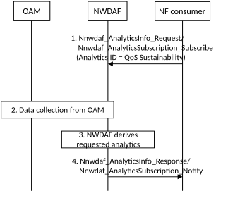
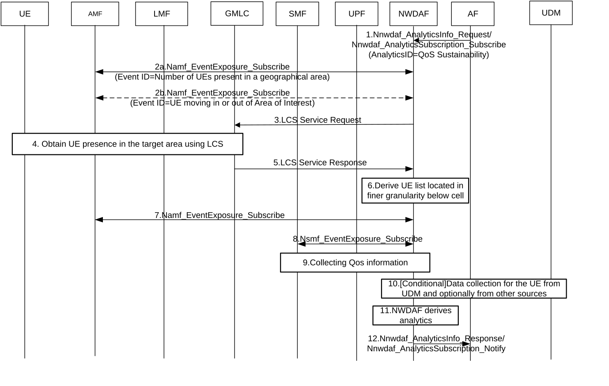

# 6.9 QoS Sustainability Analytics

## 6.9.1 General

The consumer of QoS Sustainability analytics may request the NWDAF analytics information regarding the QoS change statistics for an Analytics target period in the past in a certain area or the likelihood of a QoS change for an Analytics target period in the future in a certain area. The consumer can request either to subscribe to notifications (i.e. a Subscribe-Notify model) or to a single notification (i.e. a Request-Response model).

The service consumer may be a NF (e.g. AF).

The request includes the following parameters:

\- Analytics ID = "QoS Sustainability";

\- Target of Analytics Reporting: any UE;

\- Analytics Filter Information:

\- QoS requirements (mandatory):

\- 5QI (standardized or pre-configured) and applicable additional QoS parameters and the corresponding values (conditional, i.e. it is needed for GBR 5QIs to know the GFBR); or

\- the QoS Characteristics attributes including Resource Type, PDB, PER and their values;

\- Location information (mandatory): an Area Of Interest or a path of interest. The location information could reflect a list of waypoints:

\- if the location information is an Area Of Interest, the area can be either described in a coarse granularity as list of TAIs or Cell IDs, or in a fine granularity as geographical area (that can be smaller than a cell), or both (coarse and fine granularity); if both granularities are provided, the NWDAF understands that the area of interest is the intersection between the fine granularity location and the list of TAIs or Cell IDs.

\- if the location information is a path of interest, the area can be either described in a coarse granularity as list of TAIs or Cell IDs, or in a fine granularity as a list of waypoints (expressed as longitude and latitude in geographical coordinates) and combined with a radius value, or both (coarse and fine granularity); if both granularities are provided, the NWDAF understands that the path of interest is the intersection between the fine granularity location and the list of TAIs or Cell IDs.

\- Threshold linear distance: The distance travelled by the UE before reporting subsequent location as described in TS 23.273 \[39\].

NOTE 1: Threshold linear distance is used by the NWDAF when requesting location of the UE from the GMLC using LCS.

NOTE 2: In this Release, the consumer of the "QoS Sustainability" Analytics ID will provide location information in the area of interest format (TAIs or Cell IDs or geographical area) which is understandable by NWDAF.

NOTE 3: When location information is described as an area of interest in a fine granularity (i.e. as geographical area that can be smaller than a cell) the Cell ID(s) can already be determined by the NEF based on its local configuration and provided to the NWDAF in addition. This addresses the scenario when Cell ID(s) cannot be determined by the NWDAF based on its local configuration. Alternatively, the NWDAF can also be configured with the Cell ID(s) corresponding to an area of interest in a fine granularity.

\- S-NSSAI (optional);

\- Optional maximum number of objects;

\- Optional UE Device and Context Information: which may contain one or more of the following:

\- Speed range, which is a range of UE speeds for which analytics is requested, where the speed range is indicated as a range of Velocity Estimate, as in clause 6.1.6.2.17 of TS 29.572 \[37\];

\- Device information, which may contain one of the following:

\- List of equipment types, according to clause 8.0 of GSMA TS.06 \[38\].

\- Analytics target period: relative time interval, either in the past or in the future, that indicates the time period for which the QoS Sustainability analytics is requested;

\- Optionally, Spatial granularity size and Temporal granularity size;

\- Reporting Threshold(s), which apply only for subscriptions and indicate conditions on the level to be reached for the reporting of the analytics, i.e. to discretize the output analytics and to trigger the notification when the threshold(s) provided in the analytics subscription are crossed by the expected QoS KPIs.

\- A matching direction may be provided such as crossed (default value), below, or above.

\- An acceptable deviation from the threshold level in the non-critical direction (i.e. in which the QoS is improving) may be set to limit the amount of signalling.

The level(s) relate to value(s) of the QoS KPIs defined in TS 28.554 \[10\], for the relevant 5QI:

\- for a 5QI of GBR resource type, the Reporting Threshold(s) refer to the QoS flow Retainability KPI;

\- for a 5QI of non-GBR resource type, the Reporting Threshold(s) refer to the RAN UE Throughput KPI and/or delay in RAN KPI as defined in TS 28.554 \[10\].

\- In a subscription, the Notification Correlation Id and the Notification Target Address.

To derive the QoS Sustainability analytics when the location information is an area of interest with coarse granularity (i.e. TAIs or Cell IDs):

\- The NWDAF collects the corresponding statistics information on the QoS KPI for the relevant 5QI of interests from the OAM, i.e. the QoS flow Retainability or the RAN UE Throughput or delay in RAN as defined in TS 28.554 \[10\] and average GTP metrics as defined in TS 28.552 \[8\].

To derive the QoS Sustainability analytics when the location information is an area of interest with fine granularity (i.e. geographical area that can be smaller than a cell):

\- The NWDAF derives the UE list for the area of interest with fine granularity by two steps, firstly based on an initial selection of the UE list in the corresponding coarse area from AMF, secondly based on finer granularity location data using LCS as described in clause 6.2.12, e.g. NWDAF can collect finer granularity location data of a UE using LCS and identify whether this UE is inside of the area of interest with fine granularity area, input data as defined in Table 6.9.2-2.

\- The NWDAF can then collect the corresponding UE level information on the QoS KPI for the relevant 5QI of interests from the 5GC NF/OAM, i.e. input data as defined in Table 6.9.2-2.

\- NWDAF derives QoS sustainability statistics or predictions for the area of interest with fine granularity by averaging these input data for all the UEs that are in the UE list.

To improve QoS Sustainability analytics, the NWDAF may additionally collect GTP metrics defined in Table 6.9.2-3.

If the Analytics target period refers to the past:

\- The NWDAF verifies whether the triggering conditions for the notification of QoS change statistics are met and if so, generates for the consumer one or more notifications.

\- The analytics feedback contains the information on the location and the time for the QoS change statistics and the Reporting Threshold(s) that were crossed.

If the Analytics target period is in the future:

\- The NWDAF detects the need for notification about a potential QoS change based on comparing the expected values for the KPI of the target 5QI against the Reporting Threshold(s) provided by the consumer in any cell in the requested area for the requested Analytics target period. The expected KPI values are derived from the statistics for the 5QI obtained from OAM. OAM information may also include planned or unplanned outages detection and other information that is not in scope for 3GPP to discuss in detail.

\- The analytics feedback contains the information on the location and the time when a potential QoS change may occur and what Reporting Threshold(s) may be crossed.

## 6.9.2 Input data

To derive the QoS Sustainability analytics for a path of interest or for an area of interest with coarse granularity (i.e. TAIs or Cell IDs), the input data is listed in Table 6.9.2-1.

Table 6.9.2-1: Data collection for "QoS Sustainability" analytics

|                        |                      |                                                                                                                                                                                                               |
|------------------------|----------------------|---------------------------------------------------------------------------------------------------------------------------------------------------------------------------------------------------------------|
| Information            | Source               | Description                                                                                                                                                                                                   |
| RAN UE Throughput      | OAM TS 28.554 \[10\] | Average UE bitrate in the cell (Payload data volume on RLC level per elapsed time unit on the air interface, for transfers restricted by the air interface), per timeslot, per cell, per 5QI and per S-NSSAI. |
| QoS flow Retainability | OAM TS 28.554 \[10\] | Number of abnormally released QoS flows during the time the QoS Flows were used per timeslot, per cell, per 5QI and per S-NSSAI.                                                                              |
| Delay in RAN           | OAM TS 28.554 \[10\] | Average Uplink and downlink packet transmission delay through RAN part to the UE, per timeslot, per cell, per 5QI and per S-NSSAI.                                                                            |

NOTE 1: The timeslot is the time interval split according to the time unit of the OAM statistics defined by operator.

To derive the QoS Sustainability analytics for an area of interest with fine granularity (i.e. geographical area that can be smaller than a cell), additional input data is listed in Table 6.9.2-2.

Table 6.9.2-2: UE level data collection for "QoS Sustainability" analytics with fine granularity

|                                                                                        |                           |                                                                                            |
|----------------------------------------------------------------------------------------|---------------------------|--------------------------------------------------------------------------------------------|
| Information                                                                            | Source                    | Description                                                                                |
| Timestamp                                                                              | LCS (NOTE 1)              | A time stamp associated with the collected information.                                    |
| UE ID                                                                                  | LCS, AMF (NOTE 1)         | (list of) SUPI(s).                                                                         |
| Finer granularity location data                                                        | LCS (NOTE 1)              | UE position in the area of interest.                                                       |
| Speed                                                                                  | LCS (NOTE 1)              | Current UE speed.                                                                          |
| SMF info                                                                               | AMF                       | SMF address for the SMF serving the UE                                                     |
| UPF info                                                                               | SMF                       | Address for the UPF serving the UE.                                                        |
| 5QI                                                                                    | SMF                       | 5G QoS Identifier.                                                                         |
| PEI                                                                                    | UDM                       | Permanent Equipment Identifier, as described in clause 5.9.3 of 1 23.501 \[2\].            |
| Equipment type                                                                         | GSMA IMEI database or OAM | Equipment Type such as smartphone, tablet, dongle, etc. as described in GSMA TS.06 \[38\]. |
| NOTE 1: The procedure to collect location data using LCS is described in clause 6.2.12 |                           |                                                                                            |

NOTE 2: How to use the input data from GSMA for QoS Sustainability analytics is up to NWDAF implementation.

Additionally, the NWDAF collects the following input (Table 6.9.2-3) according to measurements defined in clause 5.33.3 QoS Monitoring to Assist URLLC Service of TS 23.501 \[2\] and IP-layer section capacity definition from ITU-T Y.1540 \[40\] between UE, NG-RAN and UPF at GTP level. The UL/DL available GTP capacity between UPF and UE will also be used as inputs for the QoS Sustainability analytics. The NWDAF calculates this value by implementation, e.g. by subtracting the UL/DL traffic volume from the maximum value of the GTP capacity.

Table 6.9.2-3: Data collection for QoS Sustainability analytics at GTP level

<table>
<colgroup>
<col style="width: 25%" />
<col style="width: 16%" />
<col style="width: 58%" />
</colgroup>
<thead>
<tr class="header">
<th>Information</th>
<th>Source</th>
<th>Description</th>
</tr>
</thead>
<tbody>
<tr class="odd">
<td>UL/DL packet delay GTP</td>
<td>OAM TS 28.552 [8] (NOTE)</td>
<td>UL/DL packet delay measurement round trip on GTP path on N3 for non-GBR traffic.</td>
</tr>
<tr class="even">
<td>UL/DL capacity GTP between UPF and NG-RAN</td>
<td>
OAM

TS 28.552 [8]

TS 28.554 [10]
</td>
<td>Maximum achievable UL/DL capacity measurement from UPF to NG-RAN based on GTP path. The capacity measurement corresponds to the IP-layer section capacity definition from ITU‑T Y.1540 [40]. It also corresponds to the descriptions in clause 5.1 (DL GTP Capacity) and clause 5.4 (UL GTP Capacity) of TS 28.552 [8] and clause 6.3 of TS 28.554 [10].</td>
</tr>
<tr class="odd">
<td>UL/DL capacity GTP between UPF and UE</td>
<td>
OAM

TS 28.552 [8]

TS 28.554 [10]
</td>
<td>Maximum achievable UL/DL capacity measurement from UE to UPF based on GTP path. The capacity measurement corresponds to the IP-layer section capacity definition from ITU‑T Y.1540 [40]. It also corresponds to the descriptions in clause 5.4 of TS 28.552 [8] and clause 6.3 of TS 28.554 [10].</td>
</tr>
<tr class="even">
<td colspan="3">NOTE: Refer to clause 5.1 of TS 28.552 [8] for the performance measurement in NG-RAN and clause 5.4 of TS 28.552 [8] for the performance measurement in UPF. In addition, Annex A of TS 28.552 [8] describes various performance measurements, especially, clause A.61 "Monitoring of one way delay between PSA UPF and NG-RAN" indicates that the measurements on the one way DL and UL delay between PSA UPF and NG-RAN can be used to evaluate and optimize the DL and UL user plane delay performance between 5GC and NG-RAN.</td>
</tr>
</tbody>
</table>

## 6.9.3 Output analytics

The NWDAF outputs the QoS Sustainability analytics. Depending on the Analytics target period, the output consists of statistics or predictions. The detailed information provided by the NWDAF is defined in Table 6.9.3-1 for statistics and Table 6.9.3-2 for predictions.

Table 6.9.3-1: "QoS Sustainability" statistics

| Information                                                                                                                                                                                                                                                                                                                                                                       | Description                                                                                                                                                                                                                                                                                                                               |
|-----------------------------------------------------------------------------------------------------------------------------------------------------------------------------------------------------------------------------------------------------------------------------------------------------------------------------------------------------------------------------------|-------------------------------------------------------------------------------------------------------------------------------------------------------------------------------------------------------------------------------------------------------------------------------------------------------------------------------------------|
| List of QoS sustainability Analytics (1..max)                                                                                                                                                                                                                                                                                                                                     |                                                                                                                                                                                                                                                                                                                                           |
| \>Applicable Area (NOTE 1)                                                                                                                                                                                                                                                                                                                                                        | A list of TAIs or Cell IDs or a geographical area in a fine granularity (e.g. smaller than a cell) within the Location information that the analytics applies to. If a Spatial granularity size was provided in the request or subscription, the number of elements of the list is smaller than or equal to the Spatial granularity size. |
| \>Applicable Time Period                                                                                                                                                                                                                                                                                                                                                          | The time period within the Analytics target period that the analytics applies to. If a Temporal granularity size was provided in the request or subscription, the duration of the Applicable Time Period is greater than or equal to the Temporal granularity size.                                                                       |
| \>Crossed Reporting Threshold(s)                                                                                                                                                                                                                                                                                                                                                  | The Reporting Threshold(s) that are met or exceeded or crossed by the statistics value or the expected value of the QoS KPI.                                                                                                                                                                                                              |
| NOTE 1: The Applicable Area may be described as geographical area in a fine granularity (e.g. smaller than a cell) within the Location information when the location information is an area of interest with finer granularity or a path of interest expressed with a list of waypoints and a radius value. How to determine the geographical area is up to NWDAF implementation. |                                                                                                                                                                                                                                                                                                                                           |

Table 6.9.3-2: "QoS Sustainability" predictions

| Information                                                                                                                                                                                                                                                                                                                                                                       | Description                                                                                                                                                                                                                                                                                                                               |
|-----------------------------------------------------------------------------------------------------------------------------------------------------------------------------------------------------------------------------------------------------------------------------------------------------------------------------------------------------------------------------------|-------------------------------------------------------------------------------------------------------------------------------------------------------------------------------------------------------------------------------------------------------------------------------------------------------------------------------------------|
| List of QoS sustainability Analytics (1..max)                                                                                                                                                                                                                                                                                                                                     |                                                                                                                                                                                                                                                                                                                                           |
| \>Applicable Area (NOTE 1)                                                                                                                                                                                                                                                                                                                                                        | A list of TAIs or Cell IDs or a geographical area in a fine granularity (e.g. smaller than a cell) within the Location information that the analytics applies to. If a Spatial granularity size was provided in the request or subscription, the number of elements of the list is smaller than or equal to the Spatial granularity size. |
| \>Applicable Time Period                                                                                                                                                                                                                                                                                                                                                          | The time period within the Analytics target period that the analytics applies to. If a Temporal granularity size was provided in the request or subscription, the duration of the Applicable Time Period is greater than or equal to the Temporal granularity size.                                                                       |
| \>Crossed Reporting Threshold(s)                                                                                                                                                                                                                                                                                                                                                  | The Reporting Threshold(s) that are met or exceeded or crossed by the statistics value or the expected value of the QoS KPI.                                                                                                                                                                                                              |
| \>Confidence                                                                                                                                                                                                                                                                                                                                                                      | Confidence of the prediction.                                                                                                                                                                                                                                                                                                             |
| NOTE 1: The Applicable Area may be described as geographical area in a fine granularity (e.g. smaller than a cell) within the Location information when the location information is an area of interest with finer granularity or a path of interest expressed with a list of waypoints and a radius value. How to determine the geographical area is up to NWDAF implementation. |                                                                                                                                                                                                                                                                                                                                           |

NOTE 1: The meaning of Confidence is based on the SLA, i.e. the consumer has to understand the meaning of the different values of Confidence.

NOTE 2: The Analytics can contain multiple sets of the above information if the location information reflected a list of waypoints.

The number of QoS sustainability analytics entries is limited by the maximum number of objects provided as part of Analytics Reporting Information.

## 6.9.4 Procedures

### 6.9.4.1 Procedure for Qos Sustainability in a coarse granularity area

Figure 6.9.4.1-1 depicts a procedure for "QoS Sustainability" analytics in a coarse granularity area provided by NWDAF.

The NWDAF shall not activate the measurements for QoS Monitoring. If QoS Monitoring is already activated, the measurements will be triggered according to QoS Monitoring procedures (see clause 5.33.3 of TS 23.501 \[2\]).

Figure 6.9.4.1-1: "QoS Sustainability" analytics provided by NWDAF in a coarse granularity area

1\. The consumer requests or subscribes to analytics information on "QoS Sustainability" provided by NWDAF. The parameters included in the request are described in clause 6.9.1.

The consumer may include multiple sets of parameters in order to provide different combinations of "Location information" and "Analytics target period" when requesting QoS Sustainability analytics.

2\. The NWDAF collects the data specified in clause 6.9.2 from the OAM, following the procedure captured in clause 6.2.3.2.

3\. The NWDAF verifies whether the triggering conditions are met and derives the requested analytics. The NWDAF can detect the need for notification based on comparing the requested analytics of the target 5QI against the Reporting Threshold(s) provided by consumer in any cell over the requested Analytics target period.

4\. The NWDAF provides response or notification on "QoS Sustainability" to the consumer.

### 6.9.4.2 Procedure for QoS Sustainability in a fine granularity area

Figure 6.9.4.2-1: Procedure for "QoS Sustainability" analytics in a fine granularity area

1\. The NF consumer requests or subscribes to analytics information on "QoS Sustainability" provided by the NWDAF. The parameters included in the request are defined in clause 6.9.1 of TS 23.288 \[5\]. The NF can request statistics or predictions or both.

The consumer provides the "Location information" as defined in clause 6.9.1 when requesting QoS Sustainability analytics. If the AF doesn't provide TAIs or Cell IDs, the NWDAF as an 5GC internal NF needs to determine which cells are related to the fine granularity area.

The consumer may optionally provide UE Context or Subscription information such as one or more of the following: device speed or speed range, IMEI or IMEISV or TAC range, equipment type.

2a. If the request is authorized and in order to provide the requested analytics, the NWDAF decides the AMF(s) based on the TAIs/Cell IDs and obtains the UE list in the TAs/Cells from AMF by invoking Namf_EventExposure_Subscribe service operation using event ID "Number of UEs present in a geographical area" as described in TS 23.502 \[3\].

2b. The NWDAF invokes Namf_EventExposure_Subscribe service operation to get the update of the UE list using event ID "UE moving in or out of Area of Interest" as described in TS 23.502 \[3\].

3\. The NWDAF obtains location information using LCS by initiating the LCS Service Request to the GMLC to get the location and optionally the speed of UEs from UE list provided by the AMF in step 2.

4\. The GMLC initiates the UE location service procedure and gets the location of the UEs as described in TS 23.273 \[39\].

5\. The GMLC provides location information for each UE in the UE list to the NWDAF.

6\. From the list of UE locations returned by the GMLC, the NWDAF identifies the UEs located in fine granularity area by comparing the UEs' locations to the fine granularity area, provided in step 1.

7\. The NWDAF invokes Namf_EventExposure_Subscribe service operation to get the serving SMF for the UE.

8\. Based on the serving SMF in step 7, the NWDAF invokes Nsmf_EventExposure_Subscribe service operation to get the UPF information and 5QI for the UE.

9\. The NWDAF may collect QoS information either from the UPF directly, or subscribe to the UPF via the SMF. The QoS information may include the bandwidth, packet delay for the UE and the information on the serving UPF node id.

NOTE 1: How the data from UPF is retrieved (subscribed to on UPF and notified then by UPF) is defined in clause 5.8.2.17 of 23.501 \[2\] and in clause 4.15.4 of TS 23.502 \[3\].

10\. Optionally, the NWDAF may collect additional information for the UE Context or UE Subscription from the UDM such as PEI (if available). PEI may be used to retrieve, from GSMA database, additional information such as IMEI or IMEISV or TAC range, equipment type. Such additional information may be used by NWDAF to add more information to the collected measurements and filter those measurements that are applicable to the UE Device and Context Information for which analytics are requested by the service consumer.

11\. The NWDAF verifies whether the triggering conditions are met and derives the requested analytics. The NWDAF can detect the need for notification based on comparing the requested analytics of the target 5QI against the Reporting Threshold(s) provided by the consumer in any cell over the requested Analytics target period.

12\. The NWDAF provides the response or notification on "QoS Sustainability" to the NF consumer.

NOTE 2: NWDAF may decide to ignore some of the filters if collected measurements are not sufficient to derive meaningful analytics.

NOTE 3: In order to reduce the amount of information collected per measurement point, the additional information from UDM may only be collected for the events of GBR unfulfillment. In this way the additional analytics filter information may only be supported for 5QI of resource type GBR and for events of GBR unfulfillment.
