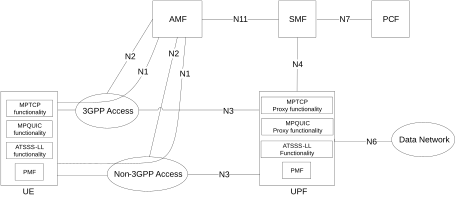
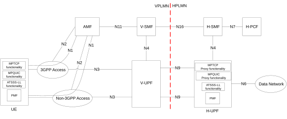
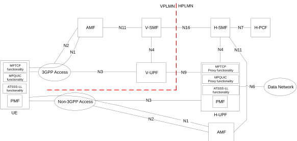

# 4.2.10 Architecture Reference Model for ATSSS Support

In order to support the ATSSS feature, the 5G System Architecture is extended as shown in Figure 4.2.10-1, Figure 4.2.10-2 and Figure 4.2.10-3. The additional functionality that is supported by the UE and the network functions shown in these figures is specified in clause 5.32 below. In summary:

\- The UE supports one or more of the steering functionalities specified in clause 5.32.6, i.e. the MPTCP functionality, the MPQUIC functionality and the ATSSS-LL functionality. Each steering functionality in the UE enables traffic steering, switching and splitting across 3GPP access and non-3GPP access, in accordance with the ATSSS rules provided by the network. The ATSSS-LL functionality is mandatory in the UE for MA PDU Session of type Ethernet.

\- The UPF may support the MPTCP Proxy functionality, which communicates with the MPTCP functionality in the UE by using the MPTCP protocol (IETF RFC 8684 \[81\]), as defined in clause 5.32.6.2.1.

\- The UPF may support the MPQUIC Proxy functionality, which communicates with the MPQUIC functionality in the UE by using the QUIC protocol (RFC 9000 \[166\], RFC 9001 \[167\], RFC 9002 \[168\]) and its multipath extensions (draft-ietf-quic-multipath \[174\]), as defined in clause 5.32.6.2.2.

\- The UPF may support ATSSS-LL functionality, which is similar to the ATSSS-LL functionality defined for the UE. There is no user plane protocol defined between the ATSSS-LL functionality in the UE and the ATSSS-LL functionality in the UPF.

NOTE 1: ATSSS-LL functionality is needed in the 5GC for MA PDU Session of type Ethernet.

\- In addition, the UPF supports Performance Measurement Functionality (PMF), which may be used by the UE to obtain access performance measurements (see clause 5.32.5) over the user-plane of 3GPP access and/or over the user-plane of non-3GPP access.

\- The AMF, SMF and PCF are extended with new functionality that is further discussed in clause 5.32.

Figure 4.2.10-1: Non-roaming and Roaming with Local Breakout architecture for ATSSS support

NOTE 2: The interactions between the UE and PCF that may be required for ATSSS control are specified in TS 23.503 \[45\].

NOTE 3: The UPF shown in Figure 4.2.10-1 can be connected via an N9 reference point, instead of the N3 reference point.

Figure 4.2.10-2 shows the 5G System Architecture for ATSSS support in a roaming case with home-routed traffic and when the UE is registered to the same VPLMN over 3GPP and non-3GPP accesses. In this case, the MPTCP Proxy functionality, the MPQUIC Proxy functionality, the ATSSS-LL functionality and the PMF are located in the H-UPF.

Figure 4.2.10-2: Roaming with Home-routed architecture for ATSSS support (UE registered to the same VPLMN)

Figure 4.2.10-3 shows the 5G System Architecture for ATSSS support in a roaming case with home-routed traffic and when the UE is registered to a VPLMN over 3GPP access and to HPLMN over non-3GPP access (i.e. the UE is registered to different PLMNs). In this case, the MPTCP Proxy functionality, the MPQUIC Proxy functionality, the ATSSS-LL functionality and the PMF are located in the H-UPF.

Figure 4.2.10-3: Roaming with Home-routed architecture for ATSSS support (UE registered to different PLMNs)
