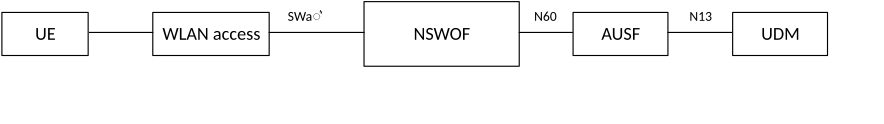
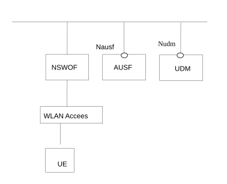
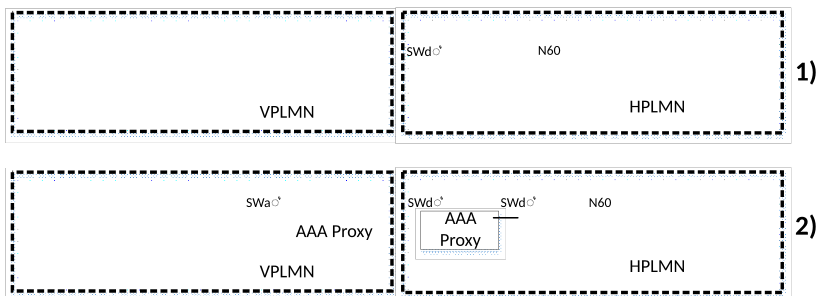
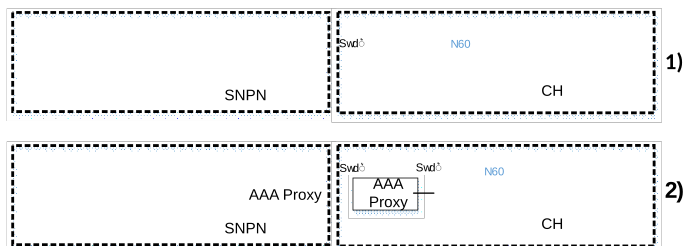
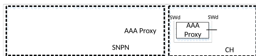
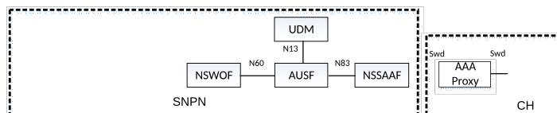
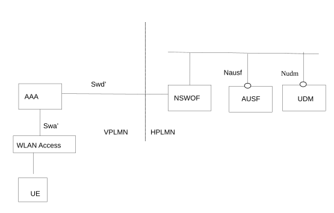
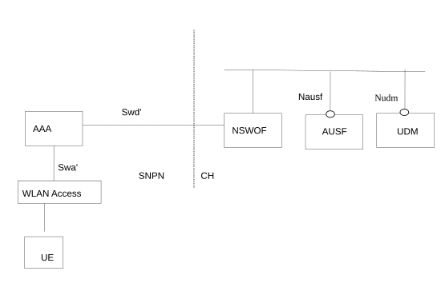
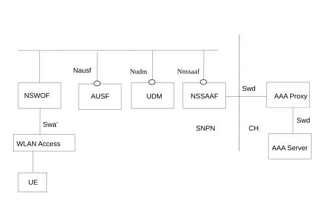

# 4.2.15 Architecture to support WLAN connection using 5G credentials without 5GS registration

The reference architecture shown with reference point representation in Figure 4.2.15-1 and with Service Based Interface (SBI)-representation in Figure 4.2.15-2, enables a UE to connect to a WLAN access network using its 5GS credentials without registration to 5GS. This architecture is based on the Non-Seamless WLAN Offload Function (NSWOF), which interfaces to the WLAN access network using the SWa' reference point and interfaces to the AUSF using the Nausf SBI. The SWa' reference point corresponds to SWa reference point as defined in TS 23.402 \[43\] with the difference that SWa' the EAP procedure ensures that the permanent user ID is not visible over the access as defined in TS 33.501 \[29\] and that SWa' connects the Untrusted non-3GPP IP Access, possibly via 3GPP AAA Proxy, to the NSWOF and that the EAP user ID is a SUCI and not an IMSI.

The functionality of the NSWOF and the procedures applied for supporting a WLAN connection using 5GS credentials for Non-seamless WLAN offload are further defined in TS 33.501 \[29\] Annex S. The roaming architectures are shown with reference point representation in Figure 4.2.15-3 and with SBI representation in Figure 4.2.15-4. The architecture in Figure 4.2.15-1 and Figure 4.2.15-2 applies to UEs with PLMN or SNPN credentials.

NOTE 1: For a UE with SNPN credentials it is assumed that the realm part of UE identifier in SUCI format is defined in a way that enables routing of SWa requests from the WLAN AN to the NSWOF in the SNPN's 5GC.

The architectures in Figure 4.2.15-3a and Figure 4.2.15-4a apply to UEs with PLMN or SNPN credentials from a CH using UDM.

The architecture in Figure 4.2.15-3b applies to UEs with SNPN credentials from a CH using AAA Server. In this architecture the UE procedures for access selection for 5G NSWO defined in clause 6.3.12b apply. Except the UE, all NFs in Figure 4.2.15-3b are out of scope of 3GPP.

The architectures in Figure 4.2.15-3c and Figure 4.2.15-4b apply to UEs with SNPN credentials from a CH using AAA Server via 5GC (NSWOF/AUSF/UDM/NSSAAF). In this architecture the UE procedures for access selection for 5G NSWO defined in clause 6.3.12b apply.

NOTE 2: How to protect the user identity over the WLAN interface in architecture defined in Figure 4.2.15-3b and Figure 4.2.15-3c is defined in TS 33.501 \[29\].

The UE can also connect to a WLAN access network using 5GS credentials by performing the 5GS registration via Trusted non-3GPP access procedure defined in clause 4.12a.2.2 of TS 23.502 \[3\]. With this procedure, the UE connects to a WLAN access network using 5GS credentials and simultaneously registers in 5GS. However, the architecture defined in Figure 4.2.15-1, Figure 4.2.15-2, Figure 4.2.15-3 and in Figure 4.2.15-4, enables a UE to connect to a WLAN access network using 5GS credentials but without registration in 5GS.

If the WLAN is configured as Untrusted Non-3GPP access, in the case that the WLAN supports IEEE 802.1x, the UE may first use the 5G NSWO procedure to obtain a connection with and the local IP address from the WLAN and any time after that, the UE may initiate the Untrusted Non-3GPP Access to obtain the access to 5GC.

Figure 4.2.15-1: Reference architecture to support authentication for Non-seamless WLAN offload in 5GS

Figure 4.2.15-2: Service based reference architecture to support authentication for Non-seamless WLAN offload in 5GS

Figure 4.2.15-3: Roaming reference architectures to support authentication for Non-seamless WLAN offload in 5GS

Figure 4.2.15-3a: Reference architectures to support authentication for Non-seamless WLAN offload using credentials from Credentials Holder using UDM

Figure 4.2.15-3b: Reference architecture to support authentication for Non-seamless WLAN offload using credentials from Credentials Holder using AAA Server

Figure 4.2.15-3c: Reference architecture to support authentication for Non-seamless WLAN offload using credentials from Credentials Holder using AAA Server via 5GC

NOTE 2: Configuration 2) in Figure 4.2.15-3 and Figure 4.2.15-3a is a deployment variant of configuration 1)

Figure 4.2.15-4: Service based Roaming reference architecture to support authentication for Non-seamless WLAN offload in 5GS

The SWd' reference point corresponds to the SWd reference point as defined in TS 23.402 \[43\] with the difference that SWd' connects the 3GPP AAA Proxy, possibly via intermediate 3GPP AAA Proxy, to the NSWOF and that the EAP user ID is a SUCI and not an IMSI.

In both roaming and non-roaming scenarios, the NSWOF acts towards the WLAN Access as a 3GPP AAA server, with the difference that the EAP user ID is a SUCI and not an IMSI.

Figure 4.2.15-4a: Service based reference architecture to support authentication for Non-seamless WLAN offload using credentials from Credentials Holder using UDM

Figure 4.2.15-4b: Service based reference architecture to support authentication for Non-seamless WLAN offload using credentials from Credentials Holder using AAA Server via 5GC
