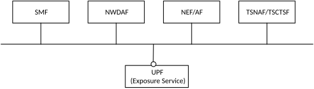

# 4.2.16 Architecture to support User Plane Information Exposure via a service-based interface

As depicted in Figure 4.2.16-1, the 5G System architecture allows user plane information exposure to some NFs via service-based interface in UPF.

Figure 4.2.16-1: Architecture to support User Plane Information Exposure via a service-based interface

NOTE 1: In this Release of the specification, only NWDAF/DCCF/MFAF, NEF/AF and TSNAF/TSCTSF are considered as the receiver of the UPF event notifications.

NOTE 2: UPF information exposure is not restricted to SBI interface, i.e. reporting via PFCP over N4 to SMF is still applicable.

Not all events can be subscribed to UPF directly. The details and constraints for the subscription to UPF event exposure service (i.e. direct vs. indirect) and the information exposed to certain NFs by UPF, as well as the information contained in the event notifications, are defined in clause 5.2.26.2 of TS 23.502 \[3\] and clause 5.8.2.17.
