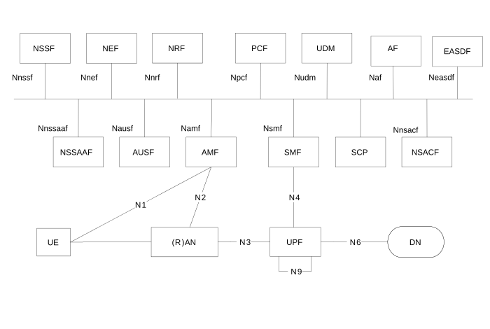
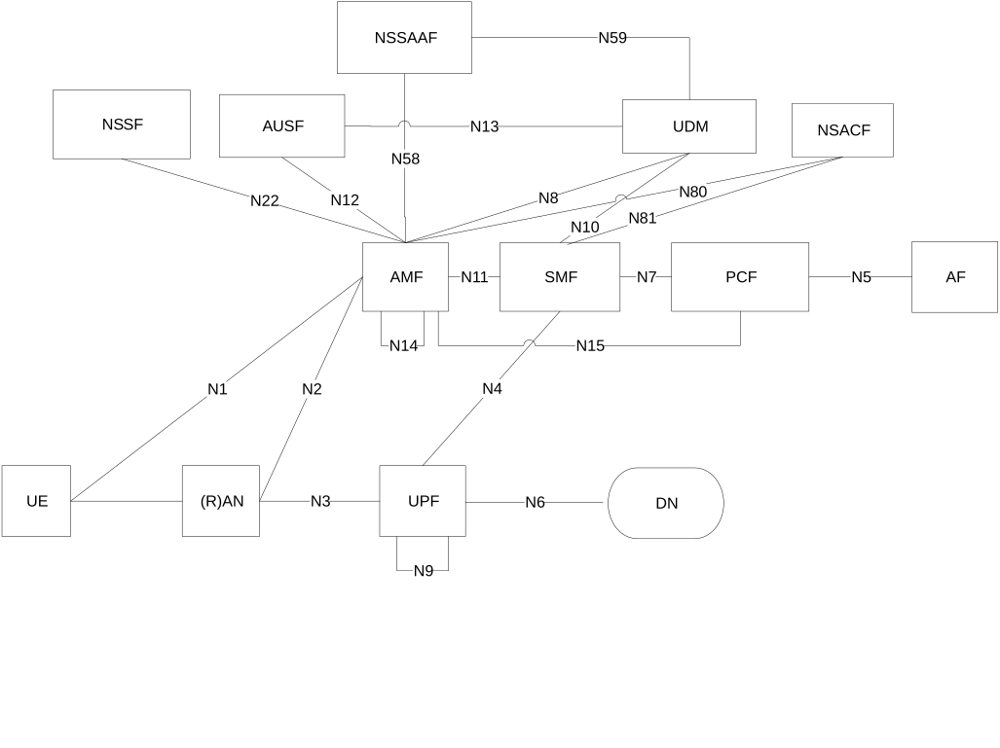
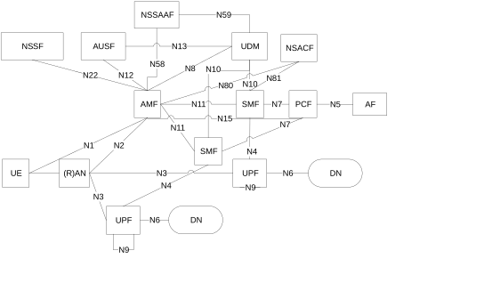
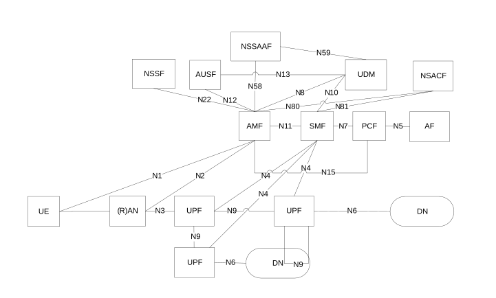
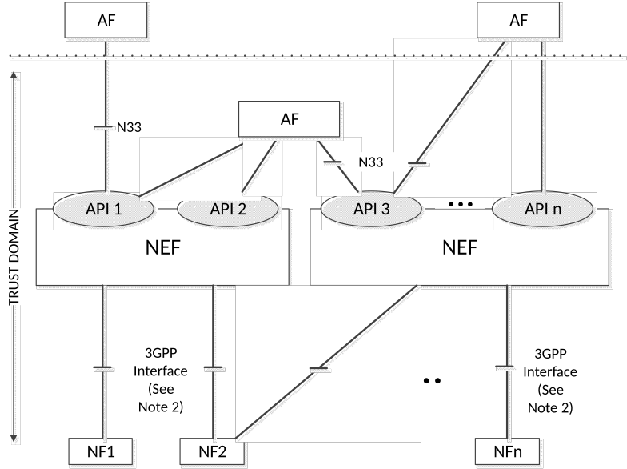

# 4.2.3 Non-roaming reference architecture

Figure 4.2.3-1 depicts the non-roaming reference architecture. Service-based interfaces are used within the Control Plane.

Figure 4.2.3-1: Non-Roaming 5G System Architecture

NOTE: If an SCP is deployed it can be used for indirect communication between NFs and NF services as described in Annex E. SCP does not expose services itself.

Figure 4.2.3-2 depicts the 5G System architecture in the non-roaming case, using the reference point representation showing how various network functions interact with each other.

Figure 4.2.3-2: Non-Roaming 5G System Architecture in reference point representation

NOTE 1: N9, N14 are not shown in all other figures however they may also be applicable for other scenarios.

NOTE 2: For the sake of clarity of the point-to-point diagrams, the UDSF, NEF and NRF have not been depicted. However, all depicted Network Functions can interact with the UDSF, UDR, NEF and NRF as necessary.

NOTE 3: The UDM uses subscription data and authentication data and the PCF uses policy data that may be stored in UDR (refer to clause 4.2.5).

NOTE 4: For clarity, the UDR and its connections with other NFs, e.g. PCF, are not depicted in the point-to-point and service-based architecture diagrams. For more information on data storage architectures refer to clause 4.2.5.

NOTE 5: For clarity, the NWDAF(s), DCCF, MFAF and ADRF and their connections with other NFs, are not depicted in the point-to-point and service-based architecture diagrams. For more information on network data analytics architecture refer to TS 23.288 \[86\].

NOTE 6: For clarity, the 5G DDNMF and its connections with other NFs, e.g. UDM, PCF are not depicted in the point-to-point and service-based architecture diagrams. For more information on ProSe architecture refer to TS 23.304 \[128\].

NOTE 7: For clarity, the TSCTSF and its connections with other NFs, e.g. PCF, NEF, UDR are not depicted in the point-to-point and service-based architecture diagrams. For more information on TSC architecture refer to clause 4.4.8.

NOTE 8: For exposure of the QoS monitoring information as specified in clause 5.8.2.18, exposure of data collected for analytics as specified in clause 5.2.26.2 of TS 23.502 \[3\] and exposure of the TSC management information as specified in clause 5.8.5.14, direct interaction between UPF and NFs can be supported via the Nupf interface (see clause 4.2.16).

NOTE 9: For clarity, the EASDF and its connections with SMF is not depicted in the point-to-point and service-based architecture diagrams. For more information on edge computing architecture refer to TS 23.548 \[130\].

Figure 4.2.3-3 depicts the non-roaming architecture for UEs concurrently accessing two (e.g. local and central) data networks using multiple PDU Sessions, using the reference point representation. This figure shows the architecture for multiple PDU Sessions where two SMFs are selected for the two different PDU Sessions. However, each SMF may also have the capability to control both a local and a central UPF within a PDU Session.

Figure 4.2.3-3: Applying Non-Roaming 5G System Architecture for multiple PDU Session in reference point representation

Figure 4.2.3-4 depicts the non-roaming architecture in the case of concurrent access to two (e.g. local and central) data networks is provided within a single PDU Session, using the reference point representation.

Figure 4.2.3-4: Applying Non-Roaming 5G System Architecture for concurrent access to two (e.g. local and central) data networks (single PDU Session option) in reference point representation

Figure 4.2.3-5 depicts the non-roaming architecture for Network Exposure Function, using reference point representation.

Figure 4.2.3-5: Non-Roaming Architecture for Network Exposure Function in reference point representation

NOTE 1: In Figure 4.2.3-5, Trust domain for NEF is same as Trust domain for SCEF as defined in TS 23.682 \[36\].

NOTE 2: In Figure 4.2.3-5, 3GPP Interface represents southbound interfaces between NEF and 5GC Network Functions e.g. N29 interface between NEF and SMF, N30 interface between NEF and PCF, etc. All southbound interfaces from NEF are not shown for the sake of simplicity.
