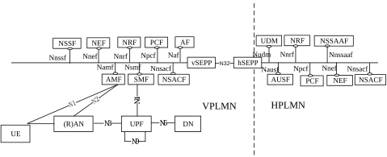
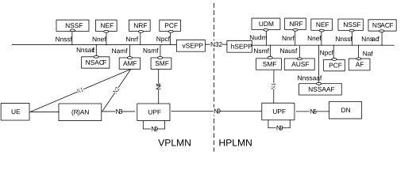
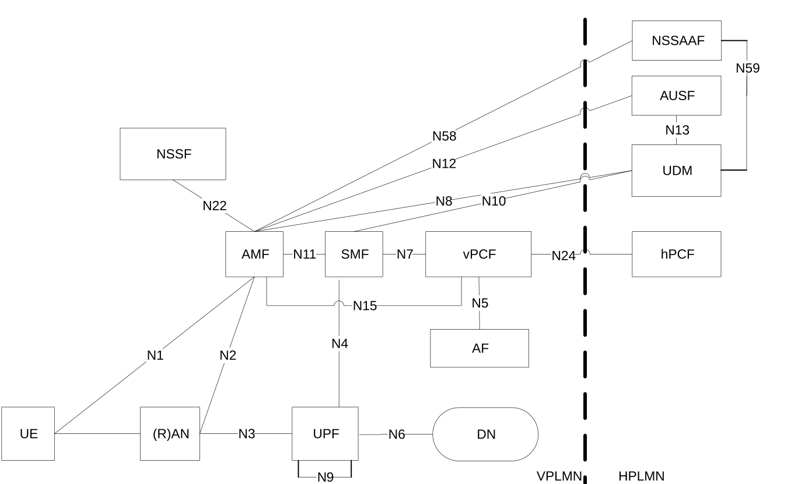
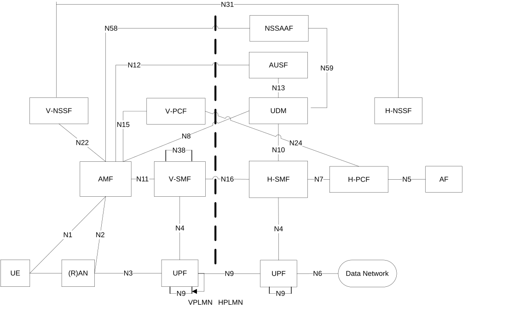
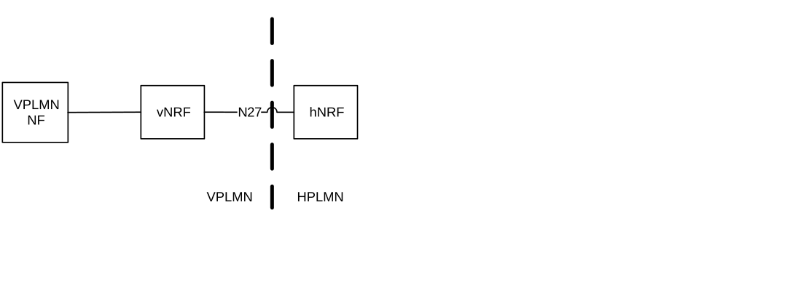
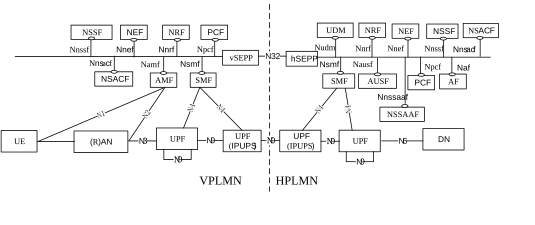

# 4.2.4 Roaming reference architectures

Figure 4.2.4-1 depicts the 5G System roaming architecture with local breakout with service-based interfaces within the Control Plane.

Figure 4.2.4-1: Roaming 5G System architecture- local breakout scenario in service-based interface representation

NOTE 1: In the LBO architecture. the PCF in the VPLMN may interact with the AF in order to generate PCC Rules for services delivered via the VPLMN, the PCF in the VPLMN uses locally configured policies according to the roaming agreement with the HPLMN operator as input for PCC Rule generation, the PCF in VPLMN has no access to subscriber policy information from the HPLMN.

NOTE 2: An SCP can be used for indirect communication between NFs and NF services within the VPLMN, within the HPLMN, or in within both VPLMN and HPLMN. For simplicity, the SCP is not shown in the roaming architecture.

NOTE 3: For clarity, the NWDAF(s) with roaming exchange capability (RE-NWDAF) and their connections with other NFs, are not depicted in the service-based architecture diagram. For more information on network data analytics architecture refer to TS 23.288 \[86\].

NOTE 4: Depending on the architecture deployed, the Primary or Centralized NSACF at the VPLMN can fetch the maximum number of registered UEs or the maximum number of LBO PDU sessions to be enforced from the HPLMN Primary or Centralized NSACF as described in clause 5.15.11.3.1.

Figure 4.2.4-2: Void

Figure 4.2.4-3 depicts the 5G System roaming architecture in the case of home routed scenario with service-based interfaces within the Control Plane.

Figure 4.2.4-3: Roaming 5G System architecture - home routed scenario in service-based interface representation

NOTE 4: An SCP can be used for indirect communication between NFs and NF services within the VPLMN, within the HPLMN, or in within both VPLMN and HPLMN. For simplicity, the SCP is not shown in the roaming architecture.

NOTE 5: UPFs in the home routed scenario can be used also to support the IPUPS functionality (see clause 5.8.2.14).

NOTE 6: For clarity, the NWDAF(s) with roaming exchange capability (RE-NWDAF) and their connections with other NFs, are not depicted in the service-based architecture diagram. For more information on network data analytics architecture refer to TS 23.288 \[86\].

Figure 4.2.4-4 depicts 5G System roaming architecture in the case of local break out scenario using the reference point representation.

Figure 4.2.4-4: Roaming 5G System architecture - local breakout scenario in reference point representation

NOTE 7: The NRF is not depicted in reference point architecture figures. Refer to Figure 4.2.4-7 for details on NRF and NF interfaces.

NOTE 8: For the sake of clarity, SEPPs are not depicted in the roaming reference point architecture figures.

NOTE 9: For clarity, the NWDAF(s) with roaming exchange capability (RE-NWDAF) and their connections with other NFs, are not depicted in the reference point architecture figure. For more information on network data analytics architecture refer to TS 23.288 \[86\].

The following figure 4.2.4-6 depicts the 5G System roaming architecture in the case of home routed scenario using the reference point representation.

Figure 4.2.4-6: Roaming 5G System architecture - Home routed scenario in reference point representation

The N38 references point can be between V-SMFs in the same VPLMN, or between V-SMFs in different VPLMNs (to enable inter-PLMN mobility).

NOTE 10: For clarity, the NWDAF(s) with roaming exchange capability (RE-NWDAF) and their connections with other NFs, are not depicted in the reference point architecture figure. For more information on network data analytics architecture refer to TS 23.288 \[86\].

For the roaming scenarios described above each PLMN implements proxy functionality to secure interconnection and hide topology on the inter-PLMN interfaces.

Figure 4.2.4-7: NRF Roaming architecture in reference point representation

NOTE 11: For the sake of clarity, SEPPs on both sides of PLMN borders are not depicted in figure 4.2.4-7.

Figure 4.2.4-8: Void

Operators can deploy UPFs supporting the Inter PLMN UP Security (IPUPS) functionality at the border of their network to protect their network from invalid inter PLMN N9 traffic in home routed roaming scenarios. The UPFs supporting the IPUPS functionality in VPLMN and HPLMN are controlled by the V-SMF and the H-SMF of that PDU Session respectively. A UPF supporting the IPUPS functionality terminates GTP-U N9 tunnels. The SMF can activate the IPUPS functionality together with other UP functionality in the same UPF, or insert a separate UPF for the IPUPS functionality in the UP path (which e.g. may be dedicated to be used for IPUPS functionality). Figure 4.2.4-9 depicts the home routed roaming architecture where a UPF is inserted in the UP path for the IPUPS functionality. Figure 4.2.4-3 depicts the home routed roaming architecture where the two UPFs perform the IPUPS functionality and other UP functionality for the PDU Session.

NOTE 12: Operators are not prohibited from deploying the IPUPS functionality as a separate Network Function from the UPF, acting as a transparent proxy which can transparently read N4 and N9 interfaces. However, such deployment option is not specified and needs to take at least into account very long lasting PDU Sessions with infrequent traffic and Inter-PLMN handover.

The IPUPS functionality is specified in clause 5.8.2.14 and TS 33.501 \[29\].

Figure 4.2.4-9: Roaming 5G System architecture - home routed roaming scenario in service-based interface representation employing UPF dedicated to IPUPS
