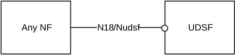
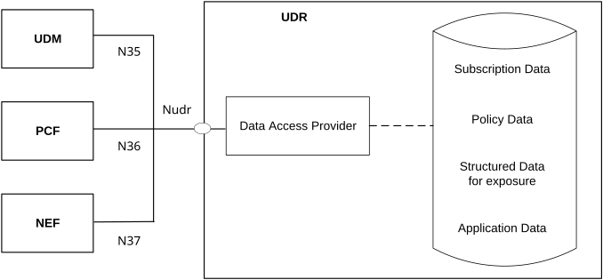

# 4.2.5 Data Storage architectures

As depicted in Figure 4.2.5-1, the 5G System architecture allows any NF to create/read/update/delete its unstructured data in a UDSF (e.g. UE contexts). If such an NF is using UDSF is part of an NF set, then any of the NF instance within this NF set may read/update/delete the unstructured data that was created by this NF. The UDSF belongs to the same PLMN where the network function is located. CP NFs/NF Sets may share a UDSF for storing their respective unstructured data or may each have their own UDSF (e.g. a UDSF may be located close to the respective NF).

NOTE 1: Structured data in this specification refers to data for which the structure is defined in 3GPP specifications. Unstructured data refers to data for which the structure is not defined in 3GPP specifications.

NOTE 2: If a NF Set has its own UDSF, it is up to UDSF implementation and deployment that only the NF instance within the set can access the data created by another NF instance within the NF set. If a UDSF is shared between several NFs not part of the same set or is shared between several NF sets, it is up to UDSF implementation and deployment to make sure that only NFs that are authorized can access the data. For further information about Guidelines and Principles for Compute-Storage Separation see Annex C.

Figure 4.2.5-1: Data Storage Architecture for unstructured data from any NF

NOTE 3: 3GPP will specify (possibly by referencing) the N18/Nudsf interface.

As depicted in Figure 4.2.5-2, the 5G System architecture allows the UDM, PCF and NEF to store data in the UDR, including subscription data and policy data by UDM and PCF, structured data for exposure and application data (including Packet Flow Descriptions (PFDs) for application detection, AF request information for multiple UEs) by the NEF. UDR can be deployed in each PLMN and it can serve different functions as follows:

\- UDR accessed by the NEF belongs to the same PLMN where the NEF is located.

\- UDR accessed by the UDM belongs to the same PLMN where the UDM is located if UDM supports a split architecture.

\- UDR accessed by the PCF belongs to the same PLMN where the PCF is located.

NOTE 4: The UDR deployed in each PLMN can store application data for roaming subscribers.

Figure 4.2.5-2: Data Storage Architecture

NOTE 5: There can be multiple UDRs deployed in the network, each of which can accommodate different data sets or subsets, (e.g. subscription data, subscription policy data, data for exposure, application data) and/or serve different sets of NFs. Deployments where a UDR serves a single NF and stores its data and, thus, can be integrated with this NF, can be possible.

NOTE 6: The internal structure of the UDR in figure 4.2.5-2 is shown for information only.

The Nudr interface is defined for the network functions (i.e. NF Service Consumers), such as UDM, PCF and NEF, to access a particular set of the data stored and to read, update (including add, modify), delete and subscribe to notification of relevant data changes in the UDR.

Each NF Service Consumer accessing the UDR, via Nudr, shall be able to add, modify, update or delete only the data it is authorised to change. This authorisation shall be performed by the UDR on a per data set and NF service consumer basis and potentially on a per UE, subscription granularity.

The following data in the UDR sets exposed via Nudr to the respective NF service consumer and stored shall be standardized:

\- Subscription Data,

\- Policy Data,

\- Structured Data for exposure,

\- Application data: Packet Flow Descriptions (PFDs) for application detection and AF request information for multiple UEs, as defined in clause 5.6.7.

The service based Nudr interface defines the content and format/encoding of the 3GPP defined information elements exposed by the data sets.

In addition, it shall be possible to access operator specific data sets by the NF Service Consumers from the UDR as well as operator specific data for each data set.

NOTE 7: The content and format/encoding of operator specific data and operator specific data sets are not subject to standardization.

NOTE 8: The organization of the different data stored in the UDR is not to be standardized.
