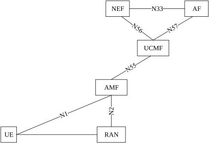
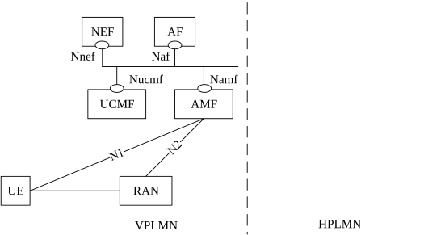

# 4.2.5a Radio Capabilities Signalling optimisation

Figure 4.2.5a-1 depicts the AMF to UCMF reference point and interface. Figure 4.2.5a-2 depicts the related interfaces in AMF and UCMF for the Radio Capabilities Signalling optimisation in the roaming architecture.

Figure 4.2.5a-1: Radio Capability Signalling optimisation architecture

NOTE: The AF in the VPLMN (i.e. the one having a relationship with the VPLMN NEF) is the one which provisions Manufacturer Assigned UE radio capability IDs in the VPLMN UCMF. RACS is a serving PLMN only feature (it requires no specific support in the roaming agreement with the UE HPLMN to operate).

Figure 4.2.5a-2: Roaming architecture for Radio Capability Signalling optimisation
