# 4.2.8 Support of non-3GPP access

## 4.2.8.0 General

In this Release of the specification, the following types of non-3GPP access networks are defined:

\- Untrusted non-3GPP access networks;

\- Trusted non-3GPP access networks; and

\- Wireline access networks.

The architecture to support Untrusted and Trusted non-3GPP access networks is defined in clause 4.2.8.2. The architecture to support Wireline access networks is defined in clause 4.2.8.2.4 and in TS 23.316 \[84\].

## 4.2.8.1 General Concepts to Support Trusted and Untrusted Non-3GPP Access

The 5G Core Network supports connectivity of UEs via non-3GPP access networks, e.g. WLAN access networks.

Only the support of non-3GPP access networks deployed outside the NG-RAN is described in this clause.

The 5G Core Network supports both untrusted non-3GPP access networks and trusted non-3GPP access networks (TNANs).

An untrusted non-3GPP access network shall be connected to the 5G Core Network via a Non-3GPP InterWorking Function (N3IWF), whereas a trusted non-3GPP access network shall be connected to the 5G Core Network via a Trusted Non-3GPP Gateway Function (TNGF). Both the N3IWF and the TNGF interface with the 5G Core Network CP and UP functions via the N2 and N3 interfaces, respectively.

A non-3GPP access network may advertise the PLMNs or SNPNs for which it supports trusted connectivity and the type of supported trusted connectivity (e.g. "5G connectivity"). Therefore, the UEs can discover the non-3GPP access networks that can provide trusted connectivity to one or more PLMNs or SNPNs. This is further specified in clause 6.3.12 (Trusted Non-3GPP Access Network selection).

The UE decides to use trusted or untrusted non-3GPP access for connecting to a 5G PLMN or SNPNs by using procedures not specified in this document. Examples of such procedures are defined in clause 6.3.12.1.

When the UE decides to use untrusted non-3GPP access to connect to a 5G Core Network in a PLMN:

\- the UE first selects and connects with a non-3GPP access network; and then

\- the UE selects a PLMN/SNPN and an N3IWF in this PLMN/SNPN. The PLMN/SNPN/N3IWF selection and the non-3GPP access network selection are independent. The N3IWF selection is defined in clause 6.3.6.

When the UE decides to use trusted non-3GPP access to connect to a 5G Core Network in a PLMN:

\- the UE first selects a PLMN/SNPN; and then

\- the UE selects a non-3GPP access network (a TNAN) that supports trusted connectivity to the selected PLMN/SNPN. In this case, the non-3GPP access network selection is affected by the PLMN/SNPN selection.

A UE that accesses the 5G Core Network over a non-3GPP access shall, after UE registration, support NAS signalling with 5G Core Network control-plane functions using the N1 reference point.

When a UE is connected via a NG-RAN and via a non-3GPP access, multiple N1 instances shall exist for the UE i.e. there shall be one N1 instance over NG-RAN and one N1 instance over non-3GPP access.

A UE simultaneously connected to the same 5G Core Network of a PLMN/SNPN over a 3GPP access and a non-3GPP access shall be served by a single AMF in this 5G Core Network.

When a UE is connected to a 3GPP access of a PLMN, if the UE selects a N3IWF and the N3IWF is located in a PLMN different from the PLMN of the 3GPP access, e.g. in a different VPLMN or in the HPLMN, the UE is served separately by the two PLMNs. The UE is registered with two separate AMFs. PDU Sessions over the 3GPP access are served by V-SMFs different from the V-SMF serving the PDU Sessions over the non-3GPP access. The same can be true when the UE uses trusted non-3GPP access, i.e. the UE may select one PLMN for 3GPP access and a different PLMN for trusted non-3GPP access.

NOTE: The registrations with different PLMNs over different Access Types doesn't apply to UE registered for Disaster Roaming service as described in the clause 5.40.

The PLMN selection for the 3GPP access does not depend on the PLMN that is used for non-3GPP access. In other words, if a UE is registered with a PLMN over a non-3GPP access, the UE performs PLMN selection for the 3GPP access independently of this PLMN.

A UE shall establish an IPsec tunnel with the N3IWF or with the TNGF in order to register with the 5G Core Network over non-3GPP access. Further details about the UE registration to 5G Core Network over untrusted non-3GPP access and over trusted non-3GPP access are described in clause 4.12.2 and in clause 4.12.2a of TS 23.502 \[3\], respectively.

It shall be possible to maintain the UE NAS signalling connection with the AMF over the non-3GPP access after all the PDU Sessions for the UE over that access have been released or handed over to 3GPP access.

N1 NAS signalling over non-3GPP accesses shall be protected with the same security mechanism applied for N1 over a 3GPP access.

User plane QoS differentiation between UE and N3IWF is supported as described in clause 5.7 and clause 4.12.5 of TS 23.502 \[3\]. QoS differentiation between UE and TNGF is supported as described in clause 5.7 and clause 4.12a.5 of TS 23.502 \[3\].

## 4.2.8.1A General Concepts to support Wireline Access

Wireline 5G Access Network (W-5GAN) shall be connected to the 5G Core Network via a Wireline Access Gateway Function (W-AGF). The W-AGF interfaces the 5G Core Network CP and UP functions via N2 and N3 interfaces, respectively.

For the scenario of 5G-RG connected via NG RAN the specification for UE defined in this TS, TS 23.502 \[3\] and TS 23.503 \[45\] are applicable as defined for UE connected to 5GC via NG RAN unless differently specified in this TS and in TS 23.316 \[84\].

When a 5G-RG is connected via a NG-RAN and via a W-5GAN, multiple N1 instances shall exist for the 5G-RG i.e. there shall be one N1 instance over NG-RAN and one N1 instance over W-5GAN.

A 5G-RG simultaneously connected to the same 5G Core Network of a PLMN over a 3GPP access and a W-5GAN access shall be served by a single AMF in this 5G Core Network.

5G-RG shall maintain the NAS signalling connection with the AMF over the W-5GAN after all the PDU Sessions for the 5G-RG over that access have been released or handed over to 3GPP access.

The 5G-RG connected to 5GC via NG-RAN is specified in TS 23.316 \[84\].

For the scenario of FN-RG, which is not 5G capable, connected via W-5GAN to 5GC, the W-AGF provides the N1 interface to AMF on behalf of the FN-RG.

An UE connected to a 5G-RG or FN-RG can access to the 5GC via the N3IWF or via the TNGF where the combination of 5G-RG/FN-RG, W-AGF and UPF serving the 5G-RG or FN-RG is acting respectively as Untrusted Non-3GPP access network or as a Trusted Non-3GPP access network defined in clause 4.2.8.2; for example a UE is connecting to 5G-RG by means of WLAN radio access and connected to 5GC via N3IWF. The detailed description is specified in TS 23.316 \[84\].

The roaming architecture for 5G-BRG, FN-BRG, 5G-CRG and FN-CRG with the W-5GAN is not specified in this Release. The Home Routed roaming scenario is supported for 5G-RG connected via NG RAN, while Local Breakout scenario is not supported.

5G Multi-Operator Core Network (5G MOCN) is supported for 5G-RG connected via NG RAN as defined in clause 5.18

## 4.2.8.2 Architecture Reference Model for Trusted and Untrusted Non-3GPP Accesses

### 4.2.8.2.1 Non-roaming Architecture

Figure 4.2.8.2.1-1: Non-roaming architecture for 5G Core Network with untrusted non-3GPP access

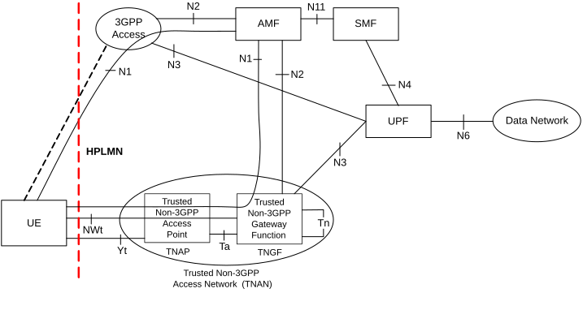

Figure 4.2.8.2.1-2: Non-roaming architecture for 5G Core Network with trusted non-3GPP access

NOTE 1: The reference architecture in Figure 4.2.8.2.1-1 and in Figure 4.2.8.2.1-2 only shows the architecture and the network functions directly connected to non-3GPP access and other parts of the architecture are the same as defined in clause 4.2.

NOTE 2: The reference architecture in Figure 4.2.8.2.1-1 and in Figure 4.2.8.2.1-2 supports service based interfaces for AMF, SMF and other NFs not represented in the figure.

NOTE 3: The two N2 instances in Figure 4.2.8.2.1-1 and in Figure 4.2.8.2.1-2 terminate to a single AMF for a UE which is simultaneously connected to the same 5G Core Network over 3GPP access and non-3GPP access.

NOTE 4 The two N3 instances in Figure 4.2.8.2.1-1 and in Figure 4.2.8.2.1-2 may terminate to different UPFs when different PDU Sessions are established over 3GPP access and non-3GPP access.

### 4.2.8.2.2 LBO Roaming Architecture

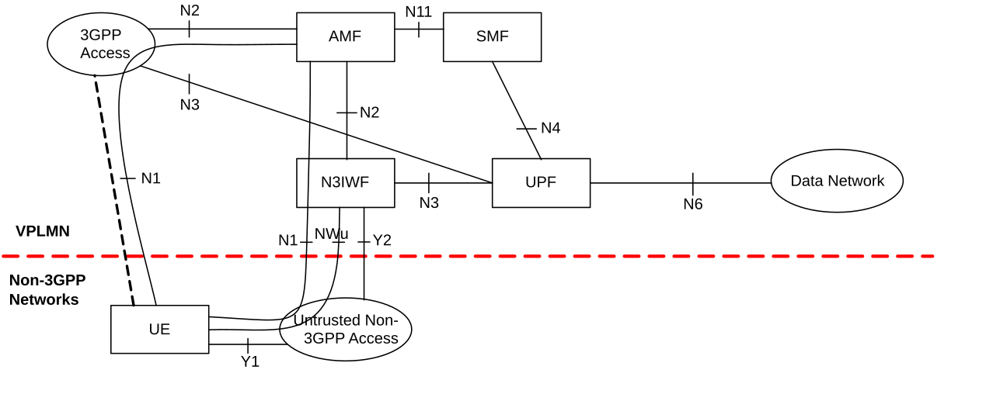

Figure 4.2.8.2.2-1: LBO Roaming architecture for 5G Core Network with untrusted non-3GPP access - N3IWF in the same VPLMN as 3GPP access

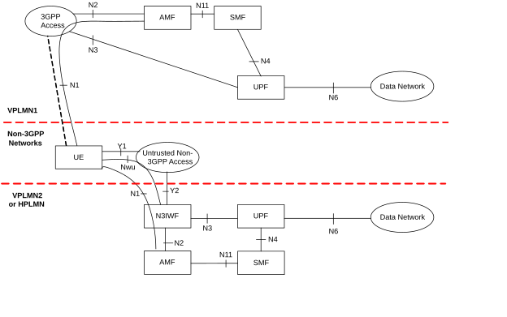

Figure 4.2.8.2.2-2: LBO Roaming architecture for 5G Core Network with untrusted non-3GPP access - N3IWF in a different PLMN from 3GPP access

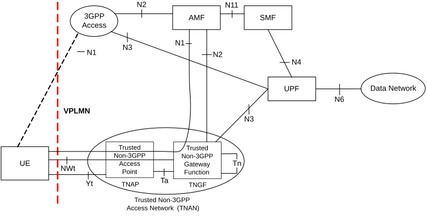

Figure 4.2.8.2.2-3: LBO Roaming architecture for 5G Core Network with trusted non-3GPP access using the same VPLMN as 3GPP access

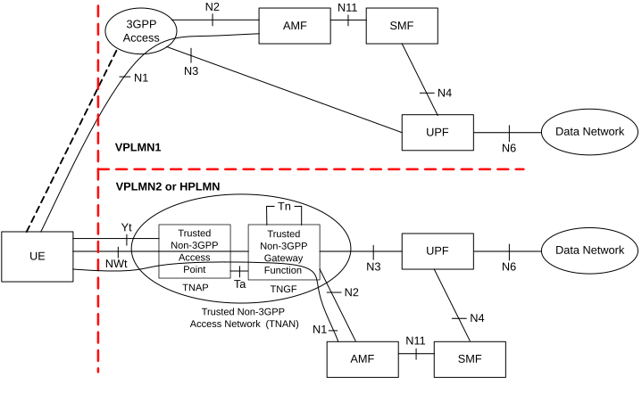

Figure 4.2.8.2.2-4: LBO Roaming architecture for 5G Core Network with trusted non-3GPP access using a different PLMN than 3GPP access

NOTE 1: The reference architecture in all above figures only shows the architecture and the network functions directly connected to support non-3GPP access and other parts of the architecture are the same as defined in clause 4.2.

NOTE 2: The reference architecture in all above figures supports service based interfaces for AMF, SMF and other NFs not represented in the figures.

NOTE 3: The two N2 instances in Figure 4.2.8.2.2-1 and in Figure 4.2.8.2.2-3 terminate to a single AMF for a UE which is connected to the same 5G Core Network over 3GPP access and non-3GPP access simultaneously.

NOTE 4: The two N3 instances in Figure 4.2.8.2.2-1 and in Figure 4.2.8.2.2-3 may terminate to different UPFs when different PDU Sessions are established over 3GPP access and non-3GPP access.

### 4.2.8.2.3 Home-routed Roaming Architecture

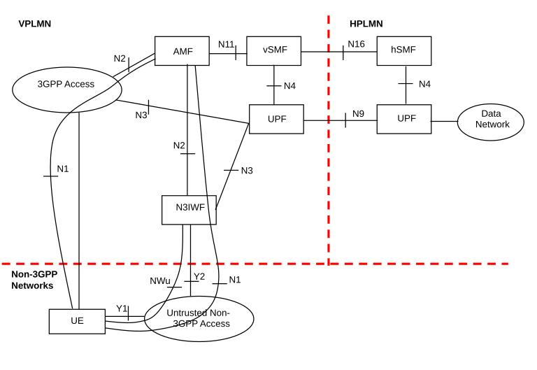

Figure 4.2.8.2.3-1: Home-routed Roaming architecture for 5G Core Network with untrusted non-3GPP access - N3IWF in the same VPLMN as 3GPP access

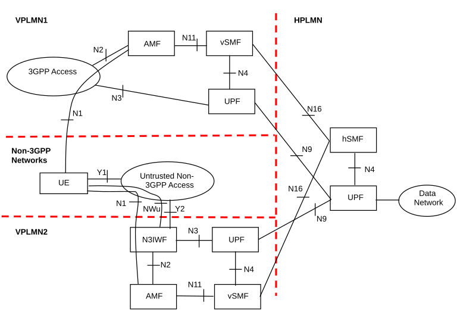

Figure 4.2.8.2.3-2: Home-routed Roaming architecture for 5G Core Network with untrusted non-3GPP access - N3IWF in a different VPLMN than 3GPP access

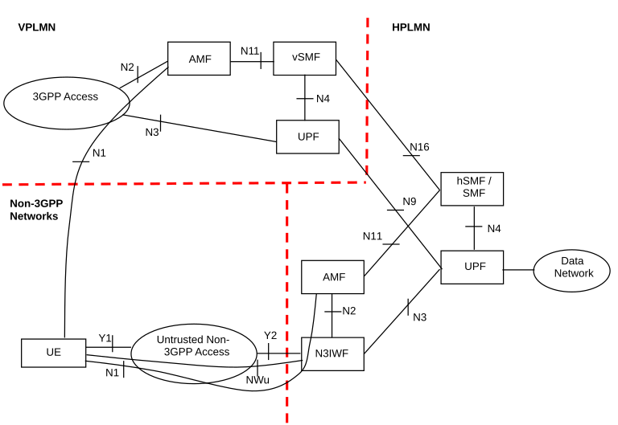

Figure 4.2.8.2.3-3: Home-routed Roaming architecture for 5G Core Network with untrusted non-3GPP access - N3IWF in HPLMN

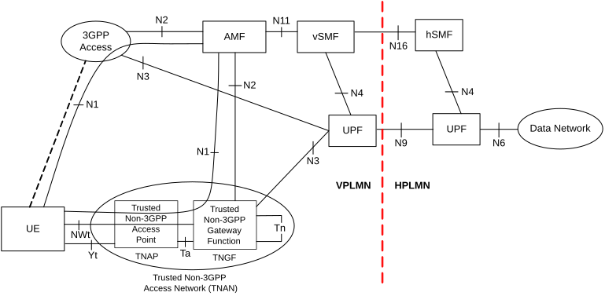

Figure 4.2.8.2.3-4: Home-routed Roaming architecture for 5G Core Network with trusted non-3GPP access using the same VPLMN as 3GPP access

NOTE 1: The reference architecture in all above figures only shows the architecture and the network functions directly connected to support non-3GPP access and other parts of the architecture are the same as defined in clause 4.2.

NOTE 2: The two N2 instances in Figure 4.2.8.2.3-1 and in Figure 4.2.8.2.3-4 terminate to a single AMF for a UE which is connected to the same 5G Core Network over 3GPP access and non-3GPP access simultaneously.

## 4.2.8.3 Reference Points for Non-3GPP Access

### 4.2.8.3.1 Overview

The description of the reference points specific for the non-3GPP access:

N2, N3, N4, N6: these are defined in clause 4.2.

**Y1** Reference point between the UE and the untrusted non-3GPP access (e.g. WLAN). This depends on the non-3GPP access technology and is outside the scope of 3GPP.

**Y2** Reference point between the untrusted non-3GPP access and the N3IWF for the transport of NWu traffic.

**Y4** Reference point between the 5G-RG and the W-AGF which transports the user plane traffic and the N1 NAS protocol. The definition of this interface is outside the scope of 3GPP.

**Y5** Reference point between the FN-RG and the W-AGF. The definition of this interface is outside the scope of 3GPP.

**Yt** Reference point between the UE and the TNAP. See e.g. Figure 4.2.8.2.1-2.

**Yt'** Reference point between the N5CW devices and the TWAP. It is defined in clause 4.2.8.5.

**NWu** Reference point between the UE and N3IWF for establishing secure tunnel(s) between the UE and N3IWF so that control-plane and user-plane exchanged between the UE and the 5G Core Network is transferred securely over untrusted non-3GPP access.

**NWt** Reference point between the UE and the TNGF. A secure NWt connection is established over this reference point, as specified in clause 4.12a.2.2 of TS 23.502 \[3\]. NAS messages between the UE and the AMF are transferred via this NWt connection.

**Ta** A reference point between the TNAP and the TNGF, which is used to support an AAA interface. Ta requirements are documented in clause 4.2.8.3.2.

**Tn** A reference point between two TNGFs, which is used to facilitate UE mobility between different TNGFs (inter-TNGF mobility).

Tn and inter-TNGF mobility are not specified in this Release of the specification.

### 4.2.8.3.2 Requirements on Ta

Ta shall be able to

\- Carry EAP-5G traffic and user location information before the NWt connection is established between the UE and the TNGF.

\- Allow the UE and the TNGF to exchange IP traffic.

In deployments where the TNAP does not allocate the local IP addresses to UE(s), Ta shall be able to:

\- Allow the UE to request and receive IP configuration from the TNAN (including a local IP address), e.g. with DHCP. This is to allow the UE to use an IP stack to establish a NWt connection between the UE and the TNGF.

NOTE: The "local IP address" is the IP address that allows the UE to contact the TNGF; the entity providing this local IP address is part of TNAN and out of 3GPP scope

In this Release of the specification, Ta is not specified.

## 4.2.8.4 Architecture Reference Model for Wireline Access network

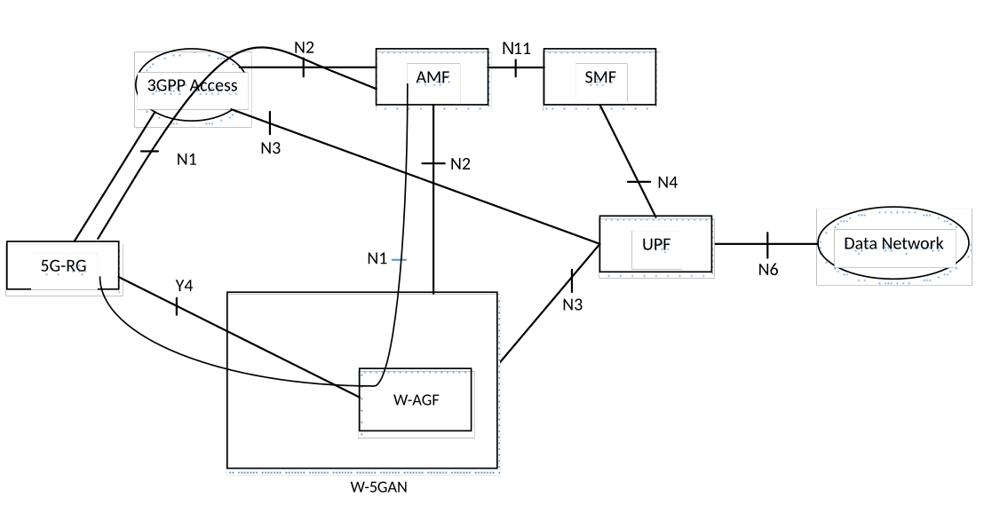

Figure 4.2.8.4-1: Non- roaming architecture for 5G Core Network for 5G-RG with Wireline 5G Access network and NG RAN

The 5G-RG can be connected to 5GC via W-5GAN, NG RAN or via both accesses.

NOTE 1: The reference architecture in figure 4.2.8.4-1 only shows the architecture and the network functions directly connected to Wireline 5G Access Network and other parts of the architecture are the same as defined in clause 4.2.

NOTE 2: The reference architecture in figure 4.2.8.4-1 supports service based interfaces for AMF, SMF and other NFs not represented in the figure.

NOTE 3: The two N2 instances in Figure 4.2.8.4-1 apply to a single AMF for a 5G-RG which is simultaneously connected to the same 5G Core Network over 3GPP access and Wireline 5G Access Network.

NOTE 4 The two N3 instances in Figure 4.2.8. 4-1 may apply to different UPFs when different PDU Sessions are established over 3GPP access and Wireline 5G Access Network.

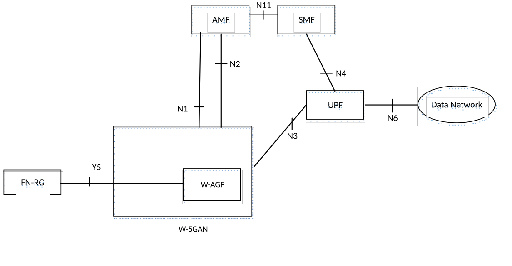

Figure 4.2.8.4-2: Non- roaming architecture for 5G Core Network for FN-RG with Wireline 5G Access network and NG RAN

The N1 for the FN-RG, which is not 5G capable, is terminated on W-AGF which acts on behalf of the FN-RG.

The FN-RG can only be connected to 5GC via W-5GAN.

NOTE 5: The reference architecture in figure 4.2.8.4-2 only shows the architecture and the network functions directly connected to Wireline 5G Access Network and other parts of the architecture are the same as defined in clause 4.2.

NOTE 6: The reference architecture in figure 4.2.8.4-1 supports service based interfaces for AMF, SMF and other NFs not represented in the figure.

## 4.2.8.5 Access to 5GC from devices that do not support 5GC NAS over WLAN access

### 4.2.8.5.1 General

The devices that do not support 5GC NAS signalling over WLAN access are referred to as "Non-5G-Capable over WLAN" devices, or N5CW devices for short. A N5CW device is not capable to operate as a 5G UE that supports 5GC NAS signalling over a WLAN access network, however, it may be capable to operate as a 5G UE over NG-RAN.

Clause 4.2.8.5 specifies the 5GC architectural enhancements that enable N5CW devices to access 5GC via trusted WLAN access networks. A trusted WLAN access network is a particular type of a Trusted Non-3GPP Access Network (TNAN) that supports a WLAN access technology, e.g. IEEE 802.11. Not all trusted WLAN access networks support 5GC access from N5CW devices. To support 5GC access from N5CW devices, a trusted WLAN access network must support the special functionality specified below (e.g. it must support a TWIF function).

When a N5CW device performs an EAP-based access authentication procedure to connect to a trusted WLAN access network, the N5CW device may simultaneously be registered to a 5GC of a PLMN or SNPN. The 5GC registration is performed by the TWIF function (see next clause) in the trusted WLAN access network, on behalf of the N5CW device. The type of EAP authentication procedure, which is used during the 5GC registration to authenticate the N5CW device, is specified in TS 33.501 \[29\]. In this Release of the specification, Trusted WLAN Access for N5CW Device only supports IP PDU Session type.

### 4.2.8.5.2 Reference Architecture

The architecture diagram in Figure 4.2.8.5.2-1 is based on the general 5GS architecture diagrams in clause 4.2 and shows the main network functions required to support 5GC access from N5CW devices. Other network functions are not shown for simplicity.

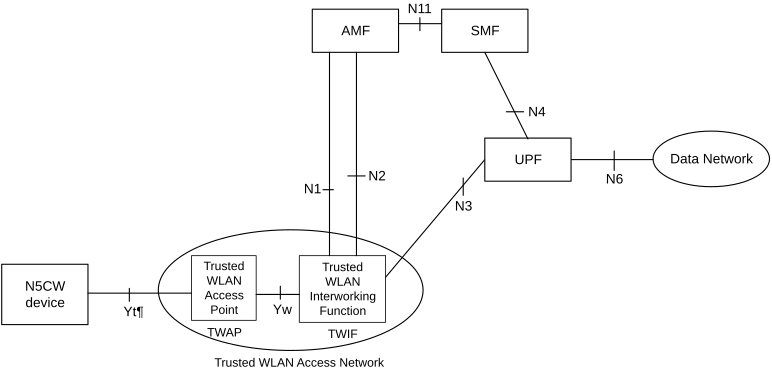

Figure 4.2.8.5.2-1: Non-roaming and LBO Roaming Architecture for supporting 5GC access from N5CW devices

The reference architecture in Figure 4.2.8.5.2-1 also supports N5CW device access to the subscribed SNPN or access to the SNPN with credentials owned by Credentials Holder. Other parts of the architecture are the same as defined in clause 5.30.2.9.

### 4.2.8.5.3 Network Functions

Trusted WLAN Access Point (TWAP): It is a particular type of a Trusted Non-3GPP Access Point (TNAP) specified in clause 4.2.8.2, that supports a WLAN access technology, e.g. IEEE 802.11. This function is outside the scope of the 3GPP specifications.

Trusted WLAN Interworking Function (TWIF): It provides interworking functionality that enables N5CW devices to access 5GC. The TWIF supports the following functions:

\- Terminates the N1, N2 and N3 interfaces.

\- Implements the AMF selection procedure.

\- Implements the NAS protocol stack and exchanges NAS messages with the AMF on behalf of the N5CW device.

\- On the user plane, it relays protocol data units (PDUs) between the Yw interface and the N3 interface.

\- May implement a local mobility anchor within the trusted WLAN access network.

### 4.2.8.5.4 Reference Points

The Yt' and Yw reference points are both outside the scope of the 3GPP specifications. The Yt' reference point transports WLAN messages (e.g. IEEE 802.11 messages), while the Yw reference point:

\- Shall be able to transport authentication messages between the TNAP and the TWIF for enabling authentication of a N5CW device;

\- Shall allow the N5CW device to request and receive IP configuration from the TWIF, including an IP address, e.g. with DHCP.

\- Shall support the transport of user-plane traffic for the N5CW device.

The N1, N2 and N3 reference points are the same reference points defined in clause 4.2.7.
