# 4.3 Interworking with EPC

## 4.3.1 Non-roaming architecture

Figure 4.3.1-1 represents the non-roaming architecture for interworking between 5GS and EPC/E-UTRAN.

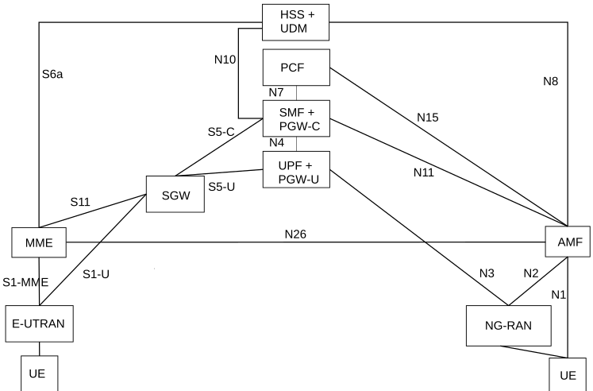

Figure 4.3.1-1: Non-roaming architecture for interworking between 5GS and EPC/E-UTRAN

NOTE 1: N26 interface is an inter-CN interface between the MME and 5GS AMF in order to enable interworking between EPC and the NG core. Support of N26 interface in the network is optional for interworking. N26 supports subset of the functionalities (essential for interworking) that are supported over S10.

NOTE 2: PGW-C + SMF and UPF + PGW-U are dedicated for interworking between 5GS and EPC, which are optional and are based on UE MM Core Network Capability and UE subscription. UEs that are not subject to 5GS and EPC interworking may be served by entities not dedicated for interworking, i.e. by either by PGW or SMF/UPF.

NOTE 3: There can be another UPF (not shown in the figure above) between the NG-RAN and the UPF + PGW-U, i.e. the UPF + PGW-U can support N9 towards an additional UPF, if needed.

NOTE 4: Figures and procedures in this specification that depict an SGW make no assumption whether the SGW is deployed as a monolithic SGW or as an SGW split into its control-plane and user-plane functionality as described in TS 23.214 \[32\].

## 4.3.2 Roaming architecture

Figure 4.3.2-1 represents the Roaming architecture with local breakout and Figure 4.3.2-2 represents the Roaming architecture with home-routed traffic for interworking between 5GS and EPC/E-UTRAN.

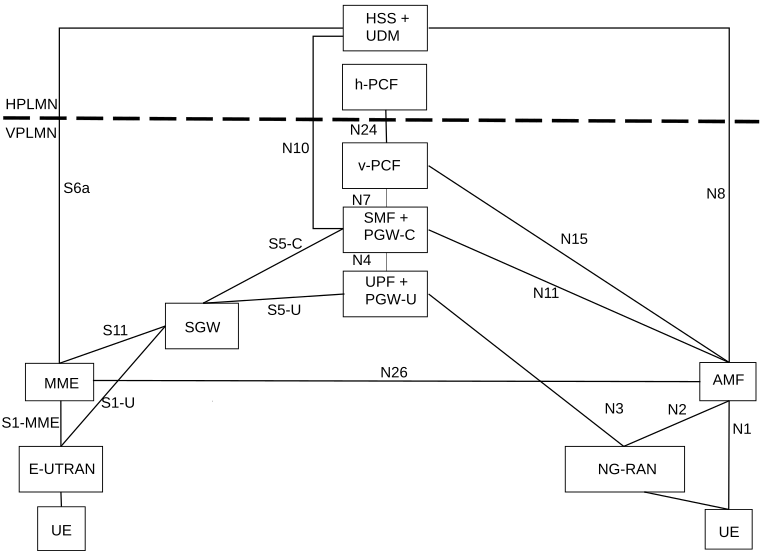

Figure 4.3.2-1: Local breakout roaming architecture for interworking between 5GS and EPC/E-UTRAN

NOTE 1: There can be another UPF (not shown in the figure above) between the NG-RAN and the UPF + PGW-U, i.e. the UPF + PGW-U can support N9 towards the additional UPF, if needed.

NOTE 2: S9 interface from EPC is not required since no known deployment exists.

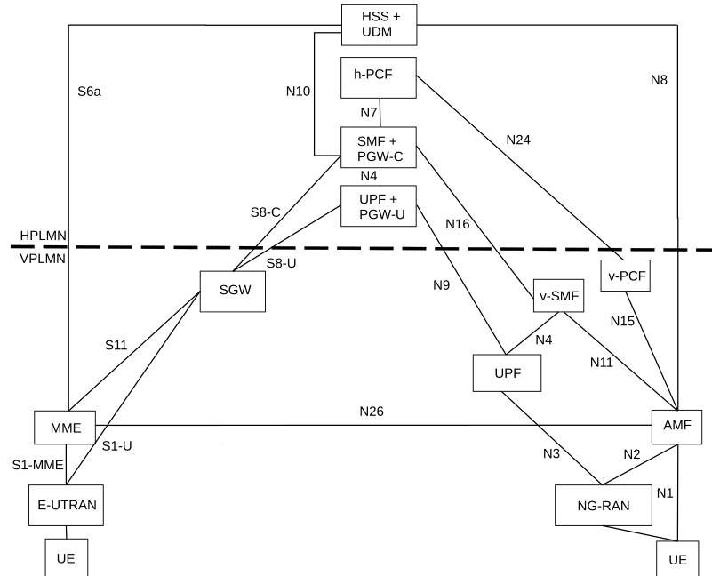

Figure 4.3.2-2: Home-routed roaming architecture for interworking between 5GS and EPC/E-UTRAN

## 4.3.3 Interworking between 5GC via non-3GPP access and E-UTRAN connected to EPC

### 4.3.3.1 Non-roaming architecture

Figure 4.3.3-1 represents the non-roaming architecture for interworking between 5GC via non-3GPP access and EPC/E-UTRAN.

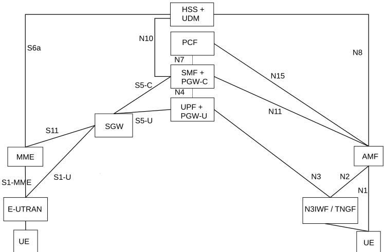

Figure 4.3.3.1-1: Non-roaming architecture for interworking between 5GC via non-3GPP access and EPC/E-UTRAN

NOTE 1: There can be another UPF (not shown in the figure above) between the N3IWF/TNGF and the UPF + PGW-U, i.e. the UPF + PGW-U can support N9 towards an additional UPF, if needed.

NOTE 2: N26 interface is not precluded, but it is not shown in the figure because it is not required for the interworking between 5GC via non-3GPP access and EPC/E-UTRAN.

### 4.3.3.2 Roaming architecture

Figure 4.3.3.2-1 represents the Roaming architecture with local breakout and Figure 4.3.3.2-2 represents the Roaming architecture with home-routed traffic for interworking between 5GC via non-3GPP access and EPC/E-UTRAN.

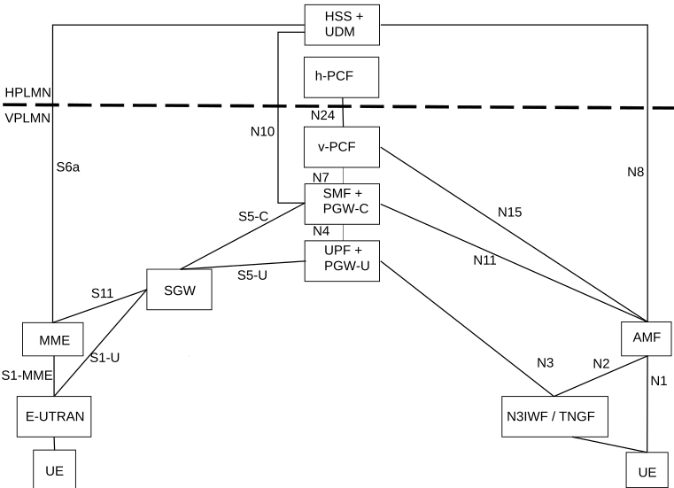

Figure 4.3.3.2-1: Local breakout roaming architecture for interworking between 5GC via non-3GPP access and EPC/E-UTRAN

NOTE 1: There can be another UPF (not shown in the figure above) between the N3IWF/TNGF and the UPF + PGW-U, i.e. the UPF + PGW-U can support N9 towards the additional UPF, if needed.

NOTE 2: S9 interface from EPC is not required since no known deployment exists.

NOTE 3: N26 interface is not precluded, but it not shown in the figure because it is not required for the interworking between 5GC via non-3GPP access and EPC/E-UTRAN.

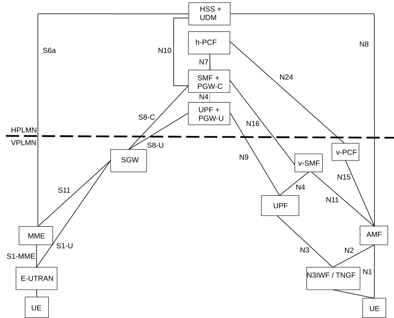

Figure 4.3.3.2-2: Home-routed roaming architecture for interworking between 5GC via non-3GPP access and EPC/E-UTRAN

NOTE 4: N26 interface is not precluded, but it not shown in the figure because it is not required for the interworking between 5GC via non-3GPP access and EPC/E-UTRAN.

## 4.3.4 Interworking between ePDG connected to EPC and 5GS

### 4.3.4.1 Non-roaming architecture

Figure 4.3.4.1-1 represents the non-roaming architecture for interworking between ePDG/EPC and 5GS.

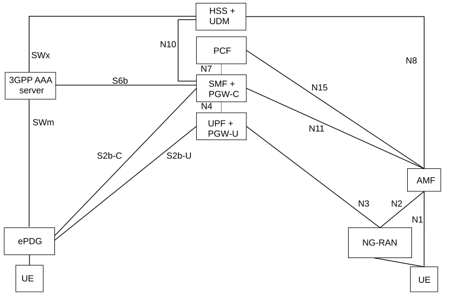

Figure 4.3.4.1-1: Non-roaming architecture for interworking between ePDG/EPC and 5GS

NOTE 1: The details of the interfaces between the UE and the ePDG and between EPC nodes (i.e. SWm, SWx, S2b and S6b), are documented in TS 23.402 \[43\].

NOTE 2: Interworking with ePDG is only supported with GTP based S2b. S6b interface is optional (see clause 4.11.4.3.6 of TS 23.502 \[3\]).

### 4.3.4.2 Roaming architectures

Figure 4.3.4.2-1 represents the Roaming architecture with local breakout and Figure 4.3.4.2-2 represents the Roaming architecture with home-routed traffic for interworking between ePDG/EPC and 5GS.

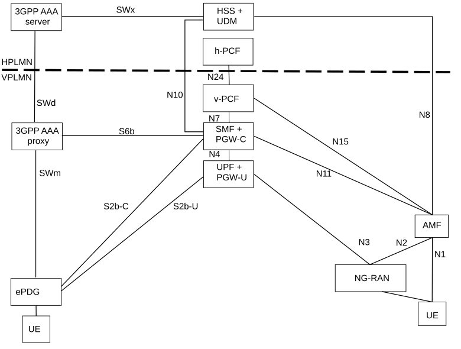

Figure 4.3.4.2-1: Local breakout roaming architecture for interworking between ePDG/EPC and 5GS

NOTE 1: The details of the interfaces between the UE and the ePDG and between EPC nodes (i.e. SWm, SWd, SWx, S2b and S6b), are documented in TS 23.402 \[43\].

NOTE 2: Interworking with ePDG is only supported with GTP based S2b. S6b interface is optional (see clause 4.11.4.3.6 of TS 23.502 \[3\]).

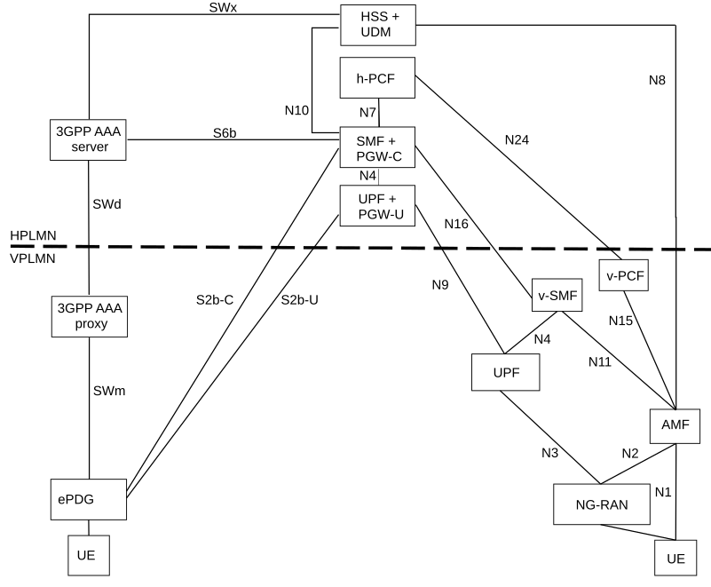

Figure 4.3.4.2-2: Home-routed roaming architecture for interworking between ePDG/EPC and 5GS

NOTE 1: The details of the interfaces between the UE and the ePDG and between EPC nodes (i.e. SWm, SWd, SWx, S2b and S6b), are documented in TS 23.402 \[43\].

NOTE 2: Interworking with ePDG is only supported with GTP based S2b. S6b interface is optional (see clause 4.11.4.3.6 of TS 23.502 \[3\]).

## 4.3.5 Service Exposure in Interworking Scenarios

### 4.3.5.1 Non-roaming architecture

Figure 4.3.5.1-1 shows the non-roaming architecture for Service Exposure for EPC-5GC Interworking. If the UE is capable of mobility between EPS and 5GS, the network is expected to associate the UE with an SCEF+NEF node for Service Capability Exposure.

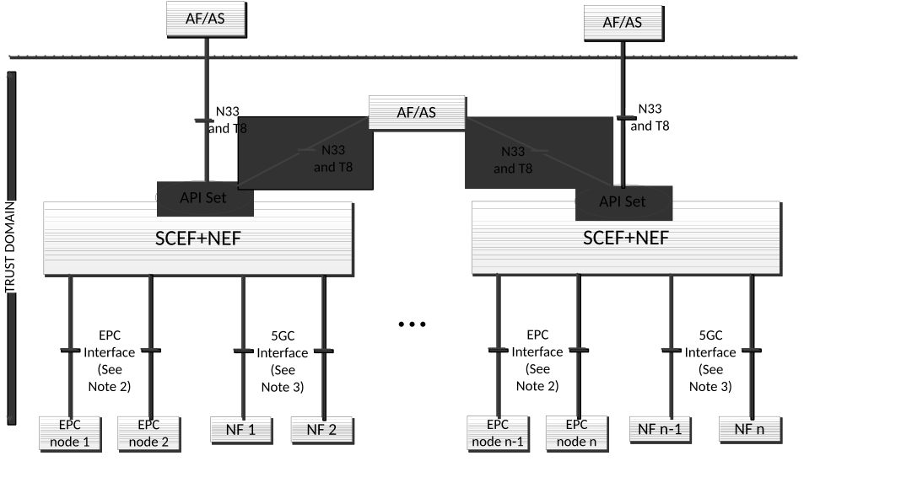

Figure 4.3.5.1 1: Non-roaming Service Exposure Architecture for EPC-5GC Interworking

NOTE 1: In Figure 4.3.5.1-1, Trust domain for SCEF+NEF is same as Trust domain for SCEF as defined in TS 23.682 \[36\].

NOTE 2: In Figure 4.3.5.1-1, EPC Interface represents southbound interfaces between SCEF and EPC nodes e.g. the S6t interface between SCEF and HSS, the T6a interface between SCEF and MME, etc. All southbound interfaces from SCEF are defined in TS 23.682 \[36\] and are not shown for the sake of simplicity.

NOTE 3: In Figure 4.3.5.1-1, 5GC Interface represents southbound interfaces between NEF and 5GC Network Functions e.g. N29 interface between NEF and SMF, N30 interface between NEF and PCF, etc. All southbound interfaces from NEF are not shown for the sake of simplicity.

NOTE 4: Interaction between the SCEF and NEF within the combined SCEF+NEF is required. For example, when the SCEF+NEF supports monitoring APIs, the SCEF and NEF need to share context and state information on a UE's configured monitoring events if the UE moves between from EPC and 5GC.

NOTE 5: The north-bound APIs which can be supported by an EPC or 5GC network are discovered by the SCEF+NEF node via the CAPIF function and/or via local configuration of the SCEF+NEF node. Different sets of APIs can be supported by the two network types.

### 4.3.5.2 Roaming architectures

Figure 4.3.5.2-1 represents the roaming architecture for Service Exposure for EPC-5GC Interworking. This architecture is applicable to both the home routed roaming and local breakout roaming.

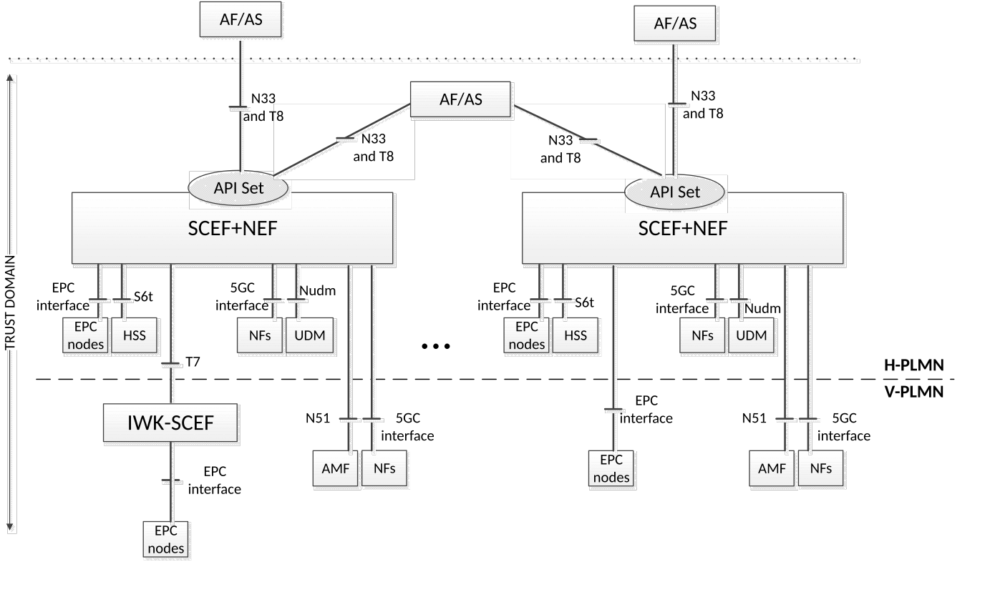

Figure 4.3.5.2-1: Roaming Service Exposure Architecture for EPC-5GC Interworking

NOTE: Figure 4.3.5.2-1 does not include all the interfaces and network elements or network functions that may be connected to SCEF+NEF.
