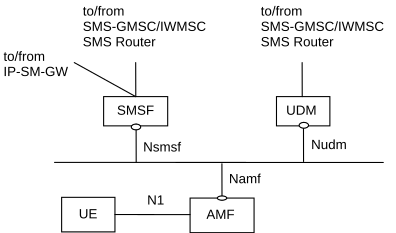
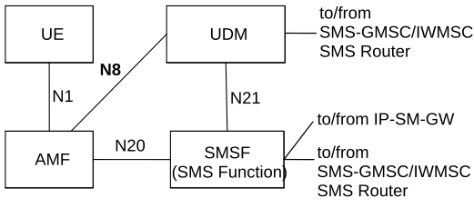
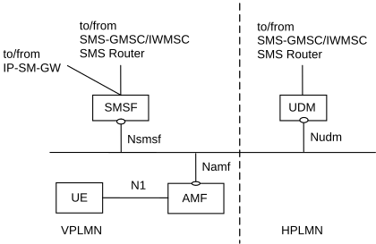
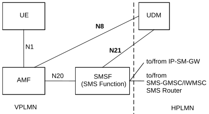
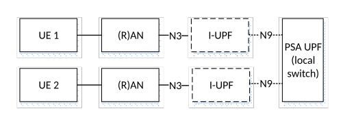
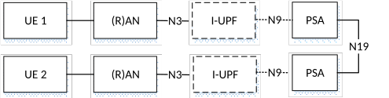
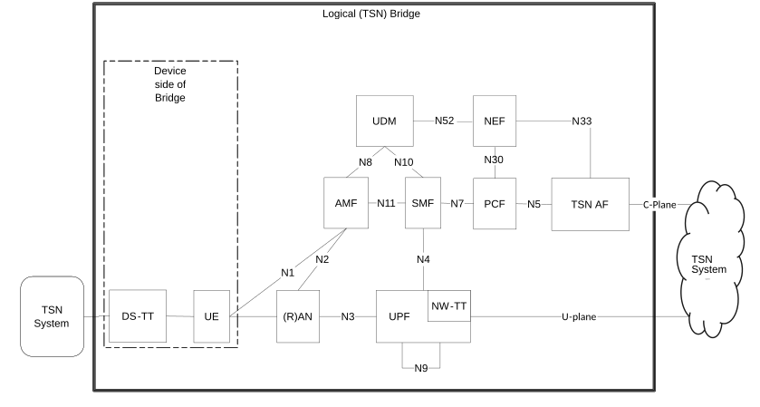
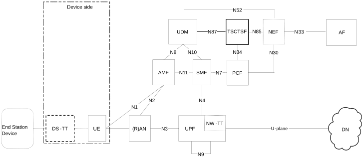
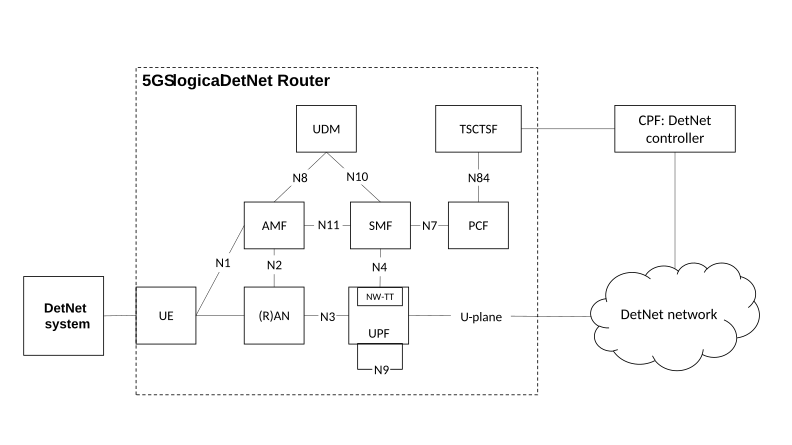

# 4.4 Specific services

## 4.4.1 Public Warning System

The Public Warning System architecture for 5G System is specified in TS 23.041 \[46\].

## 4.4.2 SMS over NAS

### 4.4.2.0 General

This clause introduces legacy SMS over NAS architecture, in which the interfaces between SMSF/UDM and SMS-GMSC/SMS-IWMSC/IP-SM-GW/SMS Router are still based on legacy protocol (i.e. MAP or Diameter).

The SBI-based SMS architecture and interfaces are specified in TS 23.540 \[142\].

### 4.4.2.1 Architecture to support SMS over NAS

Figure 4.4.2.1-1 shows the non-roaming architecture to support SMS over NAS using the Service-based interfaces within the Control Plane.

Figure 4.4.2.1-1: Non-roaming System Architecture for SMS over NAS

Figure 4.4.2.1-2 shows the non-roaming architecture to support SMS over NAS using the reference point representation.

Figure 4.4.2.1-2: Non-roaming System Architecture for SMS over NAS in reference point representation

NOTE 1: SMS Function (SMSF) may be connected to the SMS-GMSC/IWMSC/SMS Router via one of the standardized interfaces as shown in TS 23.040 \[5\].

NOTE 2: UDM may be connected to the SMS-GMSC/IWMSC/SMS Router via one of the standardized interfaces as shown in TS 23.040 \[5\].

NOTE 3: Each UE is associated with only one SMS Function in the registered PLMN.

NOTE 4: SMSF re-allocation while the UE is in RM‑REGISTERED state in the serving PLMN is not supported in this Release of the specification. When serving AMF is re-allocated for a given UE, the source AMF includes SMSF identifier as part of UE context transfer to target AMF. If the target AMF, e.g. in the case of inter-PLMN mobility, detects that no SMSF has been selected in the serving PLMN, then the AMF performs SMSF selection as specified in clause 6.3.10.

NOTE 5: To support MT SMS domain selection by IP-SM-GW/SMS Router, IP-SM-GW/SMS Router may connect to SGs MSC, MME and SMSF via one of the standardized interfaces as shown in TS 23.040 \[5\].

Figure 4.4.2.1-3 shows the roaming architecture to support SMS over NAS using the Service-based interfaces within the Control Plane.

Figure 4.4.2.1-3: Roaming architecture for SMS over NAS

Figure 4.4.2.1-4 shows the roaming architecture to support SMS over NAS using the reference point representation.

Figure 4.4.2.1-4: Roaming architecture for SMS over NAS in reference point representation

### 4.4.2.2 Reference point to support SMS over NAS

**N1:** Reference point for SMS transfer between UE and AMF via NAS.

Following reference points are realized by service based interfaces:

**N8:** Reference point for SMS Subscription data retrieval between AMF and UDM.

**N20:** Reference point for SMS transfer between AMF and SMS Function.

**N21:** Reference point for SMS Function address registration management and SMS Management Subscription data retrieval between SMS Function and UDM.

### 4.4.2.3 Service based interface to support SMS over NAS

**Nsmsf:** Service-based interface exhibited by SMSF.

## 4.4.3 IMS support

IMS support for 5GC is defined in TS 23.228 \[15\].

The 5G System architecture supports N5 interface between PCF and P-CSCF and supports Rx interface between PCF and P-CSCF, to enable IMS service. See TS 23.228 \[15\], TS 23.503 \[45\] and TS 23.203 \[4\].

NOTE 1: Rx support between PCF and P-CSCF is for backwards compatibility for early deployments using Diameter between IMS and 5GC functions.

NOTE 2: When service based interfaces are used between the PCF and P-CSCF in the same PLMN, the P-CSCF performs the functions of a trusted AF in the 5GC.

## 4.4.4 Location services

### 4.4.4.1 Architecture to support Location Services

Location Service feature is optional and applicable to both regulatory services and commercial services in this Release of the specification. The non-roaming and roaming architecture to support Location Services are defined in clause 4.2 of TS 23.273 \[87\].

### 4.4.4.2 Reference point to support Location Services

The reference points to support Location Services are defined in clause 4.4 of TS 23.273 \[87\].

### 4.4.4.3 Service Based Interfaces to support Location Services

The Service Based Interfaces to support Location Services are defined in clause 4.5 of TS 23.273 \[87\].

## 4.4.5 Application Triggering Services

See clause 5.2.6.1 of TS 23.502 \[3\].

Application trigger message contains information that allows the network to route the message to the appropriate UE and the UE to route the message to the appropriate application. The information destined to the application, excluding the information to route it, is referred to as the Trigger payload. The Trigger payload is implementation specific.

NOTE: The application in the UE may perform actions indicated by the Trigger payload when the Triggered payload is received at the UE. For example initiation of immediate or later communication with the application server based on the information contained in the Trigger payload, which includes the PDU Session Establishment procedure if the related PDU Session is not already established.

## 4.4.6 5G LAN-type Services

### 4.4.6.1 User plane architecture to support 5G LAN-type service

The general User Plane architectures described in clause 4.2.3 and clause 4.2.4 apply to 5G LAN-type services, with the additional options described in this clause.

Figure 4.4.6.1-1 depicts the non-roaming user plane architecture to support 5G LAN-type service using local switch.

Figure 4.4.6.1-1: Local-switch based user plane architecture in non-roaming scenario

Figure 4.4.6.1-2 depicts the non-roaming user plane architecture to support 5G LAN-type service using N19 tunnel.

Figure 4.4.6.1-2: N19-based user plane architecture in non-roaming scenario

NOTE: As described in clause 5.29.3, the PSA UPFs can be controlled by a dedicated SMF, a dedicated SMF Set or multiple SMF Sets.

### 4.4.6.2 Reference points to support 5G LAN-type service

**N19:** Reference point between two UPFs for direct routing of traffic between different PDU Sessions without using N6. It has a per 5G VN group granularity.

## 4.4.7 MSISDN-less MO SMS Service

MSISDN-less MO SMS via T4 is subscription based. The subscription provides the information whether a UE is allowed to originate MSISDN-less MO SMS.

The UE is pre-configured with the Service Centre address that points to SMS-SC that performs this MO SMS delivery via NEF delivery procedure. The recipient of this short message is set to the pre-configured address of the AF (i.e. Address of the destination SME). If UE has multiple GPSIs associated to the same IMSI, the GPSI that is associated with an SMS may be determined from the UE's IMSI and the Application Port ID value in the TP-User-Data field (see TS 23.040 \[5\]). The NEF may obtain the GPSI by querying the UDM with the IMSI and application port ID.

UE is aware whether the MO SMS delivery status (success or fail) based on the SMS delivery report from SMS-SC. The network does not perform any storing and forwarding functionality for MO SMS.

See clause 5.2.6 of TS 23.502 \[3\] for a description of NEF Services and Service Operations.

## 4.4.8 Architecture to enable Time Sensitive Communication, Time Synchronization and Deterministic Networking

### 4.4.8.1 General

The 5G System can be extended to support the following:

a\) **Integration of 5GS into a TSN data network (DN):** Integration as a bridge in an IEEE 802.1 Time Sensitive Networking (TSN). The 5GS bridge supports the Time sensitive communication as defined in IEEE 802.1 Time Sensitive Networking (TSN) standards. The architecture is described in clause 4.4.8.2.

This Release supports of the specification, integration of the 5G System with IEEE 802.1 TSN networks that apply the fully centralized configuration model as defined in IEEE Std 802.1Q \[98\]. IEEE TSN is a set of standards to define mechanisms for the time-sensitive (i.e. deterministic) transmission of data over Ethernet networks.

b\) Enablers for AF requested support of Time Synchronization and/or some aspects of Time Sensitive Communication. The architecture is described in clause 4.4.8.3.

c\) **Support for TSN enabled transport network (TN):** Enablers for interworking with TSN network deployed in the transport network. This option can be used simultaneously with either option a) or b). The architecture is described in clause 5.28a. The interworking is applicable when the transport network deploys the fully centralized configuration model as defined in IEEE Std 802.1Q \[98\]. In this scenario, a TSN TN is deployed to realize the N3 interface between (R)AN and UPF. From the perspective of the TSN TN, (R)AN and UPF act as End Stations of the TSN TN.

d\) Integration as a router in a Deterministic Network as defined in IETF RFC 8655 \[150\]. The architecture is described in clause 4.4.8.4.

### 4.4.8.2 Architecture to support IEEE Time Sensitive Networking

The 5G System is integrated with the external network as a TSN bridge. This "logical" TSN bridge (see Figure 4.4.8.2-1) includes TSN Translator functionality for interoperation between TSN Systems and 5G System both for user plane and control plane. 5GS TSN translator functionality consists of Device-side TSN translator (DS-TT) and Network-side TSN translator (NW-TT). The TSN AF is part of 5GC and provides the control plane translator functionality for the integration of the 5GS with a TSN network, e.g. the interactions with the CNC. 5G System specific procedures in 5GC and RAN, wireless communication links, etc. remain hidden from the TSN network. To achieve such transparency to the TSN network and the 5GS to appear as any other TSN Bridge, the 5GS provides TSN ingress and egress ports via DS-TT and NW-TT. DS-TT and NW-TT optionally support:

\- hold and forward functionality for the purpose of de-jittering;

\- per-stream filtering and policing as defined in clause 8.6.5.2.1 of IEEE Std 802.1Q \[98\].

DS-TT optionally supports link layer connectivity discovery and reporting as defined in IEEE Std 802.1AB \[97\] for discovery of Ethernet devices attached to DS-TT. NW-TT supports link layer connectivity discovery and reporting as defined in IEEE Std 802.1AB \[97\] for discovery of Ethernet devices attached to NW-TT. If a DS-TT does not support link layer connectivity discovery and reporting, then NW-TT performs link layer connectivity discovery and reporting as defined in IEEE Std 802.1AB \[97\] for discovery of Ethernet devices attached to DS-TT on behalf of DS-TT.

NOTE 1: If NW-TT performs link layer connectivity discovery and reporting on behalf of DS-TT, it is assumed that LLDP frames are transmitted between NW-TT and UE on the QoS Flow with the default QoS rule as defined in the clause 5.7.1.1. Alternatively, SMF can establish a dedicated QoS Flow matching on the Ethertype defined for LLDP (IEEE Std 802.1AB \[97\]).

There are three TSN configuration models defined in IEEE Std 802.1Q \[98\]. Amongst the three models:

\- fully centralized model is supported in this Release of the specification;

\- fully distributed model is not supported in this Release of the specification;

\- centralized network/distributed user model is not supported in this Release of the specification.

NOTE 2: This Release supports interworking with TSN using clause 8.6.8.4 of IEEE Std 802.1Q \[98\] scheduled traffic and clause 8.6.5.2.1 of IEEE Std 802.1Q \[98\] per-stream filtering and policy.

Figure 4.4.8.2-1: System architecture view with 5GS appearing as TSN bridge

NOTE 3: Whether DS-TT and UE are combined or are separate is up to implementation.

NOTE 4: TSN AF does not need to support N33 in this release of the specification.

### 4.4.8.3 Architecture for AF requested support of Time Sensitive Communication and Time Synchronization

This clause describes the architecture to enable Time Sensitive Communication AF requested time sensitive communication and time synchronization services. The Time Sensitive Communication and Time Synchronization related features that are supported based on AF request are described in clauses 5.27.1 and 5.27.2, respectively. Figure 4.4.8.3-1 shows the architecture to support Time Sensitive Communication and Time Synchronization services.

As shown in Figure 4.4.8.3-1, to support Time Synchronization service based on IEEE Std 802.1AS \[104\] or IEEE Std 1588 \[126\] for Ethernet or IP type PDU Sessions, the DS-TT, NW-TT and Time Sensitive Communication and Time Synchronization Function (TSCTSF) are required in order to support the features in IEEE Std 802.1AS \[104\] or IEEE Std 1588 \[126\] as described in clause 5.27. The NEF exposes 5GS capability to support Time Synchronization service as described in clause 5.27.1.8. TSCTSF controls the DS-TT(s) and NW-TT for the (g)PTP based time synchronization service. In addition, TSCTSF supports TSC assistance container related functionalities.

Figure 4.4.8.3-1: Architecture to enable Time Sensitive Communication and Time Synchronization services

NOTE 1: If the AF is considered to be trusted by the operator, the AF could interact directly with TSCTSF, the connection between AF and TSCTSF is not depicted in the architecture diagram for brevity.

UPF/NW-TT distributes the (g)PTP messages as described in clause 5.27.1.

When the UPF supports one or more NW-TT(s), there is one-to-one association between an NW-TT and the network instance or between an NW-TT and network instance together with DNN/S-NSSAI in the UPF. When there are multiple network instances within a UPF, each network instance is considered logically separate. The network instance for the N6 interface (clause 5.6.12) may be indicated by the SMF to the UPF for a given PDU Session during PDU Session establishment procedure. UPF allocates resources based on the Network Instance and S-NSSAI and it is supported according to TS 29.244 \[65\]. DNN/S-NSSAI may be indicated by the SMF together with the network instance to the UPF for a given PDU Session during PDU Session establishment procedure.

NOTE 2: The same NW-TT is used for all PDU Sessions in the UPF for the given DNN/S-NSSAI; the NW-TT is unique per DNN/S-NSSAI. This ensures that the UPF selects an N4 session associated with the correct TSCTSF when the NW-TT initiates an UMIC or PMIC. At any given time, the NW-TT is associated with a single TSCTSF.

### 4.4.8.4 Architecture to support IETF Deterministic Networking

The 5G System is integrated with the Deterministic Network as defined in IETF RFC 8655 \[150\] as a logical DetNet transit router, see Figure 4.4.8.4-1. The TSCTSF performs mapping in the control plane between the 5GS internal functions and the DetNet controller. 5G System specific procedures in 5GC and RAN remain hidden from the DetNet controller.

Figure 4.4.8.4-1: 5GS Architecture to support IETF Deterministic Networking

On the device side, the UE is connected with a DetNet system, which may be a DetNet End System or a DetNet Node.

The architecture does not require the DS-TT functionality to be supported in the device nor require the user plane NW-TT functionality to be supported in the UPF, however, it can co-exist with such functions. For the reporting of information of the network side ports, NW-TT control plane function is used. The architecture can be combined with architecture in clause 4.4.8.3 to support time synchronization and TSC.

DetNet may be used in combination with time synchronization mechanisms as defined in clause 5.27, but it does not require usage of these mechanisms.

5GS acts as a DetNet router in the DetNet domain. Use cases where the 5GS acts as a sub-network (see clause 4.1.2 of IETF RFC 8655 \[150\]) are also possible but do not require any additional 3GPP standardization. A special case where the 5GS can act as a sub-network is when the 5GS acts as a TSN network, which is supported by the 3GPP specifications based on the architecture in clause 4.4.8.2.

NOTE: For DetNet interworking, it is assumed that there is a business agreement to support the use of the DetNet controller so that it can be regarded trusted for the operator. Depending on the needs of a given deployment, functions such as the authentication, authorization and potential throttling of signalling from the DetNet controller can be achieved by including such functionalities in the TSCTSF.

The routing of the downlink packets is achieved using the existing 3GPP functions.
