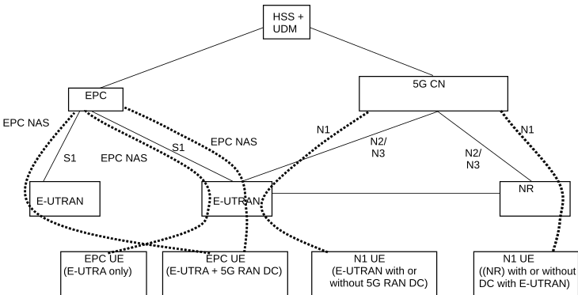

# 5.17.1 Support for Migration from EPC to 5GC

## 5.17.1.1 General

Clause 5.17.1 describes the UE and network behaviour for the migration from EPC to 5GC.

Deployments based on different 3GPP architecture options (i.e. EPC based or 5GC based) and UEs with different capabilities (EPC NAS and 5GC NAS) may coexist at the same time within one PLMN.

It is assumed that a UE that is capable of supporting 5GC NAS procedures may also be capable of supporting EPC NAS (i.e. the NAS procedures defined in TS 24.301 \[13\]) to operate in legacy networks e.g. in the case of roaming.

The UE will use EPC NAS or 5GC NAS procedures depending on the core network by which it is served.

In order to support smooth migration, it is assumed that the EPC and the 5GC have access to a common subscriber database, that is HSS in the case of EPC and the UDM in the case of 5GC, acting as the master data base for a given user as defined in TS 23.002 \[21\]. The PCF has access to the UDR that acts as a common subscriber database for a given user identified by a SUPI using the Nudr services defined in TS 23.502 \[3\].

Figure 5.17.1.1-1: Architecture for migration scenario for EPC and 5G CN

A UE that supports only EPC based Dual Connectivity with secondary RAT NR:

\- always performs initial access through E-UTRA (LTE-Uu) but never through NR;

\- performs EPC NAS procedures over E-UTRA (i.e. Mobility Management, Session Management etc) as defined in TS 24.301 \[13\].

A UE that supports camping on 5G Systems with 5GC NAS:

\- performs initial access either through E-UTRAN that connects to 5GC or NR towards 5GC;

\- performs initial access through E-UTRAN towards EPC, if supported and needed;

\- performs EPC NAS or 5GC NAS procedures over E-UTRAN or NR respectively (i.e. Mobility Management, Session Management etc) depending on whether the UE requests 5GC access or EPC access, if the UE also supports EPC NAS.

When camping on an E-UTRA cell connected to both EPC and 5GC, a UE supporting EPC NAS and 5GC NAS shall select a core network type (EPC or 5GC) and initiate the corresponding NAS procedure as specified in TS 23.122 \[17\].

In order to support different UEs with different capabilities in the same network, i.e. both UEs that are capable of only EPC NAS (possibly including EPC based Dual Connectivity with NR as secondary RAT) and UEs that support 5GC NAS procedures in the same network:

\- eNB that supports access to 5GC shall broadcast that it can connect to 5GC. Based on that, the UE AS layer indicates "E-UTRA connected to 5GC" capability to the UE NAS layer. In addition the eNB broadcasts the supported CIoT 5GS Optimisations that the UE uses for selecting a core network type.

\- It is also expected that the UE AS layer is made aware by the UE NAS layer whether a NAS signalling connection is to be initiated to the 5GC. Based on that, UE AS layer indicates to the RAN whether it is requesting 5GC access (i.e. "5GC requested" indication). The RAN uses this indication to determine whether a UE is requesting 5GC access or an EPC access. RAN routes NAS signalling to the applicable AMF or MME accordingly.

NOTE: The UE that supports EPC based Dual Connectivity with secondary RAT only does not provide this "5GC requested" indication at Access Stratum when it performs initial access and therefore eNB uses the "default" CN selection mechanism to direct this UE to an MME

The 5GC network may steer the UE from 5GC based on:

\- Core Network type restriction (e.g. due to lack of roaming agreements) described in clause 5.3.4.1.1;

\- Availability of EPC connectivity;

\- UE indication of EPC Preferred Network Behaviour; and

\- Supported Network Behaviour.

The UE that wants to use one or more of these functionalities not supported by 5G System, when in CM-IDLE may disable all the related radio capabilities that allow the UE to access 5G System. The triggers to disable and re-enable the 5GS capabilities to access 5G System in this case are left up to UE implementation.

## 5.17.1.2 User Plane management to support interworking with EPS

In order to support the interworking with EPC, the SMF+PGW-C provides information over N4 to the UPF+PGW-U related to the handling of traffic over S5-U. Functionality defined in TS 23.503 \[45\] for traffic steering control on SGi-LAN/N6 can be activated in UPF+PGW-U under consideration of whether the UE is connected to EPC or 5GC.

When the UE is connected to EPC and establishes/releases PDN connections, the following differences apply to N4 compared to when the UE is connected to 5GC:

\- The CN Tunnel Info is allocated for each EPS Bearer.

\- In addition to the Service Data Flow related information, the SMF+PGW-C shall be able to provide the GBR and MBR values for each GBR bearer of the PDN connection to the UPF+PGW-U.

If the UE does not have preconfigured rules for associating an application to a PDN connection (i.e. the UE does not have rules in UE local configuration and is not provisioned with ANDSF rules), the UE should use a matching URSP rule as defined in TS 23.503 \[45\], if available, to derive the parameters, e.g. APN, for the PDN connection establishment and associating an application to the PDN connection.

NOTE: The mapping between the parameters in the URSP rules and the parameters used for PDN connection establishment is defined in TS 24.526 \[110\].

## 5.17.1.3 QoS handling for home routed roaming

During mobility from EPS to 5GS, the handling of QoS constraints in V-SMF is specified in clauses 4.11.1.2.2 and 4.11.1.3.3 of TS 23.502 \[3\] and follows the same principle as described in clause 5.7.1.11.
