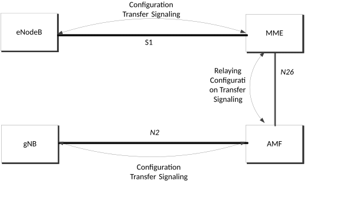

# 5.17.7 Configuration Transfer Procedure between NG-RAN and E-UTRAN

## 5.17.7.1 Architecture Principles for Configuration Transfer between NG-RAN and E-UTRAN

The purpose of the Configuration Transfer between NG-RAN and E-UTRAN is to enable the transfer the RAN configuration information between the gNB and eNodeB via MME and AMF.

In order to make the information transparent for the MME and AMF, the information is included in a transparent container. The source and target RAN node addresses, which allows the Core Network nodes to route the messages. The mechanism depicted in Figure 5.17.7.1-1.

Figure 5.17.7.1-1: Configuration Transfer between gNB and E-UTRAN basic network architecture

The NG-RAN transparent containers are transferred from the source NG-RAN node to the destination E-UTRAN node and vice versa by use of Configuration Transfer messages.

An ENB Configuration Transfer message is used from the E-UTRAN node to the MME over S1 interface as described in TS 36.413 \[100\], the destination RAN node includes the en-gNB Identifier and may include a TAI associated with the en-gNB. If MME is aware that the en-gNB serves cells which provide access to 5GC, the MME relays the request towards a suitable AMF via inter-system signalling based on a broadcast 5G TAC. An AMF Configuration Transfer message is used from the AMF to the NG-RAN over N2 interface.

A Configuration Transfer message is used by the gNB node to the AMF over N2 interface for the reply and a Configuration Transfer Tunnel message is used to tunnel the transparent container from AMF to MME over the N26 interface. MME relays this reply to the target eNB using a MME CONFIGURATION TRANSFER message. Transport of the RAN containers in E-UTRAN is specified in TS 23.401 \[26\].

Each Configuration Transfer message carrying the transparent container is routed and relayed independently by the core network node(s). Any relation between messages is transparent for the AMF and MME, i.e. a request/response exchange between applications, for example SON applications, is routed and relayed as two independent messages by the AMF and MME.

## 5.17.7.2 Addressing, routing and relaying

### 5.17.7.2.1 Addressing

All the Configuration Transfer messages contain the addresses of the source and destination RAN nodes.

An gNB node is addressed by the Target NG-RAN node identifier as described in TS 38.413 \[34\].

An eNodeB is addressed by the Target eNodeB identifier as described in TS 36.413 \[100\].

### 5.17.7.2.2 Routing

The source RAN node sends a message to its core network node including the source and destination addresses.

MME uses the destination address to route the message to the correct AMF via N26 interface. AMF uses the destination address to route the message to the correct MME via N26 interface.

The AMF connected to the destination RAN node decides which RAN node to send the message to, based on the destination address.

The MME connected to the destination RAN node decides which RAN node to send the message to, based on the destination address.

### 5.17.7.2.3 Relaying

The AMF performs relaying between N2 and N26 messages as described in TS 38.413 \[34\] and TS 29.274 \[101\].

The MME performs relaying between S1 and N26 message as described in TS 36.413 \[100\] and TS 29.274 \[101\].
