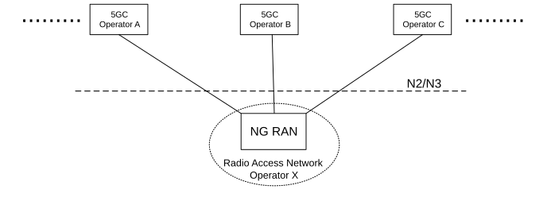

# 5.18 Network Sharing

## 5.18.1 General concepts

A network sharing architecture shall allow multiple participating operators to share resources of a single shared network according to agreed allocation schemes. The shared network includes a radio access network. The shared resources include radio resources.

The shared network operator allocates shared resources to the participating operators based on their planned and current needs and according to service level agreements.

In this Release of the specification, only the 5G Multi-Operator Core Network (5G MOCN) network sharing architecture, in which only the RAN is shared in 5G System, is supported. 5G MOCN for 5G System, including UE, RAN and AMF, shall support operators' ability to use more than one PLMN ID (i.e. with same or different country code (MCC) some of which is specified in TS 23.122 \[17\] and different network codes (MNC)) or combinations of PLMN ID and NID. 5G MOCN supports NG-RAN Sharing with or without multiple Cell Identity broadcast as described in TS 38.300 \[27\].

5G MOCN also supports the following sharing scenarios involving non-public networks, i.e.NG-RAN can be shared by any combination of PLMNs, PNI-NPNs (with CAG) and SNPNs (each identified by PLMN ID and NID).

NOTE 1: PNI-NPNs (without CAG) are not explicitly listed above as it does not require additional NG-RAN sharing functionality compared to sharing by one or multiple PLMNs.

In all non-public network sharing scenarios, each Cell Identity as specified in TS 38.331 \[28\] is associated with one of the following configuration options:

\- one or multiple SNPNs;

\- one or multiple PNI-NPNs (with CAG); or

\- one or multiple PLMNs only.

NOTE 2: This allows the assignment of multiple cell identities to a cell and also allows the cell identities to be independently assigned, i.e. without need for coordination, by the network sharing partners, between PLMNs and/or non-public networks.

NOTE 3: Different PLMN IDs (or combinations of PLMN ID and NID) can also point to the same 5GC. When same 5GC supports multiple SNPNs (identified by PLMN ID and NID), it is up to the operator's policy whether they are used as equivalent SNPNs for a UE.

NOTE 4: There is no standardized mechanism to avoid paging collisions if the same 5G-S-TMSI is allocated to different UEs by different PLMNs or SNPNs of the shared network, as the risk of paging collision is assumed to be very low. If such risk is to be eliminated then PLMNs and SNPNs of the shared network needs to coordinate the value space of the 5G-S-TMSI to differentiate the PLMNs and SNPNs of the shared network.

Figure 5.18.1-1: A 5G Multi-Operator Core Network (5G MOCN) in which multiple CNs are  
connected to the same NG-RAN

## 5.18.2 Broadcast system information for network sharing

If a shared NG-RAN is configured to indicate available networks (PLMNs and/or SNPNs) for selection by UEs, each cell in the shared radio access network shall in the broadcast system information include available core network operators in the shared network.

The Broadcast System Information broadcasts a set of PLMN IDs and/or PLMN IDs and NIDs and one or more additional set of parameters per PLMN e.g. cell-ID, Tracking Areas, CAG Identifiers. All 5G System capable UEs that connect to NG-RAN support reception of multiple PLMN IDs and per PLMN specific parameters. All SNPN-enabled UEs support reception of multiple combinations of PLMN ID and NID and SNPN-specific parameters.

The available core network operators (PLMNs and/or SNPNs) shall be the same for all cells of a Tracking Area in a shared NG-RAN network.

UEs not set to operate in SNPN access mode decode the broadcast system information and take the information concerning available PLMN IDs into account in PLMN and cell (re-)selection procedures. UEs set to operate in SNPN access mode decode the broadcast system information and take the information concerning available PLMN IDs and NIDs into account in network and cell (re-)selection procedures. Broadcast system information is specified in TS 38.331 \[28\] for NR, TS 36.331 \[51\] for E-UTRA and related UE access stratum idle mode procedures in TS 38.304 \[50\] for NR and TS 36.304 \[52\] for E-UTRA.

## 5.18.2a PLMN list and SNPN list handling for network sharing

The AMF prepares lists of PLMN IDs or SNPN IDs suitable as target PLMNs or target SNPNs for use at idle mode cell (re)selection and for use at handover and RRC Connection Release with redirection. The AMF:

\- provides the UE with the list of PLMNs or list of SNPNs that the UE shall consider as Equivalent to the serving PLMN or the serving SNPN (see TS 23.122 \[17\]); and

\- provides the NG-RAN with a prioritised list of permitted PLMNs or a prioritized list of permitted SNPNs. When prioritising these PLMNs or SNPNs, the AMF may consider the following information: HPLMN of the UE or the subscribed SNPN of the UE, the serving PLMN or the serving SNPN, a preferred target PLMN (e.g. based on last used EPS PLMN) or a preferred target SNPN, or the policies of the operator(s).

For a UE registered in an SNPN, the AMF shall not provide a list of equivalent PLMNs to the UE and shall not provide a list of permitted PLMNs to NG-RAN.

For a UE registered in a PLMN, the AMF shall not provide a list of equivalent SNPNs to the UE and shall not provide a list of permitted SNPNs to NG-RAN.

## 5.18.3 Network selection by the UE

NOTE: This clause applies to UEs not operating in SNPN access mode. Network selection for UEs set to operate in SNPN access mode is described in clause 5.30.2.4.

A UE that has a subscription to one of the sharing core network operators shall be able to select this core network operator while within the coverage area of the shared network and to receive subscribed services from that core network operator.

Each cell in shared NG-RAN shall in the broadcast system information include the PLMN-IDs concerning available core network operators in the shared network.

When a UE performs an Initial Registration to a network, one of available PLMNs shall be selected to serve the UE. UE uses all the received broadcast PLMN-IDs in its PLMN (re)selection processes which is specified in TS 23.122 \[17\]. UE shall inform the NG-RAN of the selected PLMN so that the NG-RAN can route correctly. The NG-RAN shall inform the core network of the selected PLMN.

As per any network, after Initial Registration to the shared network and while remaining served by the shared network, the network selection procedures specified in TS 23.122 \[17\] may cause the UE to perform a reselection of another available PLMN.

UE uses all of the received broadcast PLMN-IDs in its cell and PLMN (re)selection processes.

## 5.18.4 Network selection by the network

The NG-RAN uses the selected PLMN/SNPN (provided by the UE at RRC establishment, or, provided by the AMF/source NG-RAN at N2/Xn handover) to select target cells for future handovers (and radio resources in general) appropriately. The network should not move the UE to another available PLMN/SNPN, e.g. by handover, as long as the selected PLMN/SNPN is available to serve the UE's location.

In the case of handover or network controlled release to a PLMN in a shared network:

\- When multiple PLMN IDs are broadcasted in a cell selected by NG-RAN, NG-RAN shall select a target PLMN, taking into account the prioritized list of PLMN IDs provided via Mobility Restriction List from AMF.

\- For Xn based HO procedure, Source NG-RAN indicates the selected PLMN ID to the target NG-RAN, see TS 38.300 \[27\].

\- For N2 based HO procedure, the NG-RAN indicates a selected PLMN ID to the AMF as part of the TAI sent in the HO required message. Source AMF uses the TAI information supplied by the source NG-RAN to select the target AMF/MME. The source AMF should forward the selected PLMN ID to the target AMF/MME. The target AMF/MME indicates the selected PLMN ID to the target NG-RAN/eNB so that the target NG-RAN/eNB can select target cells for future handover appropriately.

\- For RRC connection release with redirection to E-UTRAN procedure, NG-RAN decides the target network by using PLMN information as defined in the first bullet.

A change in serving PLMN is indicated to the UE as part of the UE registration with the selected network via 5G-GUTI in 5GS.

In the case of handover or network controlled release to an SNPN in a shared network, the following applies:

\- When multiple SNPN IDs are broadcasted in a cell selected by NG-RAN, NG-RAN shall select a target SNPN, taking into account the prioritized list of SNPN IDs provided via Mobility Restriction List from AMF.

\- For Xn based HO procedure, Source NG-RAN indicates the selected SNPN ID to the target NG-RAN, see TS 38.300 \[27\].

\- For N2 based HO procedure, the NG-RAN indicates a selected SNPN ID to the AMF together with the TAI sent in the HO required message. Source AMF uses the selected SNPN ID together with the TAI information supplied by the source NG-RAN to select the target AMF. The source AMF should forward the selected SNPN ID to the target AMF. The target AMF indicates the selected SNPN ID to the target NG-RAN so that the target NG-RAN can select target cells for future handover appropriately.

A change in serving SNPN is indicated to the UE as part of the UE registration with the selected network.

## 5.18.5 Network Sharing and Network Slicing

As defined in clause 5.15.1, a Network Slice is defined within a PLMN or SNPN. Network sharing is performed among different PLMNs and/or SNPNs. In the case of network sharing, each PLMN or SNPN sharing the NG-RAN defines and supports its PLMN- or SNPN- specific set of slices that are supported by the common NG-RAN.
