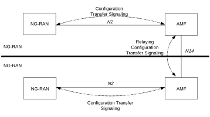

# 5.26 Configuration Transfer Procedure

The purpose of the Configuration Transfer is to enable the transfer of information between two RAN nodes at any time via NG interface and the Core Network. An example of application is to exchange the RAN node's IP addresses in order to be able to use Xn interface between the NG-RAN node for Self-Optimised Networks (SON), as specified in TS 38.413 \[34\].

## 5.26.1 Architecture Principles for Configuration Transfer

Configuration Transfer between two RAN node provides a generic mechanism for the exchange of information between applications belonging to the RAN nodes.

In order to make the information transparent for the Core Network, the information is included in a transparent container that includes source and target RAN node addresses, which allows the Core Network nodes to route the messages. The mechanism is depicted in figure 5.26 1.

Figure 5.26-1: inter NG-RAN Configuration Transfer basic network architecture

The NG-RAN transparent containers are transferred from the source NG-RAN node to the destination NG-RAN node by use of Configuration Transfer messages.

A Configuration Transfer message is used from the NG-RAN node to the AMF over N2 interface, a AMF Configuration Transfer message is used from the AMF to the NG-RAN over N2 interface and a Configuration Transfer Tunnel message is used to tunnel the transparent container from a source AMF to a target AMF over the N14 interface.

Each Configuration Transfer message carrying the transparent container is routed and relayed independently by the core network node(s).

## 5.26.2 Addressing, routing and relaying

### 5.26.2.1 Addressing

All the Configuration Transfer messages contain the addresses of the source and destination RAN nodes. An NG-RAN node is addressed by the Target NG-RAN node identifier.

### 5.26.2.2 Routing

The following description applies to all the Configuration Transfer messages used for the exchange of the transparent container.

The source RAN node sends a message to its core network node including the source and destination addresses. The AMF uses the destination address to route the message to the correct AMF via the N14 interface.

The AMF connected to the destination RAN node decides which RAN node to send the message to, based on the destination address.

### 5.26.2.3 Relaying

The AMF performs relaying between N2 and N14 messages as described in TS 38.413 \[34\], TS 29.518 \[71\].
