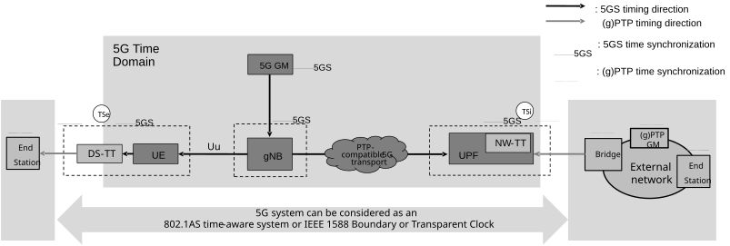

# 5.27.1.1 General

For supporting time synchronization service, the 5GS is configured to operate in one or multiple PTP instances and to operate in one of the following modes (if supported) for each PTP instance:

1\) as time-aware system as described in IEEE Std 802.1AS \[104\],

2\) as Boundary Clock as described in IEEE Std 1588 \[126\], provisioned by the profiles supported by this 3GPP specification including SMPTE Profile for Use of IEEE Std 1588 \[126\] Precision Time Protocol in Professional Broadcast Applications ST 2059-2:2015 \[127\];

NOTE 1: Via proper configuration of the IEEE Std 1588 \[126\] data set members, the 5G internal system clock can become the time source for the PTP grandmaster function for the connected networks in the case of mode 1 and mode 2.

NOTE 2: In some cases where the 5G internal system clock is the time source for the PTP grandmaster function for the connected networks, it might not be required for the UE to receive gPTP or PTP messages over user plane. The UE and DS-TT uses the 5G timing information and generates the necessary gPTP or PTP message for the end station, if needed (this is implementation specific).

3\) as peer-to-peer Transparent Clock as described in IEEE Std 1588 \[126\], provisioned by the profiles supported by this 3GPP specification including SMPTE Profile for Use of IEEE Std 1588 Precision Time Protocol in Professional Broadcast Applications ST 2059-2:2015 \[127\]; or

4\) as end-to-end Transparent Clock as described in IEEE Std 1588 \[126\], provisioned by the profiles supported by this 3GPP specification including SMPTE Profile for Use of IEEE Std 1588 Precision Time Protocol in Professional Broadcast Applications ST 2059-2:2015 \[127\].

NOTE 3: When the GM is external, the operation of 5GS as Boundary Clock assumes that profiles that are supported by the 5GS allows the exemption specified in clauses 9.5.9 and 9.5.10 of IEEE Std 1588 \[126\] where the originTimestamp (or preciseOriginTimestamp in case of two-step operation) is not required to be updated with the syncEventEgressTimestamp (and a Local PTP Clock locked to the external GM). As described in clause 5.27.1.2.2, only correctionField is updated with the 5GS residence time and link delay, in a similar operation as specified by IEEE Std 802.1AS \[104\].

The configuration of the time synchronization service in 5GS for option 1 by TSN AF and CNC is described in clause 5.28.3 and for options 1-4 by AF/NEF and TSCTSF in clause 5.27.1.8 and clause 5.28.3.

The 5GS shall be modelled as an IEEE Std 802.1AS \[104\] or IEEE Std 1588 \[126\] compliant entity based on the above configuration.

NOTE 4: This release of the specification does not support the PTP management mechanism or PTP management messages as described in clause 15 in IEEE Std 1588 \[126\].

The DS-TT and NW-TT at the edge of the 5G system may support the IEEE Std 802.1AS \[104\] or other IEEE Std 1588 \[126\] profiles' operations respective to the configured mode of operation. The UE, gNB, UPF, NW-TT and DS- TTs are synchronized with the 5G GM (i.e. the 5G internal system clock) which shall serve to keep these network elements synchronized. The TTs located at the edge of 5G system fulfil some functions related to IEEE Std 802.1AS \[104\] and may fulfil some functions related to IEEE Std 1588 \[126\], e.g. (g)PTP support and timestamping. Figure 5.27.1-1 illustrates the 5G and PTP grandmaster (GM) clock distribution model via 5GS.

Figure 5.27.1-1: 5G system is modelled as PTP instance for supporting time synchronization

Figure 5.27.1-1 depicts the two synchronizations systems considered: the 5G Clock synchronization and the (g)PTP domain synchronization.

\- 5G Access Stratum-based Time Distribution: Used for NG RAN synchronization and also distributed to the UE. The 5G Access Stratum-based Time Distribution over the radio interface towards the UE is specified in TS 38.331 \[28\]. This method may be used to either further distribute the 5G internal system clock to devices connected to a UE (using implementation-specific means) or to support the operation of the (g)PTP-based time distribution method.

\- (g)PTP-based Time Distribution: Provides timing among entities in a (g)PTP domain. This process follows the applicable profiles of IEEE Std 802.1AS \[104\] or IEEE Std 1588 \[126\]. This method relies on the 5G access stratum-based time distribution method to synchronize the UE/DS-TT and on the 5GS time synchronization to synchronize the gNB (which, in turn, may synchronize the DS-TT) and the NW-TT.

The gNB needs to be synchronized to the 5G internal system clock.

The 5GS supports two methods for determining the grandmaster PTP Instance and the time-synchronization spanning tree.

\- Method a), BMCA procedure.

\- Method b), local configuration.

This is further described in clause 5.27.1.6.
