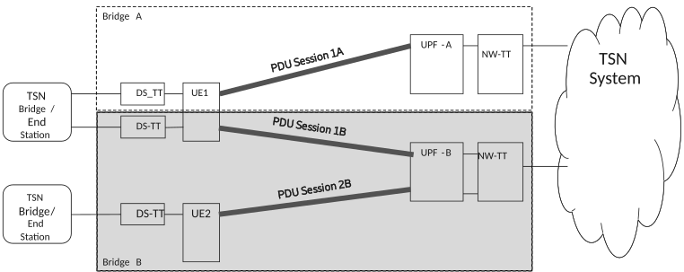

# 5.28.1 5GS bridge management for TSN

5GS acts as a Layer 2 Ethernet Bridge. When integrated with IEEE TSN network, 5GS functions acts as one or more TSN Bridges of the TSN network. The 5GS Bridge is composed of the ports on a single UPF (i.e. PSA) side, the user plane tunnel between the UE and UPF and the ports on the DS-TT side. For each 5GS Bridge of a TSN network, the port on NW-TT support the connectivity to the TSN network, the ports on DS-TT side are associated to the PDU Session providing connectivity to the TSN network.

The granularity of the 5GS TSN bridge is per UPF for each network instance or DNN/S-NSSAI. The bridge ID of the 5GS TSN bridge is bound to the UPF ID of the UPF as identified in TS 23.502 \[3\]. The TSN AF stores the binding relationship between a port on UE/DS-TT side and a PDU Session during reporting of 5GS TSN bridge information. The TSN AF also stores the information about ports on the UPF/NW-TT side. The UPF/NW-TT forwards traffic to the appropriate egress port based on the traffic forwarding information. From the TSN AF point of view, a 5GS TSN bridge has a single NW-TT entity within UPF and the NW-TT may have multiple ports that are used for traffic forwarding.

NOTE 1: How to realize single NW-TT entity within UPF is up to implementation.

NOTE 2: Ethernet PDU Session type in this release of the specification may be subject to the constraint that it supports a single N6 interface in a UPF associated with the N6 Network Instance.

There is only one PDU Session per DS-TT port for a given UPF. All PDU Sessions which connect to the same TSN network via a specific UPF are grouped into a single 5GS bridge. The capabilities of each port on UE/DS-TT side and UPF/NW-TT side are integrated as part of the configuration of the 5GS Bridge and are notified to TSN AF and delivered to CNC for TSN bridge registration and modification.

NOTE 3: It is assumed that all PDU Sessions which connect to the same TSN network via a specific UPF are handled by the same TSN AF.

Figure 5.28.1-1: Per UPF based 5GS bridge

NOTE 4: If a UE establishes multiple PDU Sessions terminating in different UPFs, then the UE is represented by multiple 5GS TSN bridges.

In order to support IEEE 802.1Q features related to TSN, including TSN scheduled traffic (clause 8.6.8.4 in IEEE Std 802.1Q \[98\]) over 5GS Bridge, the 5GS supports the following functions:

\- Configure the bridge information in 5GS.

\- Report the bridge information of 5GS Bridge to TSN network after PDU Session establishment.

\- Receiving the configuration from TSN network as defined in clause 5.28.2.

\- Map the configuration information obtained from TSN network into 5GS QoS information (e.g. 5QI, TSC Assistance Information) of a QoS Flow in corresponding PDU Session for efficient time-aware scheduling, as defined at clause 5.28.2.

The bridge information of 5GS Bridge is used by the TSN network to make appropriate management configuration for the 5GS Bridge. The bridge information of 5GS Bridge includes at least the following:

\- Information for 5GS Bridge:

\- Bridge ID

Bridge ID is to distinguish between bridge instances within 5GS. The Bridge ID can be derived from the unique bridge MAC address as described in IEEE Std 802.1Q \[98\], or set by implementation specific means ensuring that unique values are used within 5GS;

\- Number of Ports;

\- list of port numbers.

\- Capabilities of 5GS Bridge as defined in IEEE Std 802.1Q \[98\]:

\- 5GS Bridge delay per port pair per traffic class, including 5GS Bridge delay (dependent and independent of frame size and their maximum and minimum values: independentDelayMax, independentDelayMin, dependentDelayMax, dependentDelayMin), ingress port number, egress port number and traffic class.

\- Propagation delay per port (txPropagationDelay), including transmission propagation delay, egress port number.

\- VLAN Configuration Information.

NOTE 5: This Release of the specification does not support the modification of VLAN Configuration Information at the TSN AF.

\- Topology related configuration of the 5GS Bridge as defined in IEEE Std 802.1AB \[97\]:

\- LLDP Configuration Information.

\- Chassis ID subtype and Chassis ID of the 5GS Bridge.

\- Optional TLV types.

\- LLDP Discovery Information for each discovered neighbor of each NW-TT port and DS-TT port.

\- Traffic classes and their priorities per port as defined in IEEE Std 802.1Q \[98\].

\- Stream Parameters as defined in clause 12.31.1 in IEEE Std 802.1Q \[98\], in order to support PSFP:

\- MaxStreamFilterInstances: The maximum number of Stream Filter instances supported by the bridge;

\- MaxStreamGateInstances: The maximum number of Stream Gate instances supported by the bridge;

\- MaxFlowMeterInstances: The maximum number of Flow Meter instances supported by the bridge (optional);

\- SupportedListMax: The maximum value supported by the bridge of the AdminControlListLength and OperControlListLength parameters.

The following parameters: independentDelayMax and independentDelayMin, how to calculate them is left to implementation and not defined in this specification.

DS-TT and NW-TT report txPropagationDelay to the TSN AF relative to the time base of the TSN GM clock (identified by the TSN time domain number received in PMIC). If the TSN AF has subscribed for notifications on txPropagationDelay and if the difference to the previously reported txPropagationDelay is larger than the txPropagationDelayDeltaThreshold received in PMIC, the corresponding DS-TT or NW-TT informs the TSN AF about the updated txPropagationDelay using PMIC signalling.

NOTE 6: Configuration of TSN time domain number and txPropagationDelayDeltaThreshold via PMIC is optional for NW-TT. NW-TT can instead be pre-configured with the threshold and the single time domain that is used by the CNC for bridge configuration and reporting.

Bridge ID of the 5GS Bridge, port number(s) of the Ethernet port(s) in NW-TT could be preconfigured on the UPF. The UPF is selected for a PDU Session serving TSC as described in clause 6.3.3.3.

This release of the specification requires that each DS-TT port is assigned with a globally unique MAC address.

NOTE 7: The MAC address of the DS-TT port must not be used in user data traffic; it is used for identification of the PDU Session and the associated bridge port within the 3GPP system.

When there are multiple network instances within a UPF, each network instance is considered logically separate. The network instance for the N6 interface (clause 5.6.12) may be indicated by the SMF to the UPF for a given PDU Session during PDU Session establishment. UPF allocates resources based on the Network Instance and S-NSSAI and it is supported according to TS 29.244 \[65\]. DNN/S-NSSAI may be indicated by the SMF together with the network instance to the UPF for a given PDU Session during PDU Session establishment procedure.

The TSN AF is responsible to receive the bridge information of 5GS Bridge from 5GS, as well as register or update this information to the CNC.
