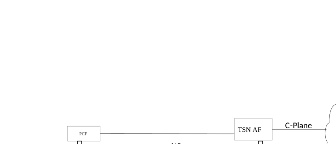

# 5.28.4 QoS mapping tables for TSN

The mapping tables between the traffic class and 5GS QoS Profile is provisioned and further used to find suitable 5GS QoS profile to transfer TSN traffic over the PDU Session. QoS mapping procedures are performed in two phases: (1) QoS capability report phase as described in clause 5.28.1 and (2) QoS configuration phase as in clause 5.28.2

\(1\) The TSN AF shall be pre-configured (e.g. via OAM) with a mapping table. The mapping table contains TSN traffic classes, pre-configured bridge delays (i.e. the preconfigured delay between UE and UPF/NW-TT) and priority levels. Once the PDU session has been setup and after retrieving the information related to UE-DS-TT residence time, the TSN AF deduces the port pair(s) in the 5GS bridge and determines the bridge delay per port pair per traffic class based on the pre-configured bridge delay and the UE-DS-TT residence time as described in clause 5.27.5. The TSN AF updates bridge delays per port pair and traffic class and reports the bridge delays and other relevant TSN information such as the Traffic Class Table (clause 12.6.3 in IEEE Std 802.1Q \[98\]) for every port, according to the IEEE Std 802.1Q \[98\] to the CNC.

\(2\) CNC may distribute PSFP information and transmission gate scheduling parameters to 5GS Bridge via TSN AF, which can be mapped to TSN QoS requirements by the TSN AF.

The PCF mapping table provides a mapping from TSN QoS information (see clauses 6.2.1.2 and 6.1.3.23 of TS 23.503 \[45\]) to 5GS QoS profile. Based on trigger from TSN AF, the PCF may trigger PDU session modification procedure to establish a new 5G QoS Flow or use the pre-configured 5QI for 5G QoS Flow for the requested traffic class according to the selected QoS policies and the TSN AF traffic requirements.

Figure 5.28.4-1 illustrates the functional distribution of the mapping tables.

Figure 5.28.4-1: QoS Mapping Function distribution between PCF and TSN AF

The minimum set of TSN QoS-related parameters that are relevant for mapping the TSN QoS requirements are used by the TSN AF: traffic classes and their priorities per port, TSC Burst Size of TSN streams, 5GS bridge delays per port pair and traffic class (independentDelayMax, independentDelayMin, dependentDelayMax, dependentDelayMin), propagation delay per port (txPropagationDelay) and UE-DS-TT residence time.

Once the CNC retrieves the necessary information, it proceeds to calculate scheduling and paths. The configuration information is then set in the bridge as described in clauses 5.28.2 and 5.28.3. The most relevant information received is the PSFP information and the schedule of transmission gates for every traffic class and port of the bridge. At this point, it is possible to retrieve the TSN QoS requirements by identifying the traffic class of the TSN stream. The traffic class to TSN QoS and delay requirement (excluding the UE-DS-TT residence time) mapping can be performed using the QoS mapping table in the TSN AF as specified in TS 23.503 \[45\]. Subsequently in the PCF, the 5G QoS Flow can be configured by selecting a 5QI as specified in TS 23.503 \[45\]. This feedback approach uses the reported information to the CNC and the feedback of the configuration information coming from the CNC to perform the mapping and configuration in the 5GS.

If the Maximum Burst Size of the aggregated TSC streams in the traffic class is provided by CNC via TSN AF to PCF, PCF can derive the required MDBV taking the Maximum Burst Size as input. If the default MDBV associated with a standardized 5QI or a pre-configured 5QI in the QoS mapping table cannot satisfy the aggregated TSC Burst Size, the PCF provides the derived MDBV in the PCC rule and then the SMF performs QoS Flow binding as specified in clause 6.1.3.2.4 of TS 23.503 \[45\].

Maximum Flow Bit Rate is calculated over StreamGateAdminCycleTime as described in Annex I and provided by the TSN AF to the PCF. The PCF sets the GBR and MBR values to the Maximum Flow Bitrate value.

The Maximum Flow Bit Rate is adjusted according to Averaging Window associated with a pre-configured 5QI in the QoS mapping table or another selected 5QI (as specified in TS 23.503 \[45\]) to obtain GBR of the 5GS QoS profile. GBR is then used by SMF to calculate the GFBR per QoS Flow. QoS mapping table in the PCF between TSN parameters and 5GS parameters should match the delay, aggregated TSC burst size and priority, while preserving the priorities in the 5GS. An operator enabling TSN services via 5GS can choose up to eight traffic classes to be mapped to 5GS QoS profiles.

Once the 5QIs to be used for TSN streams are identified by the PCF as specified in TS 23.503 \[45\], then it is possible to enumerate as many bridge port traffic classes as the number of selected 5QIs.

When PSFP information is not available to the TSN AF for a given TSN stream (e.g. because of lack of PSFP support in the DS-TTs or the NW-TTs, or exceeding the number of supported table entries for PSFP functions, or because CNC does not provide PSFP information), the 5GS can support the TSN streams using pre-configured mapping from stream priority (i.e. PCP as defined in IEEE Std 802.1Q \[98\]) to QoS Flows.
