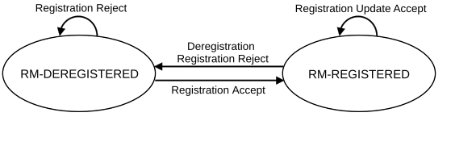
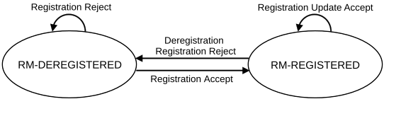

# 5.3.2 Registration Management

## 5.3.2.1 General

A UE/user needs to register with the network to receive services that requires registration. Once registered and if applicable the UE updates its registration with the network (see TS 23.502 \[3\]):

\- periodically, in order to remain reachable (Periodic Registration Update); or

\- upon mobility (Mobility Registration Update); or

\- to update its capabilities or re-negotiate protocol parameters (Mobility Registration Update).

The Initial Registration procedure involves execution of Network Access Control functions as defined in clause 5.2 (i.e. user authentication and access authorization based on subscription profiles in UDM). As result of the Registration procedure, the identifier of the serving AMF serving the UE in the access through which the UE has registered will be registered in UDM.

The registration management procedures are applicable over both 3GPP access and Non-3GPP access. The 3GPP and Non-3GPP RM states are independent of each other, see clause 5.3.2.4.

## 5.3.2.2 5GS Registration Management states

### 5.3.2.2.1 General

Two RM states are used in the UE and the AMF that reflect the registration status of the UE in the selected PLMN:

\- RM-DEREGISTERED.

\- RM-REGISTERED.

### 5.3.2.2.2 RM-DEREGISTERED state

In the RM‑DEREGISTERED state, the UE is not registered with the network. The UE context in AMF holds no valid location or routing information for the UE so the UE is not reachable by the AMF. However, some parts of UE context may still be stored in the UE and the AMF e.g. to avoid running an authentication procedure during every Registration procedure.

In the RM-DEREGISTERED state, the UE shall:

\- attempt to register with the selected PLMN using the Initial Registration procedure if it needs to receive service that requires registration (see clause 4.2.2.2 of TS 23.502 \[3\]).

\- remain in RM-DEREGISTERED state if receiving a Registration Reject upon Initial Registration (see clause 4.2.2.2 of TS 23.502 \[3\]).

\- enter RM-REGISTERED state upon receiving a Registration Accept (see clause 4.2.2.2 of TS 23.502 \[3\]).

When the UE RM state in the AMF is RM-DEREGISTERED, the AMF shall:

\- when applicable, accept the Initial Registration of a UE by sending a Registration Accept to this UE and enter RM-REGISTERED state for the UE (see clause 4.2.2.2 of TS 23.502 \[3\]); or

\- when applicable, reject the Initial Registration of a UE by sending a Registration Reject to this UE (see clause 4.2.2.2 of TS 23.502 \[3\]).

### 5.3.2.2.3 RM-REGISTERED state

In the RM‑REGISTERED state, the UE is registered with the network. In the RM-REGISTERED state, the UE can receive services that require registration with the network.

In the RM-REGISTERED state, the UE shall:

\- perform Mobility Registration Update procedure if the current TAI of the serving cell (see TS 37.340 \[31\]) is not in the list of TAIs that the UE has received from the network in order to maintain the registration and enable the AMF to page the UE;

NOTE: Additional considerations for Mobility Registration Update in case of NR satellite access are provided in clause 5.4.11.6.

\- perform Periodic Registration Update procedure triggered by expiration of the periodic update timer to notify the network that the UE is still active.

\- perform a Mobility Registration Update procedure to update its capability information or to re-negotiate protocol parameters with the network;

\- perform Deregistration procedure (see clause 4.2.2.3.1 of TS 23.502 \[3\]) and enter RM-DEREGISTERED state, when the UE needs to be no longer registered with the PLMN. The UE may decide to deregister from the network at any time.

\- enter RM-DEREGISTERED state when receiving a Registration Reject message or a Deregistration message. The actions of the UE depend upon the cause value' in the Registration Reject or Deregistration message. See clause 4.2.2 of TS 23.502 \[3\].

When the UE RM state in the AMF is RM-REGISTERED, the AMF shall:

\- perform Deregistration procedure (see clauses 4.2.2.3.2, 4.2.2.3.3 of TS 23.502 \[3\]) and enter RM-DEREGISTERED state for the UE, when the UE needs to be no longer registered with the PLMN. The network may decide to deregister the UE at any time;

\- perform Implicit Deregistration at any time after the Implicit Deregistration timer expires. The AMF shall enter RM-DEREGISTERED state for the UE after Implicit Deregistration;

\- when applicable, accept or reject Registration Requests or Service Requests from the UE.

### 5.3.2.2.4 5GS Registration Management State models

Figure 5.3.2.2.4-1: RM state model in UE

Figure 5.3.2.2.4-2: RM state model in AMF

## 5.3.2.3 Registration Area management

Registration Area management comprises the functions to allocate and reallocate a Registration area to a UE. Registration area is managed per access type i.e. 3GPP access or Non-3GPP access.

When a UE registers with the network over the 3GPP access, the AMF allocates a set of tracking areas in TAI List to the UE. When the AMF allocates registration area, i.e. the set of tracking areas in TAI List, to the UE it may take into account various information (e.g. Mobility Pattern and Allowed/Non-Allowed Area (refer to clause 5.3.4.1)). An AMF which has the whole PLMN as serving area may alternatively allocate the whole PLMN ("all PLMN") as registration area to a UE in MICO mode (refer to clause 5.4.1.3). When AMF allocates registration area for UE registered for Disaster Roaming service as specified in clause 5.40.4, AMF shall only consider TAIs covering the area with the Disaster Condition.

The 5G System shall support allocating a Registration Area using a single TAI List which includes tracking areas of any NG-RAN nodes in the Registration Area for a UE.

In the case of SNPN, the TAI list allocated by AMF does not support Tracking Areas belonging to different SNPNs.

TAI used for non-3GPP access shall be dedicated to non-3GPP access. TAI(s) dedicated to Non-3GPP access may be defined in a PLMN and apply within this PLMN. Each N3IWF, TNGF, TWIF and W-AGF is locally configured with one TAI value. Each N3IWF, TNGF, TWIF and W-AGF may be configured with a different TAI value or with the same TAI value as other N3IWFs, TNGFs, TWIFs and/or W-AGFs. The TAI is provided to the AMF during N2 interface setup and as part of the User Location Information in UE associated messages as described in TS 38.413 \[34\].

When a UE registers with the network over a Non-3GPP access, the AMF allocates to the UE a registration area that only includes the TAI received from the serving N3IWF, TNGF, TWIF or W-AGF.

NOTE 1: For example, two W-AGFs can each correspond to a different TAI (one TAI per W-AGF) and thus support different sets of S-NSSAI(s).

When generating the TAI list, the AMF shall include only TAIs that are applicable on the access type (i.e. 3GPP access or Non-3GPP access) where the TAI list is sent.

NOTE 2: To prevent extra signalling load resulting from Mobility Registration Update occurring at every RAT change, it is preferable to avoid generating a RAT-specific TAI list for a UE supporting more than one RAT.

NOTE 3: For a UE registered on N3GPP access the TAI(s) provided to the UE as part of the Registration Area is expected to enable the support of the slices that are intended to be provided for this UE over this specific Non-3GPP access. In addition, the Registration Area provided to the UE for non-3GPP access will never change until the UE deregisters from non-3GPP access (either explicit deregistration or implicit deregistration due to Deregistration timer expiring due to UE entering CM_IDLE state).

For all 3GPP Access RATs in NG-RAN and for Non-3GPP Access, the 5G System supports the TAI format as specified in TS 23.003 \[19\] consisting of MCC, MNC and a 3-byte TAC only.

The additional aspects for registration management when a UE is registered over one access type while the UE is already registered over the other access type is further described in clause 5.3.2.4.

To ensure a UE initiates a Mobility Registration procedure when performing inter-RAT mobility to or from NB-IoT, a Tracking Area shall not contain both NB-IoT and other RATs cells (e.g. WB-E-UTRA, NR) and the AMF shall not allocate a TAI list that contains both NB-IoT and other RATs Tracking Areas.

For 3GPP access the AMF determines the RAT type the UE is camping on based on the Global RAN Node IDs associated with the N2 interface and additionally the Tracking Area indicated by NG-RAN. When the UE is accessing NR using unlicensed bands, as defined in clause 5.4.8, an indication is provided in N2 interface as defined in TS 38.413 \[34\].

The AMF may also determine more precise RAT Type information based on further information received from NG-RAN:

\- The AMF may determine the RAT Type to be LTE-M as defined in clause 5.31.20; or

\- The AMF may determine the RAT Type to be NR using unlicensed bands, as defined in clause 5.4.8.

\- The AMF may determine the RAT Type to be one of the RAT types for satellite access, as defined in clause 5.4.10.

\- The AMF may determine the RAT Type to be NR RedCap as defined in clause 5.41.

For Non-3GPP accesses the AMF determines the RAT type the UE is camping based on the 5G-AN node associated with N2 interface as follows:

\- The RAT type is Untrusted Non-3GPP if the 5G-AN node has a Global N3IWF Node ID;

\- The RAT type is Trusted Non-3GPP if the 5G-AN node has a Global TNGF Node ID or a Global TWIF Node ID; and

\- The RAT type is Wireline -BBF if the 5G-AN node has a Global W-AGF Node ID corresponding to a W-AGF supporting the Wireline BBF Access Network. The RAT type is Wireline-Cable if the 5G-AN node has a Global W-AGF Node ID corresponding to a W-AGF supporting the Wireline Cable Access Network. If not possible to distinguish between the two, the RAT type is Wireline.

NOTE 4: How to differentiate between W-AGF supporting either Wireline BBF Access Network or the Wireline (e.g. different Global W-AGF Node ID IE or the Global W-AGF Node ID including a field to distinguish between them) is left to Stage 3 definition.

NOTE 5: If an operator supports only one kind of Wireline Access Network (either Wireline BBF Access Network or a Wireline Cable Access Network) the AMF may be configured to use RAT type Wireline or the specific one.

For Non-3GPP access the AMF may also use the User Location Information provided at N2 connection setup to determine a more precise RAT Type, e.g. identifying IEEE 802.11 access, Wireline-Cable access, Wireline-BBF access.

When the 5G-AN node has either a Global N3IWF Node ID, or a Global TNGF Node ID, or a Global TWIF Node ID, or a Global W-AGF Node ID, the Access Type is Non-3GPP Access.

## 5.3.2.4 Support of a UE registered over both 3GPP and Non-3GPP access

This clause applies to Non-3GPP access network corresponding to the Untrusted Non-3GPP access network, to the Trusted Non-3GPP and to the W-5GAN. In the case of W-5GAN the UE mentioned in this clause corresponds to the 5G-RG.

For a given serving PLMN there is one RM context for a UE for each access, e.g. when the UE is consecutively or simultaneously served by a 3GPP access and by a non-3GPP access (i.e. via an N3IWF, TNGF and W-AGF) of the same PLMN. UDM manages separate/independent UE Registration procedures for each access.

When served by the same PLMN for 3GPP and non-3GPP accesses, an UE is served by the same AMF except in the temporary situation described in clause 5.17 i.e. after a mobility from EPS while the UE has PDU Sessions associated with non-3GPP access.

The 5G NSWO authentication as defined in Annex S of TS 33.501 \[29\] does not impact the RM state.

An AMF associates multiple access-specific RM contexts for an UE with:

\- a 5G-GUTI that is common to both 3GPP and Non-3GPP accesses. This 5G-GUTI is globally unique.

\- a Registration state per access type (3GPP / Non-3GPP)

\- a Registration Area per access type: one Registration Area for 3GPP access and another Registration Area for non 3GPP access. Registration Areas for the 3GPP access and the Non-3GPP access are independent.

\- timers for 3GPP access:

\- a Periodic Registration timer; and

\- a Mobile Reachable timer and an Implicit Deregistration timer.

\- timers for non-3GPP access:

\- a UE Non-3GPP Deregistration timer; and

\- a Network Non-3GPP Implicit Deregistration timer.

The AMF shall not provide a Periodic Registration Timer for the UE over a Non-3GPP access. Consequently, the UE need not perform Periodic Registration Update procedure over Non-3GPP access. Instead, during the Initial Registration procedure and Re-registration, the UE is provided by the network with a UE Non-3GPP Deregistration timer that starts when the UE enters non-3GPP CM-IDLE state.

When the 3GPP access and the non-3GPP access for the same UE are served by the same PLMN, the AMF assigns the same 5G-GUTI for use over both accesses. Such a 5G-GUTI may be assigned or re-assigned over any of the 3GPP and Non-3GPP accesses. The 5G-GUTI is assigned upon a successful registration of the UE and is valid over both 3GPP and Non-3GPP access to the same PLMN for the UE. Upon performing an initial access over the Non-3GPP access or over the 3GPP access while the UE is already registered with the 5G System over another access of the same PLMN, the UE provides the native 5G-GUTI for the other access. This enables the AN to select an AMF that maintains the UE context created at the previous Registration procedure via the GUAMI derived from the 5G-GUTI and enables the AMF to correlate the UE request to the existing UE context via the 5G-GUTI.

If the UE is performing registration over one access and intends to perform registration over the other access in the same PLMN (e.g. the 3GPP access and the selected N3IWF, TNGF or W-AGF are located in the same PLMN), the UE shall not initiate the registration over the other access until the Registration procedure over first access is completed.

NOTE: To which access the UE performs registration first is up to UE implementation.

When the UE is successfully registered to an access (3GPP access or Non-3GPP access respectively) and the UE registers via the other access:

\- if the second access is located in the same PLMN (e.g. the UE is registered via a 3GPP access and selects a N3IWF, TNGF or W-AGF located in the same PLMN), the UE shall use for the registration to the PLMN associated with the new access the 5G-GUTI that the UE has been provided with at the previous registration or UE configuration update procedure for the first access in the same PLMN. Upon successful completion of the registration to the second access, if the network included a 5G-GUTI in the Registration Accept, the UE shall use the 5G-GUTI received in the Registration Accept for both registrations. If no 5G-GUTI is included in the Registration Accept, then the UE uses the 5G-GUTI assigned for the existing registration also for the new registration.

\- if the second access is located in a PLMN different from the registered PLMN of the first access (i.e. not the registered PLMN), (e.g. the UE is registered to a 3GPP access and selects a N3IWF, TNGF or W-AGF located in a PLMN different from the PLMN of the 3GPP access, or the UE is registered over Non-3GPP and registers to a 3GPP access in a PLMN different from the PLMN of the N3IWF, TNGF or W-AGF), the UE shall use for the registration to the PLMN associated with the new access a 5G-GUTI only if it has got one previously received from a PLMN that is not the same as the PLMN the UE is already registered with. If the UE does not include a 5G-GUTI, the SUCI shall be used for the new registration. Upon successful completion of the registration to the second access, the UE has the two 5G-GUTIs (one per PLMN).

A UE supporting registration over both 3GPP and Non-3GPP access to two PLMNs shall be able to handle two separate registrations, including two 5G-GUTIs, one per PLMN and two associated equivalent PLMN lists.

When a UE 5G-GUTI assigned during a Registration procedure over 3GPP (e.g. the UE registers first over a 3GPP access) is location-dependent, the same UE 5G-GUTI can be re-used over the Non-3GPP access when the selected N3IWF, TNGF or W-AGF function is in the same PLMN as the 3GPP access. When an UE 5G-GUTI is assigned during a Registration procedure performed over a Non 3GPP access (e.g. the UE registers first over a non-3GPP access), the UE 5G-GUTI may not be location-dependent, so that the UE 5G-GUTI may not be valid for NAS procedures over the 3GPP access and, in this case, a new AMF is allocated during the Registration procedure over the 3GPP access.

When the UE is registered first via 3GPP access, if the UE registers to the same PLMN via Non-3GPP access, the UE shall send the GUAMI or 5G-GUTI obtained via 3GPP access to the N3IWF, TNGF or W-AGF, which uses the received GUAMI or 5G-GUTI to select the same AMF as the 3GPP access. Whether GUAMI or 5G-GUTI is sent from the UE in a particular non-3GPP access is specified in TS 24.501 \[47\] and TS 24.502 \[48\].

The Deregistration Request message indicates whether it applies to the 3GPP access the Non-3GPP access, or both.

If the UE is registered on both 3GPP and Non-3GPP accesses and it is in CM-IDLE over Non-3GPP access, then the UE or AMF may initiate a Deregistration procedure over the 3GPP access to deregister the UE only on the Non-3GPP access, in which case all the PDU Sessions which are associated with the Non-3GPP access shall be released.

If the UE is registered on both 3GPP and non-3GPP accesses and it is in CM-IDLE over 3GPP access and in CM-CONNECTED over non-3GPP access, then the UE may initiate a Deregistration procedure over the non-3GPP access to deregister the UE only on the 3GPP access, in which case all the PDU Sessions which are associated with the 3GPP access shall be released.

Registration Management over Non-3GPP access is further defined in clause 5.5.1.
