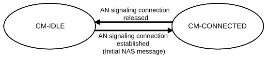
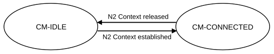

# 5.3.3 Connection Management

## 5.3.3.1 General

Connection management comprises the functions of establishing and releasing a NAS signalling connection between a UE and the AMF over N1. This NAS signalling connection is used to enable NAS signalling exchange between the UE and the core network. It comprises both the AN signalling connection between the UE and the AN (RRC Connection over 3GPP access or UE-N3IWF connection over untrusted N3GPP access or UE-TNGF connection over trusted N3GPP access) and the N2 connection for this UE between the AN and the AMF.

## 5.3.3.2 5GS Connection Management states

### 5.3.3.2.1 General

Two CM states are used to reflect the NAS signalling Connection of the UE with the AMF:

\- CM-IDLE

\- CM-CONNECTED

The CM state for 3GPP access and Non-3GPP access are independent of each other, i.e. one can be in CM-IDLE state at the same time when the other is in CM-CONNECTED state.

### 5.3.3.2.2 CM-IDLE state

A UE in CM-IDLE state has no NAS signalling connection established with the AMF over N1. The UE performs cell selection/cell reselection according to TS 38.304 \[50\] and PLMN selection according to TS 23.122 \[17\].

There are no AN signalling connection, N2 connection and N3 connections for the UE in the CM-IDLE state.

If the UE is both in CM-IDLE state and in RM-REGISTERED state, the UE shall, unless otherwise specified in clause 5.3.4.1:

\- Respond to paging by performing a Service Request procedure (see clause 4.2.3.2 of TS 23.502 \[3\]), unless the UE is in MICO mode (see clause 5.4.1.3);

\- perform a Service Request procedure when the UE has uplink signalling or user data to be sent (see clause 4.2.3.2 of TS 23.502 \[3\]). Specific conditions apply for LADN, see clause 5.6.5.

When the UE state in the AMF is RM-REGISTERED, UE information required for initiating communication with the UE shall be stored. The AMF shall be able to retrieve stored information required for initiating communication with the UE using the 5G-GUTI.

NOTE: In 5GS there is no need for paging using the SUPI/SUCI of the UE.

The UE provides 5G-S-TMSI as part of AN parameters during AN signalling connection establishment as specified in TS 38.331 \[28\] and TS 36.331 \[51\]. The UE shall enter CM-CONNECTED state whenever an AN signalling connection is established between the UE and the AN (entering RRC_CONNECTED state over 3GPP access, or at the establishment of the UE-N3IWF connectivity over untrusted non-3GPP access or the UE-TNGF connectivity over trusted non-3GPP access). The transmission of an Initial NAS message (Registration Request, Service Request or Deregistration Request) initiates the transition from CM-IDLE to CM-CONNECTED state.

When the UE states in the AMF are CM-IDLE and RM-REGISTERED, the AMF shall:

\- perform a network triggered Service Request procedure when it has signalling or mobile-terminated data to be sent to this UE, by sending a Paging Request to this UE (see clause 4.2.3.3 of TS 23.502 \[3\]), if a UE is not prevented from responding e.g. due to MICO mode or Mobility Restrictions.

The AMF shall enter CM-CONNECTED state for the UE whenever an N2 connection is established for this UE between the AN and the AMF. The reception of initial N2 message (e.g. N2 INITIAL UE MESSAGE) initiates the transition of AMF from CM-IDLE to CM-CONNECTED state.

The UE and the AMF may optimize the power efficiency and signalling efficiency of the UE when in CM-IDLE state e.g. by activating MICO mode (see clause 5.4.1.3).

### 5.3.3.2.3 CM-CONNECTED state

A UE in CM-CONNECTED state has a NAS signalling connection with the AMF over N1. A NAS signalling connection uses an RRC Connection between the UE and the NG-RAN and an NGAP UE association between the AN and the AMF for 3GPP access. A UE can be in CM-CONNECTED state with an NGAP UE association that is not bound to any TNLA between the AN and the AMF. See clause 5.21.1.2 for details on the state of NGAP UE association for an UE in CM-CONNECTED state. Upon completion of a NAS signalling procedure, the AMF may decide to release the NAS signalling connection with the UE.

In the CM-CONNECTED state, the UE shall:

\- enter CM-IDLE state whenever the AN signalling connection is released (entering RRC_IDLE state over 3GPP access or when the release of the UE-N3IWF connectivity over untrusted non-3GPP access or the UE-TNGF connectivity over trusted non-3GPP access is detected by the UE), see TS 38.331 \[28\] for 3GPP access.

When the UE CM state in the AMF is CM-CONNECTED, the AMF shall:

\- enter CM-IDLE state for the UE whenever the logical NGAP signalling connection and the N3 user plane connection for this UE are released upon completion of the AN Release procedure as specified in TS 23.502 \[3\].

The AMF may keep a UE CM state in the AMF in CM-CONNECTED state until the UE de-registers from the core network.

A UE in CM-CONNECTED state can be in RRC_INACTIVE state, see TS 38.300 \[27\]. When the UE is in RRC_INACTIVE state the following applies:

\- UE reachability is managed by the RAN, with assistance information from core network;

\- UE paging is managed by the RAN.

\- UE monitors for paging with UE's CN (5G S-TMSI) and RAN identifier.

### 5.3.3.2.4 5GS Connection Management State models

Figure 5.3.3.2.4-1: CM state transition in UE

Figure 5.3.3.2.4-2: CM state transition in AMF

When a UE enters CM-IDLE state, the UP connection of the PDU Sessions that were active on this access are deactivated.

NOTE: The activation of UP connection of PDU Sessions is documented in clause 5.6.8.

### 5.3.3.2.5 CM-CONNECTED with RRC_INACTIVE state

RRC_INACTIVE state applies to NG-RAN. UE support for RRC_INACTIVE state is defined in TS 38.306 \[69\] for NR and TS 36.306 \[70\] for E-UTRA connected to 5GC. RRC_INACTIVE is not supported by NB-IoT connected to 5GC.

The AMF shall provide assistance information to the NG-RAN, to assist the NG-RAN's decision whether the UE can be sent to RRC_INACTIVE state except due to some exceptional cases such as:

\- PLMN (or AMF set) does not support RRC_INACTIVE;

\- The UE needs to be kept in CM-CONNECTED State (e.g. for tracking).

The "RRC Inactive Assistance Information" includes:

\- UE specific DRX values;

\- UE specific extended idle mode DRX values (cycle length and Paging Time Window length);

\- The Registration Area provided to the UE;

\- Periodic Registration Update timer;

\- If the AMF has enabled MICO mode for the UE, an indication that the UE is in MICO mode;

\- Information from the UE identifier, as defined in TS 38.304 \[50\] for NR and TS 36.304 \[52\] for E-UTRA connected to 5GC, that allows the RAN to calculate the UE's RAN paging occasions;

\- An indication that Paging Cause Indication for Voice Service is supported;

\- AMF PEIPS Assistance Information (see clause 5.4.12.2) for paging a UE in CM-CONNECTED with RRC_INACTIVE state over NR as defined in TS 38.300 \[27\];

\- CN based MT communication handling support indication for RRC_INACATIVE state (see clause 5.31.7.2.1).

The RRC Inactive Assistance Information mentioned above is provided by the AMF during N2 activation with the (new) serving NG-RAN node (i.e. during Registration, Service Request, Handover) to assist the NG RAN's decision whether the UE can be sent to RRC_INACTIVE state. If the AMF allocates a new Registration Area to the UE, the AMF should update the NG-RAN with the new Registration Area by sending the RRC Inactive Assistance Information accordingly. The Paging Cause Indication for Voice Service is used to assist NG RAN to perform RAN based paging.

RRC_INACTIVE state is part of RRC state machine and it is up to the RAN to determine the conditions to enter RRC_INACTIVE state. If any of the parameters included in the RRC Inactive Assistance Information changes as the result of NAS procedure, the AMF shall update the RRC Inactive Assistance Information to the NG-RAN node.

When the UE is in CM-CONNECTED state, if the AMF has provided RRC Inactive assistance information, the RAN node may decide to move a UE to CM-CONNECTED with RRC_INACTIVE state.

The state and "endpoints" (in the case of Dual Connectivity configuration) of the N2 and N3 reference points are not changed by the UE entering CM-CONNECTED with RRC_INACTIVE state. A UE in RRC_INACTIVE state is aware of the RAN Notification area and periodic RAN Notification Area Update timer.

The 5GC network is not aware of the UE transitions between CM-CONNECTED with RRC_CONNECTED and CM-CONNECTED with RRC_INACTIVE state, unless the 5GC network is notified via N2 notification procedure in clause 4.8.3 of TS 23.502 \[3\].

At transition into CM-CONNECTED with RRC_INACTIVE state, the NG-RAN configures the UE with a periodic RAN Notification Area Update timer taking into account the value of the Periodic Registration Update timer value indicated in the RRC Inactive Assistance Information and uses a guard timer with a value longer than the RAN Notification Area Update timer value provided to the UE.

If the periodic RAN Notification Area Update guard timer expires in NG-RAN, the NG-RAN shall initiate AN Release procedure as specified in clause 4.2.6 of TS 23.502 \[3\].

When the UE is in CM-CONNECTED with RRC_INACTIVE state, the UE performs PLMN selection procedures as defined in TS 23.122 \[17\] and TS 24.501 \[47\].

When the UE is CM-CONNECTED with RRC_INACTIVE state, the UE may resume the RRC Connection due to:

\- Uplink data pending;

\- Mobile initiated NAS signalling procedure;

\- As a response to RAN paging;

\- Notifying the network that it has left the RAN Notification Area;

\- Upon periodic RAN Notification Area Update timer expiration.

If the UE resumes the connection in a different NG-RAN node within the same PLMN or equivalent PLMN or within the same SNPN or equivalent SNPN, the UE AS context is retrieved from the old NG-RAN node and a procedure is triggered towards the CN (see clause 4.8.2 of TS 23.502 \[3\]).

NOTE 1: With Dual Connectivity configuration if the UE resumes the RRC connection in the Master RAN node, the Secondary RAN node configuration is defined in TS 38.300 \[27\].

If the RAN paging procedure applying DRX or eDRX value no longer than 10.24s, as defined in TS 38.300 \[27\], is not successful in establishing contact with the UE the procedure shall be handled by the network as follows:

\- If NG-RAN has at least one pending NAS PDU for transmission, the RAN node shall initiate the AN Release procedure (see clause 4.2.6 of TS 23.502 \[3\]) to move the UE CM state in the AMF to CM-IDLE state and indicate to the AMF the NAS non-delivery.

\- If NG RAN has only pending user plane data for transmission, the NG-RAN node may keep the N2 connection active or initiate the AN Release procedure (see clause 4.2.6 of TS 23.502 \[3\]) based on local configuration in NG-RAN.

NOTE 2: The user plane data which triggers the RAN paging can be lost, e.g. in the case of RAN paging failure.

If the RAN paging procedure applying eDRX value longer than 10.24s, as defined in TS 38.300 \[27\], has not requested the CN based mobile terminated (MT) communication handling as described in clause 5.31.7.2.1 and is not successful in establishing contact with the UE after paging the UE, the procedure shall be handled by network as follows:

\- If NG-RAN has at least one pending NAS PDU for transmission, the RAN node shall initiate the AN Release procedure (see clause 4.2.6 of TS 23.502 \[3\]) to move the UE CM state in the AMF to CM-IDLE state and indicate to the AMF the NAS non-delivery.

\- If NG-RAN has only pending user plane data for transmission, the NG-RAN node may keep the N2 connection active and based on implementation send indication to the CN requesting the CN based mobile terminated (MT) communication handling as described in clause 5.31.7.2.1, or initiate the AN Release procedure (see clause 4.2.6 of TS 23.502 \[3\]) based on local configuration in NG-RAN.

NOTE 3: The user plane data which triggers the RAN paging can be lost, e.g. in the case of RAN paging failure.

If a UE in CM-CONNECTED with RRC_INACTIVE state performs cell selection to GERAN/UTRAN/E-UTRAN, it shall follow idle mode procedures of the selected RAT as specified in clause 5.17.

In addition, a UE in CM-CONNECTED state with RRC_INACTIVE state shall enter CM-IDLE state and initiates the NAS signalling recovery (see TS 24.501 \[47\]) in the following cases:

\- If RRC resume procedure fails,

If the UE receives Core Network paging,

\- If the periodic RAN Notification Area Update timer expires and the UE cannot successfully resume the RRC Connection,

\- In any other failure scenario that cannot be resolved in RRC_INACTIVE state and requires the UE to move to CM-IDLE state.

When a UE is in CM-CONNECTED with RRC_INACTIVE state and a trigger to change the UE's NG-RAN or E‑UTRAN UE Radio Capability information happens, the UE shall move to CM-IDLE state and initiate the procedure for updating UE Radio Capability defined in clause 5.4.4.1. (For specific requirements for a UE operating in dual-registration mode see clause 5.17.2.1)

When UE is in CM-CONNECTED with RRC_INACTIVE state, if RAN has received Location Reporting Control message from AMF with the Reporting Type indicating single stand-alone report or continuously reporting whenever the UE changes the cell, the RAN shall perform location reporting as specified in clause 4.10 of TS 23.502 \[3\].

When the UE is CM-CONNECTED with RRC_INACTIVE state. If the AMF receives Nudm_UECM_DeregistrationNotification from UDM, the AMF shall initiate AN Release procedure as specified in clause 4.2.6 of TS 23.502 \[3\].

When UE is in CM-CONNECTED with RRC_INACTIVE state, if RAN has received Location Reporting Control message from AMF with the Reporting Type of the Area Of Interest based reporting, the RAN shall send a Location Report message to AMF including UE presence in the Area Of Interest (i.e. IN, OUT, or UNKNOWN) and the UE's last known location with time stamp.

When the UE is in CM-CONNECTED with RRC_INACTIVE state, if the old NG-RAN node that sends the UE into RRC_INACTIVE state receives the downlink N2 signalling, it initiates the RAN paging as defined in TS 38.300 \[27\]. If the UE resumes the RRC Connection towards a different NG-RAN node, the old NG-RAN node includes the "UE Context Transfer" indication into a response container to the NF (e.g. AMF or SMF) that generates such N2 downlink signalling. Then the NF shall reattempt the same procedure when the path switch from the old NG-RAN node to the new NG-RAN node is complete.

## 5.3.3.3 NAS signalling connection management

### 5.3.3.3.1 General

NAS signalling connection management includes the functions of establishing and releasing a NAS signalling connection.

### 5.3.3.3.2 NAS signalling connection establishment

NAS signalling connection establishment function is provided by the UE and the AMF to establish a NAS signalling connection for a UE in CM-IDLE state. The AMF shall provide the list of recommended cells/ TAs / NG-RAN node identifiers for paging, if the NG-RAN had provided that information in an earlier AN Release Procedure in the AN (see clause 4.2.6 of TS 23.502 \[3\]).

When the UE in CM-IDLE state needs to transmit an NAS message, the UE shall initiate a Service Request, a Registration or a Deregistration procedure to establish a NAS signalling connection to the AMF as specified in clauses 4.2.2 and 4.2.3 of TS 23.502 \[3\]. If the NAS signalling connection is to be established via an NG-RAN node, but the AMF detects that this UE has already established a NAS signalling connection via old NG-RAN node, the AMF shall release the old established NAS signalling connection by triggering AN Release Procedure.

Based on UE preferences, UE subscription, Mobility Pattern and network configuration, the AMF may keep the NAS signalling connection until the UE de-registers from the network.

### 5.3.3.3.3 NAS signalling connection Release

The procedure of releasing a NAS signalling connection is initiated by the AN node (either 5G (R)AN node or N3IWF) or the AMF. The NG-RAN node may include the list of recommended cells/ TAs / NG-RAN node identifiers for paging, during the AN Release Procedure in the AN (see clause 4.2.6 of TS 23.502 \[3\]). The AMF stores this information, if provided by the NG-RAN.

The UE considers the NAS signalling connection is released if it detects the AN signalling connection is released. The AMF considers the NAS signalling connection is released if it detects the N2 context is released.

## 5.3.3.4 Support of a UE connected over both 3GPP and Non-3GPP access

The AMF manages two CM states for an UE: a CM state for 3GPP access and a CM state for Non-3GPP access. An N2 interface can serve the UE for either 3GPP access or for Non 3GPP access. UE connected over both 3GPP and Non-3GPP has got two N2 interfaces, one for each access. A UE may be in any combination of the CM states between 3GPP and Non-3GPP access, e.g. a UE may be CM-IDLE for one access and CM-CONNECTED for the other access, CM-IDLE for both accesses or CM-CONNECTED for both accesses.

When the UE CM state in the AMF is CM-IDLE for 3GPP access and CM-CONNECTED for Non-3GPP access, the AMF shall perform a network triggered Service Request procedure, when it has downlink data to be sent to this UE for 3GPP access, by sending either the Paging Request via 3GPP access or the NAS notification via Non-3GPP access to this UE (see clause 4.2.3.3 of TS 23.502 \[3\]).

Connection Management over Non-3GPP access is further defined in clause 5.5.2.
