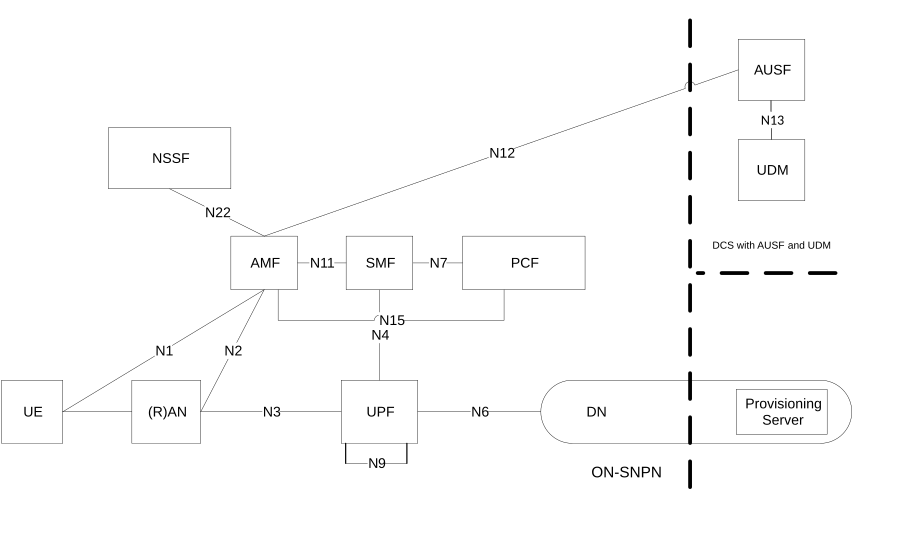
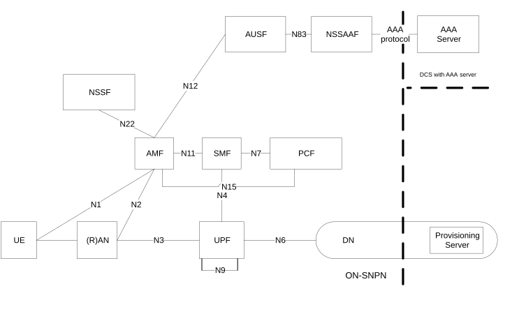
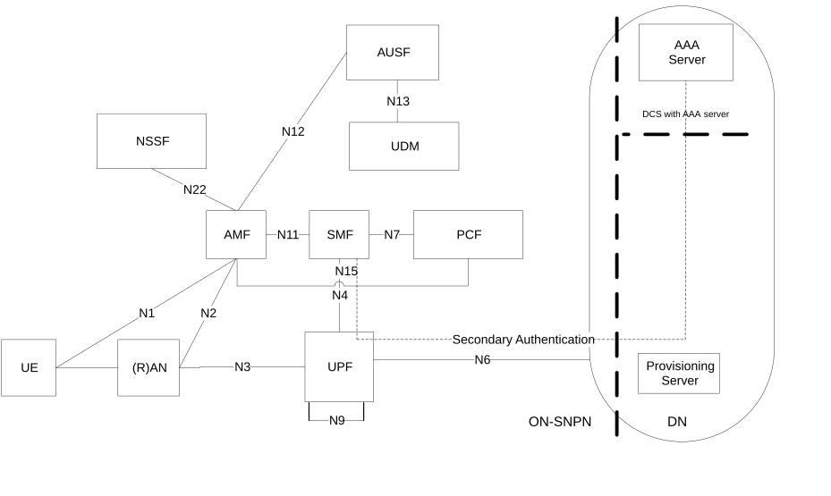

# 5.30.2.10 Onboarding of UEs for SNPNs

## 5.30.2.10.1 General

Onboarding of UEs for SNPNs allows the UE to access an Onboarding Network (ONN) for the purpose of provisioning the UE with SNPN credentials for primary authentication and other information to enable access to a desired SNPN, i.e. (re-)select and (re-)register with SNPN.

To provision SNPN credentials in a UE that is configured with Default UE credentials (see clause 5.30.2.10.2.4), the UE selects an SNPN as ONN and establishes a secure connection with that SNPN referred to as Onboarding SNPN (ON-SNPN), see more details in clause 5.30.2.10.2.

NOTE: If the UE is already provisioned with a set of SNPN credentials or credentials owned by a Credentials Holder and needs to be provisioned with an additional set of SNPN credentials, the UE can access an SNPN using the network selection in SNPN access mode as described in clause 5.30.2.4, normal registration (i.e. not registration for onboarding) and normal PDU Session (i.e. not a restricted PDU Session used for onboarding) and then leverage the SNPN's User Plane connection to get access to a PVS. The PVS address can be provided in the same way as when the Onboarding Network is a PLMN.

To provision SNPN credentials in a UE that is equipped with a USIM configured with PLMN credentials, the UE selects a PLMN as ONN and establishes a secure connection with that PLMN, see more details in clause 5.30.2.10.3.

After the secure connection is established, the UE is provisioned with SNPN credentials and possibly other data to enable discovery, (re-)selection and (re-)registration for a desired SNPN, see more details in clause 5.30.2.10.4.

ON-SNPN and SO-SNPN can be roles taken by either an SNPN or different SNPNs. It is possible for the same network to be in both roles with respect to a specific UE.

## 5.30.2.10.2 Onboarding Network is an SNPN

### 5.30.2.10.2.1 General

A UE configured with Default UE credentials may register with an ON-SNPN for the provisioning of SO-SNPN credentials.

### 5.30.2.10.2.2 Architecture

Figures 5.30.2.10.2.2-1, 5.30.2.10.2.2-2 and 5.30.2.10.2.2-3 depict the architecture for Onboarding of UEs in an ON-SNPN.

Figure 5.30.2.10.2.2-1: Architecture for UE Onboarding in ON-SNPN when the DCS includes an AUSF and a UDM

Figure 5.30.2.10.2.2-2: Architecture for UE Onboarding in ON-SNPN when the DCS includes a AAA Server used for primary authentication

Figure 5.30.2.10.2.2-3: Architecture for UE Onboarding in ON-SNPN when the DCS is not involved during primary authentication

NOTE 1: AUSF in the ON-SNPN interfaces with the DCS via NSSAAF as shown in Figure 5.30.2.10.2.2-2 owned by an entity that is internal or external to the ON-SNPN.

NOTE 2: The functionality with respect to exchange information between PVS and SO-SNPN to provision SNPN credentials and other data from the SO-SNPN in the UE is out of 3GPP scope.

NOTE 3: The dotted lines in Figure 5.30.2.10.2.2-1, Figure 5.30.2.10.2.2-2 and Figure 5.30.2.10.2.2-3 indicate that whether domains (e.g. DCS domain, PVS domain and SO-SNPN) are separated depends on the deployment scenario.

NOTE 4: See TS 33.501 \[29\] for the functionality beyond AUSF and other interfaces required for security.

NOTE 5: When secondary authentication is used in the context of the UE onboarding architecture in Figure 5.30.2.10.2.2-3, the same S-NSSAI/DNN or different S-NSSAI/DNNs can be used for the onboarding PDU Sessions of different UEs even though the DN-AAA servers that authenticate the UEs can reside in different administrative domains.

When the DCS is involved during mutual primary authentication during the Onboarding procedure (as in Figure 5.30.10.2.2-1 and Figure 5.30.10.2.2-2), the following applies:

\- When the DCS includes an AUSF and a UDM functionality, then the AMF selects AUSF in the DCS domain. The ON-SNPN and DCS domain are connected via N32 and SEPP which are not shown in the Figure 5.30.2.10.2.2-1.

\- When the DCS includes a AAA Server functionality, only NSI based SUPI is supported and the AMF selects AUSF in the ON-SNPN. Based on local configuration (e.g. using the realm part of the Onboarding SUCI), the AUSF skips the UDM selection and directly performs primary authentication towards DCS with AAA Server functionality using Default UE credentials for primary authentication. The AUSF uses an NSSAAF (and the NSSAAF may use a AAA-P which is not shown in the figure 5.30.2.10.2.2-2) to relay EAP messages towards the DCS including a AAA Server. The NSSAAF selects AAA Server based on the domain name corresponding to the realm part of the SUPI.

NOTE 5: The AMF in ON-SNPN uses the Home Network Identifier of the Onboarding SUCI to select the DCS. It is assumed that the ON-SNPN is configured on per Home Network Identifier basis to determine whether to perform primary authentication with AUSF/UDM or AAA server.

\- Upon establishment of the PDU Session used for User Plane Remote Provisioning the ON-SNPN may trigger secondary authentication procedure, as described in clause 4.3.2.3 of TS 23.502 \[3\], with a DN-AAA using Default UE credentials for secondary authentication as described in clause I.9.2.4 of TS 33.501 \[29\].

When the DCS is not involved during primary authentication (as in Figure 5.30.10.2.2-3), the following applies:

\- The AMF selects a local AUSF as described in clause 5.30.2.10.2.6 and performs primary authentication towards the local AUSF using Default UE credentials for primary authentication as described in TS 33.501 \[29\].

\- Upon establishment of the PDU Session used for User Plane Remote Provisioning the ON-SNPN may trigger secondary authentication procedure, as described in clause 4.3.2.3 of TS 23.502 \[3\], with the DCS or with a DN-AAA server using Default UE credentials for secondary authentication, as described in clause I.9.2.4 of TS 33.501 \[29\]. When secondary authentication is used, the SMF identifies the DCS or the DN-AAA server as defined in clause 4.3.2.3 of TS 23.502 \[3\].

NOTE 6: If the secondary authentication fails, the SMF rejects the PDU Session used for User Plane Remote Provisioning. Based on local policy the AMF can deregister the UE as described in clause 5.30.2.10.2.7.

NOTE 7: The DCS and PVS can be owned by an administrative entity that can be different from either the ON-SNPN or SO-SNPN. The ownership of DCS and PVS is outside the scope of 3GPP.

### 5.30.2.10.2.3 Broadcast system information

When the SNPN supports Onboarding of UEs for SNPNs (i.e. the SNPN can be used as ON-SNPN), the NG-RAN node or the Trusted non-3GPP access network providing access to SNPN additionally broadcasts the following information:

\- An onboarding enabled indication that indicates whether onboarding is currently enabled for the SNPN. For access to SNPN via NG-RAN the onboarding enabled indication is broadcasted per cell e.g. to allow start of the onboarding procedure only in parts of the SNPN.

NOTE: Onboarding enabled indication per cell does not affect mobility management functions, i.e. once the UE selects the ON-SNPN as described in clause 5.30.2.10.2.5 and successfully registers within ON-SNPN as described in clause 5.30.2.10.2.6, the UE can move to a cell of the ON-SNPN not indicating onboarding support and continue with the remote provisioning as described in clause 5.30.2.10.4.

### 5.30.2.10.2.4 UE Configuration Aspects

A UE enabled to support UE Onboarding, shall be pre-configured with Default UE credentials and the UE may be pre-configured with ON-SNPN selection information. The Default UE credentials consist of credentials for primary authentication and optionally credentials for secondary authentication, as described in clause I.9 of TS 33.501 \[29\].

NOTE 1: The content of the ON-SNPN network selection information depends on UE implementation and can include SNPN network identifiers and/or GIN(s).

The UE uses the ON-SNPN selection information for selection of ON-SNPN (see clause 5.30.2.10.2.5).

The UE Configuration Data for UP Remote Provisioning is described in the clause 5.30.2.10.4.2.

NOTE 2: It is assumed that the UE is not pre-configured with a S-NSSAI and DNN for the purpose of UE onboarding in the ON-SNPN.

NOTE 3: The Default UE credentials for primary authentication are used to derive a SUPI. When the UE derives the SUPI from the Default UE credentials for primary authentication, the UE performs specific onboarding procedure as described in clauses 5.30.2.10.2.5, 5.30.2.10.2.6 and 5.30.2.10.2.7.

### 5.30.2.10.2.5 Network selection

This clause applies only when the UE is in SNPN access mode.

When the UE wants to perform UE onboarding via an SNPN, the UE shall perform ON-SNPN selection as described below. An ON-SNPN is an SNPN providing onboarding access and enabling remote provisioning for a UE registered for onboarding as specified in clause 4.2.2.2.4 of TS 23.502 \[3\].

NOTE: The trigger for the UE to initiate the UE Onboarding procedure is UE implementation dependent (e.g. the trigger can be a power-on event in the UE, or an input by the user).

For automatic or manual selection, the UE may select and attempt to register to an ON-SNPN which broadcast the Onboarding enabled indication described in clause 5.30.2.10.2.3 and matches the pre-configured ON-SNPN selection information such as SNPN network identifier and/or GIN(s) (if available) described in clause 5.30.2.10.2.4 according to the UE implementation-specific logic. If the registration fails, the UE may select and attempt to register to a different ON-SNPN as defined in clause 4.9.3.1.3 or clause 4.9.3.1.4 of TS 23.122 \[17\].

### 5.30.2.10.2.6 Registration for UE onboarding

When the user or UE has selected an ON-SNPN according to clause 5.30.2.10.2.5, the UE establishes an RRC connection towards the NG-RAN node of the ON-SNPN. The UE provides an indication in RRC Connection Establishment that the RRC connection is for onboarding as defined in TS 38.331 \[28\]. This indication allows the NG-RAN node to select an appropriate AMF that supports the UE onboarding procedures. The UE indicates the ON-SNPN as the selected network and the NG-RAN node shall indicate the selected PLMN ID and NID of the ON-SNPN to the AMF.

NOTE 1: As the configuration information in the UE does not include any S-NSSAI and DNN used for onboarding, the UE does not include S-NSSAI and DNN in RRC when it registers for UE onboarding purposes to the ONN.

The UE shall initiate the NAS registration procedure by sending a NAS Registration Request message with the following characteristics:

\- The UE shall set the 5GS Registration Type to the value "SNPN Onboarding" indicating that the registration request is for onboarding.

\- The UE shall provide a SUCI derived from a SUPI as specified in TS 23.003 \[19\] and TS 33.501 \[29\]. The SUPI shall uniquely identify the UE and shall be derived from the Default UE credentials for primary authentication. The SUPI used for onboarding may contain an IMSI or a network-specific identifier. The ON-SNPN may determine the corresponding DCS identity or address/domain, based on the SUCI (i.e. based on the Home Network Identifier of the SUCI).

The UE does not include a Requested NSSAI in NAS signalling when it registers for UE onboarding purposes to the ON-SNPN.

The AMF supporting UE onboarding is configured with AMF Onboarding Configuration Data that includes e.g.:

\- S-NSSAI and DNN to be used for onboarding or a configured SMF for the S-NSSAI and DNN used for onboarding.

\- Information to use a local AUSF(s) within the ON-SNPN for onboarding of UEs with a SUCI for a DCS with AAA Server or for onboarding of UEs in the case where the DCS is not involved during primary authentication.

NOTE 2: The S-NSSAI used for onboarding is assumed to be configured in both the AMF (i.e. in the AMF Onboarding Configuration Data) and the NG-RAN nodes for the corresponding Tracking Areas where onboarding is enabled.

When the AMF receives a NAS Registration Request with a 5GS Registration Type set to "SNPN Onboarding", the AMF:

\- starts an authentication procedure towards the AUSF, the authentication procedure is specified in TS 33.501 \[29\]. The AMF may be provided with PVS IP address(es) or PVS FQDN(s) from the DCS during authentication procedure. The AMF selects an appropriate AUSF as described in clause 6.3.4 based on the Home Network Identifier of the SUCI used during onboarding or based on local configuration in the AMF.

\- applies the AMF Onboarding Configuration Data e.g. used to restrict UE network usage to only onboarding for User Plane Remote Provisioning of UE as described in clause 5.30.2.10.4.3.

\- stores in the UE context in AMF an indication that the UE is registered for SNPN onboarding.

\- shall handle the list of equivalent SNPNs as described in TS 24.501 \[47\].

Upon successful authentication from AUSF, the AMF informs the UE about the result of the registration. If the UE is not successfully authenticated, the AMF shall reject the registration procedure for onboarding and the UE may select a different ON-SNPN to attempt to register.

NOTE 3: The AMF does not interact with the UDM of the ON-SNPN or DCS (i.e. for registration or subscription management purposes) when it receives a NAS Registration Request with a 5GS Registration Type set to "SNPN Onboarding" (see clause 4.2.2.2.4 of TS 23.502 \[3\]).

### 5.30.2.10.2.7 Deregistration from the ON-SNPN for onboarding registered UE

Once remote provisioning of SO-SNPN credentials is completed, the UE should initiate deregistration from the ON-SNPN.

Based on ON-SNPN policies, the AMF may start an implementation specific timer once the UE has registered to the ON-SNPN for the purpose of onboarding. Expiry of this timer triggers the AMF to deregister the onboarding registered UE from the ON-SNPN.

The AMF may also deregister the UE when it determines that the PDU Session used for User Plane Remote Provisioning has been released by the SMF.

When AMF re-allocation occurs for a UE registered for SNPN onboarding during mobility registration update procedure as described in TS 23.502 \[3\] in clause 4.2.2.2.4 or during N2 based handover as described in TS 23.502 \[3\] clause 4.9.1.3, the new AMF supporting SNPN Onboarding should be selected as described in clause 6.3.5. If the new AMF receives in UE context the indication that the UE is registered for SNPN onboarding, the new AMF may start an implementation specific timer for when to deregister the UE when the new AMF completes the Registration procedure (i.e. sends Registration Accept to the UE) or completes the N2 based handover procedure.

NOTE: This specific timer is used to prevent onboarding registered UEs from staying at the ON-SNPN indefinitely.

## 5.30.2.10.3 Onboarding Network is a PLMN

### 5.30.2.10.3.1 General

A UE configured with PLMN credentials in USIM for primary authentication may register with a PLMN for the provisioning of SO-SNPN credentials.

### 5.30.2.10.3.2 Network selection and Registration

This clause applies only when the UE is not in SNPN access mode.

When the UE is using PLMN credentials for accessing a PLMN as the Onboarding Network (ONN), then regular network selection, as per TS 23.122 \[17\] and regular initial registration procedures apply, as per TS 23.502 \[3\]. After successfully registering to the ON-PLMN, the UE is provisioned with the SO-SNPN credentials via User Plane as in clause 5.30.2.10.4.4.

NOTE: When Onboarding network is a PLMN and the UE's subscription only allows for Remote Provisioning, then based on PLMN policies, the AMF can start an implementation specific timer once the UE has registered to the PLMN. Expiry of this timer triggers the AMF to deregister the UE from the PLMN. This specific timer is used to prevent registered UEs that are only allowed for Remote Provisioning from staying at the PLMN indefinitely.

## 5.30.2.10.4 Remote Provisioning of UEs in Onboarding Network

### 5.30.2.10.4.1 General

Remote Provisioning of UEs that registered with an Onboarding Network enables provisioning the UE with SNPN credentials for primary authentication and other information to enable access to the desired SNPN.

Onboarding Services are provided using a PDU Session for DNN and S-NSSAI used for onboarding allowing remote provisioning of UEs via User Plane. The PDU Session may be restricted only to be used for Remote Provisioning of the UE.

### 5.30.2.10.4.2 Onboarding configuration for the UE

In order to enable UP Remote Provisioning of SNPN credentials for a UE, UE Configuration Data for User Plane Remote Provisioning are either pre-configured on the UE or provided by the ONN. UE Configuration Data for User Plane Remote Provisioning provided by the ONN take precedence over corresponding configuration data stored in the UE.

UE Configuration Data for User Plane Remote Provisioning consist of PVS IP address(es) and/or PVS FQDN(s).

If the UE does not have any PVS IP address or PVS FQDN after the establishment of the PDU Session used for User Plane Remote Provisioning, the UE may construct an FQDN for PVS discovery as defined in TS 23.003 \[19\].

The UE Configuration Data for User Plane Remote Provisioning may be stored in the ME.

The UE Configuration Data for User Plane Remote Provisioning (i.e. PVS IP address(es) or PVS FQDN(s), or both) may be:

\- locally configured in the SMF of ONN; and/or

\- provided by the DCS to the AMF of ON-SNPN as part of the authentication procedure as specified in TS 33.501 \[29\] and sent by the AMF in the Nsmf_PDUSession_CreateSMContext Request message to the SMF

If the SNPN acting as ON-SNPN is not capable to provide access to Localized Services, the PVS IP address(es) and/or PVS FQDN(s) provided by the DCS take precedence over the locally configured PVS IP address(es) and/or PVS FQDN(s) in the ON-SNPN. If the SNPN acting as ON-SNPN is capable to provides access to Localized Services, the SMF should include both DCS provided and the locally configured PVS IP address(es) and/or PVS FQDN(s), in the UE Configuration Data for User Plane Remote Provisioning.

If the PCF is used for User Plane Remote Provisioning, the SMF provides the UE Configuration Data to the PCF as described in clause 5.30.2.10.4.3.

The UE Configuration Data for User Plane Remote Provisioning may be provided to the UE during the establishment of the PDU Session used for User Plane Remote Provisioning as part of Protocol Configuration Options (PCO) in the PDU Session Establishment Response.

NOTE: If there are multiple PVS IP addresses and/or PVS FQDNs in the UE, how the UE selects PVS from this information is up to UE implementation.

### 5.30.2.10.4.3 User Plane Remote Provisioning of UEs when Onboarding Network is an ON-SNPN

The AMF selects an SMF used for User Plane Remote Provisioning using the SMF discovery and selection functionality as described in clause 6.3.2. The S-NSSAI and DNN of the AMF Onboarding Configuration Data may be used to discover and select an SMF for User Plane Remote Provisioning. Alternatively, for SMF selection, the AMF Onboarding Configuration Data may contain a configured SMF for the S-NSSAI and DNN used for onboarding. The AMF provides Onboarding Indication to SMF via Nsmf_PDUSession_CreateSMContext request message when a PDU Session used for User Plane Remote Provisioning is established. During PDU Session establishment for remote provisioning, the AMF may provide the PVS IP address(es) and/or PVS FQDN(s) to the SMF.

When a UPF is selected for User Plane Remote Provisioning, the UPF selection function described in clause 6.3.3 for normal services is applied considering the S-NSSAI and DNN used for onboarding.

The SMF or the PCF may store S-NSSAI and DNN information used for onboarding. Onboarding Configuration Data available to PCF (for details see TS 23.503 \[45\]) and/or SMF may include PVS FQDN(s) and/or PVS IP address(es). The SMF and the PCF may use Onboarding Indication and DNN and S-NSSAI used for onboarding to access the Onboarding Configuration Data.

NOTE: The SMF is aware about the PVS IP address(es) and/or PVS FQDN(s) in one of the following ways: either received from the AMF or retrieved locally from the Onboarding Configuration Data.

When the UE registered for Onboarding (i.e. 5GS Registration Type is set to the value "SNPN Onboarding") successfully completes the User Plane Remote Provisioning of SNPN credentials via the Onboarding Network, then the UE should deregister from the Onboarding Network.

Initial QoS parameters used for User Plane Remote Provisioning are configured in the SMF when dynamic PCC is not used.

Dynamic PCC may be used for a PDU Session used for User Plane Remote Provisioning as described in TS 23.503 \[45\]. If a PCF is used and the AMF provided an Onboarding Indication, the SMF provides Onboarding Indication to the PCF when requesting an SM Policy Association. The SMF may provide the UE Configuration Data (i.e. PVS IP address(es) and/or PVS FQDN(s)) to the PCF when requesting an SM Policy Association.

The QoS Flows of a restricted PDU Session, which is associated with the S-NSSAI/DNN used for Onboarding, shall be dedicated to Onboarding Services. The SMF may configure in the UPF PDR(s) and FAR(s) including PVS and DNS server IP addresses to block any traffic that is not from or to PVS and DNS server addresses.

If the UE is registered for Onboarding (i.e. 5GS Registration Type is set to the value "SNPN Onboarding"), the network should apply S-NSSAI and DNN in the Onboarding Configuration Data for the PDU Session Establishment request from the UE.

### 5.30.2.10.4.4 User Plane Remote Provisioning of UEs when Onboarding Network is a PLMN

Subscription data of such a UE shall contain the DNN and S-NSSAI used for onboarding.

The AMF selects an SMF used for User Plane Remote Provisioning using the SMF discovery and selection functionality as described in clause 6.3.2, considering the DNN and S-NSSAI used for onboarding provided by the UE or the default DNN and S-NSSAI provided by UDM.

The UPF selection function described in clause 6.3.3 is applied, considering the DNN and S-NSSAI used for onboarding.

The SMF may be configured with one or more PVS FQDN(s) and/or PVS IP address(es) per DNN and S-NSSAI used for onboarding. When the UE requests a PDU Session used for User Plane Remote Provisioning by using DNN and S-NSSAI used for onboarding, the SMF sends the PVS FQDN(s) and/or PVS IP address(es) associated to the DNN and S-NSSAI of the PDU Session to the UE as part of Protocol Configuration Options (PCO) in the PDU Session Establishment Response if the following conditions are met:

\- the UE subscription data contains the DNN and S-NSSAI used for onboarding; and

\- the SMF has obtained the PVS FQDN(s) and/or PVS IP address(es) associated to the DNN and S-NSSAI of the PDU Session from local configuration; and

\- the UE has requested PVS information via PCO in PDU Session Establishment Request.

NOTE 1: Local PCC or dynamic PCC can be used as described for PLMNs in TS 23.503 \[45\] and based on operator policy, PDR(s) and FAR(s) can be configured to restrict traffic other than provisioning traffic between PVS/DNS server(s) and UE(s).

NOTE 2: If the UE receives multiple PVS IP addresses and/or PVS FQDNs, how the UE uses this information is up to UE implementation.
