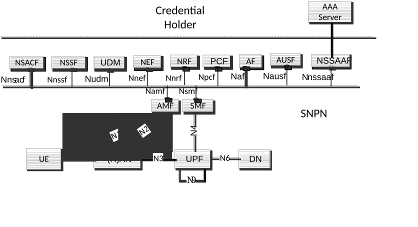
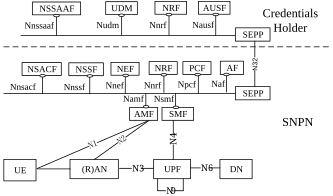

# 5.30.2.9 SNPN connectivity for UEs with credentials owned by Credentials Holder

## 5.30.2.9.1 General

SNPNs may support UE access using credentials owned by a Credentials Holder separate from the SNPN. In this case the Session Management procedures (i.e. PDU Sessions) terminate in an SMF in the SNPN.

When an SNPN supports UE access using credentials assigned by a Credentials Holder separate from the SNPN, it is assumed that is supported homogeneously within the whole SNPN.

Credentials Holder using AAA Server for primary authentication and authorization is described in clause 5.30.2.9.2 and Credentials Holder using AUSF and UDM for primary authentication and authorization is described in clause 5.30.2.9.3.

## 5.30.2.9.2 Credentials Holder using AAA Server for primary authentication and authorization

The AUSF and the UDM in SNPN may support primary authentication and authorization of UEs using credentials from a AAA Server in a Credentials Holder (CH).

\- Only NSI based SUPI is supported and the SUPI is used to identify the UE during primary authentication and authorization towards the AAA Server. SUPI privacy is achieved according to methods in clause I.5 of TS 33.501 \[29\].

\- The AMF discovers and selects the AUSF as described in clause 6.3.4 using the Home Network Identifier (realm part) and Routing Indicator present in the SUCI provided by a UE configured as described in clause 5.30.2.3.

\- The AMF selects the UDM in the same SNPN, based on local configuration (e.g. using the realm part of the SUCI), or using the NRF procedure defined in clause 4.17.4a of TS 23.502 \[3\].

\- If the UDM decides that the primary authentication is performed by AAA Server in CH based on the UE's SUPI and subscription data. The Home Network Identifier, is derived by UDM from the SUCI received from AUSF. If the SUCI was generated using a privacy protection scheme that requires de-concealment, UDM de-conceal the SUCI as defined in TS 33.501 \[29\]. The UDM then instructs the AUSF that primary authentication by a AAA Server in a CH is required, the AUSF shall discover and select the NSSAAF and then forward EAP messages to the NSSAAF. The NSSAAF selects AAA Server based on the domain name corresponds to the realm part of the SUPI, relays EAP messages between AUSF and AAA Server (or AAA proxy) and performs related protocol conversion. The AAA Server acts as the EAP Server for the purpose of primary authentication.

NOTE 1: The UDM in SNPN, based on SLA between Credentials Holder and SNPN, is pre-configured with information indicating whether the UE needs primary authentication from AAA Server.

NOTE 2: It is assumed that the SNPN is configured on per Home Network Identifier basis to determine whether to perform primary authentication with AUSF/UDM or AAA server.

\- The AMF and SMF shall retrieve the UE subscription data from UDM using SUPI.

Figure 5.30.2.9.2-1 depicts the 5G System architecture for SNPN with Credentials Holder using AAA Server for primary authentication and authorization.

NOTE 3: The SNPN in Figure 5.30.2.9.2-1 can be the subscribed SNPN for the UE (i.e. NG-RAN broadcasts SNPN ID of the subscribed SNPN). As a deployment option, the SNPN in Figure 5.30.2.9.2-1 can also be another SNPN than the subscribed SNPN for the UE (i.e. none of the SNPN IDs broadcast by NG-RAN matches the SNPN ID corresponding to the subscribed SNPN). In both cases, the AUSF, UDM and NSSAAF are configured to support the HNI of the UE's SUPI/SUCI, SUPI privacy settings (when using privacy protection scheme other than the 'null-scheme' to generate the SUCI as defined in TS 33.501 \[29\]), subscription data of the UE and authentication settings to allow UE authentication with AAA-S in CH.

Figure 5.30.2.9.2-1: 5G System architecture with access to SNPN using credentials from Credentials Holder using AAA Server

NOTE 4: The NSSAAF deployed in the SNPN can support primary authentication in the SNPN using credentials from Credentials Holder using a AAA Server (as depicted) and/or the NSSAAF can support Network Slice-Specific Authentication and Authorization with a Network Slice-Specific AAA Server (not depicted).

## 5.30.2.9.3 Credentials Holder using AUSF and UDM for primary authentication and authorization

An SNPN may support primary authentication and authorization of UEs that use credentials from a Credentials Holder using AUSF and UDM. The Credentials Holder may be an SNPN or a PLMN. The Credentials Holder UDM provides to SNPN the subscription data.

NOTE 1: A list of functionalities not supported in SNPN is provided in clause 5.30.2.0.

Optionally, an SNPN may support network slicing (including Network Slice-Specific Authentication and Authorization, Network Slice Access Control and subscription-based restrictions to simultaneous registration of network slices) for UEs that use credentials from a Credentials Holder using AUSF and UDM. The SNPN retrieves NSSAA and NSSRG information from the UDM of the Credentials Holder.

Figure 5.30.2.9.3-1 depicts the 5G System architecture for SNPN with Credentials Holder using AUSF and UDM for primary authentication and authorization and network slicing.

NOTE 2: The architecture for SNPN and Credentials Holder using AUSF and UDM is depicted as a non-roaming reference architecture as the UE is not considered to be roaming, even though some of the roaming architecture reference points are also used, e.g. for AMF and SMF in SNPN to register with and retrieve subscription data from UDM of the Credentials Holder.

Figure 5.30.2.9.3-1: 5G System architecture with access to SNPN using credentials from Credentials Holder using AUSF and UDM
